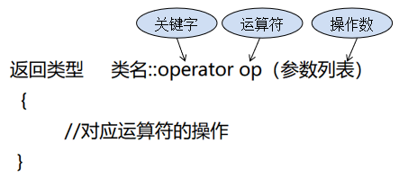

# 运算符重载

运算符重载，就是赋予运算符新的含义。和函数重载一样，一个函数名可以用来代表不同功能的函数。

实际上，我们已经在不知不觉之中使用了运算符重载。列如：我们习惯使用的对整数，浮点数运用+、-、*、/，起始计算机对整数和浮点数的操作过程是不一样的，但由于C++已经对运算符进行了重载，所以才能都适用。

又如<<本来是左移运算符，但在输出操作中，与cout搭配，当作输出流运算符了

## 运算符重载的意义

运算符重载是为了解决类对象之间的运算的，通常的运算符只用于算术运算，如常量int之间，因为编译器已经定义了；而一个类两个对象之间成员进行运算必须重新定义，让编译器在遇到对象运算时能按我们要求的进行运算，这就是运算符重载的意义。

## 运算符重载限制

C++中绝大部分的运算符允许重载，少部分不允许重载，详细描述如下

### 	可以重载的运算符

+ 算术运算符：+     -     *     /     % 
+ 自增、自减运算符：++  --
+ 位运算符：|     &     ~     ^     <<     >>     
+ 逻辑运算符：||     &&     !     
+ 关系运算符：==     !=     <     >     <=     >=     
+ 赋值运算符：=     +=     -=     /=     %=     &=     |=     ^=     <<=     >>=     
+ 单目运算符：+     -     *     &
+ 动态内存分配：new     delete     new[]     delete[]
+ 其他运算符：()     ->     ,     []     

### 	不能重载的运算符

+ .	成员访问运算符	
+ ::	域运算符
+ .*   ->*	成员指针访问运算符
+ szieof	长度运算符	
+ ?:	条件运算符

## 运算符重载规则

+ 重载运算符函数可以对运算符作出新的解释﹐但原有基本语义不变:
  + 不改变运算符的优先级
  + 不改变运算符的结合性
  + 不改变运算符所需要的操作数
  + 不能创建新的运算符

+ 语法：

+ 一个运算符被重载后，原有意义没有失去，只是定义了相对一特定类的一个新运算符。

## 运算符重载的两种方法