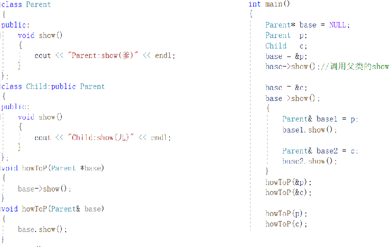
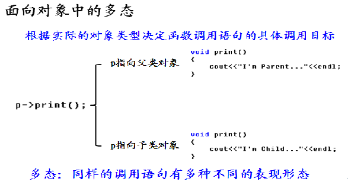
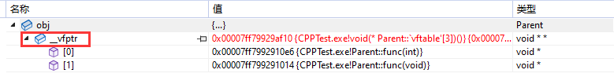

# 多态

## 问题抛出

如果子类定义了与父类中原型相同的函数会发生什么？


## 面向对象新需求

对于上面这种现象，编译器的做法不是我们期望的，我们期望的是

+ 根据实际的对象类型来判断重写函数的调用
+ 如果父类指针指向的是父类对象，则调用父类中定义的函数
+ 如果父类指针指向的是子类对象，则调用子类中定义的重写函数
  
  解决方案：
  + 在父类中，在**能让子类重写的函数**的前面加上virtual关键字(必须)
  + 在子类中，在**重写的父类的虚函数**后面加上override，表示是虚函数重写(非必须，但是加上可以防止重写的虚函数写错)

## 多态的意义探究

### 面向对象三大概念：

封装：突破了C语言函数的概念
继承：代码复用——可以用以前人写的代码
多态：可以使用未来人写的代码

> 案例：打印矩形和圆形坐标和面积
>
> 矩形：x，y，length,width
>
> 圆形：x，y，radius
>
> 思路:
>
> 1. 矩形和圆形都有共同的属性(x,y)，那么可以把坐标抽取出来，定义一个形状类为父类，形状类中包含坐标，并提设置和访问方法以及获取面积的方法。
> 2. 定义一个矩形类，继承自形状类；并增加length和width属性
> 3. 定义一个圆形类，继承自形状类；并增加radius属性
> 4. 写一个测试类，定义相应的方法来实现功能

### 多态成立的三要素：

1. 要有继承：多态发生在父子类之间

2. 要有虚函数重写：重写了虚函数，才能进行动态绑定

3. 要有父类指针(引用)指向子类对象

   > 多态是设计模式的基础，多态是框架的基础 

## 虚析构

构造函数不能是虚函数。建立一个派生类对象时，必须从类层次的根开始，沿着继承路径逐个调用基类的构造函数

析构函数可以是虚的。通过父类指针释放所有的子类资源		

```cpp
class Base
{
public:
	Base()
	{
		cout << __FUNCSIG__ << endl;
	}
	virtual ~Base()
	{
		cout << __FUNCSIG__ << endl;
	}
};

class Derive : public Base
{
private:
	char* _str;
public:
	Derive()
	{
		_str = new char[10]{ "顽石老师" };
		cout << __FUNCSIG__ << endl;
	}
	~Derive()
	{
		delete _str;
		cout << __FUNCSIG__ << endl;
	}
};


int main()
{
	Base* base = new Derive;
	delete base;			//父类写了虚析构，通过父类指针释放对象的时候，才会调用子类的析构函数

	return 0;
}
```


## 函数的重载、重写、重定义

### 函数重载

+ 必须在同一个类中进行(作用域相同)

+ 子类无法重载父类的函数，父类同名函数将被名称覆盖

+ 重载是在编译期间根据参数类型和个数决定函数调用

### 函数重定义

+ 发生于父类和子类之间，如果子类写了个和父类函数原型一样的函数，并且父类中的函数没有声明为虚函数，则子类会直接覆盖掉父类的函数
+ 通过父类指针或引用执行子类对象时，会调用父类的函数

### 虚函数重写

+ 必须发生于父类和子类之间

+ 并且父类与子类中的函数必须有完全相同的原型
+ 使用virtual声明之后能够产生多态(如果不使用virtual，那叫重定义)
+ 多态是在运行期间根据具体对象的类型决定函数调用

## 纯虚函数和抽象类

### 纯虚函数

纯虚函数是一种特殊的虚函数，在许多情况下，在基类中不能对虚函数给出有意义的实现，而把它声明为纯虚函数，它的实现留给该基类的派生类去做。这就是纯虚函数的作用。

纯虚函数也可以叫抽象函数，一般来说它只有函数名、参数和返回值类型，不需要函数体。这意味着它没有函数的实现，需要让派生类去实现。

C++中的纯虚函数，一般在函数签名后使用=0作为此类函数的标志。Java、C#等语言中，则直接使用abstract作为关键字修饰这个函数签名，表示这是抽象函数(纯虚函数)。

```cpp
class Animal
{
public:
    virtual void cry() = 0;
}
```

### 抽象类

抽象类是对问题领域进行分析、设计中得出的抽象概念，是对一系列看上去不同，但是本质上相同的具体概念的抽象。

通常在编程语句中用 abstract 修饰的类是抽象类。在C++中，含有纯虚拟函数的类称为抽象类，它不能生成对象；在java中，含有抽象方法的类称为抽象类，同样不能生成对象。

抽象类是不完整的，它只能用作基类。在面向对象方法中，抽象类主要用来进行类型隐藏和充当全局变量的角色。

#### 概念理解

在面向对象的概念中，所有的对象都是通过类来描绘的，但是反过来，并不是所有的类都是用来描绘对象的，如果一个类中没有包含足够的信息来描绘一个具体的对象，这样的类就是抽象类。 

比如，在一个图形编辑软件的分析设计过程中，就会发现问题领域存在着圆、三角形这样一些具体概念，它们是不同的，但是它们又都属于形状这样一个概念，形状这个概念在问题领域并不是直接存在的，它就是一个抽象概念。而正是因为抽象的概念在问题领域没有对应的具体概念，所以用以表征抽象概念的**抽象类是不能够实例化**的。 

#### 抽象类特征

1. 抽象类不能实例化
2. 抽象类和包含抽象方法(纯虚函数)、非抽象方法和属性
3. 从抽象类派生的非抽象类，必须对继承过来的所有抽象方法实现


### 关键字

#### abstract

> MSVC独有的关键字，申明类为抽象类

```cpp
class  Animal abstract
{
};


int main()
{
	Animal a;	//error C3622: “Animal”: 声明为“abstract”的类不能被实例化
	return 0;
}
```


#### final

> C++标准关键字，结束的意思

+ 禁用虚函数重写

  ```cpp
  class  Animal 
  {
  protected:
  	virtual void show() final
  	{
  
  	}
  };
  
  class Dog final :public Animal
  {
  public:
  	void show()override	//error C3248: “Animal::show”: 声明为“final”的函数无法被“Dog::show”重写
  	{
  
  	}
  };
  ```

+ 禁止该类被继承

  ```cpp
  class  Animal  final
  {
  };
  
  class Dog final :public Animal //error C3246: "Dog": 无法从 "Animal" 继承，因为它已声明为 "final"
  {
  };
  ```

  

## 多态探究

### 多态的理论基础

**静态联编和动态联编**：联编是指一个程序模块、代码之间互相关联的过程。

+ 静态联编(关联)，是程序的匹配、连接在编译阶段实现，也称为早期匹配。
  	   	 `重载函数使用静态联编。`

+ 动态联编(关联)，是指程序联编推迟到运行时进行，所以又称为动态联编(迟绑定),将函数体和函数调用关联起来，就叫绑定
  		`switch 语句和 if 语句是动态联编的例子。`

  那么C++中的动态联编是如何实现的呢？
  如果我们声明了类中的成员函数为虚函数，那么C++编译器会为类生成一个虚函数表，通过这个表即可实现动态联编

### 多态的本质(原理)

虚函数表是顺序存放虚函数地址的，虚表是顺序表(数组)，依次存放着类里面的虚函数。
虚函数表是由编译器自动生成与维护的，相同类的不同对象的虚函数表是一样的。

.png)

既然虚函数表，是一个顺序表，那么它的首地址存放在哪里呢？其实当我们在类中定义了virtual函数时，C++编译器会偷偷的给对象添加一个vptr指针，vptr指针就是存的虚函数表的首地址。

### 如何证明vptr指针存在

我们可以通过求出类的大小判断是否有vptr的存在

```cpp
class Dog
{
	void show() {}
};

class Cat
{
	virtual void show() {}
};

int main()
{
	cout << "Dog size:" << sizeof(Dog) << " Cat size:" << sizeof(Cat) << endl;

	return 0;
}
output: Dog size:1 Cat size:8
```

通过调试确实能看到vptr指针的存在，而且存放在对象的第一个元素



### 如何找到vptr指针呢

既然vptr指针存在，那么能不能拿到vptr指针，手动来调用函数呢？

答案是可以的，但是操作起来比较麻烦！下面我们就来挖一挖

1. 因为vptr指针在对象的第一个元素(通过证明vptr指针的存在可以看出)，所以对对象t取地址可以拿到对象的地址

   ```cpp
   Object* p = &obj;
   ```

2. 现在拿到的指针的步长是对象的大小，因为vptr是指针，只有4/8个字节，所以需要把p强转成int*指针，这样对(int\*)&t就得到了vptr指针

   ```cpp
   int vptr = *(int*)p;	//拿到了vptr指针的指针
   int* pvptr = (int*)vptr; //把vptr的值转成指针
   ```

3. 因为vptr指针是指向的存储指针数组的首地址，所以拿到vptr指针后先把vptr转成int*指针，这样进行取值的话，刚好是每个指针

   ```cpp
   FUN foo = (FUN)*(pvptr+0)
   ```

4. 接着吧得到的数组里面的元素(指针)转成函数指针，即可直接使用了

   ```cpp
   using FUN = void (*)();
   
   Parent* p = &obj;
   long long vptr = *(long long*)p;
   long long* pvptr = (long long*)vptr;
   auto foo = (FUN)*(pvptr + 1);
   foo();
   //output:Parent::fun(int i)
   ```

   