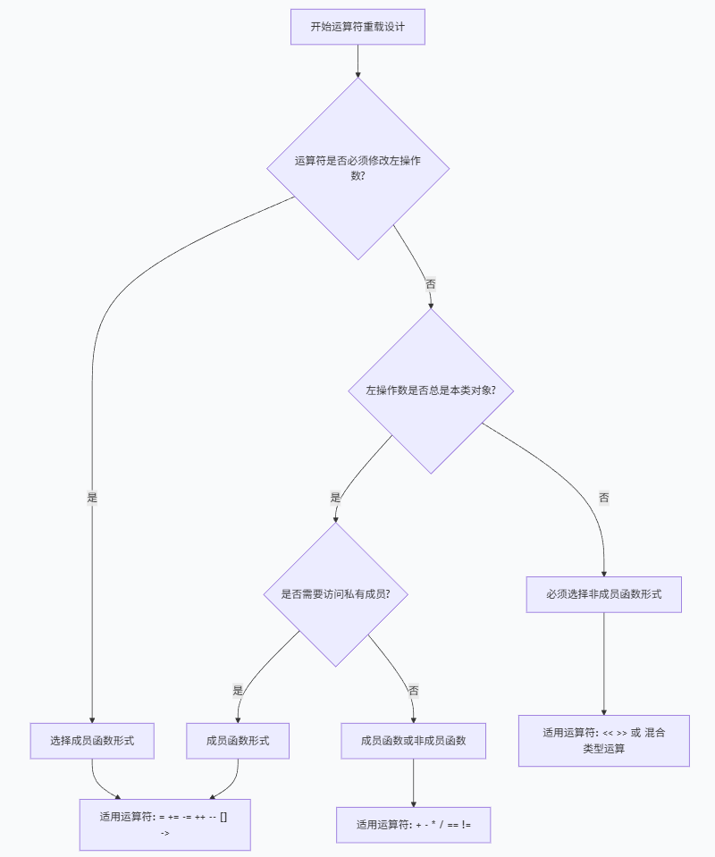

# 运算符重载

**运算符重载**是C++中的一种特性，允许开发者为自定义类型重新定义或扩展内置运算符的功能。通过运算符重载，可以使对象之间的操作更加直观和简洁。

运算符重载本质上是**函数重载**。它通过定义一个特殊的函数来实现，函数名由关键字`operator`加上要重载的运算符组成。重载后的运算符可以像内置运算符一样操作对象。

## 运算符重载概念

### 运算符重载的意义

我们平常常见的算术运算符、逻辑运算符等运算符都是系统库函数里面已经存在的，所以运算符可以直接用于我们常用的数据类型。然而对于我们自定义的类实例化的对象，系统没有与之相关的运算符可以操作，但是为了使我们编写程序时更加便捷，C++提供了一种方式`运算符重载`，来满足我们对于类对象进行的操作。

也就是说运算符重载是为了解决类对象之间的运算的，让编译器在遇到对象运算时能按我们要求的进行运算，这就是运算符重载的意义。

### 运算符重载限制

C++中绝大部分的运算符允许重载，少部分不允许重载，详细描述如下

### 可以重载的运算符

+ 算术运算符：+     -     *     /     % 
+ 自增、自减运算符：++  --
+ 位运算符：|     &     ~     ^     <<     >>     
+ 逻辑运算符：||     &&     !     
+ 关系运算符：==     !=     <     >     <=     >=     
+ 赋值运算符：=     +=     -=     /=     %=     &=     |=     ^=     <<=     >>=     
+ 单目运算符：+     -     *     &
+ 动态内存分配：new     delete     new[]     delete[]
+ 其他运算符：()     ->     ,     []     

### 	不能重载的运算符

+ .	成员访问运算符	
+ ::	域运算符
+ .*   ->*	成员指针访问运算符
+ szieof	长度运算符	
+ ?:	条件运算符

### 运算符重载规则

+ 重载运算符函数可以对运算符作出新的解释﹐但原有基本语义不变:
  + 不改变运算符的优先级
  + 不改变运算符的结合性
  + 不改变运算符所需要的操作数
  + 不能创建新的运算符

+ 一个运算符被重载后，原有意义没有失去，只是定义了相对一特定类的一个新运算符。

## 运算符重载方法

### 定义和使用运算符重载

如果脑海里不能直接浮现对应的运算符重载函数，可以先实现普通的函数，然后再改成运算符重载的形式。

比如，有一个`Number`类，要实现两个`Number`对象相加，提供一个`add`函数即可！

```cpp
class Number {
public:
	Number()
		: m_value(0.0)
	{}

	Number(double value) 
		: m_value(value) 
	{}

	double value()const { return m_value; }
        
    Number add(const Number& other){
        return m_value + other.m_value;
    }
private:
	double m_value;
};
```

使用如下：

```cpp
	Number a(3);
	Number b(4);
	auto ret = a.add(b);
```

很简单对吧！但是通过`add`函数相加，比较麻烦，要是能直接使用`a+b`这种方式就好了！我们把`add`函数复制一份，修改一下函数名！

```cpp
	Number operator+(const Number& other) {
		return m_value + other.m_value;
	}
```

这样我们就可以直接使用`a+b`这种形式了！

```cpp
	auto ret = a + b;
```

这种方式其实就是直接调用的运算符重载函数，其实也可以有另外一种调用方式，就是直接使用函数名，如下：

```cpp
	ret = a.operator+(b);
```


### 两种重载方法

运算符重载有两种方式，分别是成员函数重载和友元(全局)函数重载。

#### 成员函数重载

**当运算符重载作为类的成员函数时，它的第一个操作数隐式地绑定到调用它的对象上**。 这种方式适合那些操作**涉及改变对象内部状态**或**需要访问对象的私有成员**的情况。

比如，我们给`Number`类，实现基本的算术运算符：

```cpp
	Number operator+(const Number& other)const {
		return m_value + other.m_value;
	}

	Number operator-(const Number& other)const {
		return m_value - other.m_value;
	}

	Number operator*(const Number& other)const {
		return m_value * other.m_value;
	}

	Number operator/(const Number& other) const {
		return m_value / other.m_value;
	}

	Number operator%(const Number& other) const {
		return (int64_t)m_value % (int64_t)other.m_value;
	}
```

当然其实最上面的运算符重载不是最合适的，下面是赋值运算符的实现，赋值运算符改变了对象内部的数据：

```cpp
	Number& operator+=(const Number& other) {
		m_value += other.m_value;
		return*this;
	}

	Number& operator-=(const Number& other) {
		m_value -= other.m_value;
		return *this;
	}

	Number& operator*=(const Number& other) {
		m_value *= other.m_value;
		return *this;
	}

	Number& operator/=(const Number& other) {
		m_value /= other.m_value;
		return *this;
	}

	Number& operator%=(const Number& other) {
		m_value =  (int64_t)m_value % (int64_t)other.m_value;
		return *this;
	}
```

#### 非成员函数重载

非成员函数方式的运算符重载通常声明为类的友元函数，这样它们可以访问类的私有和受保护成员，同时它们的操作数都是显式传递的，没有隐式的 this 指针。

这种方式特别适用于那些需要对称地处理两个操作数的情况。例如，当两个操作数的类型不同或者当操作不直接关联到对象状态的改变时。

比如对于前面的算术运算符，最好是改为非成员函数的重载：

```cpp
Number operator+(const Number& left,const Number& right){
	return left.value() + right.value();
}
Number operator-(const Number& left,const Number& right){
	return left.value() - right.value();
}
Number operator*(const Number& left,const Number& right){
	return left.value() * right.value();
}
Number operator/(const Number& left,const Number& right){
	return left.value() / right.value();
}
Number operator%(const Number& left,const Number& right){
	return left.toInt64() % right.toInt64();
}
```

注意，当你写了全局重载之后，原来的成员函数版本要删掉了，否则会有二义性问题！

```cpp
	auto ret = a + b;
```

代码运行没有问题，结果也正确，但是思考一下，如果我要和一个整数相加，会有问题吗？

```cpp
	auto t = a + 1;
	auto t1 = 1 + a;
```

也没有问题，因为`1`会隐式构造成`Number`对象，然后进行运算！

但是在某些情况下，具有可交换性的双目运算符需要重载很多个相同的运算符：

```cpp
class Vector2 {
public:
	Vector2()
		: m_x(0.0f), m_y(0.0f)
	{ }

	Vector2(float x, float y)
		: m_x(x), m_y(y)
	{ }

private:
	float m_x;
	float m_y;
private:
	friend Vector2 operator+(const Vector2& left, const Vector2& right);
	friend Vector2 operator+(const Vector2& left, float d);
	friend Vector2 operator+(float d,const Vector2& left);
};

Vector2 operator+(const Vector2& left, const Vector2& right) {
	return Vector2(left.m_x + right.m_x, left.m_y + right.m_y);
}

Vector2 operator+(const Vector2& left, float d) {
	return Vector2(left.m_x + d, left.m_y + d);
}

Vector2 operator+(float d,const Vector2& right) {
	return Vector2(right.m_x + d, right.m_y + d);
}
```

使用示例：

```cpp
void t()
{
	Vector2 a(1.0f, 2.0f);
	Vector2 b(3.0f, 4.0f);

	auto c = a + b;
	auto d = a + 1.0f;
	auto e = 1.0f + a;
}
```

#### 选择时机指南

#####  选择决策流程图



##### 决策检查表

###### 选择成员函数当：

- 运算符必须修改左操作数（`=`, `+=`, `-=` 等）
- 运算符是下标访问（`[]`）
- 运算符是成员访问（`*`, `->`）
- 运算符是自增自减（`++`, `--`）
- 运算符是类型转换（`operator type()`）
- 左操作数必须是本类对象

###### 选择非成员函数当：

- 需要对称性（如 `a + b` 和 `b + a`）
- 左操作数可能是其他类型（如 `5 + obj`）
- 运算符是流操作（`<<`, `>>`）
- 不想让运算符成为类接口的一部分
- 想要支持隐式转换

###### 根据具体情况决定：

- 算术运算符（`+`, `-`, `*`, `/`）
- 关系运算符（`==`, `!=`, `<`, `>` 等）
- 位运算符（`&`, `|`, `^` 等）
- 逻辑运算符（`&&`, `||`）

##### 黄金法则

1. **修改自身的用成员**：`=`, `+=`, `-=`, `++`, `--`, `[]`, `->`, `()`
2. **对称运算用友元**：`+`, `-`, `*`, `/`, `==`, `!=`, `<`, `>`
3. **流操作用非成员**：`<<`, `>>`
4. **复用已有实现**：用 `+=` 实现 `+`，用 `==` 和 `<` 实现其他比较

## 自增自减运算符重载

在C++中，自增运算符（++）和自减运算符（--）可以被重载，以适应不同的数据类型。自增运算符的重载分为前置和后置两种形式。

### 前置自增运算符重载

前置自增运算符的重载函数**没有形参**，返回值类型是类对象的引用。例如，假设我们有一个*Clock*类，我们可以这样重载前置自增运算符：

```cpp
class Clock {
public:
   Clock& operator++() {
       this->second++;
       if (second >= 60) {
           this->second = this->second - 60;
           this->minute++;
           if (minute >= 60) {
               this->minute = this->minute - 60;
               this->hour = (this->hour + 1) % 24;
           }
       }
       return *this; // 返回加一之后的值
   }
private:
   int hour, minute, second;
};
```

在这个例子中，*operator++()*函数先对当前对象的*second*值加一，然后对*hour*和*minute*值进行进位操作，最后返回指向当前对象的引用。

### 后置自增运算符重载

后置自增运算符的重载函数**需要一个*int*形参**，该形参没有实际作用，只是用来区别前置运算符的重载函数。返回值是类对象的副本。例如，继续上面的*Clock*类，我们可以这样重载后置自增运算符：

```cpp
class Clock {
public:
   Clock operator++(int) {
       Clock old = *this; // 记录修改前的对象
       ++(*this); // 调用前置“++”运算符
       return old; // 返回修改前的对象
   }
private:
   int hour, minute, second;
};
```

在这个例子中，*operator++(int)*函数先将当前对象拷贝一份，然后调用前置自增运算符对当前对象进行加一操作，最后返回修改前的对象

### 完整例子

以下是一个完整的示例代码，展示了如何重载前置和后置自增运算符：

```cpp
#include <iostream>
using namespace std;
class Point {
public:
   Point() : x(0), y(0) {}
   Point(double x, double y) : x(x), y(y) {}
   Point& operator++() { // 前置自增
       x++;
       y++;
       return *this;
   }
   Point operator++(int) { // 后置自增
       Point old = *this;
       ++(*this);
       return old;
   }
   void display() const {
       cout << "(" << x << "," << y << ")" << endl;
   }
private:
   double x, y;
};
int main() {
   Point p1(1, 1);
   cout << "初始值: ";
   p1.display();
   cout << "前置自增: ";
   (++p1).display();
   cout << "后置自增: ";
   (p1++).display();
   cout << "自增后: ";
   p1.display();
   return 0;
}
```

在这个示例中，我们定义了一个*Point*类，并重载了前置和后置自增运算符。程序输出如下：

```css
初始值: (1,1)
前置自增: (2,2)
后置自增: (2,2)
自增后: (3,3)
```

通过这个示例，我们可以看到前置自增和后置自增的区别。前置自增返回的是加一后的值，而后置自增返回的是加一前的值。

## 输入输出运算符重载

在C++中，类的私有成员不能被直接访问，需要通过类中提供的成员函数来操作这些数据。同时，C++能够使用流提取运算符 *>>* 和流插入运算符 *<<* 来输入和输出内置的数据类型。我们可以重载这些运算符来操作对象等用户自定义的数据类型。

### 重载输出流运算符

重载输出流运算符 *<<* 可以让我们方便地输出对象的内容。以下是一个示例，展示了如何重载输出流运算符：

```cpp
#include <iostream>
using namespace std;
class Date {
private:
   int year;
   int month;
   int day;
public:
   Date() : year(0), month(0), day(0) {}
   Date(int y, int m, int d) : year(y), month(m), day(d) {}
   // 重载输出流运算符
   friend ostream& operator<<(ostream& out, const Date& date) {
       out << date.year << "-" << date.month << "-" << date.day;
       return out;
   }
};
int main() {
   Date date(2023, 5, 27);
   cout << date << endl; // 输出: 2023-5-27
   return 0;
}
```

在这个示例中，我们定义了一个 *Date* 类，并重载了输出流运算符 *<<*。通过重载运算符，我们可以直接使用 *cout << date* 来输出日期对象的内容。

### 重载输入流运算符

类似地，我们也可以重载输入流运算符 *>>* 来方便地输入对象的内容。以下是一个示例，展示了如何重载输入流运算符：

```cpp
#include <iostream>
using namespace std;
class Date {
private:
   int year;
   int month;
   int day;
public:
   Date() : year(0), month(0), day(0) {}
   // 重载输入流运算符
   friend istream& operator>>(istream& in, Date& date) {
       in >> date.year >> date.month >> date.day;
       return in;
   }
};
int main() {
   Date date;
   cout << "Enter date (year month day): ";
   cin >> date; // 输入: 2023 5 27
   cout << "You entered: " << date << endl; // 输出: You entered: 2023-5-27
   return 0;
}
```

在这个示例中，我们重载了输入流运算符 *>>*，使得我们可以直接使用 *cin >> date* 来输入日期对象的内容。

### 总结

通过重载输入流和输出流运算符，我们可以方便地对自定义对象进行输入和输出操作。这种方式不仅简化了代码，还提高了代码的可读性和可维护性。

## 类型转换重载

类型转换和运算符重载是两个重要的概念。类型转换允许我们将一个类型的数据转换为另一个类型，而运算符重载则允许我们为自定义类型定义新的运算符行为。

类型转换运算符是一种单目运算符，可以被重载为成员函数。例如：

```cpp
class Real {
public:
	Real(double value) 
		: m_value(value) 
	{}

	operator double() const { return m_value; }
private:
	double m_value;
};
```

有了类型转换运算符重载，就可以直接把对象赋值给double类型的对象了：

```cpp
	Real r = 1.23;// double(1.23) is converted to Real
	double d = r; // Real(r) is converted to double
```

在将r赋值给d时，会先调用`operator double() const`函数，将r对象转成double类型，然后赋值给d对象。

如果你不想直接转换，而是必须通过强制转换来转换，可以在转换运算符重载函数前面加上`explicit`关键字即可！

```cpp
	explicit operator double() const { return m_value; }
```

然后运行`double d = r`这里就会报错了：

```css
error C2440: “初始化”: 无法从“Real”转换为“double”
```


## 自定义字面量

用户自定义字面量是C++11引入的一项特性，允许开发者通过定义自定义后缀，为整型、浮点型、字符和字符串字面量赋予特定的行为或返回类型。这种机制增强了代码的可读性和表达力，使得代码更加直观和类型安全。

用户自定义字面量通过定义特殊的字面量运算符实现。该运算符以 `operator""` 为前缀，后接一个唯一的标识符（即用户定义的后缀）。根据字面量的类型（如整数、浮点数、字符或字符串），运算符的参数形式会有所不同。

**使用场景**

用户自定义字面量常用于以下场景：

- 单位转换（如长度、重量、时间等）。
- 字符串处理（如添加特定前缀或后缀）。
- 类型安全的数值表示（如货币、物理量等）。

**注意事项**

- 用户定义的后缀必须以`_` 开头，以避免与标准库冲突。
- 字面量运算符可以是 `constexpr`，以支持编译期计算。
- 不允许使用默认参数。

**工作原理**

当编译器遇到带有用户定义后缀的字面量时，会查找对应的 `operator""`函数。如果找到匹配的运算符，则调用该函数并传递字面量的值作为参数。例如，`150.0_cm` 会调用 `operator"" _cm`，并将 `150.0` 作为参数传递。

### 需求分析

比如有一个`ByteSize`类，用于表示代码中的字节大小，并能进行单位转换：

```cpp
class ByteSize {
public:
	ByteSize()
		: m_byte()
	{ }

	ByteSize(uint64_t byteSize)
		: m_byte(byteSize)
	{ }

	uint64_t byte()const { return m_byte; }
	float kByte()const { return m_byte / 1024.f; }
	float mByte()const { return kByte() / 1024.f; }
	float gByte()const { return mByte() / 1024.f; }
	float tByte()const { return gByte() / 1024.f; }
	float pByte()const { return tByte() / 1024.f; }
private:
	uint64_t m_byte;
};
```

来简单测试一下：

```cpp
int main()
{
	ByteSize b(3 * 1024LLU * 1024 * 1024);	//3GB
	std::print("{} bytes\n", b.byte());
	std::print("{} KBytes\n", b.kByte());
	std::print("{} MBytes\n", b.mByte());
	std::print("{} GBytes\n", b.gByte());
	std::print("{} TBytes\n", b.tByte());
	std::print("{} PBytes\n", b.pByte());

	return 0;
}
```

输出如下：

```css
3221225472 bytes
3145728 KBytes
3072 MBytes
3 GBytes
0.0029296875 TBytes
2.861023e-06 PBytes
```

通过一系列函数将底层存储的字节大小，转换成不同单位的大小，非常方便！

**但是，**现在有个问题，从字节转到其他单位很方便，但是从其他的单位转到字节，必须手动计算，然后传入到`ByteSize`构造函数中，比较麻烦！

我们可以写一个支持字符串的构造函数，用于从字符串中解析带单位的字节大小：

```cpp
	ByteSize(const std::string& sizeStr)
		: m_byte(parse(sizeStr))
	{ }
	...
private:
	/*
	* 支持单位如下：
	*  -- B
	*  -- KB
	*  -- MB
	*  -- GB
	*  -- TB
	*  -- PB
	*/
	uint64_t parse(const std::string& str) {
		if (str.ends_with("PB")) {
			return std::stod(str) * 1024 * 1024 * 1024 * 1024 * 1024;
		}
		else if (str.ends_with("TB")) {
			return std::stod(str) * 1024 * 1024 * 1024 * 1024;
		}
		else if (str.ends_with("GB")) {
			return std::stod(str) * 1024 * 1024 * 1024;
		}
		else if (str.ends_with("MB")) {
			return std::stod(str) * 1024 * 1024;
		}
		else if (str.ends_with("KB")) {
			return std::stod(str) * 1024;
		}
		else if (str.ends_with("B")) {
			return std::stoull(str);
		}
		return 0;
	}
```

然后再进行测试：

```cpp
	{
		std::println("3GB");
		ByteSize b("3GB");
		std::println("{} bytes", b.byte());
		std::println("{} KBytes", b.kByte());
		std::println("{} MBytes", b.mByte());
		std::println("{} GBytes", b.gByte());
		std::println("{} TBytes", b.tByte());
		std::println("{} PBytes", b.pByte());
		std::println();
	}

	{
		std::println("1TB");
		ByteSize b("1TB");
		std::println("{} bytes", b.byte());
		std::println("{} KBytes", b.kByte());
		std::println("{} MBytes", b.mByte());
		std::println("{} GBytes", b.gByte());
		std::println("{} TBytes", b.tByte());
		std::println("{} PBytes", b.pByte());
		std::println();
	}

	{
		std::println("1PB");
		ByteSize b("1PB");
		std::println("{} bytes", b.byte());
		std::println("{} KBytes", b.kByte());
		std::println("{} MBytes", b.mByte());
		std::println("{} GBytes", b.gByte());
		std::println("{} TBytes", b.tByte());
		std::println("{} PBytes", b.pByte());
		std::println();
	}
```

运行结果如下：

```cpp
3GB
3221225472 bytes
3145728 KBytes
3072 MBytes
3 GBytes
0.0029296875 TBytes
2.861023e-06 PBytes

1TB
1099511627776 bytes
1073741824 KBytes
1048576 MBytes
1024 GBytes
1 TBytes
0.0009765625 PBytes

1PB
1125899906842624 bytes
1099511627776 KBytes
1073741824 MBytes
1048576 GBytes
1024 TBytes
1 PBytes
```

这样就方便很多了对吧，但是C++给我们提供了更简单的方法来解决这件事情。

### 使用自定义字面量

```cpp
ByteSize operator "" _B(unsigned long long  byteSize) {
	return ByteSize(byteSize);
}

ByteSize operator "" _KB(long double byteSize) {
	return ByteSize(byteSize * 1024);
}

ByteSize operator "" _KB(unsigned long long byteSize) {
	return ByteSize(byteSize * 1024);
}

ByteSize operator "" _MB(long double byteSize) {
	return ByteSize(byteSize * 1024 * 1024);
}

ByteSize operator "" _MB(unsigned long long byteSize) {
	return ByteSize(byteSize * 1024 * 1024);
}

ByteSize operator "" _GB(long double byteSize) {
	return ByteSize(byteSize * 1024 * 1024 * 1024);
}

ByteSize operator "" _GB(unsigned long long byteSize) {
	return ByteSize(byteSize * 1024 * 1024 * 1024);
}

ByteSize operator "" _TB(long double byteSize) {
	return ByteSize(byteSize * 1024 * 1024 * 1024 * 1024);
}

ByteSize operator "" _TB(unsigned long long byteSize) {
	return ByteSize(byteSize * 1024 * 1024 * 1024 * 1024);
}

ByteSize operator "" _PB(long double byteSize) {
	return ByteSize(byteSize * 1024 * 1024 * 1024 * 1024 * 1024);
}

ByteSize operator "" _PB(unsigned long long byteSize) {
	return ByteSize(byteSize * 1024 * 1024 * 1024 * 1024 * 1024);
}
```

其实写起来还是有点多的，为了支持整型和浮点型数据，每个版本都重载了两个函数，使用方式如下：

```cpp
	{
		std::println("3MB");
		auto b = 3_MB;
		std::println("{} bytes", b.byte());
		std::println("{} KBytes", b.kByte());
		std::println("{} MBytes", b.mByte());
		std::println("{} GBytes", b.gByte());
		std::println("{} TBytes", b.tByte());
		std::println("{} PBytes", b.pByte());
		std::println();
	}

	{
		std::println("3GB");
		auto b = 3_GB;
		std::println("{} bytes", b.byte());
		std::println("{} KBytes", b.kByte());
		std::println("{} MBytes", b.mByte());
		std::println("{} GBytes", b.gByte());
		std::println("{} TBytes", b.tByte());
		std::println("{} PBytes", b.pByte());
		std::println();
	}

	{
		std::println("1.5TB");
		auto b = 1.5_TB;
		std::println("{} bytes", b.byte());
		std::println("{} KBytes", b.kByte());
		std::println("{} MBytes", b.mByte());
		std::println("{} GBytes", b.gByte());
		std::println("{} TBytes", b.tByte());
		std::println("{} PBytes", b.pByte());
		std::println();
	}

	{
		std::println("1PB");
		auto b = 1_PB;
		std::println("{} bytes", b.byte());
		std::println("{} KBytes", b.kByte());
		std::println("{} MBytes", b.mByte());
		std::println("{} GBytes", b.gByte());
		std::println("{} TBytes", b.tByte());
		std::println("{} PBytes", b.pByte());
		std::println();
	}
```

### 其他

除了上面的字面量重载(参数为`unsigned long long`和`long double`)之外，还有其他两种：

+ 参数为字符

```cpp
char operator""_c(char v)
{
	if (isupper(v))
	{
		return tolower(v);
	}
	return v;
}
```

+ 参数为字符串

```cpp
std::string operator""_s(const char* str,size_t size)
{
	return std::string(str,size);
}
```

值得注意的是，字符串并不需要自己传递长度，会自动进行推导！

```cpp
	auto str = "hello"_s;
```
