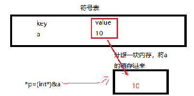

# 从C语言到C++

C++ 和C语言虽然是两门独立的语言，但是它们却有着扯也扯不清的关系。早期并没有“C++”这个名字，而是叫做“带类的C”。“带类的C”是作为C语言的一个扩展和补充出现的，它增加了很多新的语法，目的是提高开发效率。

这个时期的 C++ 非常粗糙，仅支持简单的面向对象编程，也没有自己的编译器，而是通过一个预处理程序（名字叫 cfront），先将 C++ 代码”翻译“为C语言代码，再通过C语言编译器合成最终的程序。

随着 C++ 的流行，它的语法也越来越强大，已经能够很完善的支持面向过程编程、面向对象编程（OOP）和泛型编程，几乎成了一门独立的语言，拥有了自己的编译方式。

我们很难说 C++ 拥有独立的编译器，例如 Windows 下的微软编译器（MSVC）、Linux 下的 GCC 编译器、Mac 下的 Clang 编译器，它们都同时支持C语言和 C++，统称为 C/C++ 编译器。对于C语言代码，它们按照C语言的方式来编译；对于 C++ 代码，就按照 C++ 的方式编译。

从表面上看，C、C++ 代码使用同一个编译器来编译，所以上面我们说“后期的 C++ 拥有了自己的编译方式”，而没有说“C++ 拥有了独立的编译器”。

从语法上看，C语言是 C++ 的一部分，C语言代码几乎不用修改就能够以 C++ 的方式编译。


## 1. 头文件

C++为了兼容C，支持所有的C头文件，但为了符合C++标准，所有的C头文件都有一个C++版本的，即去掉.h，并在名子前面加c。如\<cstring>和\<cmath>。

|  C语言   |   C++    |
| :------: | :------: |
| stdio.h  | iostream |
|  math.h  |  cmath   |
| string.h | cstring  |
| stdlib.h | cstdlib  |
|  ......  |  ......  |

## 2. 命名空间

### 定义与使用

假设这样一种情况，当一个班上有两个名叫 maye的学生时，为了明确区分它们，我们在使用名字之外，不得不使用一些额外的信息，比如他们的家庭住址，或者他们父母的名字等等。

同样的情况也出现在 C++ 中。比如有两个相同的变量m，编译器就无法判断你使用的是哪个变量m。

+ 为了解决上输入问题，引入了命名空间这个概念，它可作为附加信息来区分不同库中相同名称的函数、类、变量等。本质上，命名空间就是定义了一个范围。
  定义方式：

  ```c++
  namespace name			//name为自定义命名空间名
  {
  	//代码声明
  }
  ```

  使用方式：

  ```cpp
  name::code;					//code可以是变量或函数...
  using  name::code;			//只使用name下面的code
  using namespace name;		//使用name里面的所有内容
  ```

### std

**std是什么？**

std是个名称空间标示符，C++标准库中的函数或者对象都是在命名空间std中定义的，所以我们要使用标准函数库中的函数或对象都要使用std来限定。

对象cout是标准函数库所提供的对象，而标准库在名字空间中被指定为std，所以在使用cout的时候要加上std: : 。这样编译器就会明白我们调用的cout是名字空间std中的cout。

**为什么将cout放到命名空间中？**

是因为像cout这样的对象在实际操作中或许会有好几个，比如说你自己也可能会不小心定义了一个对象叫cout，那么这两个cout对象就会产生冲突。


## 3. 输入输出

C语言的的输入输出用的主要是scanf()、printf()函数，而C++是使用类对象cin、cout进行输入输出。

```cpp
int a;
double b;
char name[20];
cin >> a >> b >> name;
cout << a << b << name;
```

+ cin 输入流对象

+ cout 输出流对象

+ endl 换行，并清空输出缓冲区(end line 结束一行，并另起一行)

+ \n照样可以在cout中使用

  

## 4. 基本数据类型

### bool类型

C++和C语言的基本数据类型几乎一样

```cpp 
char 	short 	int  long long	float 	double 	unsigned 	signed ...
```

值得注意的是，C语言中虽然也有bool(布尔类型)，但是需要包含头文件<stdbool.h>，而在C++中则不用，直接使用即可。

布尔类型对象可以被赋予文字值true或false，所对应的关系就是真与假的概念，即1,0。

可以使用boolalpha打印出bool类型的true或false

```cpp
bool cmpare(int a,int b)
{
    return a > b;
}
cout << boolalpha << compare(2,3) << endl;
```


### 强弱类型

+ C语言：强类型，弱检查—— 一般就叫做弱类型了

```c
void* p = NULL;
int* p1 = p;

int* pn = NULL;
void* pp = pn;
//无报错，无警告，完美
```

在C语言中，void\*可以和其他类型指针相互转换！


+ C++：强类型，强检查   ——  真正意义上的强类型

```cpp
void* p = NULL;
int* p1 = p;		//错误	“初始化”: 无法从“void *”转换为“int *”

int* pn = NULL;
void* pp = pn;		//正确	任意类型的指针都可以自动转为万能指针
```

在C++中，void*不能直接转换为其他类型的指针，但是可以把其他类型的指针转为void\*


### NULL和nullptr

NULL属于 C 语言中的宏，后来 C++11 引入了 nullptr 关键字，都用来表示空指针。

那问题来了，为什么 C++11 要引入 nullptr 呢？

那必定是 NULL 在某些方面存在某些不足，所以引入了nullptr，下面我们来看一下！

在 C 语言中，NULL是一个宏，被定义为空指针；在C++中，被定义为0，定义形式如下所示：

> 在C语言中NULL会被定义成(void*)NULL，但是C++不允许直接将 void * 隐式转换到其他类型，NULL 只好被定义为 0。

```java
#ifdef __cplusplus
    #define NULL 0
#else
    #define NULL ((void *)0)
#endif
```

我们来看一个C++中使用NULL的例子，代码如下所示：

```cpp
#include<iostream>
using namespace std;

void func(int x)
{
	cout << __FUNCSIG__<< endl;
}

void func(char* px)
{
	cout << __FUNCSIG__ << endl;
}

int main()
{
    //都调用的整数版本的func函数
	func(2);			//void __cdecl func(int)
	func(NULL);			//void __cdecl func(int)

	return 0;
}
```

从运行结果来看，无论是数字还是NULL都是调用的，参数为int类型的函数，这是毋庸置疑的，C++中NULL就是0。

但是这个结果更本不符合语义，我们传NULL，肯定是想传一个空指针进去的，而不是作为一个整数0，为此C++11引入了新的空指针关键字。

下面我们来修改一下上面的程序，将 NULL 替换为 nullptr，修改后如下所示：

```cpp
int main()
{
	func(2);			//void __cdecl func(int)
	func(nullptr);		//void __cdecl func(char *)

	return 0;
}
```

修改之后，运行结果正常！

看到这里你应该明白为什么 C++11 引入 nullptr 了吧！就是因为 NULL 在 C++ 程序中容易引起歧义！


### const

#### C语言中的冒牌货

C语言中的const并不是真正的常量，只是表示const修饰的变量为只读。

```c
const int num = 18;
//num = 19			//error:不能修改const 对象
//int arr[num]		//error:数组大小必须是常量
```

通过指针间接修改只读变量的值:

```c
int* pt = (int*)&num;
*pt = 19;
printf("%d %d\n", num,*pt);		//output:19 19
```

可以看到常量it的值已经通过指针被间接改变

#### C++中的真货

**为了兼容C语言做出了什么改变？**

```cpp
int* pt = (int*)&num;
*pt = 19;
cout << num << " " << *pt << endl;		//output:18 19
```

+ 明明已经通过指针修改了a值，为什么输出却没有变呢？

+ **解释**：
  C++编译器当碰见常量声明时，在符号表中放入常量，那么如何解释取地址呢？(编译期间即可确定)
  编译过程中若发现对const使用了&操作符，则给对应的常量分配存储空间（为了兼容C）

  

**const 的奇葩情况**

当给C++中的常量赋值一个变量时，它又变得和C语言一样了；(在程序运行期间分配内存)

```cpp
int num = 20;

const int a = num;					//赋值变量
int* p = (int*)&a;
*p = 21;
cout << a << " " << *p << endl;	  //output:21 21
```


#### const字符指针

在C++中const修饰的指针，不能直接赋值给没有const修饰的指针，需要强制类型转换，或者把被赋值的指针也声明为const

```cpp
char* name = "maye";		//错误
const char*name ="maye";	//正确
```

+ 函数参数为字符指针的时候需要特别注意

```cpp
void show(char* name)
{
	cout << name << endl;
}
void test()
{
	show("maye");	//"const char *" 类型的实参与 "char *" 类型的形参不兼容
	//void show(const char* name)	//请把函数原型里的参数加上const
}
```


## 5. 变量的初始化

在C++中变量的初始化，又有了奇葩的操作(极度猥琐)

### 1，背景

 在C++语言中，**初始化**与**赋值**并不是同一个概念：

  **初始化**：**创建变量时**赋予其一个初始值。

  **赋值**：把对象（已经创建）的**当前值**擦除，而用一个**新值**来代替。

### 2，列表初始化

作为C++11新标准的一部分，用**花括号**来初始化变量得到了全面应用（在此之前，只是在初始化数组的时候用到）。列表初始化有两种形式，如下所示：

```cpp
int a = 0;			//常规
int a = { 0 };		
int a{ 0 };
```

说明：上述的两种方式都可以将变量a初始化为0。

**2.1 局限**

当对**内置类型**使用**列表初始化**时，若**初始值存在丢失的风险**，编译将报错，如：

```cpp
int a = 3.14;	//正确，编译器会警告		“初始化”: 从“double”转换到“int”，可能丢失数据
int a = {3.14};	//错误，编译器会报错		从“double”转换到“int”需要收缩转换
```

### 3，直接初始化

如果在新创建的变量右侧使用括号将初始值括住（不用等号），也可以达到初始化效果

```cpp
int a(20);
```

``其他实例：``

```cpp
const char* name("maye");
char sex[3]("男");

const char* name{ "maye" };
char sex[3]{"男"};

cout << name << " "<<sex << endl;

char id[5]{ 1,2,3,4,5 };	//正确
char id[5](1,2,3,4,5);		//错误
```

## 6. 动态内存分配

在软件开发过程中，常常需要动态地分配和释放内存空间，例如对动态链表中结点的插入与删除。在C语言中是利用库函数malloc和free来分配和释放内存空间的。C++提供了较简便而功能较强的运算符new和delete来取代malloc和free函数。

**malloc**的职责仅仅是分配内存，**new**除了分配内存外，还干一件事，调用构造函数。

**free**的职责仅仅是释放内存，**delete**除了释放内存之外，还干一件事，调用析构函数。


+ 申请对象：

```cpp
Type* pointer = new Type;
//...
delete pointer;
```

**示例：**

```cpp
int* p = new int;
cout<<*p<<endl;	
delete p;
```

以上代码输出`-842150451`，据此可以知道，new是不会自动初始化内存的，那么我们可以在new的时候，指定初始值，简单方便！

```cpp
int *p = new int(18);
```


+ 申请对象数组:

```cpp
Type* pointer = new Type[N];
//...
delete[] pointer;	//数组的释放必须加上[]
```

**示例：**

```cpp
int* parr = new int[5];
for (int i = 0; i < 5; i++)
{
	cout << parr[i] << " ";
}
delete[] parr;
```

`output：-842150451 -842150451 -842150451 -842150451 -842150451`输出时垃圾值，同样的，也可以在new的时候初始化！

```cpp
int* parr = new int[5]{0};
```


+ 定位放置

一般来说，使用new申请空间时，是从系统的“堆”（heap）中分配空间。申请所得的空间的位置时根据当时的内存的实际使用情况决定的。但是，在某些特殊情况下，可能需要在程序员指定的特定内存创建对象，这就是所谓的“定位放置new”（placement new）操作。

定位放置new操作的语法形式不同于普通的new操作。例如，一般都用如下语句A* p=new A;申请空间，而定位放置new操作则使用如下语句A* p=new (ptr) A;申请空间，其中ptr就是程序员指定的内存首地址。

```cpp
Type* pointer = new(ptr) Type;
//根据情况是否释放内存
```

**示例：**

```cpp
int a = 123;
int* p = new(&a) int;
cout << a << " " << *p << endl;	//123 123
```

通过定位放置new，把对象a所在的空间首地址，返回了回来，所以输出的值也是123。在这里不需要释放内存哦！

**小结：**

+ new 和 malloc不要混用
+ 分配内存使用完，记得释放内存(数组和普通变量释放有些微区别)


## 7. 三目运算符

三目运算符，又名条件运算符。可以在合适的情况下，代替if...else...语句，让代码变得更简洁。

C语言和C++中的条件表达式的值的类型是不一样的，C语言中返回的是一个值，也就是常量；C++中返回的是变量本身；这就

```cpp
void test()
{
	int a = 2;
	int b = 3;
    int max = (a>b?a:b);	//获取ab中最大的值				   C √  C++ √
    (a>b?a:b) = 66;			//把ab中最大的那个变量，赋值为66	   C ×	C++ √
}
```

通过代码测试发现，无论是在C语言还是C++中，条件表达式都可以作为一个值，赋值给其他变量；

但是，C语言中的条件表达式不能作为左值，即不能赋值，而在C++中却是可以的。

**思考：**为什么呢？既然说C++中返回的是变量的本身，俺么在C语言中如何模拟呢？

```cpp
*(a > b ? &a : &b) = 520;
```

可以在条件表达式中返回变量的地址，返回之后解引用，即可达到和C++中一样的效果，那么说明C++中是自动帮我们做了这件事情的，绝绝子！


## 8. 引用

### 什么是引用？

引用变量是一个别名，也就是说，它是某个已存在变量的另一个名字。一旦把引用初始化为某个变量，就可以使用该引用名称来操作变量。对引用的操作与对其所绑定的变量或对象的操作完全等价。

```cpp
Type &refName = variable_name;
```

### 创建引用

先来定义一个变量。

```cpp
int i = 18;
```

再为变量i声明一个引用。

```cpp
int& r = i;
```

在这些声明中，& 读作**引用**。因此，第一个声明可以读作 "r 是一个初始化为 i 的整型引用";

```cpp
cout<<i<<" "<<r<<endl;
```

i和r的值都为18，因为他们两个其实都是同一块内存空间的名字。

```cpp
r = 20;
1cout<<i<<" "<<r<<endl;
```

当通过引用修改了值之后，i的值也会发生变化，都输出20。


### 注意事项

+ 引用必须初始化

```cpp
int& refa;		//错误 没有初始化
int a = 8;
int& refa = a;	//正确 
```

+ 一旦引用被初始化为一个对象，就不能被指向到另一个对象

```cpp
int a = 8,b = 9;
int& refa = a;
refa = b;		//只是把b的值赋值给了refa，而不是让refa引用b
```

+ 如果要引用右值，那么必须使用常量引用

```cpp
int& refc = 12;		//错误 “初始化”: 无法从“int”转换为“int &”，非常量引用的初始值必须为左值
const int&refc =12;	//正确 
```

+ 当然，也可以使用右值引用来引用常量；或者使用std::move()把左值转成右值

  + 引用右值

    ```cpp
    int&& refr = 21;
    ```

  + 引用经过std::move()转换过的变量

    ```cpp
    int a = 123;
    int&& refr = 21;
    ```

  **常引用和右值引用有什么区别呢？**

  1，常引用引用的值是不可以修改的；但是右值引用引用的值是可以修改的！(大多数情况用常引用：函数参数)

  2，右值引用一般用来实现移动语义（资源权限的转移）


+ 通过使用引用来替代指针，会使 C++ 程序更容易阅读和维护


### 引用的用处

+ 作为函数参数

```cpp
//在函数内部改变实参的值需要传变量的地址
void fun(int* n)
{
	*n=18
}
//指针是非常危险的，因为指针所指向的内存空间，不确定，需要额外判断
fun(nullptr);	//传nullptr 会发生中断，当然，你可以在函数里面判断是否是空，但是如果是野指针呢？

//在C++中，除了使用指针外，还可以通过引用来达到这个目的
void fun(int& n)
{
	n=18
}
//可以用指针的引用替代二级指针
```

+ 作为函数返回值

```cpp
int& getAge()
{
	int age = 18;
	return age;		//注意：不要返回局部变量的引用或地址，可以使用静态变量或全局变量替代
}
int& refAge = getAge();
refAge = 23;
```

### 引用的本质

引用如此神奇，那么引用的本质到底是什么呢？

+ 引用在C++中，内部实现是一个常指针：type &name <==> type*const name
+ C++编译器在编译过程中使用常指针作为引用的内部实现，因此引用所占用的空间大小与指针相同。
+ 从使用的角度，引用会让人误会其只是一个别名，没有自己的存储空间。这是C++为了实用性而做出的细节隐藏(所以我们查看不了引用的地址)


## 9. 枚举类型

C语言和C++语言都提供了枚举类型，两者是有一定区别。

``有如下定义：``

```cpp
enum SHAPE {CIRCLE,RECT,LINE,POINT};
enum WEEK  {MON,TUE,WED,THI,FIR,SAT,SUN};
```

### 1，C语言中的enum

+ 允许非枚举值赋值给枚举类型，允许其他枚举类型的值赋值给另一个枚举类型

	enum WEEK today = 3;	//正确
	today = CIRCLE;			//正确
+ 枚举具有外层作用域，容易造成名字冲突``(在不同作用域不会冲突，但是遵循就近原则，访问不到外层作用域的枚举)``

```c++
enum OTHER { RECT };//error C2365: “RECT”: 重定义；以前的定义是“枚举数”
int RECT = 12;		//同上
```

+ 不同类型的枚举值可以直接比较

```cpp
if (CIRCLE == MON)
{
	printf("oh.yes");
}
```


### 2，C++中的enum

+ 只允许赋值枚举值

```c
enum WEEK today = 3;	//错误	error C2440: “初始化”: 无法从“int”转换为“main::WEEK”
today = CIRCLE;			//错误	error C2440: “=”: 无法从“main::SHAPE”转换为“main::WEEK”
```

+ 枚举元素会暴露在外部作用域，不同两个枚举类型，若含有相同枚举元素，则会冲突

```cpp
enum OTHER { RECT };	//错误 	error C2365: “RECT”: 重定义；以前的定义是“枚举数”
int RECT = 12;			//错误同上	但是可以通过枚举名访问指定的枚举属性
OTHER::RECT;			//正确
```

+ 不同类型的枚举也可以直接比较

```cpp
if (CIRCLE == MON)
{
	cout<<"oh.yes";
}
```


### 3,C++中的 enum class 强枚举类型

```cpp
enum class SHAPE {CIRCLE,RECT,LINE,POINT};
enum class WEEK  {MON,TUE,WED,THI,FIR,SAT,SUN};
```

+ 强枚举类型不会将枚举元素暴露在外部作用域，必须通过枚举名去访问

```cpp
cout<<SHAPCE::RECT<<endl;	//输出 1 
```

+ 不相关的两个枚举类型不能直接比较，编译报错

```cpp
if (SHAPE::CIRCLE == WEEK::MON)	//error C2676: 二进制“==”:“main::SHAPE”不定义该运算符或到预定义运算符可接收的类型的转换
{
	cout<<"oh.yes";
}
```

### **小结**

+ C 枚举类型支持不同类型枚举值之间赋值、以及数字赋值、比较，并且具有外层作用域。

+ C++ 中枚举不允许不同类型的值给枚举类型变量赋值，但仍然支持不同类型之间枚举进行比较，枚举符号常量具有外层作用域。

+ C++ 强枚举类型不允许不同类型之间的赋值、比较，枚举常量值并不具有外层作用域。


## 10. auto自动类型推导

在 C++11 之前的版本中，定义变量或者声明变量之前都必须指明它的类型，比如 int、char 等；但是在一些比较灵活的语言中，比如 JavaScript、PHP、Python 等，程序员在定义变量时可以不指明具体的类型，而是让编译器（或者解释器）自己去推导，这就让代码的编写更加方便。

C++11 为了顺应这种趋势也开始支持自动类型推导了！C++11 使用 auto 关键字来支持自动类型推导。

注意：auto 仅仅是一个占位符，在编译器期间它会被真正的类型所替代。或者说，C++ 中的变量必须是有明确类型的，只是这个类型是由编译器自己推导出来的。

+ 使用 auto 类型推导的变量必须马上初始化
+ auto 不能在函数的参数中使用(但是能作为函数的返回值)
+ auto 不能作用于类的非静态成员变量（也就是没有 static 关键字修饰的成员变量）中
+ auto 关键字不能定义数组
+ auto 不能作用于模板参数


## 11. for循环

对于一个有范围的集合而言，由程序员来说明循环的范围是多余的，有时候还会容易犯错误。
因此C++中引入了基于范围的for循环，for循环后的括号由冒号“ ：”分为两部分：第一部分是范围内用于迭代的变量，第二部分则表示被迭代的范围

```cpp
int arr[]={1,2,3,4,5,6,7};
//一般用法
for(int i=0;i<sizeof(arr)/sizeof(arr[0]);i++)
{
    cout<<arr[i]<<" ";
}
//新用法
for(int i:arr)
{
     cout<<i<<" ";
}
```

**特点：**

+ 从数组的第一个元素开始，逐个赋值给迭代变量
+ 不依赖于下标元素，通用


## 12. 类型信息

typeid 运算符用来获取一个表达式的类型信息。

``typeid 的操作对象既可以是表达式，也可以是数据类型，下面是它的两种使用方法：``

```cpp
typeid( dataType )
typeid( expression )
```

dataType 是数据类型，expression 是表达式，这和 sizeof 运算符非常类似，只不过 sizeof 有时候可以省略括号`( )`，而 typeid 必须带上括号。

typeid 会把获取到的类型信息保存到一个 type_info 类型的对象里面，并返回该对象的常引用；当需要具体的类型信息时，可以通过成员函数来提取。

```cpp
//获取一个普通变量的类型信息
int n = 100;
const type_info& nInfo = typeid(n);
cout << nInfo.name() << " | " << nInfo.raw_name() << " | " << nInfo.hash_code() << endl;

//获取一个字面量的类型信息
const type_info& dInfo = typeid(25.65);
cout << dInfo.name() << " | " << dInfo.raw_name() << " | " << dInfo.hash_code() << endl;

//获取一个普通类型的类型信息
const type_info& charInfo = typeid(char);
cout << charInfo.name() << " | " << charInfo.raw_name() << " | " << charInfo.hash_code() << endl;
	
//获取一个表达式的类型信息
const type_info& expInfo = typeid(20 * 45 / 4.5);
cout << expInfo.name() << " | " << expInfo.raw_name() << " | " << expInfo.hash_code() << endl;
```

本例中还用到了 type_info 类的几个成员函数，下面是对它们的介绍：

- name() 用来返回类型的名称。
- raw_name() 用来返回名字编码（Name Mangling）算法产生的新名称。。
- hash_code() 用来返回当前类型对应的 hash 值。hash 值是一个可以用来标志当前类型的整数，有点类似学生的学号、公民的身份证号、银行卡号等。不过 hash 值有赖于编译器的实现，在不同的编译器下可能会有不同的整数，但它们都能唯一地标识某个类型。

**除此之外，还可以用 == 比较两个类型是否相等**

如有以下定义：

```cpp
char *str;
int a = 2;
int b = 10;
float f;
```

类型判断结果为：

| 类型比较                      | 结果  | 类型比较                     | 结果  |
| ----------------------------- | ----- | ---------------------------- | ----- |
| typeid(int) == typeid(int)    | true  | typeid(int) == typeid(char)  | false |
| typeid(char*) == typeid(char) | false | typeid(str) == typeid(char*) | true  |
| typeid(a) == typeid(int)      | true  | typeid(b) == typeid(int)     | true  |
| typeid(a) == typeid(a)        | true  | typeid(a) == typeid(b)       | true  |
| typeid(a) == typeid(f)        | false | typeid(a/b) == typeid(int)   | true  |


## 13. 函数

### 内联函数

函数调用时，需要跳转到函数的地址去执行，执行完成后返回到被调用函数，比较费时，因此，C++中提供了一种操作方式，允许编译时直接把函数替换到调用处，即内联函数。在函数前面加上inline申明为内联函数。

**为什么使用内联函数？**
内联函数没有普通函数调用时的额外开销(压栈，跳转，返回)

**注意：**

+ 内联函数声明时inline关键字必须和函数定义结合在一起，否则编译器会直接忽略内联请求。
+ C++编译器不一定准许函数的内联请求！(只是对编译器的请求，因此编译器可以拒绝)
+ 现代C++编译器能够进行编译优化，因此一些函数即使没有inline声明，也可能被编译器内联编译
  **C++中内联函数的限制：**
  + 不能存在任何形式的循环语句 
  + 不能存在过多的条件判断语句
  + 函数体不能过于庞大
  + 不能对函数进行取址操作
  + 编译器对于内联函数的限制并不是绝对的，内联函数相对于普通函数的优势只是省去了函数调用时压栈，跳转和返回的开销。因此，当函数体的执行开销远大于压栈，跳转和返回所用的开销时，那么内联将无意义。


### 函数默认参数

定义函数时可以给形参指定一个默认的值，这样调用函数时如果没有给这个形参赋值（没有对应的实参），那么就使用这个默认的值。也就是说，调用函数时可以省略有默认值的参数。如果用户指定了参数的值，那么就使用用户指定的值，否则使用参数的默认值。

```cpp
void showX(int x = 666)
{
    cout<<"x:"<<x<<endl;
}
showX();
showX(6);
```

**小结：**

+ 有函数声明时，默认参数可以放在声明或定义中，但不能同时存在

```cpp
int add(int a,int b = 5);
int add(int a,int b)
{
    return a+b;
}
```

+ 在具有多个参数的函数中指定默认值时,默认参数都必须出现在不默认参数的右边,一旦某个参数开始指定默认值,它右边的所有参数都必须指定默认值.

    也就是说，**函数声明时，必须按照从右向左的顺序，依次给与默认值。**

```cpp
int foo(int a, int b = 2, int c = 3);     // 正确
int foo1(int a, int b = 2, int c);         // 错误, i3未指定默认值
int foo2(int a = 1, int b, int c = 3);     // 错误, i2未指定默认值
```


### 占位参数

定义函数时，还可以给函数提供占位参数

+ 占位参数只有参数类型，而没有参数名
+ 在函数体内部无法使用占位参数
+ 占位参数也可以指定默认参数

```cpp
void func(int a,int = 0)
{
    cout<<a<<endl;
}
func(2);
```


### 函数重载

函数重载是指在同一作用域内，可以有一组具有相同函数名，不同参数列表的函数，这组函数被称为重载函数。重载函数通常用来命名一组功能相似的函数，这样做减少了函数名的数量，对于程序的可读性有很大的好处。

**不同参数列表：**

+ 参数个数不同
+ 参数类型不同
+ 参数顺序不同
+ 函数重载与返回值类型无关

``来个例子体会一下，比较不同类型的两个变量的大小``

```cpp
int maxmum(int a, int b)
{
	return a > b?a:b;
}
long maxmum(long int a, long int b)
{
	return a > b ? a : b;
}
char maxmum(char a, char b)
{
	return a > b ? a : b;
}
double maxmum(double a, double b)
{
	return a > b ? a : b;
}
const char* maxmum(const char* str1,const char* str2)
{
	return strcmp(str1, str2)==1?str1:str2;
}
char* maxmum(char* str1, char* str2)
{
	return strcmp(str1, str2) == 1 ? str1 : str2;
}

int main()
{
	cout << maxmum(2, 6) << endl;
    cout << maxmum(2L, 6L) << endl;
	cout << maxmum('A', 'C') << endl;

	cout << maxmum("maye", "MAYE") << endl;
	char str1[] = "hello";
	char str2[] = "hello";
	cout << maxmum(str1, str2) << endl;
	return 0;
}
```

函数重载可以根据具体的参数去决定调用哪一个函数。

#### 为什么需要函数重载？

- 试想如果没有函数重载机制，如在C中，你必须要这样去做：为这个maxmum函数取不同的名字，如maxmum_int、maxmum_string等等。这里还只是简单的几种情况，如果是很多个的话，就需要为实现同一个功能的函数取很多个名字，这样做很不友好！
- 类的构造函数跟类名相同，也就是说：构造函数都同名。如果没有函数重载机制，要想实例化不同的对象，那是相当的麻烦！
- 操作符重载，本质上就是函数重载，它大大丰富了已有操作符的含义，方便使用，如+可用于连接字符串等！


#### **重载函数的调用匹配规则**

为了估计哪个重载函数最适合，需要依次按照下列规则来判断：

- **精确匹配**：参数匹配而不做转换，或者只是做微不足道的转换，如数组名到指针、函数名到指向函数的指针；
- **提升匹配**：即整数提升（如bool 到 int、char到int、short 到int），float到double
- **使用标准转换匹配**：如int 到double、double到int、double到long double、Derived*到Base*、T*到void*、int到unsigned int；
- **编译器傻了**：如果在最高层有多个匹配函数找到，调用将被拒绝（因为有歧义、模凌两可）


### 函数重载遇上默认参数

在给重载函数指定默认参数时，要考虑是否会和别的重载函数冲突

```cpp
void fun(int a)
{
	cout << "fun(int a) " << a << endl;
}
void fun(int a, int b = 8)
{
	cout << "fun(int,int =8) " << a <<" "<< b << endl;
}
int main()
{
	//fun(5);	//error C2668: “fun”: 对重载函数的调用不明确
	  fun(5, 6);//正确
	return 0;
}
```
