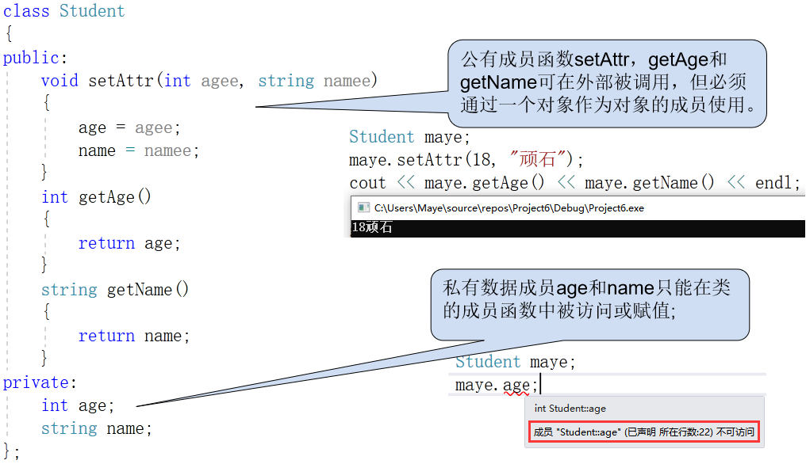
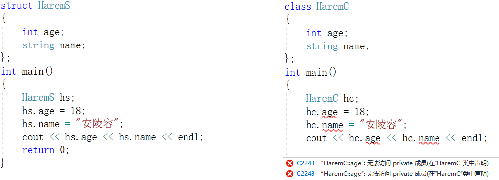
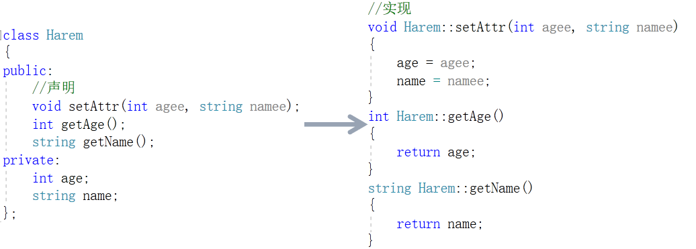

# 类和对象

## 面向对象

### 概念

面向对象(Object Oriented)是软件开发方法，一种编程范式。面向对象是一种对现实世界理解和抽象的方法，是计算机编程技术发展到一定阶段后的产物。

面向对象是相对于面向过程来讲的，面向对象方法`把相关的数据和方法组织为一个整体`来看待，从更高的层次来进行系统建模，更贴近事物的自然运行模式。

+ 面向过程：就是分析出解决问题所需要的步骤，然后用函数把这些步骤一步一步实现，使用的时候一个一个依次调用就可以了。
+ 面向对象：是把构成问题事务分解成各个对象，建立对象的目的不是为了完成一个步骤，而是为了描述某个事物在整个解决问题的步骤中的行为。

### 四大特性

面向对象主要有四大特征：抽象、封装、继承、多态。

#### 1、抽象(abstract)

抽象是将类对象的共同特征总结、提取出来构造类的过程，包括数据抽象和行为抽象两方面，抽象只关注对象的哪些属性和行为，并不关注这此行为的细节是什么。

属性抽象 -->表示世界中一类事物的特征，就是对象的属性。比如鸟有翅膀，羽毛等(类的属性)

行为抽象 -->表示世界中一类事物的行为，就是对象的行为。比如鸟会飞，会叫(类的方法)

#### 2、封装(encapsulation )

通常认为封装是把数据和操作数据的方法绑定起来，对数据的访问只能通过已定义的接口。面向对象的本质就是将现实世界描绘成一系列完全自治，封闭的对象，可以说，封装就是隐藏一切可隐藏的东西，只向外界提供最简单的编程接口。封装给对象提供了隐藏内部特性和行为的能力，对象提供一些能这被其它对象访问的方法来改变它内部的数据。

封装保证了模块具有较好的独立性，使得程序维护修改较为容易。对应用程序的修改仅限于类的内部，因而可以将应用程序修改带来的影响减少到最低限度。

#### 3、继承(inheritance)

继承是从已有类得到继承信息创建新类的过程，继承让变化中的软件系统有了一定的延续性，同时继承也是封装程序中可变因素的重要手段。子类继承父类属性(静态特征)和方法(动态特征)，继承必须遵循封装当中的控制访问

#### 4、多态(Polymorhism)

多态是指允许不同类的对象对同一消息做出响应。多态性包括参数化多态性和包含多态性。多态性语言具有灵活/抽象/行为共享/代码共享的优势，很好的解决了应用程序函数同名问题。总的来说，方法的重写，重载与动态链接构成多态性。

动态链接 -->对于父类中定义的方法，如果子类中重写了该方法，那么父类类型的引用将调用子类中的这个方法，这就是动态链接。

### 类和对象

#### 什么是类？

类，即类别：类是具有相似属性和行为的一组实例集合

#### 什么是对象？

在生活中，像张三，李四，王五，这样真真正正存在人的实体，我们称这些实体为对象。

在计算机中，类的实例就是对象。

## 类的创建和对象的实例化

类的创建和C语言中的结构体类似，只不过关键变成了class，当然其实也是可以使用struct的。

类中除了可以定义成员变量(属性)之外，还可以定义成员函数(方法)，类还可以设置访问权限，可以控制类中的成员在何处能访问。

三个访问权限限定符：用来设置成员变量和成员函数的访问属性。

+ public：公有成员，它们允许被本类或其它类的成员函数(通过对象)访问或调用，是类的外部接口，成员函数一般定义为public属性;
+ private：私有成员，它们只允许被本类的成员函数访问，数据成员一般定义为private属性;
+ protected：保护成员，它们允许被本类的成员函数和派生类的成员函数访问或调用。

**示例**

### class和struct的区别

前面说道class也是可以用struct替代的，那么他们两个之间有什么区别吗？

区别只有一个：struct定义的类属性是默认公有的，而calss定义的类属性是私有的，其他的没有区别

## 类的定义和成员函数定义分离

一般将类的定义放在头文件(.h) 中，类的实现放在源文件(.cpp) 中，而main主函数可以放在另一个源文件中。

**何谓分离？即把函数的定义放在类的外部实现！**

成员函数的定义方式与其他函数的定义方式基本相同，但必须在成员函数名前面加上类名和作用域限定符(简称域运算符)

