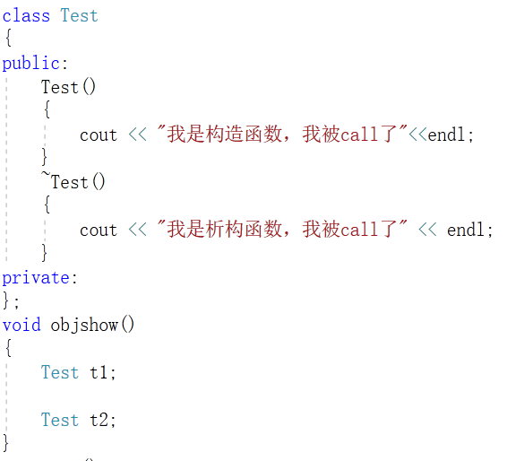
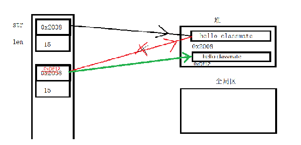
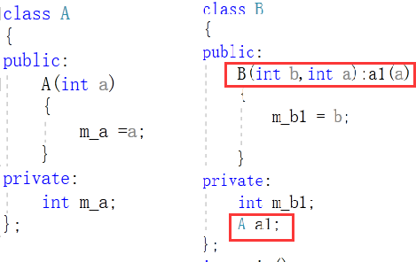
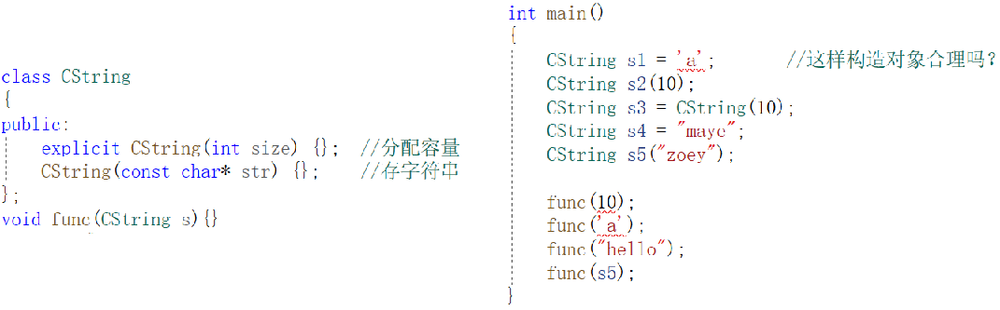

# 构造与析构函数

## 构造函数

创建一个对象时，常常需要做某些初始化的工作，例如对数据成员赋初值。

为了解决这个问题，C++提供了构造函数(constructor)来处理对象的初始化。构造函数是一种特殊的成员函数，与其他成员函数不同，不需要用户来调用它，而是在建立对象时自动执行。

**特点:**

+ 构造函数名和类名相同
+ 构造函数可以重载
+ 构造函数没有返回类型声明

**调用:**

+ 自动调用(隐式)	一般情况下C++编译器会自动调用构造函数(无参构造)
+ 手动调用(显示)	在一些情况下则需要手工调用构造函数(有参构造)

## 析构函数

当对象释放时，我们可能需释放/清理对象里面的某些资源(比如：动态内存释放)。

为了解决这个问题，C++提供了析构函数(destructor)来处理对象的清理工作。析构函数和构造函数类似，不需要用户来调用它，而是在释放对象时自动执行。

**特点:**

+ 析构函数名和类名相同，但是得在前面加一个波浪号  ~
+ 析构函数只能有一个
+ 构造函数没有返回类型声明


## 构造/析构函数调用机制

当定义了多个对象时，构造与析构的顺序是怎么样的呢？



**结论:**

+ 先创建的对象先构造，后创建的对象后构造
+ 先创建的对象后析构，后创建的对象先析构

## 构造/析构函数用途展示

构造函数：可以用来初始化对象，而且不需要显式调用，方便，快捷

析构函数：可以用来释放对象， 一次写好，没有后顾之忧(经常忘记delete？)

```cpp
class Man
{
public:
    Man()
    {
        age = 18;
        name = new char[20]{0};
        strcpy(name,"maye");
    }
    ~Man()
    {
        if(name!=nullptr)
        {
            delete[] name;
            name = nullptr;
        }
    }
    void print()
    {
        cout<<age<<" "<<name<<endl;
    }
private:
    int age;
    char* name;
}
```


## 构造函数分类

构造函数是可以重载的，根据参数类型和作用可以分为以下几类：

### 无参构造函数

+ 直接创建对象即可自动调用
+ `Test te;` 注意：不要在对象后面加(),无参构造函数不能显式调用

### 有参构造函数

+ 有三种调用方法

  ```cpp
  //1，括号法
  Test t1(20,"cc");
  t1.print();
  //2，赋值符号
  Test t2 = {18,"maye"};
  t2.print();
  //3，匿名对象
  Test t3 = Test(90,"plus");
  t3.print();
  //注意:
  Test tt;	//error:类Test不存在默认构造函数
  ```

+ 如果没有写有参构造函数，那么C++编译器会自动帮我们生成一个无参构造函数
  如果写了有参构造函数，那么就不会帮我们生成了，必须自己写一个无惨构造函数，才能直接定义对象。


### 拷贝构造函数(赋值构造)

+ 用一个对象去初始化另一个对象时(函数传参也会拷贝)，需要拷贝构造(如果自己没有写，编译器会自动帮我们生成)

  ```cpp
  Test t(1,"2");
  //1,赋值符号
  Test t1 =t;
  //2,参数方法
  Test t2(t);
  
  t2 = t1;	//这个调用的是赋值运算符重载函数
  ```

  

+ 注意：定义之后进行赋值不会调用拷贝构造函数，而是调用赋值函数，这是运算符重载(抛转。。。后面会讲)

### 移动构造函数

+ 移动构造函数数用来实现移动语义，转移对象之间的资源(如果自己没有写，编译器会自动帮我们生成)


## 深拷贝和浅拷贝

首先，明确一点深拷贝和浅拷贝是针对类里面有指针的对象的，因为基本数据类型在进行赋值操作时（也就是拷贝）是直接将值赋给了新的变量，也就是该变量是原变量的一个副本，这个时候你修改两者中的任何一个的值都不会影响另一个，而对于对象来说在进行浅拷贝时，只是将对象的指针复制了一份，也就内存地址，即两个不同的对象里面的指针指向了同一个内存地址，那么在改变任一个对象的指针指向的内存的值时，都是该变这个内存地址的所存储的值，所以两个变量的值都会改变。

简而言之，当数据成员中有指针时，必须要用深拷贝。

+ 浅拷贝（shallowCopy）只是增加了一个指针指向已存在的内存地址。
  + 使用浅拷贝，释放内存的时候可能会出现重复释放同一块内存空间的错误。

+ 深拷贝（deepCopy）是增加了一个指针并且申请了一个新的内存，使这个增加的指针指向这个新的内存。
  + 使用深拷贝下，释放内存的时候不会因为出现重复释放同一个内存的错误。

**注意**

+ C++类中默认提供的拷贝构造函数，是浅拷贝的
+ 要想实现深拷贝，必须自己手动实现拷贝构造函数



## 构造函数的初始化参数列表

先来看一下什么是类的组合，组合（有时候叫聚合）是将一个对象放到另一个对象里）。它是一种 has-a 的关系。

简单来说，就是一个类的对象作为另一个类的成员，这就叫做类的组合。

如果我们有一个类成员，而且这个成员它只有一个带参数的构造函数，没有默认构造函数。这时要对这个类成员进行初始化，就必须调用这个类成员的带参数的构造函数



基本数据类型的对象也可以，使用初始化参数列表哟~(多个对象初始化，中间用逗号隔开)


**本类和对象成员都需要执行构造函数，那么谁先执行呢？有什么样的顺序呢？**

+ 先指针被组合对象的构造函数，如果组合对象有多个，按照定义顺序，而不是按照初始化列表的顺序！

+ 析构和构造顺序相反

## 拷贝构造函数中的骚操作

#### explicit

C++提供了关键字explicit，禁止通过构造函数进行的隐式转换。声明为explicit的构造函数不能在隐式转换中使用。

[注意]explicit用于修饰构造函数，防止隐式转换。是针对单个参数的构造函数(或者除了第一个参数外其余参数都有默认值的多参构造)而言。



在实际代码中的东西可不像这种故意造出的例子。

发生隐式转换，除非有心利用，隐式转换常常带来程序逻辑的错误，而且这种错误一旦发生是很难察觉的。

原则上应该在所有的单个参数的构造函数前加explicit关键字，当你有心利用隐式转换的时候再去解除explicit，这样可以大大减少错误的发生。

#### default

> **default 函数特性仅适用于类的构造和析构函数，且构造函数必须是默认构造函数**。

如果类 A 有用户自定义的构造函数，却没有自己实现默认构造函数，那么会报错！因为编译器将不再会自动为它隐式的生成默认构造函数。如果需要用到默认构造函数来创建类的对象时，程序员必须自己显式的定义默认构造函数。

我们只需在函数声明后加上`=default;`，就可将该函数声明为 default 函数，编译器将为显式声明的 default 函数自动生成函数体。

```cpp
class Int
{
private:
	int m_number;
public:
	 Int() = default;
	 Int(int number) { m_number = number; }
};
int main()
{
	Int i = 2;
	Int a;
	return 0;
}
```


#### delete

对于 C++ 的类，如果程序员没有为其定义特殊成员函数，那么在需要用到某个特殊成员函数的时候，编译器会隐式的自动生成一个默认的特殊成员函数，比如拷贝构造函数，或者拷贝赋值操作符。

程序员不需要自己手动编写拷贝构造函数以及拷贝赋值操作符，依靠编译器自动生成的默认拷贝构造函数以及拷贝赋值操作符就可以实现类对象的拷贝和赋值。这在某些情况下是非常方便省事的，但是在某些情况下，假设我们不允许发生类对象之间的拷贝和赋值，可是又无法阻止编译器隐式自动生成默认的拷贝构造函数以及拷贝赋值操作符，那这就成为一个问题了。

为了能够让程序员显式的禁用某个函数，C++11 标准引入了一个新特性：deleted 函数。程序员只需在函数声明后加上“=delete;”，就可将该函数禁用。例如，我们可以将类 X 的拷贝构造函数以及拷贝赋值操作符声明为 deleted 函数，就可以禁止类 X 对象之间的拷贝和赋值。

**用法示例：禁止拷贝**

```cpp
class Int
{
private:
	int m_number;
public:
	 Int(int number) { m_number = number; }
	 Int(const Int& other) = delete;
};
int main()
{
	Int i = 2;
	Int a = i;		//error C2280: “Int::Int(const Int &)”: 尝试引用已删除的函数
	return 0;
}
```


**用法示例：禁用转换构造函数**

delete 函数特性还可用于禁用类的某些转换构造函数，从而避免不期望的类型转换。在清单 12 中，假设类 X 只支持参数为双精度浮点数 double 类型的转换构造函数，而不支持参数为整数 int 类型的转换构造函数，则可以将参数为 int 类型的转换构造函数声明为 deleted 函数。

```cpp
class Int
{
private:
	int m_number;
public:
	 Int() = default;
	 Int(double) = delete;
	 Int(int number) { m_number = number; }
};
int main()
{
	Int i = 2;
	Int d = 3.14f;		//error C2280: “Int::Int(double)”: 尝试引用已删除的函数
	return 0;
}
```


##  std::string

[string](https://blog.csdn.net/liitdar/article/details/80498634)

**to_string(T val)       **``将数值转化为字符串，返回对应的字符串。``

在C语言中，我们经常使用字符串，但要对字符串进行操作的时候，我们需要使用一些函数进行操作，但也非常麻烦，那么在C++中有没有更好的字符串操作方法呢？

不用多说，肯定是有的，C++ 标准库提供了 string 类型，支持C语言字符串所有的操作，另外还增加了其他更多的功能。(现在我们可能还无法透彻地理解string，因为到目前为止我们还没有讨论类和对象。所以现在粗略地了解下即可，等理解了面向对象的概念之后再回头来理解。)

注意:需要包含头文件#include<string>和命名空间std

```cpp
//初始化
string name= "maye";
string name("maye");
string nm = name;
//输出
cout<<name<<endl;
cout<<name.data()<<endl;	//转成const char*输出
...
```

#include<charconv>

[](https://learn.microsoft.com/zh-cn/cpp/standard-library/charconv-functions?view=msvc-170#from_chars)

## std::stirng_view

[](https://zhuanlan.zhihu.com/p/529073150)