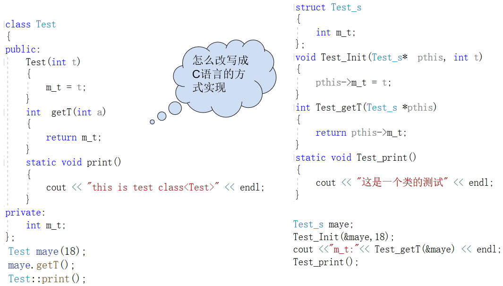
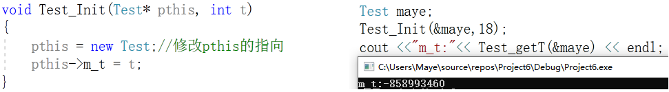
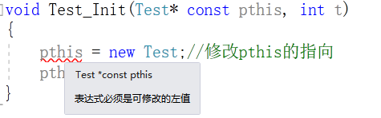
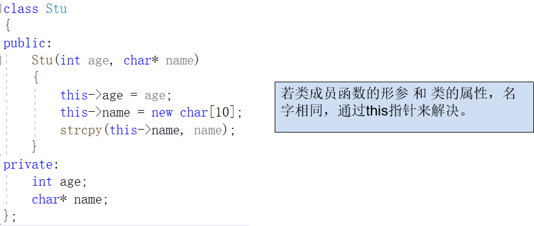
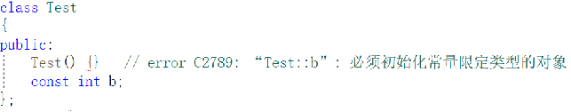
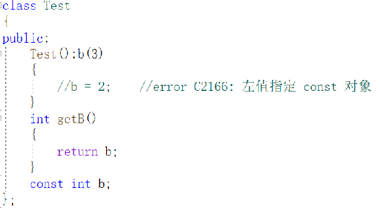
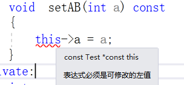

# 特殊成员

## this指针


## 静态(static)成员

静态成员是**属于类**本身而**不是类的实例**的成员。使用*static*关键字可以将类成员定义为静态的。静态成员在类的所有对象中共享，无论创建多少个对象，静态成员都只有一个副本。静态成员包括**静态数据成员**和**静态成员函数**。

### 静态成员变量

静态数据成员不能在类定义中初始化，因为它们不属于任何单个对象。它们必须在类外部使用范围解析运算符*::*进行初始化。静态数据成员通常用于存储类级别的信息，例如，跟踪创建的对象数量。

> static 成员变量和普通 static 变量一样，都在内存分区中的全局数据区分配内存，到程序结束时才释放。这就意味着，static 成员变量不随对象的创建而分配内存，也不随对象的销毁而释放内存。而普通成员变量在对象创建时分配内存，在对象销毁时释放内存。

如下代码展示了如何定义静态成员变量：

```cpp
class ZcEntity{
public:
    static const char* ClassName;
};
```

如何访问静态成员变量呢？

```cpp
//1,通过对象访问
ZcEntity entity;
entity.ClassName = "ZcEntity1";
std::println("ClassName: {}", entity.ClassName);

//2,直接通过类名访问
ZcEntity::ClassName = "ZcEntity2";
std::println("ClassName: {}", ZcEntity::ClassName);
```

但是当编译的时候，就直接报错了：

```css
error LNK2001: 无法解析的外部符号 "public: static char const * const ZcEntity::ClassName" (?ClassName@ZcEntity@@2PEBDEB)
```

这个错误很熟悉了对吧，原因就是找不到`ZcEntity::ClassName`变了的定义，咦，不是定了吗？其实在类里面那个叫做声明，并不是定义！！！

必须要在类外进行定义，定义方式如下：

```cpp
class ZcEntity{
public:
    static const char* ClassName;
};
const char* ZcEntity::ClassName = "zcEntity";
```

定义之后，再运行，即可得到如下结果：

```cpp
ClassName: ZcEntity1
ClassName: ZcEntity2
```

**注意：**在C++17及之后的版本中，还有一种简单的定义静态变量的写法：

```cpp
class ZcEntity{
public:
    inline static const char* ClassName  = "zcEntity";
};
```

就是直接把静态变量的申明和定义放在一起，只需要在static关键字之前加上inline关键字即可！

### 静态成员函数

static 除了可以声明静态成员变量，还可以声明静态成员函数。静态成员函数可以在没有类实例的情况下调用。它们只能访问静态数据成员和其他静态成员函数。静态成员函数没有`this`指针，因此不能访问非静态成员。

封装函数返回`ClassName`静态变量的值，我们可以先用非静态成员函数来返回：

```cpp
const char* GetClassName() {
	return ClassName;
}
```

但是这个函数就必须通过对象来调用了：

```css
ZcEntity e;
e.GetClassName();
```

因为这个函数里面没有访问任何非静态成员，所以可以让这个函数也变成静态成员函数，通过类名就可以访问：

```cpp
static const char* GetClassName() {
	return ClassName;
}
```

这样就可以直接通过类名访问了，当然通过对象也还是可以访问的：

```cpp
ZcEntity::GetClassName();
```

所以说静态成员函数调用方式，有两种：

+ 和普通成员函数一样，通过对象去调用        e->ClassName();
+ 不定义对象，直接通过`类名::函数名`去调用  ZcEntity::ClassName();

**思考：为什么静态成员函数不能调用类的非静态成员？**


## 面向对象模型

C++对象模型可以概括为以下两部分：

+ 语言中直接支持面向对象程序设计的部分， 主要设计如构造函数、析构函数、虚函数、继承、多态等等。
+ 对于各种支持的底层实现机制

C++中的类从面向对象理论出发，将变量(属性)和函数(方法)集中定义在一起，用于描述现实世界中的类。从计算机的角度，程序依然由数据段和代码段构成。

C++编译器如何完成面向对象理论到计算机程序的转化？

换句话：C++编译器是如何管理类、对象、类和对象之间的关系

具体的说：具体对象调用类中的方法，那c++编译器是如何区分，是哪个个具体的对象，调用这个方法那?


**思考下面程序运行的结果？**

```cpp
class C1
{
public:
    int i;
    int j;
    int k;
    static int number;
};

class C2
{
public:
    int i;
    int j;
    int k;
    int getK(){return k;}
    void setK(int nk){i = nk;}
};

void test()
{
    cout<<"c1:%d "<<sizeof(C1)<<endl;
    cout<<"c2:%d "<<sizeof(C2)<<endl;
}
```

**output:**

```sh
c1:%d 12
c2:%d 12
```

通过这个案例，我们可以猜测出C++类中的成员变量和成员函数是分开存储的，成员函数并不占对象的空间。

+ 成员变量
  + 普通成员变量：存储在对象中，与struct对象有相同的内存布局和字节对齐方式
  + 静态成员变量：存储在静态变量区(全局区)
+ 成员函数
  + 存储在代码段中

但是类限定了静态成员变量和成员函数的作用域，只有通过类或对象才能访问到！


**问题出来了：很多对象共用一块代码？代码是如何区分具体对象的那？**

换句话说：int getK() { return k; }，代码是如何区分，具体obj1、obj2、obj3对象的k值？


### 普通成员函数的内部处理

左边为C++代码，如何把C++代码改为C语言代码呢？



其实把C++的类改为C语言，只需要用结构体+函数，然后通过传对象的指针，在函数里面访问即可！(右边的代码)

### pthis对象指针

把C++类改为C语言形式之后，每个普通成员函数的第一个参数是指向当前操作的对象的pthis指针。这个指针其实还不太安全，因为我们可以在函数改变pthis指针的指向，虽然不能影响原来对象的值，单可能会导致结果不正确。



在上面的代码中，pthis在Test_Init函数中被改变，然后给指向改变之后的pthis的m_t赋值，可以看到被修改之后，即使初始化了成员，输出也是乱码，非常的不安全！

那么有没有什么办法可以让pthis指针在函数里面不能被修改呢？

+ 可以给pthis指针加上const属性，让它不能被改变指向



+ 但是在C++中，对pthis指针做了隐藏，我们看不到，所以编译器帮我们增加了const属性

+ 我们在这里研究的pthis指针其实在C++中叫做this指针~


### this指针

this 是 C++ 中的一个关键字，也是一个 const 指针，它指向当前对象，在类的内部可以通过它可以访问当前对象的所有成员。

所谓当前对象，是指正在使用的对象。例如对于t.getT();t就是当前对象，this 就指向 t。




## 常(const)成员

在类中，如果你不希望某些数据被修改，可以使用`const`关键字加以限定。const 可以用来修饰成员变量和成员函数。

### const成员变量

const 成员变量的用法和普通 const 变量的用法相似，只需要在声明时加上 const 关键字。初始化 const 成员变量只有一种方法，就是通过构造函数的初始化列表。



必须通过构造函数的初始化列表初始化，初始化之后不允许赋值。



### const成员函数

const 成员函数可以使用类中的所有成员变量，但是不能在函数里面修改它们的值，这种措施主要还是为了保护数据而设置的。const 成员函数也称为常成员函数。

那const加在函数的哪个地方呢？其实const写在哪里不重要，重要的是修饰的谁？

+ 通过测试发现写在函数返回值前面和后面的都是修饰的返回值

+ 而放在函数原型后面的是修饰的this指针所指向的对象不能修改，这个函数就叫做const成员函数



#### mutable

mutable的中文意思是“可变的，易变的”，跟constant（既C++中的const）是反义词。

在C++中，mutable也是为了突破const的限制而设置的。被mutable修饰的变量，将永远处于可变的状态，即使在一个const函数中。

我们知道，如果类的成员函数不会改变对象的状态，那么这个成员函数一般会声明成const的。但是，有些时候，我们需要在const的函数里面修改一些跟类状态无关的数据成员，那么这个数据成员就应该被mutalbe来修饰。


### 注意

+ 常成员函数可以访问任何成员

+ 常对象只能访问常函数

## 友元(friend)

私有成员只能在类的成员函数内部访问，如果想在别处访问对象的私有成员，只能通过类提供的接口（成员函数）间接地进行。这固然能够带来数据隐藏的好处，利于将来程序的扩充，但也会增加程序书写的麻烦

所以C++引入友元的概念，使得被定义为友元的函数即使在外部，也能访问类中的私有成员。

### 友元函数

友元函数是指某些虽然不是类成员函数却能够访问类的所有成员的函数。就像好朋友一样，有钱一起花~

+ 全局函数作为友元函数

```cpp
class GirlFriend
{
    friend void stage(GirlFriend& girl);
private:
    int data;
public:
    GirlFriend(int data)
        :data(data)
    {}
};

void stage(GirlFriend& girl)
{
    GirlFriend t(33);
    cout << "data: " << girl.data<<" " << t.data;
}

int main()
{
    GirlFriend g(2);
    stage(g);
    return 0;
}
```

我们在GirlFriend类中把stage函数声明为了友元函数，这样子就可以在stage函数中访问GirlFriend类的私有成员了~

+ 成员函数作为友元函数

```cpp
class GirlFriend;       //必须提前声明
class BoyFriend
{
public:
    BoyFriend() = default;
    void kissGirlFriend(GirlFriend* girlFriend);
};

class GirlFriend
{
    friend void stage(GirlFriend& girl);
    friend void BoyFriend::kissGirlFriend(GirlFriend* girlFriend);
private:
    int data;
public:
    GirlFriend(int data)
        :data(data)
    {}
};

void BoyFriend::kissGirlFriend(GirlFriend* girlFriend)
{
    cout << "kiss kiss " << girlFriend->data << endl;
}

int main()
{
    GirlFriend g(2);
    BoyFriend boy;
    boy.kissGirlFriend(&g);
    return 0;
}
```

一个类的成员函数作为另一个类的友元函数的时候，这个成员函数必须在类外实现，而且是必须在作为友元的类之后实现。


+ 注意点
  + 友元的概念是针对类外部函数（包括全局函数和其他类的成员函数）而言的，类自身的成员函数可以自由访问自己类中的成员。
  + 不能把别的类的私有函数定义为友元。
  + 一个函数可以被多个类声明为友元函数，这样就可以访问多个类中的 private 成员

### 友元类

```cpp
class GirlFriend
{
    friend class BoyFriend;
private:
    int data;
public:
    GirlFriend(int data)
        :data(data)
    {}
};

class BoyFriend
{
private:
public:
    void bedExercise(GirlFriend* girl)
    {
        cout << __FUNCTION__ << " " << girl->data;
    }
};

int main()
{
    GirlFriend g(234);
    BoyFriend().bedExercise(&g);
    return 0;
}
```

在GirlFriend类中，把BoyFriend类声明为了友元类，此时在BoyFriend类中，就可以随心所欲的访问GirlFriend类的私有成员了！

### 注意

友元函数有优点也有缺点，用好了是神器，用坏了是毁灭！

**优点：**能够提高效率，表达简单、清晰

**缺点：** 友元函数破环了类的封装性，尽量使用成员函数，除非不得已的情况下才使用友元函数。

友元的实际应用其实很有限，用的不多。


## 成员指针

### 成员变量指针

#### 非静态成员变量指针

定义成员变量指针：

```cpp
 int A::*p = &A::num;
```

通过成员变量指针访问成员变量：

```cpp
A a(22);
cout<<" "<<a.*p;
```

#### 静态成员变量指针

定义静态成员变量指针：

```cpp
int *p = &A::static_number;
```

直接访问

```cpp
cout<<" "<<*p;
```


### 成员函数指针

#### 非静态成员函数指针

定义成员函数指针:

```cpp
void (A:: * pshow)() = &A::show;
```

通过成员函数指针调用成员函数

```cpp
//在类外调用
(a.*pshow)();
//在类内调用
(this->*pshow)();
```

静态成员函数指针

定义静态成员变量指针：

```cpp
void (A:: * pstatic_show)() = &A::static_show;
```

可以通过对象访问

```cpp
A a(22);
cout<<" "<<(a.*pstatic_show);
```

也可以直接访问

```cpp
cout<<" "<<pstatic_show();
```


