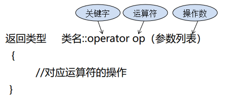
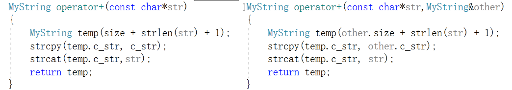
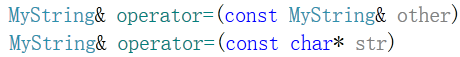
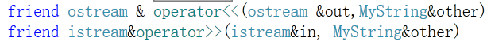
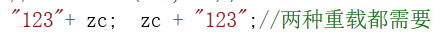

# 运算符重载

运算符重载，就是赋予运算符新的含义。它是重载系统内部运算符的函数，是实现类静态多态性的方式之一。它本质上是函数重载。

实际上，我们已经在不知不觉之中使用了运算符重载。列如：我们习惯使用的对整数，浮点数运用+、-、*、/，起始计算机对整数和浮点数的操作过程是不一样的，但由于C++已经对运算符进行了重载，所以才能都适用。

又如<<本来是左移运算符，但在输出操作中，与cout搭配，当作输出流运算符了


## 运算符重载的意义

我们平常常见的算术运算符、逻辑运算符等运算符都是系统库函数里面已经存在的，所以运算符可以直接用于我们常用的数据类型。然而对于我们自定义的类实例化的对象，系统没有与之相关的运算符可以操作，但是为了使我们编写程序时更加便捷，C++提供了一种方式——运算符重载，来满足我们对于类对象进行的操作。

也就是说运算符重载是为了解决类对象之间的运算的，让编译器在遇到对象运算时能按我们要求的进行运算，这就是运算符重载的意义。

## 运算符重载限制

C++中绝大部分的运算符允许重载，少部分不允许重载，详细描述如下

### 	可以重载的运算符

+ 算术运算符：+     -     *     /     % 
+ 自增、自减运算符：++  --
+ 位运算符：|     &     ~     ^     <<     >>     
+ 逻辑运算符：||     &&     !     
+ 关系运算符：==     !=     <     >     <=     >=     
+ 赋值运算符：=     +=     -=     /=     %=     &=     |=     ^=     <<=     >>=     
+ 单目运算符：+     -     *     &
+ 动态内存分配：new     delete     new[]     delete[]
+ 其他运算符：()     ->     ,     []     

### 	不能重载的运算符

+ .	成员访问运算符	
+ ::	域运算符
+ .*   ->*	成员指针访问运算符
+ szieof	长度运算符	
+ ?:	条件运算符

## 运算符重载规则

+ 重载运算符函数可以对运算符作出新的解释﹐但原有基本语义不变:
  + 不改变运算符的优先级
  + 不改变运算符的结合性
  + 不改变运算符所需要的操作数
  + 不能创建新的运算符

+ 语法：



+ 一个运算符被重载后，原有意义没有失去，只是定义了相对一特定类的一个新运算符。

## 运算符重载方法

### 两种重载方法

重载为**成员函数**或**全局(友元)函数**



**两种形式的选择时机：**

+ 左操作数(或者只有左操作数并且)是本类的对象时，可选用成员函数形式。



+ 左操作数不是本类的对象，必须采用非成员函数的形式，一般是友元函数。



+ 一般单目运算符最好被重载为成员函数；双目运算符重载为友元函数。
  + 有些运算符不能重载为友元函数，它们是：=，()，[]和->。

+ 具有可交换性的双目运算符最好两种形式都有(成员函数时适用左操作数为本类对象，友元函数时适用左操作数为其他类的对象)。



## 单目运算符重载

> 一些只需要一个操作数的运算符称为一元运算符（或单目运算符）。


## 双目运算符重载

> 一些需要两个操作数的运算符称为二元运算符（或双目运算符）。


## 自定义后缀操作符(自定义字面量)

> 即通过实现一个后缀操作符，将申明了该后缀标识的字面量转化为需要的类型

字面量（literal）是指在源代码中写出的固定常量，它们在 C++98 里只能是原生类型，如：

- "hello"，字符串字面量，类型是 const char[6]
- 3.14f，浮点数字面量，类型是 float

```cpp
unsigned long long operator""_m(unsigned long long v)
{
	return v * 100;
}

long double operator""_m(long double v)
{
	return v * 100;
}

char operator""_c(char v)
{
	if (isupper(v))
	{
		return tolower(v);
	}
	return v;
}

std::string operator""_s(const char* str,size_t size)
{
	return std::string(str,size);
}


int main()
{
	std::cout << -5.256_m << "  " << 'A'_c << " " << "hello"_s << std::endl;
	
	return 0;
}
```


## 类型转换重载(自定义类型转换)

类型转换函数是一种特殊的成员函数，形式如下：

```c
operator type() const;
```

+ type可以是可以作为返回类型的任何类型

+ 类型转运算符没有显示返回类型声明，没有形参，必须定义为类的成员函数