# 继承

面向对象程序设计有4个主要特点：抽象、封装、继承和多态性。我们已经讲解了类和对象，了解了面向对象程序设计的两个重要特征一数据抽象与封装，已经能够设计出基于对象的程序，这是面向对象程序设计的基础。

要较好地进行面向对象程序设计，还必须了解面向对象程序设计另外两个重要特 征——继承性和多态性。本章主要介绍有关继承的知识，多态性将在后续章节中讲解。

## 继承关系举例

万事万物中皆有继承，是重要的现象

**植物继承图：**


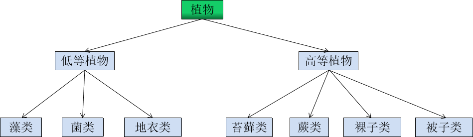


传递性：高等植物，蕨类植物，苔藓都是植物，具有植物的共同特征

不对称性：不是所有植物都属于菌类

## 继承概念

> 继承(inheritance)机制是面向对象程序设计使代码可以复用的最重要的手段，它允许程序员在保持原有类特性的基础上进行扩展，增加功能，这样产生新的类，称派生类。继承呈现了面向对象程序设计的层次结构，体现了由简单到复杂的认知过程。以前我们接触的复用都是函数复用，继承是类设计层次的复用。

这就比如我们设计一个学生管理系统，学校中有老师，学生，工作人员等，我们要记录他们的信息比如学生有电话，姓名，地址，学号，各科成绩等信息。

```cpp
struct Student
{
    int _number;
    string _tel;
    string _name;
   	string _addr;
    float _chineseScore;
    float _mathScore;
    float _englistScore;
};
```

比如教师有电话，姓名，地址，工号，工资等信息。

```cpp
struct Teacher
{
    int _number;
    string _tel;
    string _name;
   	string _addr;
    float _sal;
};
```

这样设计后我们会发现会有很多的重复信息，那么我们可以把重复的信息提取出来，重新建立一个Person类。

```cpp
struct Person
{
    uint32_t _number;
    string _tel;
    string _name;
   	string _addr;
};
```

那么我们的学生类和教师类就可以复用Person类。

```cpp
struct Student 
{
    Person _super;			//复用Person类的成员(相当于父类)
    float _chineseScore;
    float _mathScore;
    float _englistScore;
};
 
struct Teacher 
{
    Person _super;
    float _sal;
};
```

当然，这只是思路分析，在C语言中可以这样实现继承，但是呢？这样在一个类里面组合一个类,访问其成员非常的不方便！

C++给我们在语法层面上直接提供了支持，上面的代码可修改如下：

```cpp
struct Person
{
    uint32_t _number;
    std::string _tel;
    std::string _name;
   	std::string _addr;
};
//Student继承自Person类，复用Person类的成员
//Person类可以称为基类或父类
//Student类可以称为派生类或子类
struct Student : public Person	
{	
    float _chineseScore;
    float _mathScore;
    float _englistScore;
};
 
struct Teacher  : public Person
{
    float _sal;
};
```

 在继承后父类Person的成员（成员函数与成员变量）都会变成子类的一部分，这里就体现出Student和Teacher复用了Person类，我们可以通过调试的监视窗口看到继承关系和调用父类成员。

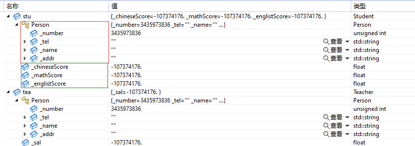


## 继承使用

### 继承语法

一个类继承自另一个类语法:

```cpp
class Derived(派生类名): AccessQualifier(访问限定符) Base(基类)
{
	//成员变量和成员函数声明...
}
```

#### 访问限定符(Access qualifier)

访问限定符指定了从基类继承的方式，继承方式不同，成员在派生类中的权限也不同。

| 类成员/继承方式 | public继承 | protected继承 | private继承 |
| --------------- | ---------- | ------------- | ----------- |
|基类的public成员	|派生类的public成员	|派生类的protected成员	|派生类的private成员|
|基类的protected成员	|派生类的protecte成员	|派生类的protected成员	|派生类的private成员|
|基类的private成员	|在派生类不可见	    | 在派生类不可见	|在派生类不可见|

通过此表格我们可以知道基类给派生类的访问方式为，MIN(成员访问权限，继承方式)，派生类的访问方式会变为基类的成员访问权限和继承方式权限最小的那个。


C++的继承方式有三种，实际上最常使用的为public继承方式，而基类的成员访问限定符设置最多的为public和protected。

#### 总结

+ 基类private成员在派生类中无论以什么方式继承都是不可见的。这里的不可见是指基类的私有成员还是被继承到了派生类对象中，但是语法上限制派生类对象不管在类里面还是类外面都不能去访问它(父类可提供接口访问)。
+ 如果基类成员不想在类外直接被访问，但需要在派生类中能访问，就定义为protected。可以看出保护成员限定符是因继承才出现的。
+ class的默认继承方式为private，而struct的默认继承方式为public，实际应用大多都为public继承。
+ 派生类可以拥有基类没有的方法和属性，派生类可以对基类进行扩充。

## 赋值兼容原则

赋值兼容原则是指在需要基类对象的任何地方，都可以使用公有派生类的对象来替代。在替代之后，派生类对象可以作为基类的对象使用，但是**只能使用从基类继承来的成员**。

```cpp
class Animal
{
public:
    std::string category{"Animal"};	//所属类别(如:狗 猫 蛇...)
};

class Dog :public Animal
{
public:
    std::string name{"Dog"};		//名字(如:大黄 小黑 发财 旺财...)
};

int main()
{
    Animal animal;
    Dog spike;		//(spike:猫和老鼠中大狗的名字 它的儿子叫tyke哟~)
    animal = spike;	//子类对象赋值给父类对象
    return 0;
}
```

以上代码并没有报错，由此可见，我们可以把派生类的对象赋值给基类，派生类赋值给基类的过程我们称其为切片，但注意的是基类对象不能赋值给派生类对象。

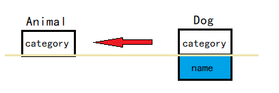

我们还可以用基类的指针指向子对象、用基类引用子对象

```cpp
Animal* pa = &dog;
Animal & pra = dog;
```

**赋值兼容原因：**

+ 从现实中来看，公有继承意味着“是一个”，学生是一个人，反之不能这样说。

+ 从代码中来看，子类继承了父类，拥有了父类的全部成员，所以父类能干的事，子类也能干；反之，子类对父类进行了扩充，子类能干的，父类不一定干的了。


## 继承中的成员

### 父子类同名成员

在继承体系中基类和派生类都有独立的作用域，子类和父类中可以有同名成员，子类成员将屏蔽父类对同名成员的直接访问，这种情况叫**隐藏**，也叫**重定义**，但我们可以在子类中通过`父类::父类成员`显示访问。如果是成员函数的隐藏，只要函数名相同就会隐藏。我们需要注意的是在继承体系中最好**不要定义同名成员**。

来个代码辅助分析：

```cpp
class Father
{
public:
    int age = 45;
};

class Child : public Father
{
public:
    int age = 18;
};
int main()
{
    Child self;
    std::cout <<"self age is:" << self.age << std::endl;
    return 0;
}
```

运行结果是什么呢？


我们可以看到父类和子类的成员名字相同，那么我们在打印成员num时则都会显示子类里成员变量的值，因为在子类作用域中所以会首先访问自类成员，就如同我们定义了零时变量和全局变量，当他们同名时，我们会首先访问局部变量，**所以当子类和父类成员同名时，子类成员会隐藏父类成员，也叫重定义。**

那么我们如果想要打印父类的成员num应该怎么办呢？那么我们应该指定类域：

```cpp
std::cout <<"self age is:" << self.Father::age << std::endl;
```

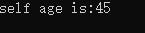

这样我们可以打印出父类里的同名成员。

上面我们测试的是成员变量，那么成员函数呢？给父子类加个同名的成员函数，测试一下：

```cpp
class Father
{
public:
    void foo()
    {
        std::cout << __FUNCSIG__ << std::endl;
    }
};

class Child : public Father
{
public:
    void foo(int i)
    {
        std::cout << __FUNCSIG__ << " " << i << std::endl;
    }
};
int main()
{
    Child self;
    self.foo(1);
    //self.foo();             //访问不到
    self.Father::foo();

    return 0;
}
```

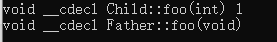

 我们可以看到Father和Child的成员函数名字是一样的，这里同样构成了上述的隐藏，要想访问父类的成员函数需要指定类域。

这里如果设置选择题b.fun(10),b.fun()时，我们大多数人都会认为构成了函数重载，但是我们要知道构成重载需要同一作用域，所以这里的fun()构成了隐藏

### 继承和静态成员

继承和static关键字在一起会产生什么现象？

上链接，啊！不，上代码！

```cpp
class A
{
public:
    static int count;
};
int A::count = 222;

class B :public A
{
public:

};

int main()
{
    A::count++;
    std::cout << A::count << " " << B::count << std::endl;

    return 0;
}
```


根据结果可以知道：

+ 基类定义的静态成员，将被派生类共享
+ 派生类中访问静态成员，用以下形式显式说明：
  + 通过类名直接访问：类名 :: 成员
  + 通过对象访问：	对象名 . 成员

### 继承和友元

> 友元是不能够继承的，也说明父类的友元无法访问子类的私有和保护成员。


## 类的默认函数

只是声明一个空类，不做任何事情的话，编译器会自动为你生成八个函数。这几个生成的默认函数的实现就是什么都不做。所有这些函数都是inline和public的。

八个默认函数分别为:

+ 默认构造函数
  + `A()`
+ 默认拷贝构造函数
  + `A(const A&)`
+ 默认移动构造函数
  + `A(A&&)`
+ 默认析构函数
  + `~A()`
+ 默认重载赋值运算符函数
  + `A& operator=(const A&)`
+ 默认重载移动赋值运算符函数
  + `A& operator=(A&&)`
+ 默认取地址运算符函数
  + `A* operator(){return this;}`
+ 默认取地址运算符const函数
  + `A* operator()const {return this;}`


### 继承中的构造和析构

我们都知道构造一个类后，没有写构造函数和析构函数，编译器会自动生成一个默认成员函数，那当我们创建子类时会是怎样的情形？

```cpp
class DNode
{
public:
    int x = 0;
    int y = 0;

    DNode()
    {
        std::cout << __FUNCSIG__ << std::endl;
    }
    ~DNode()
    {
        std::cout << __FUNCSIG__ << std::endl;
    }
};

class DSprite : public DNode
{
public:
    std::string texture;
};

int main()
{
    DSprite palyer;
  
    return 0;
}
```

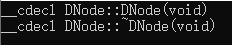

 我们会发现我们的子类中并没有写构造函数和析构函数时，对于父类继承下来的部分，我们的子类会调用父类的默认构造函数和析构函数。

当父类没有默认构造函数，子类有资源需要释放，子类有浅拷贝问题，我们就需要自己实现构造函数和析构函数了，那么如果要我们自己实现该如何实现呢？

当我们构造时，父类调用对应的构造函数，自己的成员则按照自己需求处理。

```cpp
class DNode
{
    ...
    DNode(int x,int y):x(x),y(y)
    {
        std::cout << __FUNCSIG__ << std::endl;
    }    
    ...
}

class DSprite : public DNode
{
    ...
    DSprite(int x,int y,const std::string& texture)
        :DNode(x,y),texture(texture)
    {
        std::cout << __FUNCSIG__ << std::endl;
    }   
    ~DSprite()
    {
        std::cout << __FUNCSIG__ << std::endl;
    }
    ...   
  
}
int main()
{
    DSprite player(0,0,"player.png");
    return 0;
}
```

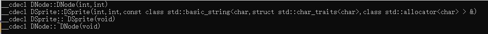

 我们可以看到先调用了父类的构造函数，再调用了子类自身的构造函数。

### 继承中的拷贝构造和赋值重载

那么拷贝构造和赋值重载是怎样的呢？

与构造与析构相同，我们在调用拷贝构造和重载时，对于继承父类部分我们会调用父类的拷贝构造和赋值重载，而对于内置类型和自定义类型来说则与普通类一样，拷贝构造会调用浅拷贝。

```cpp
int main()
{
    DSprite player(8,8,"player.png");
    auto enemy = player;

    return 0;
}
```

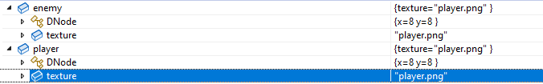


 如果子类存在**浅拷贝**问题，就需要自己实现拷贝构造和赋值解决浅拷贝，那么我们又该如何实现拷贝构造和赋值呢？

```cpp
class DNode
{
public:
	...
    DNode(const DNode& other)
    {
        x = other.x;
        y = other.y;
    }
	...
};

class DSprite : public DNode
{
public:
	...
    DSprite(const DSprite& other)
        :DNode(other)
        ,texture(other.texture)
    {
    }
	...
};
```

我们这里实现的是子类的拷贝构造函数，我们自身的内置类型直接传值拷贝即可，而对于父类的部分我们需要运用到切片，将子类的 父类部分直接切片至新的子类的父类部分。

```cpp
class DNode
{
public:
	...
    DNode& operator=(const DNode& other)
    {
        x = other.x;
        y = other.y;
        return *this;
    }
	...
};

class DSprite : public DNode
{
public:
	...
    DSprite& operator=(const DSprite& other)
    {
        DNode::operator=(other);
        texture = other.texture;
        return *this;
    }
	...
};
```

我们这里实现的是子类的赋值重载，与拷贝构造原理相同，我们可以直接将内置类型赋值过去，对于子类的父类部分，则调用父类的赋值重载运用切片将其赋值给新的子类的父类部分。

我们这里需要特别注意的是由于operator=是在子类的作用域中，而我们希望调用的是父类的operator=，所以这里我们需要特别指定为父类的作用域。


问题：子类如何初始化父类成员？父类与子类的构造函数有什么关系？

+ 在子类对象构造时，需要调用父类构造函数对其继承得来的成员进行初始化

+ 在子类对象析构时，需要调用父类析构函数对其继承得来的成员进行清理

  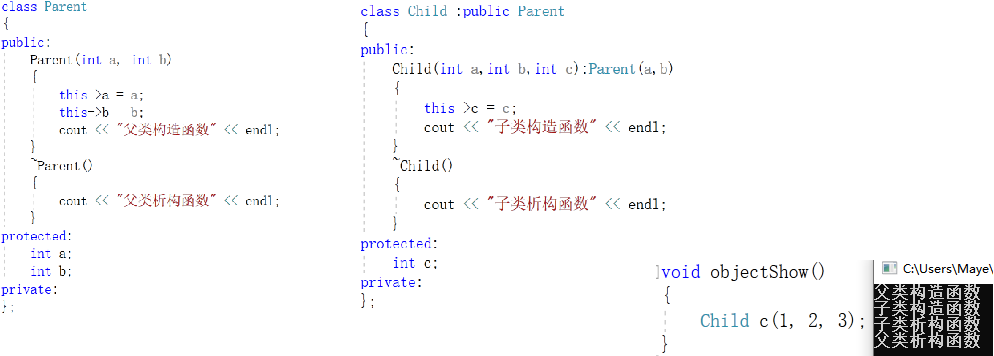
  继承中的构造析构调用原则 
  1、子类对象在创建时会首先调用父类的构造函数
  2、父类构造函数执行结束后，执行子类的构造函数
  3、当父类的构造函数有参数时，需要在子类的初始化列表中显示调用
  4、析构函数调用的先后顺序与构造函数相反

## 继承关系

**单继承：**一个子类只有一个直接父类父类时称这个继承关系为单继承。

**多继承：**一个子类有两个或两个以上直接父类时称这个继承关系称为多继承

派生类只有一个基类，称为单继承（Single Inheritance）。除此之外，C++也支持多继承（Multiple Inheritance），即一个派生类可以有两个或多个基类。

多继承容易让代码逻辑复杂、思路混乱，一直备受争议，后来的 Java、C#、PHP 等干脆取消了多继承。

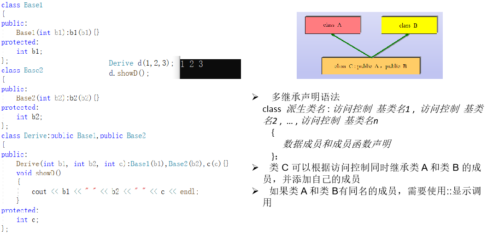

**菱形继承**

那么**菱形继承**则为：（一种多继承的特殊表达）

如果一个派生类从多个基类派生，而这些基类又有一个共同的基类，则在对该基类中声明的名字进行访问时，可能产生二义性问题。

为了解决多继承时的命名冲突和冗余数据问题，C++ 提出了虚继承，使得在派生类中只保留一份间接基类的成员。使用关键字Virtual 

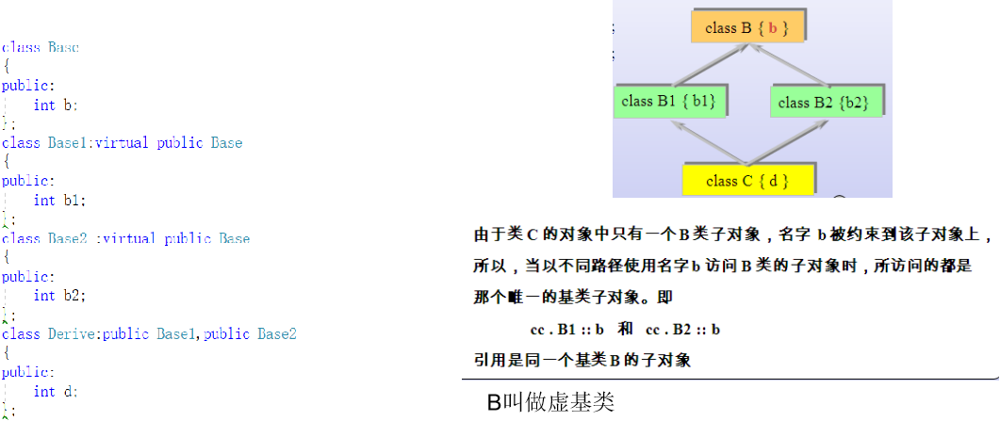

https://blog.csdn.net/m0_57234892/article/details/123892631