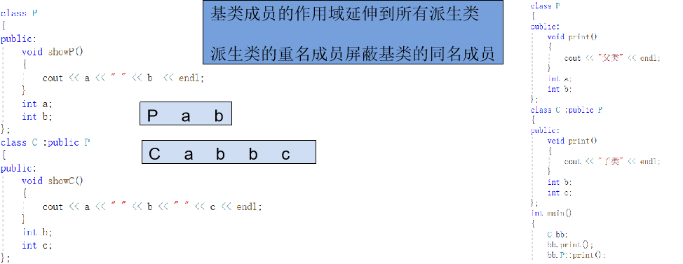
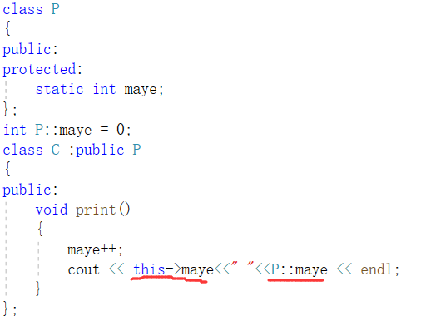

# 继承

面向对象程序设计有4个主要特点：抽象、封装、继承和多态性。我们已经讲解了类和对象，了解了面向对象程序设计的两个重要特征一数据抽象与封装，已经能够设计出基于对象的程序，这是面向对象程序设计的基础。

要较好地进行面向对象程序设计，还必须了解面向对象程序设计另外两个重要特 征——继承性和多态性。本章主要介绍有关继承的知识，多态性将在后续章节中讲解。

继承性是面向对象程序设计最重要的特征，可以说，如果没有掌握继承性，就等于没有掌握类和对象的精华，就是没有掌握面向对象程序设计的真谛。

继承可以使得子类具有父类的属性和方法或者重新定义、追加属性和方法等。

## 继承关系举例

万事万物中皆有继承，是重要的现象

**植物继承图：**


传递性：高等植物，蕨类植物，苔藓都是植物，具有植物的共同特征

不对称性：不是所有植物都属于菌类

## 继承相关概念

继承是类之间定义的一种重要关系，一个B类继承A类，或者说从A类派生B类，那么A类称为基类(父类)，B类称为派生类(子类)，像父子关系一样。

.png)

## 继承和访问控制

### 继承语法

一个类继承自另一个类语法:

```cpp
class 派生类名:基类名列表
{
	//成员变量和成员函数声明...
}
```

基类名列表：如果一个类继承自多个类，需要用逗号隔开

+ 访问限定符 基类名1,访问限定符 基类名2...

+ 访问限定符表示派生类对基类的继承方式，使用关键字：
  + public	公有继承
  + private	私有继承
  + protected	保护继承

派生类继承了基类的全部成员变量和成员方法（除了私有成员、构造和析构之外的成员方法），但是这些成员的访问属性，在派生过程中是可以调整的。

**继承重要说明**

1. 子类拥有父类的除私有属性和方法之外的所有属性和方法
2. 子类可以拥有父类没有的方法和属性
3. 子类就是一种特殊的父类，子类对象可以当作父类对象使用(在父类做函数形参时，可以传子类对象)
   		

### 继承中访问权限作用

不同的继承方式会改变继承成员的访问属性

+ public继承：父类成员在子类中保持原有访问级别
+ private继承：父类成员在子类中变为private成员
+ protected继承：父类中public成员会变成protected
  + 父类中protected成员仍然为protected
  + 父类中private成员仍然为private
+ private成员在子类中依然存在，但是却无法访问到。不论种方式继承，派生类都不能直接使用基类的私有成员 。(可以通过提供接口访问)

### 能否被访问、继承方式选择

+ 如何判断成员是否能被访问：“三看”原则

  1. 看调用语句，是再写在子类的内部还是外部

  2. 看子类如何从父类继承

  3. 看父类访问级别
     

+ 派生类成员访问级别设置的原则
  思考：如何恰当的使用public，protected和private为成员声明访问级别？

  1. 需要被外界访问的成员直接设置为public
  2. 只能在当前类中访问的成员设置为private
  3. 只能在当前类和子类中访问的成员设置为protected，protected成员的访问权限介于public和private之间。
     一般情况下，均使用public继承方式

### 赋值兼容性原则

类型兼容规则是指在需要基类对象的任何地方，都可以使用公有派生类的对象来替代。通过公有继承，派生类得到了基类中除构造函数、析构函数之外的所有成员。这样，公有派生类实际就具备了基类的所有功能，凡是基类能解决的问题，公有派生类都可以解决。类型兼容规则中所指的替代包括以下情况：

+ 子类对象可以当作父类对象使用
+ 子类对象可以直接赋值给父类对象
+ 子类对象可以直接初始化父类对象
+ 父类指针可以直接指向子类对象
+ 父类引用可以直接引用子类对象

在替代之后，派生类对象就可以作为基类的对象使用，但是只能使用从基类继承的成员。
类型兼容规则是多态性的重要基础之一。

总结：子类就是特殊的父类 

### 继承中的构造和析构

问题：子类如何初始化父类成员？父类与子类的构造函数有什么关系？

+ 在子类对象构造时，需要调用父类构造函数对其继承得来的成员进行初始化

+ 在子类对象析构时，需要调用父类析构函数对其继承得来的成员进行清理

  
  继承中的构造析构调用原则 
  1、子类对象在创建时会首先调用父类的构造函数
  2、父类构造函数执行结束后，执行子类的构造函数
  3、当父类的构造函数有参数时，需要在子类的初始化列表中显示调用
  4、析构函数调用的先后顺序与构造函数相反

### 继承中父子类中同名成员处理

1、当子类成员变量与父类成员变量同名时，子类依然从父类继承同名成员

2、在子类中通过作用域分辨符::进行同名成员区分（在派生类中使用基类的同名成员，显式地使用类名限定符） 

4、同名成员存储在内存中的不同位置



总结：同名成员变量和成员函数通过作用域分辨符进行区分


### 继承中的static成员

继承和static关键字在一起会产生什么现象？

+ 基类定义的静态成员，将被所有派生类共享
+ 根据静态成员自身的访问特性和派生类的继承方式，在类层次体系中具有不同的访问性质 （遵守派生类的访问控制）

+ 派生类中访问静态成员，用以下形式显式说明：
  + 通过类名直接访问：类名 :: 成员
  + 通过对象访问：	对象名 . 成员



## 多继承

派生类只有一个基类，称为单继承（Single Inheritance）。除此之外，C++也支持多继承（Multiple Inheritance），即一个派生类可以有两个或多个基类。

多继承容易让代码逻辑复杂、思路混乱，一直备受争议，后来的 Java、C#、PHP 等干脆取消了多继承。


## 菱形继承

如果一个派生类从多个基类派生，而这些基类又有一个共同的基类，则在对该基类中声明的名字进行访问时，可能产生二义性问题。

为了解决多继承时的命名冲突和冗余数据问题，C++ 提出了虚继承，使得在派生类中只保留一份间接基类的成员。使用关键字Virtual 

