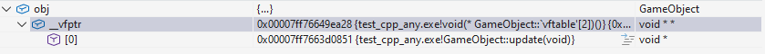
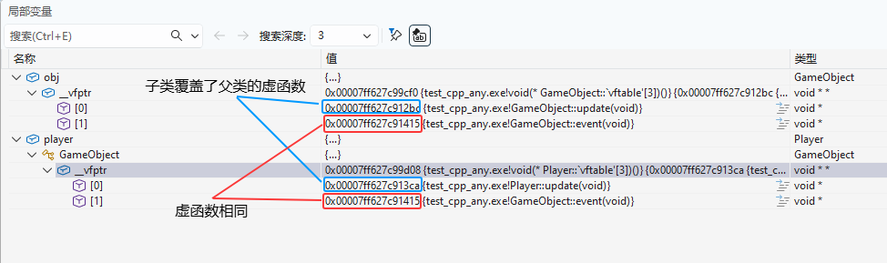
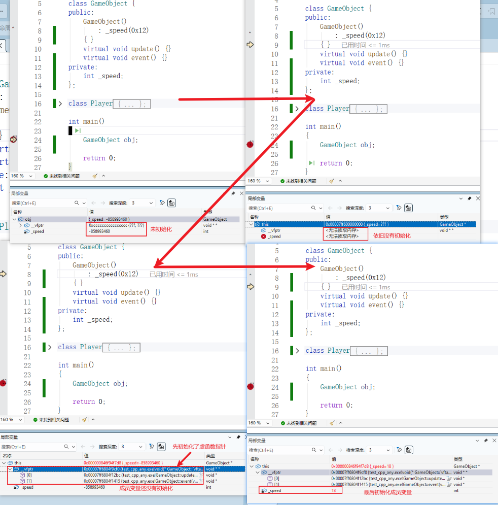
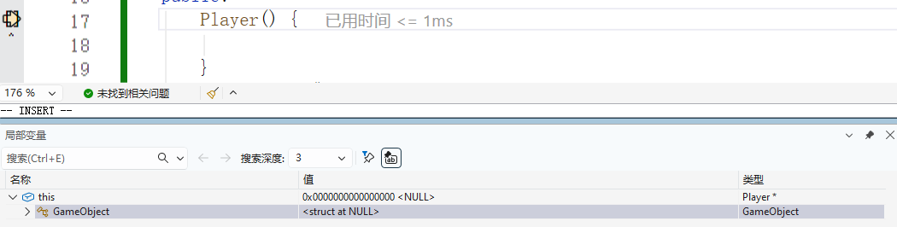
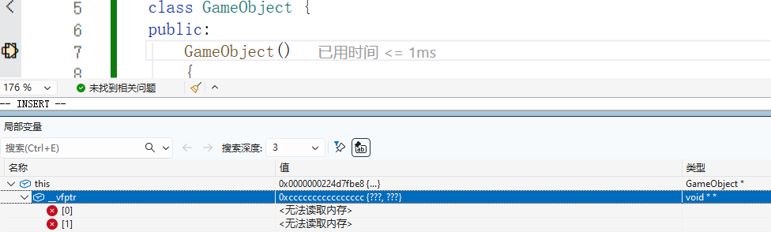
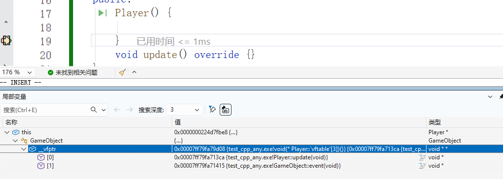
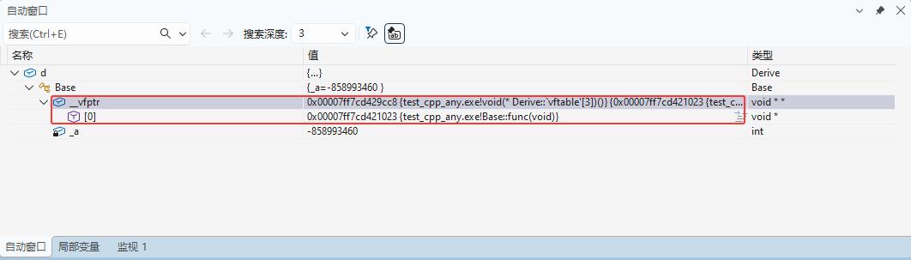
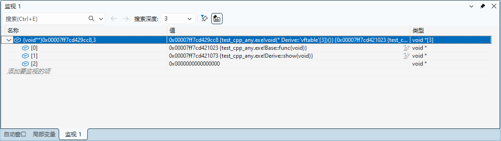

# 多态

**多态性**是C++面向对象编程的核心概念之一，它允许使用统一的接口来操作不同类型的对象。在C++中，多态性主要通过虚函数实现，它使得程序更加灵活、可扩展并且易于维护。

## 面相对象新需求

### 问题抛出

如果子类定义了与父类中原型相同的函数会发生什么？
```cpp
class Parent {
public:
	void show()const {
		std::println("Parent::show(父)");
	}
};

class Child : public Parent{
public:
	void show()const {
		std::println("Child::show(子)");
	}
};

void show(const Parent& p) {
	p.show();
}

void show(const Parent* p) {
	p->show();
}
```

测试：

```cpp
int main()
{
	Parent parent;
	Child child;

	show(parent);		// 调用父类的show
	show(&parent);		// 调用父类的show

	show(child);		// 调用父类的show
	show(&child);		// 调用父类的show
	return 0;
}
```

根据测试结果发现，无论是父类指针指向子类对象，还是引用子类对象，最终调用的都是父类的show函数！因为参数都是父类对象，调用show函数的时候，只能访问到父类的show函数！！！

### 多态实现

对于上面的这种结果不是我们期望的，我们期望的是：调用同一个接口，而产生不同的行为，这就是多态！

**举个例子**，当我们提到汽车、飞机、轮船等交通工具时，它们虽然都属于“交通工具”这一大类，但在实际使用时，却有着不同的出行方式。也就是说，当我们说“乘坐xx出行”时，这些交通工具会以各自独特的方式行驶。这正好体现了多态性：我们调用相同的接口（“乘坐xx出行”），对于不同的对象（如汽车、飞机、轮船等）会根据它们各自的实现来展现出不同的行为。这样，我们就可以在不关心具体实现细节的情况下，灵活地处理和使用这些交通工具了。


通俗地讲，多态就是“多种形态” 的意思，它的核心要义在于“一个接口，多种实现”，也就是说：

+ 如果父类指针指向的是父类对象，则调用父类中定义的函数
+ 如果父类指针指向的是子类对象，则调用子类中定义的重写函数

实现多态很简单，只需要在父类的同名函数之前加上`virtual`关键字修饰即可！在**重写的父类的虚函数**后面加上`override`，表示是虚函数重写(非必须，但是加上可以防止重写的虚函数写错)。

> 还可以在虚函数的后面加上final关键字，表示改虚函数不能被子类重写！

注意：要构成多态，要满足多态三要素！

1. 多态发生在有继承关系的类之间。
2. 必须用基类的指针或引用调用该接口。
3. 被调用的接口是虚函数，并且虚函数完成了重写（覆盖）。

接下来根据刚才的例子实现一个简单的多态。代码如下：

```cpp
//定义交通工具类
class Transport
{
public:
	Transport(const std::string& name)
		: _name(name) {
	}
	//出行
	virtual void going_out() const {}
protected:
	std::string _name;
};

//定义飞机类
class Plane : public Transport
{
public:
	Plane()
		: Transport("飞机") {}
	//出行
	virtual void going_out() const {
		std::println("{}：飞行", _name);
	}
};

//定义轮船类
class Steamship : public Transport
{
public:
	Steamship()
		: Transport("轮船") {}
	//出行
	virtual void going_out() const {
		std::println("{}：航行", _name);
	}
};

//定义汽车类
class Car : public Transport
{
public:
	Car()
		: Transport("汽车") {}

	//出行
	virtual void going_out() const {
		std::println("{}：地面行驶", _name);
	}
};

//中间函数，将派生类对象转化为基类的引用
void goingOut(const Transport& t) {
	t.going_out();
}
```

运行测试：

```cpp
int main()
{
	Plane p;
	Steamship s;
	Car c;

	goingOut(p);
	goingOut(s);
	goingOut(c);
	return 0;
}
```

这里的going_out就是一个虚函数，各派生类的going_out都重写了基类的going_out。

运行结果如下：

```css
飞机：飞行
轮船：航行
汽车：地面行驶
```

不难发现，虽然我们传入的参数都是基类的引用，但程序却调用了不同的函数。这就说明程序根据引用所表示的实际对象来执行相应代码。

当然，这里的中间函数也可以设置为将对象的地址转化为基类的指针，使用时传入对象的地址。

```cpp
void goingOut(const Transport* t) {
	t->going_out();
}
```


### 多态中的虚析构

根据赋值兼容性原则，父类指针可以指向子类对象，那么如果通过父类指针来释放子类对象会有什么问题呢？

先来看一段代码：

```cpp
class Base
{
public:
	Base() {
		std::println("{}", __FUNCSIG__);
	}
	~Base() {
		std::println("{}", __FUNCSIG__);
	}
};

class Derive : public Base
{
private:
	char* _str;
public:
	Derive() {
		_str = new char[10] { "顽石老师" };
		std::println("{}", __FUNCSIG__);
	}
	~Derive() {
		delete[] _str;
		std::println("{}", __FUNCSIG__);
	}
};
```

测试一下：

```cpp
int main(){
	//基类指针指向子类对象
	Base* base = new Derive;
	//通过父类指针释放子类对象
	delete base;			
	return 0;
}
```

输出结果如下：

```cpp
__cdecl Base::Base(void)
__cdecl Derive::Derive(void)
__cdecl Base::~Base(void)
```

结果显示，只有父类对象的构造函数和析构函数都调用了，而子类对象只调用了构造函数，没有调用析构函数！为啥呢？其实和上面的同名函数道理是一样的，编译器识别不到子类对象的析构函数，无法调用！

所以在这个程序中，会导致没有调用派生类析构，从而导致内存泄漏（子类中的动态内存没有释放）！

**解决方法：**将A类的析构函数设置为虚函数。

```cpp
	virtual ~Base() {
		std::println("{}", __FUNCSIG__);
	}
```

然后再运行：

```cpp
__cdecl Base::Base(void)
__cdecl Derive::Derive(void)
__cdecl Derive::~Derive(void)
__cdecl Base::~Base(void)
```

这样，子类的析构函数就能被调用了，所以基类当中的析构函数建议设计为虚函数。

### 函数重载、重写、重定义(隐藏)


## 纯虚函数和抽象类

在C++面向对象编程中，**虚函数**与**抽象类**是实现运行时多态的核心机制。虚函数允许通过基类指针或引用调用派生类重写的方法，而抽象类则通过**纯虚函数**定义接口规范，**强制派生类实现特定行为**。

**虚函数**在基类中使用`virtual`声明，调用时会根据对象的实际类型进行**动态绑定**。若派生类重写该函数，则通过基类指针调用时会执行派生类版本。 **纯虚函数**使用`=0`声明，表示该函数无实现，必须由派生类提供实现，否则派生类也将是抽象类，无法实例化。

### 纯虚函数

在 C++ 中，**虚函数**和**纯虚函数**不仅可以在类内声明，还可以在类外提供实现。普通虚函数类外实现很常见，而纯虚函数虽然声明为 *=0*，依然可以在类外定义函数体，这在需要为纯虚函数提供默认行为或调试时非常有用。

来一个案例：

```cpp
class Shape {
public:
    virtual ~Shape(){}
	virtual double area() const = 0;
};

class Rect : public Shape {
public:
};
```

在这个示例中，area虚函数使用`=0`声明为了纯虚函数，那么纯虚函数所在的`Shape`类就是**抽象类**，它将无法定义对象，因为此类是不完整的！

> **为什么叫抽象类呢？**
>
> 在面向对象的概念中，所有的对象都是通过类来描绘的，但是反过来，并不是所有的类都是用来描绘对象的，如果一个类中没有包含足够的信息来描绘一个具体的对象，这样的类就是抽象类。 
>
> 比如，在一个图形编辑软件的分析设计过程中，就会发现问题领域存在着圆、三角形这样一些具体概念，它们是不同的，但是它们又都属于形状这样一个概念，形状这个概念在问题领域并不是直接存在的，它就是一个抽象概念。而正是因为抽象的概念在问题领域没有对应的具体概念，所以用以表征抽象概念的**抽象类是不能够实例化**的。 

```cpp
	Shape shape;		//error C2259: “Shape”: 无法实例化抽象类
```

无法定义对象，那能用来干嘛呢？主要是用来实现多态的，也就是说可以用基类指针指向子类对象。

```cpp
	Shape* shape = new Rect;	//error C2259: “Rect”: 无法实例化抽象类
```

报错了，需要注意的是，如果父类有纯虚函数，那么子类必须实现，否则子类也无法定义对象，使用如下代码重写一下父类虚函数。

```cpp
class Rect : public Shape {
public:
   double area() const override{
       return 123;
   }
};
```

然后测试一下：

```cpp
	Shape* shape = new Rect;
	std::println("area is {}", shape->area());
	delete shape; 
```

输出结果为：

```cpp
area is 123
```

### 纯虚函数实现

纯虚函数也可提供定义，为纯虚函数提供默认行为、便于派生类选择性调用。但该类仍是抽象类，派生类必须重写才能实例化。

```cpp
class Shape {
public:
	virtual double area() const = 0 {
		return -1.0;
	}
};

class Circle : public Shape {
public:
	double area() const override {
		return Shape::area();
	}
};
```

测试一下：

```cpp
	Shape* shape = new Circle;
	std::println("area is {}", shape->area());
	delete shape; 
```

输出结果为：`area is -1`

当然，纯虚函数也可以在类外实现：

```cpp
double Shape::area() const{
	return -1.0;
}
```

## 多态原理探究

### 引入

我们前面讲过，一个没有任何成员变量的类的大小是1字节：

```cpp
class GameObject {
public:
	void update() {}
};
```

求类型大小：

```cpp
	std::println("sizeof(GameObject) {}", sizeof(GameObject));	//sizeof(GameObject) 1
```

普通的成员函数并不占用对象的内存空间，因为函数存放在代码段，只是作用域归属于类，那么加上虚函数呢？

```cpp
class GameObject {
public:
	virtual void update() {}
};
```

再次运行，输出结果如下：

```cpp
sizeof(GameObject) 8
```

为什么是8个字节，而不再是1个字节大小了呢？让我们定义对象并通过调试看一下对象的内存：

```cpp
	GameObject obj;
```

对象内存图：



可以发现对象的头部多了一个指针`_vfptr`，这个指针叫做**虚函数表指针**,它指向了**虚函数表**。

### 虚函数表指针

指向虚表的指针,叫虚函数表指针,位于对象的头部（作为对象的第一个成员）。

**定义：**如果在类中定义了虚函数，则对象中会增加一个隐藏的指针，叫虚函数表指针`__vfptr`,虚函数表指针在成员的前面,直接占了`4/8`字节.

### 虚函数表

**虚函数表指针**所指向的表,叫做虚函数表(virtual function table)，也叫做虚表

虚函数表本质是一个虚函数指针数组，元素顺序取决于虚函数的声明顺序；大小由虚函数的数量决定。

#### 虚表的特性

- 虚表在编译期间生成，虚表是由虚函数的地址组成，而编译期间虚函数的地址已经存在，因此能够在编译期间完成.
- 虚函数继承体系中，基类先生成一份虚表，之后派生类自己的虚表都是基于从父类继承下来的虚表（继承了虚函数指针）。

- 如果派生类重写了基类中某个虚函数，用派生类自己的虚函数覆盖虚表中基类的虚函数,如果子类没有重写,则虚函数表和父类的虚函数表的元素完全一样
- 派生类自己新增加的虚函数,从继承的虚表的最后一个元素开始,按其在派生类中的声明次序增加到派生类虚表的最后。
- 派生类自己新增的虚函数放在继承的虚表的后面,如果是基类则是按顺序从头开始放,总而言之,自己新增的虚函数位置一定比继承的虚函数位置后
- 虚函数和普通函数一样的，都是存在代码段的，只是他的指针又存到了虚表中.另外对象中存的不是虚表,存的是虚表指针
- 虚表是在编译阶段就完成了,在初始化列表完成的是虚表指针的初始化
- 同一类型直接定义的对象共享同一个虚表

**特性分析：**

```cpp
class GameObject {
public:
	virtual void update() {}
	
	virtual void event() {}
};

class Player : public GameObject {
public:
	void update() override {}
};


int main()
{
	GameObject obj;
	Player player;

	return 0;
}
```

调试结果如下：



#### 虚函数指针初始化时机

虚表指针作为类的隐藏的数据成员，自然是在构造函数中被初始化的。实际上它在构造函数执行之前就被初始化，即它的初始化发生在构造函数执行初始化列表和函数体之前，咱们可以把它理解为在构造函数中第一个被初始化。具体来说，一个具有虚函数的对象在被创建时，经历以下的过程：

**1.对象内存分配**：首先为对象分配内存。这一步包括为对象的所有数据成员和虚表指针（如果有的话）分配空间。

**2.虚表指针初始化**：在进入构造函数的具体代码之前，编译器生成的代码会设置虚表指针，指向类的虚表。这一步确保了即使在构造函数体内部，虚函数的调用也可以正确地解析到当前类的实现。对于继承体系中的构造过程，这意味着每个构造函数开始执行之前，虚表指针都会被更新以反映当前正在构造的类的虚表。

- 对于基类对象，虚表指针指向基类的虚表。
- 对于派生类对象，当基类的构造函数执行时，虚表指针先被设置为基类的虚表，然后在派生类构造函数执行前被更新为派生类的虚表。

**3.构造函数的初始化列表执行**：如果构造函数有初始化列表，那么在虚表指针设置之后、构造函数体执行之前，初始化列表中的表达式会被用来初始化对象的数据成员。

**4.** **构造函数体执行**：最后，执行构造函数的函数体部分。

给GameObejct加上一个成员，然后调试查看一下虚函数指针的初始化时机：

```cpp
class GameObject {
public:
	GameObject()
		: _speed(0x12)
	{ }
	virtual void update() {}
	virtual void event() {}
private:
	int _speed;
};
```

调试情况如下：



#### 虚表指针分布初始化

分布初始化是指，当定义子类对象时，先会调用父类的构造函数，此时虚函数指针指向的是父类的虚函数表；父类构造函数执行完毕后，在执行子类构造函数，此时虚函数指针才会指向子类的虚函数表。

下面来验证一下：

```cpp
class GameObject {
public:
	GameObject()
	{
	}
	virtual void update() {}
	
	virtual void event() {}
};

class Player : public GameObject {
public:
	Player() {

	}
	void update() override {}
};
```

定义子类对象，进行调试：

```cpp
Player player;
```

刚进入`Player`构造函数时，this指针都为NULL。



再按F11，进入父类的构造函数，此时虚函数表指针还没有初始化：



再按两次F11，让构造函数执行完，就可以看到虚函数表指针初始化完毕了！


再继续执行完`Player`类的构造函数，可以发现虚函数表指针已经改变指向了，指向了自己的虚函数表：



因此，在父类的构造函数中调用虚函数，无法发生多态行为，因为在父类中调用虚函数时，虚函数指针还指向着父类的虚函数表，一定会调用父类的函数！

```cpp
class GameObject {
public:
	GameObject()
		: _speed(0x12)
	{ 
		update();	//调用虚函数，无法产生多态行为
	}
	virtual void update() {std::println("GameObject update"); }
	virtual void event() { }
private:
	int _speed;
};

class Player : public GameObject {
public:
	Player() { }
	void update() override { std::println("Player update"); }
};

int main()
{
	Player player;

	return 0;
}
```

运行结果为：

```css
GameObject update
```

#### 虚表的位置

虚表没有明确说必须存放在哪里，不过我们可以尝试对比各个区的地址，看虚表的大致位置。

```cpp
class Base{
public:
    virtual void func(){
    }
private:
    int _a;
};
 
class Derive :public Base {
};
 
int main()
{
    Base b;
    Derive d;
    int x = 0;
    int *y = new int;
    static int z = 1;
    const char * str = "hello world";
 
    std::println("栈对象地址:        {}",(void*) & x);
    std::println("堆对象地址:        {}",(void*) y);
    std::println("静态区对象地址:    {}",(void*) &z);
    std::println("常量区对象地址:    {}",(void*) str);
    std::println("Base对象虚表指针:  {}",(void*) *(uint64_t**)(&b)); //64位环境
    std::println("Derive对象虚表指针:{}",(void*) *(uint64_t**)(&d)); 
    
    return 0;
}
```

输入结果如下：

```css
栈对象地址:         0x2900f4f664
堆对象地址:         0x1e37cffd810
静态区对象地址:     0x7ff602b33008
常量区对象地址:     0x7ff602afeb60
Base对象虚表指针:   0x7ff602afeb38
Derive对象虚表指针: 0x7ff602afeb50
```

根据地址分析，虚表指针与常量区对象地址距离最近，因此可以推测虚表位于常量区。

另外，在监视窗口中观察虚表指针与虚函数地址也可以发现，虚表指针与虚函数地址也是比较接近,也可以大致推测在代码段中。(代码段常量区很贴近,比较ambiguous,模棱两可的)

从应用角度来说。虚表也应当位于常量区中。因为虚表在编译期间确定好后，不会再发生改变，在常量区也是比较合适的.

调用虚函数实际上是通过虚函数表找到对应的虚函数，然后进行调用的，这就是多态实现的原理。

### 虚表打印

当子类新增了属于自己的虚函数之后，通过调试发现，虚函数表中无法看到子类新增的虚函数：

```cpp
class Base{
public:
    virtual void func(){
    }
private:
    int _a;
};
 
class Derive :public Base {
public:
    virtual void show(){
    }
};
 
int main()
{
	Derive d;
    
    return 0;
}
```

对上例函数查看VS监视时，发现虚表不显示完全。



需要在监视窗口中手动输入`(void**)0x虚函数表指针,3`,表示以`(void*)[3]`方式展开：



此后就能全部显示虚表了。

### 如何拿到vptr指针呢

既然vptr指针存在，那么能不能拿到vptr指针，手动来调用函数呢？

答案是可以的，但是操作起来比较麻烦！下面我们就来挖一挖

1. 因为vptr指针在对象的第一个元素(通过证明vptr指针的存在可以看出)，所以对对象t取地址可以拿到对象的地址

   ```cpp
   Object* p = &obj;
   ```

2. 现在拿到的指针的步长是对象的大小，因为vptr是指针，只有4/8个字节，所以需要把p强转成int*指针，这样对(int\*)&t就得到了vptr指针

   ```cpp
   int vptr = *(int*)p;	//拿到了vptr指针的指针
   int* pvptr = (int*)vptr; //把vptr的值转成指针
   ```

3. 因为vptr指针是指向的存储指针数组的首地址，所以拿到vptr指针后先把vptr转成int*指针，这样进行取值的话，刚好是每个指针

   ```cpp
   FUN foo = (FUN)*(pvptr+0)
   ```

4. 接着吧得到的数组里面的元素(指针)转成函数指针，即可直接使用了

   ```cpp
   using FUN = void (*)();
   
   Parent* p = &obj;
   long long vptr = *(long long*)p;
   long long* pvptr = (long long*)vptr;
   auto foo = (FUN)*(pvptr + 1);
   foo();
   //output:Parent::fun(int i)
   ```

   