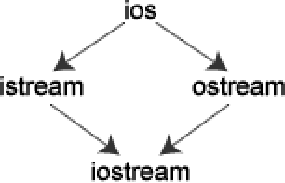
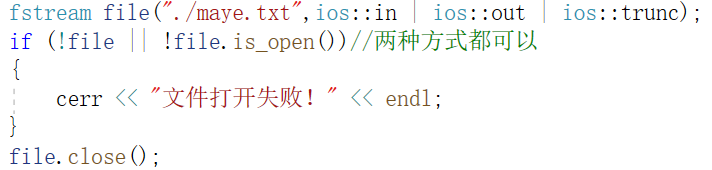
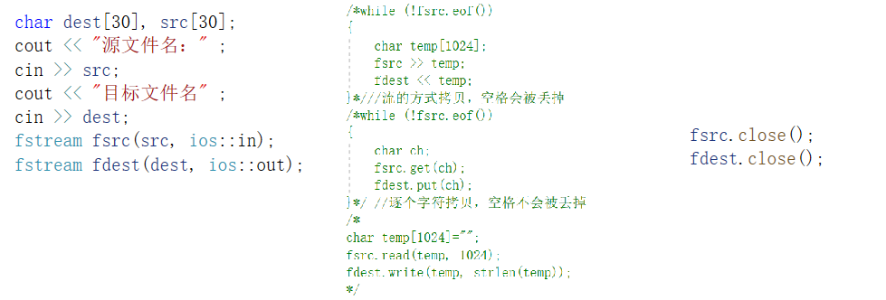

# IO流

## I/O流的概念和流类库的结构

C++输入输出包含以下三个方面的内容：

    1. 对系统指定的标准设备的输入和输出。即从键盘输入数据，输出到显示器屏幕。这种输入输出称为标准的输入输出，简称标准I/O。
       2. 以外存磁盘文件为对象进行输入和输出，即从磁盘文件输入数据，数据输出到磁盘文件。以外存文件为对象的输入输出称为文件的输入输出，简称文件I/O。
       3. 对内存中指定的空间进行输入和输出。通常指定一个字符数组作为存储空间(实际上可以利用该空间存储任何信息)。这种输入和输出称为字符串输入输出，简称串I/O。

C++编译系统提供了用于输入输出的iostream类库。iostream这个单词是由3个部 分组成的，即i-o-stream，意为输入输出流。

## 标准输入输出流

### 标准输入流

**类**

ios:对流状态进行设置，虚基类;

streambuf:提供对数据的缓冲支持;

istream、ostream、iostream:提取与插入

**对象**

cin: istream类对象，处理标准输入，即键盘输入;

cout: ostream类对象，处理标准输出，即屏幕输出;

cerr: ostream类对象，处理标准出错信息，提供不带缓冲区的输出;

clog: ostream类对象，处理标准出错信息，提供带缓冲区的输出;

标准输入流常见api

cin.get()			//一次只能读取一个字符

cin.get(str,maxsize,endch)	//可以读取字符串，但是超过长度的部分或者遇到结束字符，会被截断

cin.getline() 		//和上面的函数一样

用cin>>str输入字符串时，遇到空格会截断，所以最好用cin.getline()

### 标准输出流

C++格式化输出两种使用方式：
A)通过流成员函数进行输入输出格式控制

有些设置会全局生效，所以如果在一次输出过程中需要混杂多种格式，使用ios_base的成员函数来处理就显得很不方便。所以提供了iomanip库可以满足这种使用方式。

通过#include <iomanip>提供的控制符，进行输入输出格式控制

上述接口与ios_base的格式控制成员是对应的，可以二者配合进行输出格式的精准控制。其中的精度控制默认是6位有效数字，科学计数法中的指数部分e为默认小写。setw设置的宽度如果小于字段宽度会失效

## 文件流

### 简介

文件：字节流，程序员以字符为单位建立程序和数据项，计算机按位模式操作和处理这些字符
如何从文件读取流和向文件写入流。这就需要用到 C++ 中另一个标准库 fstream，它定义了三个新的数据类型：

### 打开、关闭

+ 在从文件读取信息或者向文件写入信息之前，必须先打开文件。
  + ofstream 用来打开文件进行写操作
  +  ifstream 用来打开文件进行读操作
  +  fstream   支持文件的读和写操作
+ 打开文件的方式有两种：
  + 通过构造函数打开
  + 通过成员函数open打开
+ void open(const char *filename, ios::openmode mode);
  + filename	要打开的文件名
  + mode	操作模式
    + ios::in		打开文件用于读取
    + ios::out	打开文件用于写入
    + ios::ate	文件打开后定位到文件末尾
    + ios::app	追加模式
    + ios::trunc	如果文件存在，则清空所有内容，如果不存在则创建文件
    + ios::binary	二进制方式
    + ios::nocreate	如果文件不存在则，打开失败	

+ 判断文件是否打开成功
  + 成员函数:is_open()
  + 运算符重载：!file
    
    
+ 关闭文件：
  + 使用成员函数：colse();

+ 有两种读写文件的方式：
  + 通过流运算符  <<   >>
  + 通过成员函数 write  read

+ 例如：编写程序，读取一个文件内容并复制到另一个文件中

### 文件位置指针

istream 和 ostream 都提供了用于重新定位文件位置指针的成员函数。这些成员函数包括关于 istream 的 seekg（"seek get"）和关于 ostream 的 seekp（"seek put"）。

seekg 和 seekp 的参数通常是一个长整型。第二个参数可以用于指定查找方向。
查找方向：

+ ios::beg	默认的，从流的开头开始定位
+ ios::cur	从流的当前位置开始定位
+ ios::end	从流的末尾开始定位

## 字符串流

使用头文件<sstream>添加对字符串流的支持

