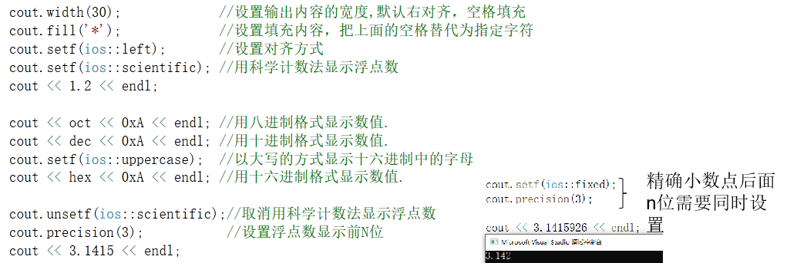
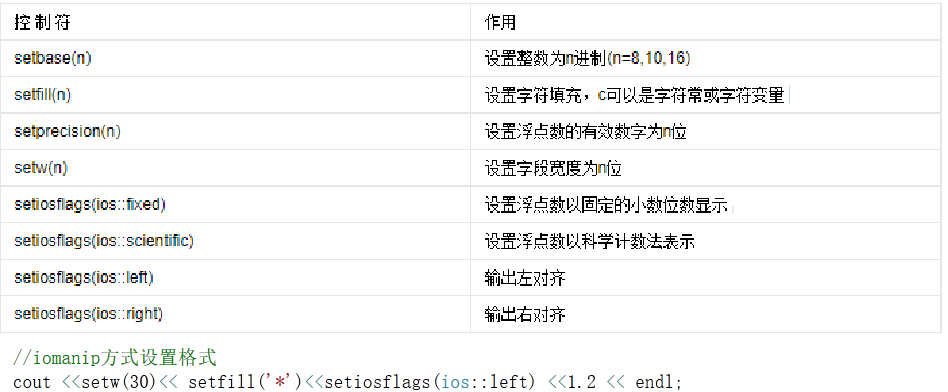
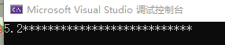
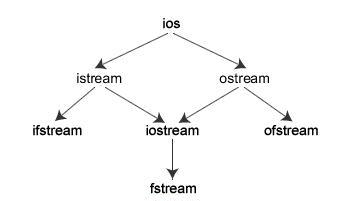
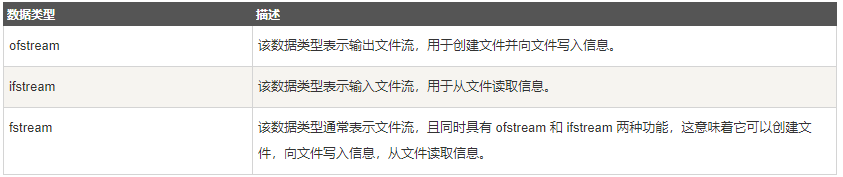
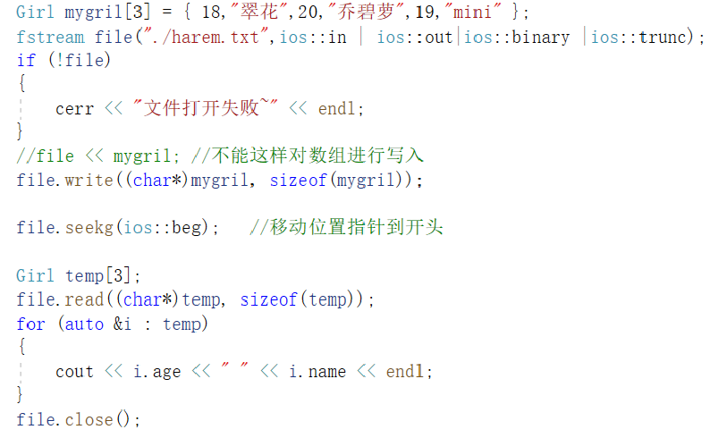

# IO流

咱们已经学过了 C 语言，所以都知道，它有一整套完成数据读写（I/O）的解决方案：

+ 使用 scanf()、gets() 等函数从键盘读取数据，使用 printf()、puts() 等函数向屏幕上输出数据；

+ 使用 fscanf()、fgets() 等函数读取文件中的数据，使用 fprintf()、fputs() 等函数向文件中写入数据。
+ 使用sscanf() 读取格式化的字符串中的数据，使用sprintf()把格式化的数据写入到字符串中

要知道，C 语言的这套 I/O 解决方案也适用于 C++ 程序，但 C++ 并没有“偷懒”，它自己独立开发了一套全新的 I/O 解决方案，其中就包含大家一直使用的 cin 和 cout。

C++标准流，提供了一下三个方面的内容：

1. 对系统指定的标准设备的输入和输出。即从键盘输入数据，输出到显示器屏幕。这种输入输出称为标准的输入输出，简称标准I/O。

2. 以外存磁盘文件为对象进行输入和输出，即从磁盘文件输入数据，数据输出到磁盘文件。以外存文件为对象的输入输出称为文件的输入输出，简称文件I/O。
3. 对内存中指定的空间进行输入和输出。通常指定一个字符数组作为存储空间(实际上可以利用该空间存储任何信息)。这种输入和输出称为字符串输入输出，简称串I/O。

本质上来说，C++ 的这套 I/O 解决方案就是一个包含很多类的类库（作为 C++ 标准库的组成部分），这些类常被称为“流类”。

C++ 的开发者认为数据输入和输出的过程也是数据传输的过程，数据像水一样从一个地方流动到另一个地方，所以 C++ 中将此过程称为“流”，实现此过程的类称为“流类”。

## 标准输入输出流

### 类和流对象

| 流类    | 预定义流对象 | 描述                             |
| ------- | ------------ | -------------------------------- |
| istream | cin          | 标准输入流                       |
| ostream | cout         | 标准输出流                       |
| ostream | cerr         | 标准错误流(不缓冲数据，直接显示) |
| ostream | clog         | 标准日志流(缓冲数据)             |

标准库定义了 4 个 IO 对象。

+ 处理输入时使用命名为 cin（读作 see-in）的 istream 类型对象。这个对象也称为标准输入。
+ 处理输出时使用命名为 cout（读作 see-out）的 ostream 类型对象，这个对象也称为标准输出。
  + 标准库还定义了另外两个 ostream 对象，分别命名为 cerr 和 clog（分别读作“see-err”和“see-log”）。cerr 对象又叫作标准错误，通常用来输出警告和错误信息给程序的使用者。
  + 而 clog 对象用于产生程序执行的一般信息。
+ 一般情况下，系统将这些对象与执行程序的窗口联系起来。这样，当我们从cin 读入时，数据从执行程序的窗口读入，当写到 cin、cerr 或 clog 时，输出写至同一窗口。运行程序时，大部分操作系统都提供了重定向输入或输出流的方法。利用重定向可以将这些流与所选择的文件联系起来。

### 标准输入流

cin本身是会略过所有空格、回车、tab的，然后开始读入，遇到空格、回车、tabl停止读入，光标会停留在这些字符之前。意思就是下一次读入也会从空格挥着这些开始读取。

#### >>读取

C++给我们提供了方便的输入方法，直接使用>>即可！但是使用>>输入字符串遇到空格会截断，当然也可以使用对象的函数来获取数据！

#### cin.get()

```cpp
char c;
char buf[20],buf1[20];
//读取一个字符
c = cin.get();	//<==> cin.get(c);
//读取字符串
cin.get(buf, 20);
//读取字符串，遇到指定的字符终止读取
cin.get(buf1, 20, '#');
cout << c << " " << buf<<" "<<buf1;
```

#### cin.getine()

```cpp
char buf[20];
cin.getline(buf, 20);
cin.getline(buf, 20, '#');
```

#### cin.ignore

```cpp
std::string str;
//忽略所有\n
while (cin.peek() == '\n')
{
	cin.ignore(1);
}	
std::getline(cin, str,'#');
输入:
\n
\n
123#
输出:
123
```

### 标准输出流

C++格式化输出两种使用方式：
A)通过流成员函数进行输入输出格式控制



有些设置会全局生效，所以如果在一次输出过程中需要混杂多种格式，使用ios_base的成员函数来处理就显得很不方便。所以提供了iomanip库可以满足这种使用方式。


通过#include <iomanip>提供的控制符，进行输入输出格式控制




上述接口与ios_base的格式控制成员是对应的，可以二者配合进行输出格式的精准控制。其中的精度控制默认是6位有效数字，科学计数法中的指数部分e为默认小写。setw设置的宽度如果小于字段宽度会失效

### 操纵符

[操纵符](https://zh.cppreference.com/w/cpp/io/manip)是令代码能以 operator<< 或 operator>> 控制输入/输出流的帮助函数。

#### 设置标志

咱们开始吧！

```cpp
cout.width(30);			//设置占位宽度
cout << 5.20 << endl;
```


可以看到，通过cout.width可以设置输出内容的宽度，默认右对齐，用空格占位。

如何设置占位字符呢？使用cout.fill即可！记得在输出数据之前设置哟~

```cpp
cout.fill('*');			//设置占位字符
cout.setf(ios::left);	//设置对其方式为左对齐
```



这样就可以看到占位的字符变化了，注意我使用了cout.setf(ios::left)对对其方式进行了设置，这样数据就显示在左边了！

现在我想让浮点数以科学计数法的方式显示，该怎么做呢？

```cpp
cout.setf(ios::scientific);//设置浮点数显示格式为科学计数法
```


也是非常简单呢，这里说明一下，cout.setf是给流对象设置标志，标志有很多，详见[操纵符总表](#操纵符总表)。

当然除了设置标志之外，还可以使用cout.unsetf取消设置。

#### 直接用<<

除了上面的方法，还可以直接在cout<<语句中使用，比如

```cpp
cout.setf(ios::showbase);		//设置显示前缀
cout.setf(ios::showpos);		//十进制正整数是否显示+号

cout << hex << 255 << endl;		//以十六进制格式输出
cout << oct << 255 << endl;		//以八进制格式输出
cout << dec << 255 << endl;		//以十进制格式输出
```

#### iomanip

使用iomanip中定义的操纵符号，可以让操纵变得更简单哟！

```cpp
cout << setw(30) << setfill('#') << setiosflags(ios::left) << 3.1415 << endl;
```


#### 操纵符总表

在头文件 `<ios>` 中定义的：

| 操纵符                                             | 描述                                                         |
| -------------------------------------------------- | ------------------------------------------------------------ |
| boolalpha<br/>noboolalpha                          | 在布尔值的文本和数值表示间切换 (函数)                        |
| showbase<br/>noshowbase                            | 控制是否使用前缀指示数值基数 (函数)                          |
| showpoint<br/>noshowpoint                          | 控制浮点表示是否始终包含小数点 (函数)                        |
| showpos<br/>noshowpos                              | 控制是否将 `+` 号与非负数一同使用 (函数)                     |
| skipws<br/>noskipws                                | 控制是否跳过输入上的前导空白符 (函数)                        |
| uppercase<br/>nouppercase                          | 控制一些输出操作是否使用大写字母(函数)<br/>`比如输出的十六进制字符是否大写 ` |
| unitbuf<br/>nounitbuf                              | 控制是否每次操作后冲洗输出 (函数)                            |
| internal<br/>left<br/>right                        | 设置填充字符的布置 (函数)                                    |
| dec<br/>hex<br/>oct                                | 更改用于整数输入/输出的基数 (函数)                           |
| fixed<br/>scientific<br/>hexfloat<br/>defaultfloat | 更改用于浮点 I/O 的格式化 (函数)                             |
| ws                                                 | 消耗空白符 (函数模板)                                        |
| ends                                               | 输出 '**\0**' (函数模板)                                     |
| flush                                              | 冲洗输出流 (函数模板)                                        |
| endl                                               | 输出 '**\n**' 并冲洗输出流 (函数模板)                        |
| emit_on_flush<br/>noemit_on_flush<br/>(C++20)      | 控制流的  `basic_syncbuf`是否在冲入时发射 (函数模板)         |
| flush_emit<br/>(C++20)                             | 冲入流，而若它使用 `basic_syncbuf`则发射其内容 (函数模板)    |

在头文件 `<iomanip>` 定义的：

| 操纵符        | 描述                                                    |
| ------------- | ------------------------------------------------------- |
| resetiosflags | 清除指定的 ios_base 标志 (函数)                         |
| setiosflags   | 设置指定的 ios_base 标志 (函数)                         |
| setbase       | 更改用于整数 I/O 的基数 (函数)                          |
| setfill       | 更改填充字符 (函数模板)                                 |
| setprecision  | 更改浮点精度 (函数)                                     |
| setw          | 更改下个输入/输出域的宽度 (函数)                        |
| get_money     | 剖析货币值 (函数模板)                                   |
| put_money     | 格式化并输出货币值 (函数模板)                           |
| get_time      | 剖析指定格式的日期/时间值 (函数模板)                    |
| put_time      | 按照指定格式格式化并输出日期/时间值 (函数模板)          |
| quoted(C++14) | 插入和读取带有内嵌空格的被引号括起来的字符串 (函数模板) |

## 文件流

### 简介

文件：字节流，程序员以字符为单位建立程序和数据项，计算机按位模式操作和处理这些字符
如何从文件读取流和向文件写入流。这就需要用到 C++ 中另一个标准库 fstream，它定义了三个新的数据类型：





### 使用

#### 打开文件

```cpp
fstream file("maye.txt");
```

可以通过构造函数指定文件名，并打开;默认就是以可读可写的方式打开的，但是文件不存在会打开失败！

```cpp
file.open("maye.txt", ios::in | ios::out | ios::trunc);
```

也可以使用open函数打开文件，使用open必须传递打开模式`ios::in`为可读，`ios::out`为可写，`ios::trunc`为文件不存在时创建，存在则清空所有内容(`ios::trunc`必须与`ios::out`搭配使用)。

```cpp
if (!file)	//if (!file.is_open())	//两种判断方式都可以
{
	cout << "open error:" << strerror(file.rdstate());
}
else
{
	cout << "open successed";
}
```

使用时必须判断是否打开成功，并查看错误原因。

使用完毕之后并不需要手动关闭文件，但是如果想提前关闭可以使用close()函数。

#### 读取文件

文件打开之后，就可以进行读写了，注意打开模式，`ios::in`为可读，`ios::out`为可写。

创建stu.txt文件，并写入以下内容，并测试读取！

```css
123 顽石 男
456 强森 男
789 里奇 男
110 莫影 男
```

##### 使用>>读取

```cpp
std::string buf;
while (!file.eof())
{
	file >> buf;
	cout << buf << " ";
	if (file.peek() == '\n')
	{
		cout << endl;
	}
}
```

注意，使用>>读取，遇到空格会截断，所以需要循环的去读取，而且还需要自己判断是不是\n。

##### 使用read()读取

```cpp
char buf[200] ={0};
file.read(buf, 200);
cout << buf;
```

值得注意的是，我们并不知道文件有多大，所以并不能很好的指定读取的大小，从而一次性把文件读取完成。可以先获取文件大小然后再读取。

```cpp
file.seekp(0,ios::end);
int64_t len = file.tellp();
file.seekp(0,ios::beg);

char* buf = new char[len + 1] {0};
file.read(buf, len);
cout << buf;

delete[] buf;
```

##### 使用std::getline读取

如果想直接读取到std::string里面，则需要使用std::getline。

	std::string buf;
	std::getline(file, buf);
	cout << buf;
这样读取只能读取一行，如果想要读取多行，则需要使用循环。

```cpp
std::string buf;
while (!file.eof())
{
	std::getline(file, buf);
	cout << buf << endl;
}
```

#### 写入文件

如果想要追加写入文件，请添加打开模式`ios::app`

如果想要二进制读写，请添加打开模式`ios::binary`

##### 使用<<写入

##### 使用write写入

### 打开模式

| 模式标记                          | 适用对象                  | 作用                                                         |
| --------------------------------- | ------------------------- | ------------------------------------------------------------ |
| ios::in                           | ifstream fstream          | 打开文件用于读取数据。如果文件不存在，则打开出错。           |
| ios::out                          | ofstream fstream          | 打开文件用于写入数据。如果文件不存在，则新建该文件；如果文件原来就存在，则打开时清除原来的内容。 |
| ios::app                          | ofstream fstream          | 打开文件，用于在其尾部添加数据。如果文件不存在，则新建该文件。 |
| ios::ate                          | ifstream                  | 打开一个已有的文件，并将文件读指针指向文件末尾（读写指 的概念后面解释）。如果文件不存在，则打开出错。 |
| ios:: trunc                       | ofstream                  | 打开文件时会清空内部存储的所有数据，单独使用时与 ios::out 相同。 |
| ios::binary                       | ifstream ofstream fstream | 以二进制方式打开文件。若不指定此模式，则以文本模式打开。     |
| ios::in \| ios::out               | fstream                   | 打开已存在的文件，既可读取其内容，也可向其写入数据。文件刚打开时，原有内容保持不变。如果文件不存在，则打开出错。 |
| ios::in \| ios::out               | ofstream                  | 打开已存在的文件，可以向其写入数据。文件刚打开时，原有内容保持不变。如果文件不存在，则打开出错。 |
| ios::in \| ios::out \| ios::trunc | fstream                   | 打开文件，既可读取其内容，也可向其写入数据。如果文件本来就存在，则打开时清除原来的内容；如果文件不存在，则新建该文件。 |

### 文件位置指针

istream 和 ostream 都提供了用于重新定位文件位置指针的成员函数。这些成员函数包括关于 istream 的 seekg（"seek get"）和关于 ostream 的 seekp（"seek put"）。

seekg 和 seekp 的参数通常是一个长整型。第二个参数可以用于指定查找方向。
查找方向：

+ ios::beg	默认的，从流的开头开始定位
+ ios::cur	从流的当前位置开始定位
+ ios::end	从流的末尾开始定位



## 字符串流

在C语言中，我们使用sscanf和sprintf来对字符串进行格式化，格式控制非常不方便，在C++中有了更方便的操作。

> 使用头文件<sstream>添加对字符串流的支持。

### 打开字符串流

```cpp
stringstream stream(ios::out | ios::in);
```

如果要同时支持格式化和反格式化，则需要指定打开模式`ios:in`和`ios::out`。

```cpp
stream << 1 <<" " << "234"s <<" "<< 5.20;
```

使用stream对象，把需要的数据全部格式化，这里每个数据之间用空格隔开，方便等会反格式化。(反格式化以空格为分割字符)

```cpp
cout << stream.str()<<endl;
```

当然在反格式化之前，我们使用stream.str()查看已经格式化的数据。

```cpp
int a;
float b;
string s;
```

首先我们定义三个对象，来接受从stream中反格式化的数据。

```cpp
stream >> a >> s >> b;
cout << a <<" " << s << " " << b << endl;
```

然后直接使用>>把每个数据都获取到，并输出查看。

### 从string反格式化

stringstream对象还可以绑定一个string对象，直接对string进行操作。

```cpp
string buf = "1 234 5.20";
stringstream stream(buf);
```

先准备一个string对象，然后构造stringstream，默认以可读可写方式打开，如有需要，可以自己传递第二个参数。

	int a;
	float b;
	string s;
	stream >> a >> s >> b;
	cout << a << " " << s << " " << b << endl;
接下来就和上面的方法一样了。

如果在反格式化之后需要写入内容，是写入不了的，需要调用stream.clear()对格式进行清除。

```cpp
stream.clear();
stream << "@@" << " ##";
cout << stream.str();
```


添加了clear之后，写入成功，写入的数据从流的开头写入的，但是我们需要在已有的内容后面追加，该怎么办呐？

```cpp
stringstream stream(buf,ios::app | ios::in | ios::out);
```

只需要在构造stringstream对象的时候，添加上`ios::app`以追加的模式写入即可！


## 重定向流

https://blog.csdn.net/SCHOLAR_II/article/details/115520548

```cpp
#include <iostream>
#include <fstream>

using namespace std;
int main() {

    // cout
    ofstream fout("out.txt");
    //用 rdbuf() 重新定向，返回旧输出流缓冲区指针
     streambuf * originalOutBuf = cout.rdbuf(fout.rdbuf());

    cout << "cout output test" << endl;

    //恢复cout
    cout.rdbuf(originalOutBuf);
    fout.close();

    cout << "cout output test 2" << endl;

    return 0;
}

```

