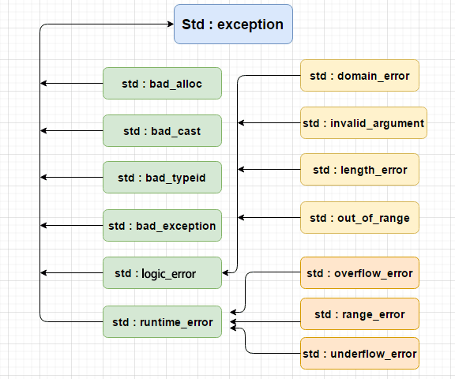

# 错误处理

错误处理在所有编程语言中，都是一件棘手的问题，也是一个备受争议的话题。这个问题在 C++ 这里尤其严重：因为历史的原因，C++ 并没有统一的错误处理方式。

目前，**关于错误处理的方式，C++ 社区基本分裂为异常和非异常（返回值）两个阵营**。


## 异常

### 简介

异常是程序在执行期间产生的问题。C++ 异常是指在程序运行时发生的特殊情况，比如尝试除以零的操作。

异常处理提供了一种可以使程序从执行的某点将控制流和信息转移到与执行先前经过的某点相关联的处理代码的方法（换言之，异常处理将控制权沿调用栈向上转移）。

C++ 异常处理涉及到三个关键字：**try、catch、throw、noexcept **。

- **throw:** 当问题出现时，程序会抛出一个异常。这是通过使用 **throw** 关键字来完成的。
- **catch:** 在您想要处理问题的地方，通过异常处理程序捕获异常。**catch** 关键字用于捕获异常。
- **try:** try 块中的代码标识将被激活的特定异常。它后面通常跟着一个或多个 catch 块。
- **noexcept ：**用于描述函数不会抛出异常，一旦有异常抛出，会立刻终止程序，它可以阻止异常的传播与扩散。noexcept可以带一个“常量表达式作为参数，常量表达式为true，表示不会抛出异常，否则代表可以抛出异常

如果有一个块抛出一个异常，捕获异常的方法会使用 **try** 和 **catch** 关键字。try 块中放置可能抛出异常的代码，try 块中的代码被称为保护代码。使用 try/catch 语句的语法如下所示：

```cpp
try
{
   // 保护代码
}catch( ExceptionName e1 )
{
   // catch 块
}catch( ExceptionName e2 )
{
   // catch 块
}catch( ExceptionName eN )
{
   // catch 块
}
```

如果 **try** 块在不同的情境下会抛出不同的异常，这个时候可以尝试罗列多个 **catch** 语句，用于捕获不同类型的异常。

### 抛出异常

可以使用 **throw** 语句在代码块中的任何地方抛出异常。throw 语句的操作数可以是任意的表达式，表达式的结果的类型决定了抛出的异常的类型。

以下是尝试除以零时抛出异常的实例:

```cpp
double division(int a, int b)
{
   if( b == 0 )
   {
      throw "Division by zero condition!";
   }
   return (a/b);
}
```

### 捕获异常

**catch** 块跟在 **try** 块后面，用于捕获异常。您可以指定想要捕捉的异常类型，这是由 catch 关键字后的括号内的异常声明决定的。

```cpp
try
{
   // 保护代码
}catch( ExceptionName e )
{
  // 处理 ExceptionName 异常的代码
}
```

上面的代码会捕获一个类型为 **ExceptionName** 的异常。如果您想让 catch 块能够处理 try 块抛出的任何类型的异常，则必须在异常声明的括号内使用省略号 ...，如下所示：

```cpp
try
{
   // 保护代码
}catch(...)
{
  // 能处理任何异常的代码
}
```

下面是一个实例，抛出一个除以零的异常，并在 catch 块中捕获该异常。

```cpp
#include <iostream>
using namespace std;
 
double division(int a, int b)
{
   if( b == 0 )
   {
      throw "Division by zero condition!";
   }
   return (a/b);
}
 
int main ()
{
   int x = 50;
   int y = 0;
   double z = 0;
 
   try {
     z = division(x, y);
     cout << z << endl;
   }catch (const char* msg) {
     cerr << msg << endl;
   }
 
   return 0;
}
```

由于我们抛出了一个类型为 **const char\*** 的异常，因此，当捕获该异常时，我们必须在 catch 块中使用 const char*。当上面的代码被编译和执行时，它会产生下列结果：

```text
Division by zero condition!
```

### C++ 标准的异常

C++ 提供了一系列标准的异常，定义在 **<exception>** 中，我们可以在程序中使用这些标准的异常。它们是以父子类层次结构组织起来的，如下所示：



下表是对上面层次结构中出现的每个异常的说明：

| 异常                   | 描述                                                         |
| :--------------------- | :----------------------------------------------------------- |
| **std::exception**     | 该异常是所有标准 C++ 异常的父类。                            |
| std::bad_alloc         | 该异常可以通过 **new** 抛出。                                |
| std::bad_cast          | 该异常可以通过 **dynamic_cast** 抛出。                       |
| std::bad_exception     | 这在处理 C++ 程序中无法预期的异常时非常有用。                |
| std::bad_typeid        | 该异常可以通过 **typeid** 抛出。                             |
| **std::logic_error**   | 理论上可以通过读取代码来检测到的异常。                       |
| std::domain_error      | 当使用了一个无效的数学域时，会抛出该异常。                   |
| std::invalid_argument  | 当使用了无效的参数时，会抛出该异常。                         |
| std::length_error      | 当创建了太长的 std::string 时，会抛出该异常。                |
| std::out_of_range      | 该异常可以通过方法抛出，例如 std::vector 和 std::bitset<>::operator[]()。 |
| **std::runtime_error** | 理论上不可以通过读取代码来检测到的异常。                     |
| std::overflow_error    | 当发生数学上溢时，会抛出该异常。                             |
| std::range_error       | 当尝试存储超出范围的值时，会抛出该异常。                     |
| std::underflow_error   | 当发生数学下溢时，会抛出该异常。                             |

### 定义新的异常

您可以通过继承和重载 **exception** 类来定义新的异常。下面的实例演示了如何使用 std::exception 类来实现自己的异常：

```cpp
#include <iostream>
#include <exception>
using namespace std;
 
struct MyException : public exception
{
  const char * what () const
  {
    return "C++ Exception";
  }
};
 
int main()
{
  try
  {
    throw MyException();
  }
  catch(MyException& e)
  {
    std::cout << "MyException caught" << std::endl;
    std::cout << e.what() << std::endl;
  }
  catch(std::exception& e)
  {
    //其他的错误
  }
}
```

这将产生以下结果：

```cpp
MyException caught
C++ Exception
```

### 抑制new抛异常

当使用new申请内存时，如果内存申请失败，会抛出std::bad_alloc异常，需要如下处理：

```cpp
try
{
	while (true)
	{
		new char[1024];
	}
}
catch (const std::bad_alloc& e)
{
	cout << "has exception "<<e.what() << endl;
}
```

如果想根据返回的指针来判断，就需要抑制new抛出异常。

```cpp
double* p = nullptr;
do
{
	 p = new(std::nothrow) double[1024];
} while (p);
```

## 非异常

为了保证与 C 语言的兼容性，C++ 从 C 语言那里继承了各种基于错误返回码的机制，常见的有两种：

1. 返回各种特殊值用于表示各种不同的错误原因（通常返回 0 表示成功）。
2. 返回 0 值表示成功；返回非 0 表示错误（大部分情况返回 -1），并通过设置全局状态（errno）来表示具体错误原因。

```cpp
int getchar(); // 遇到文件结尾返回 -1
char* malloc(int); // 如果分配出错，返回 0
```

基于错误返回码的错误处理机制，存在一些天然的缺陷：

1. 繁琐且重复的错误检查使代码变得混乱。
2. 构造函数没有返回值，错误返回码无法处理构造函数出错的情形。类似的，重载的运算符执行出错也没法返回错误码。
3. 还有，最令人头疼的是，开发者可能会忘记检查错误或者没有正确处理返回码。

关于基于返回值的错误处理方式，C++ 也进行了一些增强：

### std::error_code

- C++11 引入了 `std::error_code` 增强了错误码的概念。

  ```cpp
  class maye_category : public std::error_category
  {
  	const char* error_msg[100] = {"one","two","three","four"};
  	const char* mapStr(int errval) const
  	{ 
  		if (errval == 0)
  		{
  			return "No Error";
  		}
  		if (errval < 255 || errval > 255 + 100)
  		{
  			return "unknown Error";
  		}
  		return error_msg[errval - 255]; 
  	}
  public:
  	virtual const char* name() const noexcept override
  	{
  		return "maye_category";
  	}
  	virtual std::string message(int _Errval) const override
  	{
  		return std::string(mapStr(_Errval));
  	}
  };
  
  void sendMsg(const std::string& msg, std::error_code& code)
  {
  	//code =  std::make_error_code(std::errc::invalid_argument);
  
  	static maye_category cate;
  	code.assign(257, cate);
  
  	//code.assign(255,)
  }
  
  int main()
  {
  	std::error_code error;
  	sendMsg("hello", error);
  	if (error)
  	{
  		std::cout << "has erro " << error.value() << " " << error.message() << " " << error.category().name() << std::endl;
  	}
  
  	std::cout << sqrt(-1) << std::endl;
  	struct ss
  	{
  		ss(int a, int b) {}
  		int a; 
  		int b;
  	};
  	std::optional<ss> v({ 2,3 });
  	//std::cout << v.has_value() <<"  "<<v.value() << std::endl;
  
  	return 0;
  }
  ```

### std::optional

#### 一、前言

  有时我们会用一个值来表示一种“没有什么意义”的状态，这就是C++17的std::optional的用处，允许函数返回“空值（nothing）“，增强了函数接口的表达能力。

  在编写程序时，我们常常遇到一种情况，那就是我们不总是有一个固定值来表示一个事物。例如，找出文本中的第一个偶数（如果存在的话）。在以前的代码中，这些情况一般使用魔术值（magic value）或者空指针（null pointers）来表示。一个魔术值可以是一个空的字符串、0、-1或者一个最大的非负值（例如std::string::npos）。

  这两个方法都有他们的缺点。魔术值人为地限制了可获得的值得范围，它也仅仅按照惯例与那些合法、正常的值分开来。对于一些类型，没有明显的魔术值，或者无法用常规手段创建魔术值。用空指针表示没有意义的值意味着其他合法的值必须被分配一个地址空间，这是一个代价高昂的操作并且难以实现。

  另一种方法是提供两次查询：首先询问是否有一个有意义的值，如果答案是真的，就查找这个值。实现这个会导致查找代码的不必要的重复，并且他的使用也不够安全。如果要查找的值不存在，第二次查询的实现就必须要做点什么，例如返回一个容易被误解的值，这个值会引起未定义的行为，或者直接抛出一个异常，后者通常是唯一明智的行为。

#### 二、介绍

C++17引入了std::optional，类似于std::variant，std:optional是一个和类型（译者注：和类型即sum type，如果你熟悉C++中的union，那么就不难理解这里的sum。如果一个union包含两个类型，一个bool类型和一个uint8_t类型，那么这个union一共会有2+2^8 = 258种值，所以我们称之为和类型，因为它们的类型数量是用各个类型的类型数量累加求得的。如果换成struct，那么这里的类型数量就是2*2^8=512种），它是类型T 的所有值和一个单独的“什么都没有”的状态的和。
	后者有专门的名字：它的类型是std::nullopt_t，并且它有一个值std::nullopt。那听上去很熟悉，它和nullptr 的概念相同，不同的是后者是C++内置的关键词。

#### 三、使用

std::optional具有我们所期望的所有特性：我们可以用任何可以被转化为T的类型来构造和赋值，我们也可用std::nullopt和默认构造函数来构造和赋值。我们还能从其他类型的std::optional初始化一个另外类型的std::optional，只要这两个类型可以相互转化。结果会包含被转换的值或者会为空，跟我们的预期相符。

我们可以像上面描述的那样查询std::optional，has_value()告诉我们是否有一个值，value()则返回这个值。如果没有值并且我们还调用了value()，会抛出一个类型为std::bad_optional_access的异常。或者我们可以使用value_or(U&& default)来得到值，如果std::optional为空，则得到default。

```cpp
#include<iostream>
#include<optional>
//从字符串中找到第一个能被n整除的数
std::optional<int> firstNumberDivisible(const std::string& str, int n)
{
	//0不能做除数
	if (n == 0)
	{
		return std::optional<int>();
	}
	for (size_t i = 0; i < str.size(); i++)
	{
		if (std::isdigit(str[i]))
		{
			if ((str[i] - '0') % n == 0)
			{
				return std::make_optional<int>(str[i] - '0');
			}
			//std::cout << str[i] - '0' << " ";
		}
	}

	return std::optional<int>();
}

int main()
{
	std::string text = "876543210";
	std::optional<int> opt = firstNumberDivisible(text, 10);
    //如果找到返回找到的值，没有找到返回999
	int v = opt.value_or(999);
   	std::cout << "first number is " << v << std::endl;
    
	if (opt.has_value())
	{
		std::cout << "first number is " << opt.value() << std::endl;
	}
	else
	{
		std::cout << "not found" << std::endl;
	}

	return 0;
}
```

除了这些显式的方法，std::optional还重载了bool类型转换，它可以显式转化为bool来表示std::optional是否有一个值。指针的解引用操作符*和->都实现了，但是没有std::bad_optional_access异常，用这种方式访问一个空的std::optional是一个未定义的行为。最后，reset()清除std::optional包含的对象，让它为空。
  上面的代码因此可以写成这样：

```cpp
if (opt)
{
	std::cout << "first number is " << *opt << std::endl;
}
```

为了方便构造std::optional，提供了std::make_optional函数模板；emplace(Args..)可以对std::optional对象重新构造值。

```cpp
auto optNums = std::make_optional<std::vector<int>>({ 1,3,5,7,9,3,4,56 });
```


# 类型转换

C++为了规范C中的类型转换，加强类型转换的可视性，引入了四种强制类型转换操作符：

+ **static_cast：**
+ **reinterpret_cast：**
+ **const_cast：**
+ **dynamic_cast：** 

## static_cast

> static_cast<type-id>(expression)

该运算符把expression转换为type-id类型，但没有运行时类型检查来保证转换的安全性。 编译器隐式执行任何类型转换都可由static_cast显示完成

+ 基本类型转换

  ```cpp
  double score = 59.5;
  int nScore = static_cast<int>(score);
  ```

+ void指针和其他类型指针之间的转换(其他类型指针之间不能转换)

  ```cpp
  void* p = new int(20);
  int* pi = static_cast<int*>(p);
  void* pc = static_cast<void*>(pi);		//这里可以隐式转换，可以省略static_cast
  delete p;
  ```

+ 用于基类派生类之间指针、引用的转换

  ```cpp
  class Base
  {
  public:
  	virtual void show()
  	{
  		std::cout << "Base " << std::endl;
  	}
  };
  
  class Derive :public Base
  {
  	char* name = nullptr;
  public:
  	Derive()
  	{
  		name = new char[5]{ "玩蛇" };
  	}
  	~Derive()
  	{
  		delete name;
  	}
  	void print()
  	{
  		std::cout << "Derive " << name << std::endl;
  	}
  };
  ```

  + **上行转换：**把派生类指针、引用转为基类的指针、引用（可以自动隐式转换）

  ```cpp
  //指针
  Derive* derive = new Derive;
  Base* base = static_cast<Derive*>(derive);
  //引用
  Derive& refDerive = *derive;
  Base& refBase = static_cast<Base&>(refDerive);
  
  delete derive;
  ```

  + **下行转换：**把基类指针、引用转为派生类的指针、引用（必须强制静态转换）

  ```cpp
  Base* base = new Base;
  Derive* derive = static_cast<Derive*>(base);
  derive->print();
  
  delete base;
  ```

  **注意：**下行转换使用`static_cast`不安全，请使用`dynamic_cast`（不安全：因为不知道基类的指针，到底是不是指向的要转换的派生类对象，如果不是，访问数据成员会有错误）

## reinterpret_cast

为操作数的位模式提供较低层的重新解释.

**主要用于以下六种情况：**

+ 任意类型指针之间的转换

  ```cpp
  int* p = nullptr;
  char* pc = reinterpret_cast<char*>(p);
  ```

+ 指针转整型，整型转指针

  ```cpp
  int* p = nullptr;
  uint64_t a = reinterpret_cast<uint64_t>(p);	//x64 指针是8个字节，所以要用uint64_t保存，否则可能会丢失数据
  double* pd = reinterpret_cast<double*>(a);
  ```

+ 函数指针也可以转换哦~

  ```cpp
  uint64_t funMax = reinterpret_cast<uint64_t>(_max);
  cout<<reinterpret_cast<int(*)(int, int)>(funMax)(2, 3);
  
  int _max(int a, int b)
  {
  	return a > b ? a : b;
  }
  ```

+ 一个官方案例

  ```cpp
  int arr[10];
  for (int i = 0; i < 10; i++)
  {
  	cout << arr+i <<"  " <<hex<< ::hash(arr+i) << endl;;
  }
  
  uint32_t _hash(void* p)
  {
  	uint64_t val = reinterpret_cast<uint64_t>(p);
  	return val ^ (val >> 32);
  }
  ```

## const_cast

const_cast用来移除类型的const属性。const_cast 中的类型必须是指针、引用或指向对象类型成员的指针

+ const指针、引用不能直接赋值给非const的对象，需要去掉const之后再赋值

  ```cpp
  const char* name = "hello";
  char* pname = const_cast<char*>(name);
  
  const int& refA = 8;
  int& refB = const_cast<int&>(refA);
  ```

+ 可以在类的const函数里面修改成员变量

  ```cpp
  class Integer
  {
  private:
  	int number;
  public:
  	Integer(int number = 0)
  		:number(number)
  	{
  	}
  	operator int()const
  	{
  		const_cast<int&>(number)++;		//必须去掉const才能修改
          const_cast<Integer*>(this)->number++;
  		return number;
  	}
  };
  
  Integer num = 10;
  int n = num;		//11
  ```

  

## dynamic_cast

dynamic_cast用于有继承关系的多态类（基类必须有虚函数）的指针或引用之间的转换。

+ 通过dynamic_cast，将派生类指针转换为基类指针（上行转换），这个操作与static_cast的效果是一样的。

+ 通过dynamic_cast，将基类指针转换为派生类指针（下行转换），dynamic_cast具有类型检查的功能，比static_cast更安全（如果转换的是指针，失败时会返回空指针；如果转换的是引用，会抛出std::bad_cast异常）


+ 指针转换，转换失败返回nullptr

  ```cpp
  	Animal* dog = new Dog;
  	dog->cry();
  	//转成实际的类型
  	Dog* d = dynamic_cast<Dog*>(dog);
  	if (!d)
  		std::cout << "dog is not Dog" << std::endl;
  	d->cry();
  	//尝试转成其他子类,失败返回nullptr
  	Cat* cat = dynamic_cast<Cat*>(dog);
  	if (!cat)
  		std::cout << "dog is not Cat";
  	else
  		cat->cry();	
  ```

+ 转换引用，转换失败抛异常std::bad_cast

  ```cpp
  Animal& refA = *dog;
  //转成实际的类型
  Dog& refD = dynamic_cast<Dog&>(refA);
  refD.cry();
  //尝试转成其他子类,失败抛异常
  Cat& refC = dynamic_cast<Cat&>(refA);
  refC.cry();
  ```

  

# lambda表达式

Lambda表达式是现代C++在C ++ 11和更高版本中的一个新的语法糖 。 lambda表达式（也称为lambda函数）是在调用或作为函数参数传递的位置处定义匿名函数对象的便捷方法。通常，lambda用于封装传递给算法或异步方法的几行代码 。

Lambda有很多叫法，有Lambda表达式、Lambda函数、匿名函数，为了方便表述统一用Lambda表达式进行叙述。

## Lambda表达式语法

语法如下:

```cpp
[capture list](parameters)mutable noexcept ->return type
{
    statement;
}
```

+ **捕获列表(capture list)：**捕获列表能够捕捉上下文中的变量以供Lambda函数使用。

+ **可变的(mutable)：**可以变的，和const是反义词。默认情况下Lambda函数总是一个`const`函数，`mutable`可以取消其常量性。在使用该修饰符时，参数列表不可省略（即使参数为空）。

+ **异常说明(noexcept)：**用于Lamdba表达式内部函数是否可以抛出异常。
+ **返回类型(return type)：**追踪返回类型(也叫尾拖返回类型)形式声明函数的返回类型。我们可以在不需要返回值的时候也可以连同符号”->”一起省略。此外，在返回类型明确的情况下，也可以省略该部分，让编译器对返回类型进行推导。

+ **函数体(statement)：**内容与普通函数一样，不过除了可以使用参数之外，还可以使用所有捕获的变量。

### Lambda捕获列表详解

Lambda表达式与普通函数最大的区别是，除了可以使用参数以外，Lambda函数还可以通过捕获列表访问一些上下文中的数据。具体地，捕捉列表描述了上下文中哪些数据可以被Lambda使用，以及使用方式（以值传递的方式或引用传递的方式）。语法上，在“`[]`”包括起来的是捕获列表，捕获列表由多个捕获项组成，并以逗号分隔。捕获列表有以下几种形式：

+ [ ]中没有任何捕获，表示不捕获任何外部变量

  ```cpp
  auto function = ([]{
  		std::cout << "Hello World!" << std::endl;
  	}
  );
  
  function();
  ```

+ [var]表示按值捕获指定的的变量var

  ```cpp
  int num = 100;
  auto function = ([num]{
  		std::cout << num << std::endl;
  	}
  );
  
  function();
  ```

+ [=]表示值传递方式捕获所有父作用域的变量(包括this指针)

  ```cpp
  int index = 1;
  int num = 100;
  auto function = ([=]{
  			std::cout << "index: "<< index << ", " 
                  << "num: "<< num << std::endl;
  	}
  );
  
  function();
  ```

+ [&var]表示按引用捕获指定的变量var

  ```cpp
  int num = 100;
  auto function = ([&num]{
  		num = 1000;
  		std::cout << "num: " << num << std::endl;
  	}
  );
  
  function();
  ```

+ [&]表示按引用捕获所有父作用域的变量(包括this)

  ```cpp
  int index = 1;
  int num = 100;
  auto function = ([&]{
  		num = 1000;
  		index = 2;
  		std::cout << "index: "<< index << ", " 
              << "num: "<< num << std::endl;
  	}
  );
  
  function();
  ```

+ [this]表示值传递方式捕获当前的this指针

  ```cpp
  #include <iostream>
  using namespace std;
   
  class Lambda
  {
  public:
      void sayHello() {
          std::cout << "Hello" << std::endl;
      };
  
      void lambda() {
          auto function = [this]{ 
              this->sayHello(); 
          };
  
          function();
      }
  };
   
  int main()
  {
      Lambda demo;
      demo.lambda();
  }
  ```

**=、&混合搭配**

+ [=,&a,&b]表示按引用捕获变量a和b，按值捕获其他所有变量

  ```cpp
  int index = 1;
  int num = 100;
  auto function = ([=, &index, &num]{
  		num = 1000;
  		index = 2;
  		std::cout << "index: "<< index << ", " 
              << "num: "<< num << std::endl;
  	}
  );
  
  function();
  ```

+ `[=,a]`这里已经以值传递方式捕捉了所有变量，但是重复捕捉`a`了，会报错的；

+ `[&,&this]`这里`&`已经以引用传递方式捕捉了所有变量，再捕捉`this`也是一种重复。

  

### Lambda参数列表

除了捕获列表之外，Lambda还可以接受输入参数。参数列表是可选的，并且在大多数方面类似于函数的参数列表。

```cpp
auto function = [] (int first, int second){
    return first + second;
};
	
function(100, 200);
```

### 可变规格mutable

`mutable`修饰符， 默认情况下Lambda函数总是一个`const`函数，`mutable`可以取消其常量性。在使用该修饰符时，参数列表不可省略（即使参数为空）。

```cpp
#include <iostream>
using namespace std;

int main()
{
   int m = 0;
   int n = 0;
   [&, n] (int a) mutable { m = ++n + a; }(4);
   cout << m << endl << n << endl;
}
```

### 异常说明

你可以使用 `throw()` 异常规范来指示 Lambda 表达式不会引发任何异常。与普通函数一样，如果 Lambda 表达式声明 C4297 异常规范且 Lambda 体引发异常，Visual C++ 编译器将生成警告 `throw()` 。

```cpp
int main() // C4297 expected 
{ 
 	[]() throw() { throw 5; }(); 
}
```

### 返回类型

Lambda表达式的**返回类型会自动推导**。除非你指定了返回类型，否则不必使用关键字。返回型类似于通常的方法或函数的返回型部分。但是，返回类型必须在参数列表之后，并且必须在返回类型->之前包含类型关键字。如果Lambda主体仅包含一个`return`语句或该表达式未返回值，则可以省略Lambda表达式的`return-type`部分。如果Lambda主体包含一个`return`语句，则编译器将从`return`表达式的类型中推断出`return`类型。否则，编译器将返回类型推导为`void`。

## Lambda表达式的优缺点

### 优点

1. 可以直接在需要调用函数的位置定义短小精悍的函数，而不需要预先定义好函数

2. 使用Lamdba表达式变得更加紧凑，结构层次更加明显、代码可读性更好

### 缺点

1. Lamdba表达式语法比较灵活，增加了阅读代码的难度

2. 对于函数复用无能为力(在不同的作用域中，无法复用)

## Lambda表达式工作原理

编译器会把一个Lambda表达式生成一个匿名类的**匿名对象**，并在类中**重载函数调用运算符**，实现了一个`operator()`方法。

```cpp
auto print = []{cout << "Hello World!" << endl; };
```

编译器会把上面这一句翻译为下面的代码：

```cpp
class Labmda_1
{
public:
	void operator()(void) const
	{
		cout << "Hello World!" << endl;
	}
};
// 用构造的类创建对象，print此时就是一个函数对象
auto print = print_class();
```

