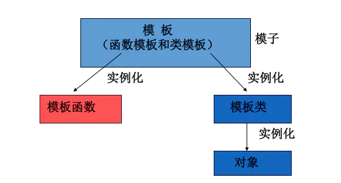

# 模板与泛型

泛型编程是指独立与任何类型的方式编写代码。``泛型编程和面向对象编程，都依赖与某种形式的多态。面向对象编程的多态性在运行时应用于存在继承关系的类，一段代码可以可以忽略基类和派生类之间的差异。在泛型编程中，编写的代码可以用作多种类型的对象。面向对象编程所依赖的多态性称为运行时多态性，泛型编程所依赖的多态性称为编译时多态性或参数式多态性。 ``

模板是泛型编程的基础。模板是创建类或者函数的公式。

模板是一种对类型进行参数化的工具，有两种形式：**函数模板**和**类模板**。

+ 函数模板	针对仅参数类型不同的函数
+ 类模板        针对仅数据成员和成员函数类型不同的类
  + 函数模板和模板函数
  + 类模板和模板类



> 怎么叫都行,不要纠结

### 为什么要使用模板?

> 假如设计一个两个参数的函数,用来求两个对象的和,在实践中我们可能需要定义n多个函数

```cpp
int sum(int a,int b){return a+b;}
char sum(char a,char b){return a+b;}
float sum(float a,float b){return a+b;}
...
```

这些函数几乎相同,唯一的区别就是形参类型不同,在这种情况下,不必定义多个函数,只需要在模板中定义一次即可。在调用哦函数时系统会根据实参的类型来取代模板中的虚拟类型，从而实现不同的函数功能。


### 函数模板

#### **定义格式**

```cpp
template<typename Type>
Type funName(Type val)
{
    //Code
}
```

+ 模板形参表使用typename或者class定义都可以，没有任何区别，为了区分类的定义，一般使用typename

```cpp
//对于任意类型的两个对象相加，的函数模板
template<typename T>
T sum(T a,T b)
{
    return a+b;
}
```

#### 函数模板调用

对于函数模板，有两种调用方式

+ 显示类型调用     ```需要在函数调用处的函数名后面加上类型参数``
  + sum<int>(2,4);
+ 自动类型推导     ``根据参数的类型进行推导，但是两个参数的类型必须一致，否则会报错。``
  + sum('a','c');

那么需要传两个不一样的参数要怎么做呢？写两个模板类型即可

```cpp
template <typename T,typename U>
auto sum(T a,U b)
{
    return a+b;
}
```

##### 函数模板和普通函数

函数模板：不提供隐式类型转换，必须是严格匹配

普通你数：提供隐式类型转换

```cpp
template<typename T>
void sum(T a,T b)
{
    cout<<"模板函数"<<a+b<<endl;
}
show('A',65);		//“void showSum(T,T)”: 未能从“char”为“T”推导 模板 参数
show<int>('A',65);	//显示指定模板类型后，‘A’可以转换到int
```


**函数模板和普通函数构成重载时，调用规则**

```cpp
template<typename T>
void sum(T a,T b)
{
    cout<<"模板函数(2)"<<a+b<<endl;
}
template<typename T>
void sum(T a,T b,T c)
{
    cout<<"模板函数(3)"<<a+b+c<<endl;
}
void sum(int a,int c)
{
    cout<<"普通函数"<<a+c<<endl;
}
void Test()
{
    sum(1,2);			//当函数模板和普通函数参数都符合时，优先选择普通函数
    sum<>(1,2);			//若显示使用模板函数，则使用<>类型列表
    sum(3.0,4.2);		//如果函数模板产生更好的匹配，则使用函数模板
    sum(5.0,6.5,8.2);	//只有一个合适
    sum('a',12);		//调用普通函数，可以隐式类型转换
    
}
```


### 编译模型

##### **一，传统的编译模型**

使用C/C++进行编程时，一般会使用头文件以使定义和声明分离，并使得程序以模块方式组织。将函数声明、类的定义放在头文件中，而将函数实现以及类成员函数的定义放在独立的文件中。

但是对于模板来说，这种方式是行不通的，具体的例子如下：

``首先是包含模板声明的头文件test.h``

```cpp
#ifndef __TEST_H_
#define __TEST_H_
template<typename T>
void show(T t);

class Test
{
public:
	template<typename T>
	void display();
};

#endif
```

``然后是包含模板声明的源文件test.cpp``

```cpp
#include"test.h"
#include<iostream>
using namespace std;
template<typename T>
void show(T t)
{
	cout << t << endl;
}

template<typename T>
void Test::display()
{
	cout << "display" << endl;
}
```

``下面是主函数文件main.cpp``

```cpp
#include<iostream>
using namespace std;
#include"test.h"

int main()
{
	show(5);
	Test t;
	t.display<int>();

	return 0;
}

```

编译时是没有问题的，但是在链接时，会报错

```cpp
1>源.obj : error LNK2019: 无法解析的外部符号 "void __cdecl show<int>(int)" (??$show@H@@YAXH@Z)，函数 _main 中引用了该符号
1>源.obj : error LNK2019: 无法解析的外部符号 "public: void __thiscall Test::display<int>(void)" (??$display@H@Test@@QAEXXZ)，函数 _main 中引用了该符号
1>F:\MyCode\VsCode\C++test\Debug\C++test.exe : fatal error LNK1120: 2 个无法解析的外部命令
```

报错原因如下：

​     当源码文件main.cpp中涉及到模板函数的调用时，因为模板函数的定义在另一个源码文件test.cpp中，编译器目前仅仅知道它们的声明。所以，在main.cpp中调用到的的show<int>函数，以及void Test::display()函数，编译器认为这些函数的实现是在其他源码文件中的，编译器不会报错，因为连接器会最终将所有的二进制文件进行连接，从而完成符号查找，形成一个可执行文件。

​     尽管编译器也编译了包含模板定义的源码文件test.cpp，但是该文件仅仅是模板的定义，而并没有真正的实例化出具体的函数来。因此在链接阶段，编译器进行符号查找时，发现源码文件中的符号，在所有二进制文件中都找不到相关的定义，因此就报错了。

##### 二，**模板的编译模型**

编译器并不是把模板编译成一个可以处理任何类型的单一实体；而是如果调用了模板的时候，编译器才产生特定类型的模板实例。

一般而言，当调用函数的时候，编译器只需要看到函数的声明。类似地，定义类类型的对象时，类定义必须可用，但成员函数的定义不是必须存在的。因此，应该将类定义和函数声明放在头文件中，而普通函数和类成员函数的定义放在源文件中。

  模板则不同：要进行实例化，编译器必须能够访问定义模板的源代码。当调用函数模板或类模板的成员函数的时候，编译器需要函数定义，需要那些通常放在源文件中的代码。

 

标准 C++ 为编译模板代码定义了两种模型。分别是包含编译模型和分别编译模型。

所谓包含编译模型，说白了，就是将函数模板的定义放在头文件中。因此，对于上面的例子，就是将test.cpp的内容都放到test.h中。

为了区分，申明和定义放在一起的文件可以取名叫做.hpp

​     **所以，结论就是，把模板的定义和实现都放到头文件中。**

​     

### 类模板

类模板与函数模板的定义和使用类似。 有时，有两个或多个类，其功能是相同的，仅仅是数据类型不同，如下面语句声明了一个类：

```cpp
//模板的参数类型定义写在类的定义之前，在类里的任意位置都可以使用
template<typename T>
class Display
{
public:
	Display(T val) :_value(val){}
	void display()
	{
		cout << _value << endl;
	}
private:
	T _value;
};
```

+ 类模板用于实现类所需数据的类型参数化 
+ 类模板在表示如数组、表、图等数据结构显得特别重要，这些数据结构的表示和算法不受所包含的元素类型的影响(STL)

##### **单个类模板语法**

定义一个类模板非常简单，重要的是如何去用类模板定义对象~

+ 如果没有指定模板的参数列表，编译器是会报错的

```cpp
Display d(20);			//error C2955: “Display”: 使用 类 模板 需要 模板 参数列表
```

+ 指定参数列表只需要在类名的后面加上<类型>即可

```cpp
Display<string> d("maye");
Display<string> d1(string("hello"));
```

类模板不代表一个具体的、实际的类，而代表一类类。实际上,类模板的使用就是将类模板实例化成一个具体的类
只有那些被调用的成员函数，才会产生这些函数的实例化代码。对于类模板，成员函数只有在被使用的时候才会被实例化。显然，这样可以节省空间和时间；

如果类模板中含有静态成员，那么用来实例化的每种类型，都会实例化这些静态成员。

**来个示例**

```cpp
#include<iostream>
#include<string>
using namespace std;

template<typename T>
class Array
{
public:
	Array(int size) 
		:_capacity(size),_size(0),_base(nullptr)
	{
		if (_capacity == 0)
			_capacity = 1;
		_base = new T[_capacity]{T()};
	}
	T& operator[](int index)
	{
		if (index < 0 || index >= _capacity)
		{
			//return T(); //不能返回临时对象的引用，对于int() 是一个0
			throw std::out_of_range("Array 越界啦");	//抛异常是最合适的
		}
		return _base[index];
	}
private:
	T* _base;
	int _size;
	int _capacity;
};
int main()
{
	Array<int> arr(10);
	for (size_t i = 0; i < 10; i++)
	{
		cout << arr[i] << " ";
	}
	cout << endl;
	Array<string> arr1(10);
	arr1[0] = string("maye");
	for (size_t i = 0; i < 10; i++)
	{
		cout << arr1[i] << " ";
	}
	return 0;
}
```

##### 继承中的类模板——类模板派生普通类

子类从模板类继承的时候,需要让编译器知道，父类的数据类型具体是什么(数据类型的本质:如何分配内存空间)

```cpp
template<typename T>
class Display
{
public:
	Display(T val) :_value(val){}
	void display()
	{
		cout << _value << endl;
	}
protected:
	T _value;
};
class A:public Display<int>	//指定具体类型
{
public:
	using Display<int>::Display;
	void show()
	{
		cout << "A" <<" "<<_value<< endl;
	}
};
```

##### 继承中的类模板——类模板派生模板类

```cpp
template<typename T>
class Display
{
public:
	Display(T val) :_value(val){}
	void display()
	{
		cout << _value << endl;
	}
protected:
	T _value;
};
template<typename U>
class A:public Display<U>
{
public:
	using Display<U>::Display;
	void show()
	{
		cout << "A" <<" "<<_value<< endl;
	}
};
```

代码看起来没有问题，但是在子类中使用父类的成员，会提示找不到标识符

```cpp
void show()
{
	cout << "A" <<" "<<_value<< endl;		//error C2065: “_value”: 未声明的标识符
}
```

**解决办法**
	1，通过this指针访问：this->_value
    2，通过父类访问：	 Display<U>::\_value  

**为什么会这样？**
this有类型Display<T>，依赖的类型T。所以this有依赖类型。所以需要this->\_value做\_value一个从属名称。

### 模板特化

提到特化这个概念，就想到泛化的概念。模板函数的T参数只能传入类类型的参数；特化函数的参数只能传入对应的参数类型。

##### 函数模板特化

假设有一个比较两个对象的模板函数

```cpp
template<typename T>
int compare(T a, T b)
{
	cout << "T" << endl;
	return a == b ? 0 : (a > b ? 1 : -1);
}
```

对于支持operator== 和 operator>操作的类型， 包括基本的int，float，double等类型，是完全没有问题的，但是它不能用来比较字符串(char*)，因为这个函数比较的是串指针，而不是字符串本身。

```cpp
cout << compare("A", "a") << endl;	//类型是const char*，比较的是地址,需要做特化版本才能比较
```

特化版本:

```cpp
template<>	//必须写，不然就是重载函数，而不是函数模板，特化版本了
int compare(const char* str1, const char* str2)
{
	cout << "const char *" << endl;
	return strcmp(str1, str2);
}
```

这样，就能正确比较字符串了，前面提到过，特化版本和普通版本的函数是可以实现重载的，并且优先匹配普通函数。

那么将这个特化放在何处？显然是要放在模板的头文件中。但这样会导致符号多重定义的错误。原因很明显，模板特化是一个函数，而非模板。

```cpp
//test.h
#pragma once
#include<iostream>
using namespace std;

template<typename T>
int compare(T a, T b)
{
	cout << "T" << endl;
	return a == b ? 0 : (a > b ? 1 : -1);
}
template<>
int compare(const char* str1, const char* str2)
{
	cout << "特化 const char *" << endl;
	return strcmp(str1, str2);
}
```

```cpp
//maye.cpp
#include"test.h"
```

```cpp
//main.cpp
int main()
{
   cout << compare("A", "a") << endl;
   //compare<char const *>(char const *,char const *)" 已经在 main2.obj 中定义
   return 0;
}
```

没有理由不在头文件中定义函数——但是一旦这样做了，那么便无法在多个文件中 #include 该头文件。肯定会有链接错误。怎么办呢？

函数模板特化即函数，而非模板的概念，完全与普通函数一样；加上inline关键字或者分文件实现都是可以的。

```cpp
template<>
inline int compare(const char* str1, const char* str2)
{
	cout << "特化 const char *" << endl;
	return strcmp(str1, str2);
}
```

因为编译器直接扩展内联函数，不产生外部符号，在多个模块中 #include 它们没有什么问题。链接器不会出错，因为不存在多重定义的符号。对于像 compare 这样的小函数来说，inline 怎么说都是你想要的（它更快）。

　　但是，如果你的特化函数很长，或出于某种原因，你不想让它成为 inline，那要如何做呢？声明和实现分开即可

```cpp
//test.h
template<>
int compare(const char* str1, const char* str2);
//test.cpp
template<>
int compare(const char* str1, const char* str2)
{
	cout << "特化 const char *" << endl;
	return strcmp(str1, str2);
}
```


##### 类模板特化

全特化：所有类型模板参数都用具体类型代表，特化版本模板参数列表为空 template<>

```cpp
template<typename T,typename U>
struct Test
{
    void show()
    {
        cout<<"非特化版本"<<endl;
    }
};
//全特化版本
template<>
struct Test<int,int>
{
    void show()
    {
        cout<<"int,int特化版本"<<endl;
    }
};
//特化版本可以有任意多个
template<>
struct Test<double,string>
{
    void show()
    {
        cout<<"double,string特化版本"<<endl;
    }
};
//测试
int main()
{
    Test<int,int> t;
    t.show();					//int,int特化版本
    Test<double, string> t1;	
    t1.show();					//double,string特化版本
    Test<char, char> t2;
    t2.show();					//非特化版本
    
    return 0;
}
```


局部特化(偏特化)：指定一部分模板参数用具体类型代替

+ 从模板参数数量上
+ 从模板参数范围上(int -> int&)

```cpp
//从模板参数数量上
template<typename T,typename U>
struct Test
{
    void show()
    {
        cout<<"非特化版本"<<endl;
    }
};
//局部特化
template<typename U>
struct Test<int,U>
{
    void show()
    {
        cout<<"非特化版本"<<endl;
    }
};
//测试
int main()
{
    Test<int,string> tt;
    tt.show();				//局部特化版本
    return 0;
}
```


```cpp
//从模板参数范围上
template<typename T>
struct Test
{
    void show()
    {
        cout<<"非特化版本"<<endl;
    }
};
//const T
template<typename T>
struct Test<T&>
{
    void show()
    {
        cout<<"T&特化版本"<<endl;
    }
};
//T*
template<typename T>
struct Test<T*>
{
    void show()
    {
        cout<<"T*特化版本"<<endl;
    }
};
//测试
int main()
{
    Test<int> t;
    t.show();			//非特化版本
    Test<int*> t1;
    t1.show();			//T*特化版本
    Test<int&> t2;
    t2.show();			//T&特化版本
    return 0;
}
```


