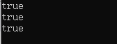

# 模板

上节课咱们已经学习了函数模板和类模板，加下来学习另外三个模板。

+ **别名模板(C++11):**
+ **变量模板(C++14):**
+ **约束与概念(C++20):**

## 非类型模板参数

模板参数并不局限于定义类型，可以使用编译器**内置类型**作为参数，在编译期间变成模板的特定常量。我们甚至可以对这些参数使用默认值。

**示例：**

编写一个封装了静态数组的类，类名为Array

```cpp
template<typename T,size_t _size=10>
class Array
{
public:
	T& operator[](int index)
	{
		return _arr[index];
	}
	size_t size()const
	{
		return _size;
	}
private:
	T _arr[_size]{0};
};

int main()
{
	Array<int,5> arr;
	arr[0] = 2;
	arr[1] = 3;

	for (size_t i = 0; i < arr.size(); i++)
	{
		std::cout << arr[i] << " ";
	}

	return 0;
}
```

可以看到模板定义了两个模板参数，第一个是类型为T，第二个是用size_t 定义的_size，并给了一个默认值。


## 别名模板

我们在写程序的过程中，总是希望写简短的代码，给一些复杂的名称简化，或者取一个简短的名字，于是又有了类型别名，用来重新定义复杂的名字。

不管是模板还是非模板都需要类型别名，可以使用`typedef`为模板具体化指定别名.

```cpp
//模板别名
//1，typedef
typedef Array<int, 20> IntArr;

//2，using
using _IntArr = Array<int, 20>;
```

如果你经常编写类似于上面typedef的代码，如果代码量过大的话，你可能会忘记能是什么意思，这样的话就不能叫做简化代码了，直接就是给自己找麻烦。而且typdef定义不了别名模板，所以C++11新增了一项功能——使用模板提供一系列别名（模板别名），例如：

```cpp
//别名模板
//1，typedef
//template<typename T>
//typedef Array<T, 10> BigArray;	//error C2823: typedef 模板 非法

//2，using
template<typename T>
using BigArray =  Array<T, 128>;
```

这样定义好之后，使用BigArray就相当于使用Array<T,128>。

## 变量模板(C++14)

变量模板定义一族变量或静态数据成员。

### 定义格式

```cpp
template<typename T>
T name = value;
```

+ name：变量名
+ value：初始值

### 解释

从变量模板实例化的变量被称为`被实例化变量`，从静态数据成员模板实例化的变量被称为`被实例化静态数据成员`。

```cpp
template<typename T>
constexpr T PI = T(3.14159265358L);

template<typename T>
T circle_area(T r)
{
	return PI<T> *r * r;	//PI<是变量模板实例化>
}
```

首先声明了一个变量模板PI，在后面就可以使用各种类型的PI了(如：PI<float>、PI<double>、PI<int>等等)，非常方便。

值得注意的是，在声明变量模板T的前面，加上了`constexpr`关键字，这个关键字和`const`类似，最大的区别就是：const 定义的常量也可能不是常量，但是用constexpr定义的一定是常量。

```cpp
int sum = 10;
const int csum = sum;	
```

此处的csum就不是一个常量，因为他必须在程序运行期间才能确定值，因为sum在运行期间才有值，而他有依赖sum。

```cpp
constexpr int s = sum;
```

而使用`constexpr`声明，则会报错`error C2131: 表达式的计算结果不是常数`，所以constexpr，只能声明真常量。

这只是用在定义变量中，如果把`constexpr`写在函数前面，则表示这个函数是返回的一个常量，编译器可以大胆的优化。

```cpp
uint8_t CharMax()
{
	return 127;
}
```

定义一个获取char类型最大值的函数。

```cpp
int max1 = CharMax();
```

定义一个int类型对象，用于接受CharMax的返回值，完全没问题。

```cpp
const int max2 = CharMax();
```

定义一个const int类型对象，用于接受CharMax的返回值，完全没问题；只是max2后续不能被修改。

```cpp
constexpr int max3 = CharMax();
```

定义一个constexpr int类型的对象，会发现直接报错`error C2131: 表达式的计算结果不是常数`，就算你给CharMax的返回类型加上const也没用。

这个时候就必须把函数声明为`constexpr `了，这样编译器就会大胆优化，只要是出现CharMax()的地方，直接用127替代，是不是和宏很类似？确实，但是宏没有运行时安全检查。

> 注意:constexpr声明的函数，函数体不要写的太复杂

```cpp
constexpr uint8_t CharMax()
{
	int max = 117;
	for (int i = 0; i < 10; i++)
	{
		++max;
	}
	return max;
}
```

这样写也是可以滴！这个代码是编译时编译器计算出来的，而不是运行时。

在类作用域中使用时，变量模板声明一个静态数据成员模板。与其他静态成员一样，静态数据成员模板的需要一个定义。这种定义可以在类定义外提供：

+ 静态数据 成员模板

```cpp
struct Limits
{
	template<typename T>
	static const T  max;
};
template<typename T>
const T Limits::max = {};
```

+ 类模板的非静态数据成员

```cpp
template<typename T>
struct Foo
{
	static const T  foo;
};
template<typename T>
const T Foo<T>::foo = {};
```

其实如果静态变量声明的是const，并且有初始值，那么可以不用在内外定义，会自动内联。

```cpp
class Test
{
public:
	static const int count = 0;
};
cout << Test::count << endl;	//可以直接使用
```

### 注解

在 C++14 引入变量模板前，参数化变量通常实现为类模板的静态数据成员，或返回所需值的 constexpr 函数模板。

```cpp
//1，使用变量模板
template<typename T>
constexpr T PI = T(3.14159265358);

//2，使用函数模板
template<typename T>
constexpr T getPI()
{
	return T(3.14159265358);
}

//3，使用类模板
template<typename T>
struct Math
{	
	static constexpr T PI = T(3.14159265358);
};

int main()
{
	cout << PI<int> << " "<<PI<float> << endl;
	cout << getPI<int>() << " " << getPI<float>() << endl;
	cout << Math<int>::PI << " " << Math<float>::PI << endl;
	return 0;
}
```

## 类型萃取

[类型萃取](https://zh.cppreference.com/w/cpp/meta#.E7.B1.BB.E5.9E.8B.E7.89.B9.E6.80.A7)，可简单理解为类型获取。对不同类型对象进行不同处理,可以提升程序效率。也就是我根据你传递过来的类型，我再决定调用那种方法。

### is_pod

萃取的典型应用是在模板函数中区分T的类型是原生类型POD，还是自定义类型，POD全称plain old data，简单理解就是C++从C继承来的基本数据类型，如int、double等。

之所以需要区分类型，主要是因为POD类型与自定义类型的很多处理方法不同，典型的就是copy，POD可以直接使用C库提供的memcpy，它主要是实现内存层面的拷贝，而非POD类型需要使用for循环挨个拷贝，因为涉及到深拷贝与浅拷贝的问题，所以在模板中需要识别数据类型，再做不同处理。

如以下代码，用来判断int类型是不是POD类型，有三种使用方式：

```cpp
cout << std::boolalpha << is_pod<int>::value << endl;	//获取静态成员
cout << std::boolalpha << is_pod<int>() << endl;		//类型转换函数
cout << std::boolalpha << is_pod<int>()() << endl;		//operaotr()函数
```

输出结果：



int确实是POD类型。

### 基础类型

#### is_void

检查 `T` 是否为 void 类型。若 `T` 是类型 void 、 const void 、 volatile void 或 const volatile void ，则提供等于 true 的成员常量 `value`。否则， `value` 等于 false 。

```cpp
template<typename T>
void show()
{
	static_assert(!is_void_v<T>, "type canot is VOID");
	cout << "hello" << endl;
}
show<int>();	//编译通过
show<int>();	//编译失败
```

## std::initializer_list

为了编写能够处理不同数量实参（但是类型相同），C++11新标准提供了std::initializer_list的方法。

+ 普通函数使用

```cpp
void showMsg(const std::initializer_list<std::string>& list)
{
	for (auto& n : list)
	{
		cout << n << " ";
	}
	cout << endl;
}
showMsg({ "hello","world","嘿嘿"});
```

+ 构造函数使用

```cpp
template<typename T,size_t _size>
class Array
{
public:
	Array() {}
	Array(const std::initializer_list<T>& list) 
	{
		size_t i = 0;
		for (auto& v : list)
		{
			_arr[i++] = v;
		}
	}
	constexpr size_t size()const { return _size; }
	T& operator[](int index)
	{
		return _arr[index];
	}
	T _arr[_size]{ T() };
};

Array<int, 10> arr = { 1,2,3,4,5,6 };
for (int i = 0; i < arr.size(); i++)
{
	cout << arr[i] << " ";
}
```

前面我们使用数组时，能直接使用聚合初始化参数列表的方式，指定多个初始值，非常方便！现在有了`std::initializer_list`我们也可以让我们的类支持这种方式了！欧耶~

