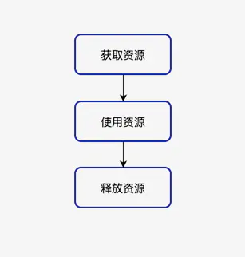
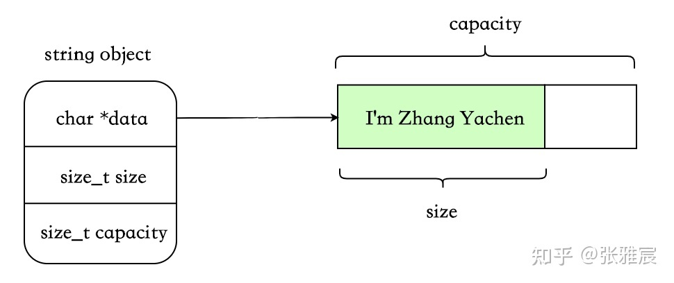
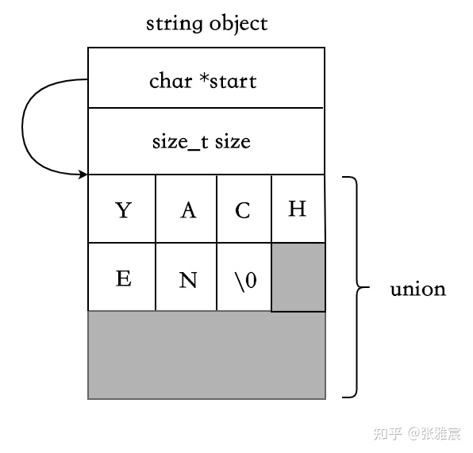
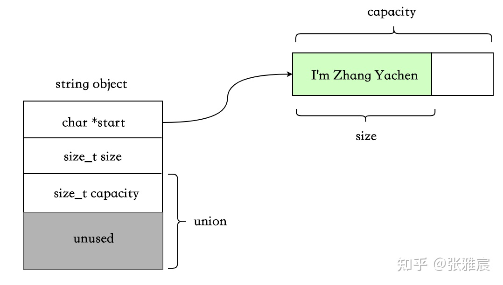
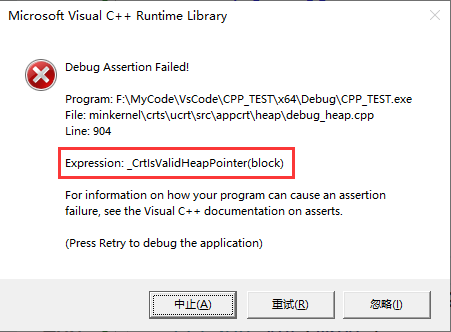
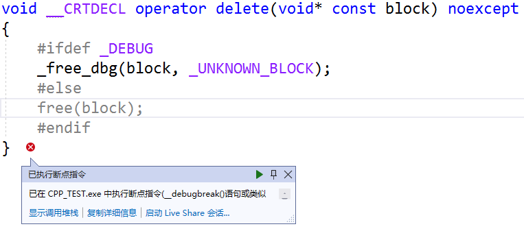

## 1. RAII

### 什么是RAII

RAII （Resource Acquisition Is Initialization）,也称为“资源获取就是初始化”，是**C++语言的一种管理资源、避免泄漏的惯用法**。C++标准保证任何情况下，已构造的对象最终会销毁，即它的析构函数最终会被调用。简单的说，RAII 的做法是使用一个对象，在其构造时获取资源，在对象生命期控制对资源的访问使之始终保持有效，最后在对象析构的时候释放资源。

RAII是C++的发明者Bjarne Stroustrup提出的概念，“资源获取即初始化”也就是说**在构造函数中申请分配资源，在析构函数中释放资源**。因为C++的语言机制保证了，当一个对象创建的时候，自动调用构造函数，当对象超出作用域的时候会自动调用析构函数。所以，在RAII的指导下，我们应该使用类来管理资源，将资源和对象的生命周期绑定。

RAII技术被认为是C++中管理资源的最佳方法，进一步引申，使用RAII技术也可以实现安全、简洁的状态管理，编写出优雅的异常安全的代码。它利用栈对象在离开作用域后自动析构的语言特点，将受限资源的生命周期绑定到该对象上，当对象析构时以达到自动释放资源的目的。

> 简单而言RAII就是指资源在我们拿到时就已经初始化，一旦不在需要该资源就可以自动释放该资源。
>
> 　　对于C++来说，资源在构造函数中初始化（可以再构造函数中调用单独的初始化函数），在析构函数中释放或清理。常见的情形就是在函数调用中创建C++对象时分配资源，在C++对象出了作用域时将其自动清理和释放（不管这个对象是如何出作用域的，不管是否因为某个中间步骤不满足条件而导致提前返回，也不管是否正常走完全部流程后返回）。

### 资源管理问题

　什么是资源呢？在计算机系统中，资源是数量有限且对系统正常运行具有一定作用的元素。比如堆上分配的内存、文件句柄、线程、数据库连接、网络连接、网络套接字、互斥锁和内存等等，它们属于系统资源。由于系统的资源是有限的，就好比自然界的石油，铁矿一样，不是取之不尽，用之不竭的，所以，我们在编程使用系统资源时，都必须遵循一个步骤：获取资源--->使用资源--->释放资源

　　操作系统的资源是有限的，当我们向操作系统索取资源，使用完后应即时归还给操作系统，这是一个良好的编程习惯，资源获取操作流程如下图：



内存只是资源的一种，在这里我们讨论一下更加广义的资源管理。比如说文件的打开与关闭、windows中句柄的获取与释放等等。按照常规的RAII技术需要写一堆管理它们的类，有的时候显得比较麻烦。但是如果手动释放，通常还要考虑各种异常处理，比如说：

+ 每当处理需要配对的获取/释放函数调用的资源时，都应该将资源封装在一个对象中，实现自动资源释放。

智能指针（std::shared_ptr和std::unique_ptr）即RAII最具代表的实现，使用智能指针，可以实现自动的内存管理，再也不需要担心忘记delete造成的内存泄漏。毫不夸张的来讲，有了智能指针，代码中几乎不需要再出现delete了。

```cpp
#include <iostream> 
 
using namespace std; 
 
int main() 
{ 
    int *testArray = new int [10]; 
    // Here, you can use the array 
    delete [] testArray; 
    testArray = NULL ; 
    return 0; 
}
```

上述例子简单，但是如果程序很复杂的时候，需要为所有的new 分配的内存delete掉，导致极度臃肿，效率下降，更可怕的是，程序的可理解性和可维护性明显降低了，当操作增多时，处理资源释放的代码就会越来越多，越来越乱。如果某一个操作发生了异常而导致释放资源的语句没有被调用，怎么办？这个时候，RAII机制就可以派上用场了。

再来一个例子：

```cpp
#include <iostream> 
using namespace std; 
 
bool OperationA(); 
bool OperationB(); 
 
int main() 
{ 
    int *testArray = new int [10]; 
 
    // Here, you can use the array 
    if (!OperationA()) 
    { 
        // If the operation A failed, we should delete the memory 
        delete [] testArray; 
        testArray = NULL ; 
        return 0; 
    } 
 
    if (!OperationB()) 
    { 
        // If the operation A failed, we should delete the memory 
        delete [] testArray; 
        testArray = NULL ; 
        return 0; 
    } 
 
    // All the operation succeed, delete the memory 
    delete [] testArray; 
    testArray = NULL ; 
    return 0; 
} 
 
bool OperationA() 
{ 
    /*Do some operation, if the operate succeed, then return true, else return false */ 
    return false ; 
} 
 
bool OperationB() 
{ 
    /*Do some operation, if the operate succeed, then return true, else return false*/
    return true ; 
}
```

上述这个例子的模型，在实际中是经常使用的，我们不能期待每个操作都是成功返回的，所以，每一个操作，我们需要做出判断，上述例子中，当操作失败时，然后，释放内存，返回程序。上述的代码，极度臃肿，效率下降，更可怕的是，程序的可理解性和可维护性明显降低了，当操作增多时，处理资源释放的代码就会越来越多，越来越乱。如果某一个操作发生了异常而导致释放资源的语句没有被调用，怎么办？这个时候，RAII机制就可以派上用场了。

### 如何使用RAII

当我们在一个函数内部使用局部变量，当退出了这个局部变量的作用域时，这个变量也就别销毁了；当这个变量是类对象时，这个时候，就会自动调用这个类的析构函数，而这一切都是自动发生的，不要程序员显示的去调用完成。这个也太好了，RAII就是这样去完成的。

由于系统的资源不具有自动释放的功能，而C++中的类具有自动调用析构函数的功能。如果把资源用类进行封装起来，对资源操作都封装在类的内部，在析构函数中进行释放资源。当定义的局部变量的生命结束时，它的析构函数就会自动的被调用，如此，就不用程序员显示的去调用释放资源的操作了。现在，我们就用RAII机制来完成上面的例子。代码如下：

```cpp
#include <iostream> 
using namespace std; 
 
class ArrayOperation 
{ 
public : 
    ArrayOperation() 
    { 
        m_Array = new int [10]; 
    } 
 
    void InitArray() 
    { 
        for (int i = 0; i < 10; ++i) 
        { 
            *(m_Array + i) = i; 
        } 
    } 
 
    void ShowArray() 
    { 
        for (int i = 0; i <10; ++i) 
        { 
            cout<<m_Array[i]<<endl; 
        } 
    } 
 
    ~ArrayOperation() 
    { 
        cout<< "~ArrayOperation is called" <<endl; 
        if (m_Array != NULL ) 
        { 
            delete[] m_Array;
            m_Array = NULL ; 
        } 
    } 
 
private : 
    int *m_Array; 
}; 
 
bool OperationA(); 
bool OperationB(); 
 
int main() 
{ 
    ArrayOperation arrayOp; 
    arrayOp.InitArray(); 
    arrayOp.ShowArray(); 
    return 0;
}
```

上面这个例子没有多大的实际意义，只是为了说明RAII的机制问题。下面说一个具有实际意义的例子：

```cpp
#include <iostream>
#include <windows.h>
#include <process.h>
 
using namespace std;
 
CRITICAL_SECTION cs;
int gGlobal = 0;
 
class MyLock
{
public:
    MyLock()
    {
        EnterCriticalSection(&cs);
    }
 
    ~MyLock()
    {
        LeaveCriticalSection(&cs);
    }
 
private:
    MyLock( const MyLock &);
    MyLock operator =(const MyLock &);
};
 
void DoComplex(MyLock &lock ) 
{
}
 
unsigned int __stdcall ThreadFun(PVOID pv) 
{
    MyLock lock;
    int *para = (int *) pv;
 
    DoComplex(lock);
 
    for (int i = 0; i < 10; ++i)
    {
        ++gGlobal;
        cout<< "Thread " <<*para<<endl;
        cout<<gGlobal<<endl;
    }
    return 0;
}
 
int main()
{
    InitializeCriticalSection(&cs);
 
    int thread1, thread2;
    thread1 = 1;
    thread2 = 2;
 
    HANDLE handle[2];
    handle[0] = ( HANDLE )_beginthreadex(NULL , 0, ThreadFun, ( void *)&thread1, 0, NULL );
    handle[1] = ( HANDLE )_beginthreadex(NULL , 0, ThreadFun, ( void *)&thread2, 0, NULL );
    WaitForMultipleObjects(2, handle, TRUE , INFINITE );
    return 0;
}
```

这个例子可以说是实际项目的一个模型，当多个进程访问临界变量时，为了不出现错误的情况，需要对临界变量进行加锁；上面的例子就是使用的Windows的临界区域实现的加锁。但是，在使用CRITICAL_SECTION时，EnterCriticalSection和LeaveCriticalSection必须成对使用，很多时候，经常会忘了调用LeaveCriticalSection，此时就会发生死锁的现象。当我将对CRITICAL_SECTION的访问封装到MyLock类中时，之后，我只需要定义一个MyLock变量，而不必手动的去显示调用LeaveCriticalSection函数。

上述两个例子都是RAII机制的应用，理解了上面的例子，就应该能理解了RAII机制的使用了。

### 总结

​    说了这么多了，RAII的本质内容是用对象代表资源，把管理资源的任务转化为管理对象的任务，将资源的获取和释放与对象的构造和析构对应起来，从而确保在对象的生存期内资源始终有效，对象销毁时资源一定会被释放。说白了，就是拥有了对象，就拥有了资源，对象在，资源则在。所以，RAII机制是进行资源管理的有力武器，C++程序员依靠RAII写出的代码不仅简洁优雅，而且做到了异常安全。在以后的编程实际中，可以使用RAII机制，让自己的代码更漂亮。


## 2. string

### string实现方式

C++中有三种方式可以实现string类型，这里的三种方式是指存储字符串的策略，分别是：

+ eager copy
+ COW（Copy-On-Write）
+ SSO（Short-String-Optimization）

string中比较重要的三个字段：

+ char \*data：指向存放字符串的首地址（在 SSO 的某些实现方案中可能没有此字段）
+ size_t size：字符串长度
+ size_t capacity：字符串容量

### eager copy

#### 解释

这个是最简单、最好理解的一种，在每次拷贝时将原 string 对应的内存以及所持有的动态资源完整地复制一份，即没有任何特殊处理。



优点：

- 实现简单。
- 每个对象互相独立，不用考虑那么多乱七八糟的场景。

缺点：

- 字符串较大时，拷贝浪费空间，浪费时间。

#### 实现代码

```cpp
class EC_String
{
public:
	~EC_String();
	EC_String() = default;
	EC_String(const char* str) ;
	EC_String(const EC_String& other) ;
	EC_String(EC_String&& other) ;
	EC_String& operator=(const EC_String& other) ;
	EC_String& operator=(EC_String&& other) ;
	friend std::ostream& operator<<(std::ostream& out, const EC_String& str);
	
	size_t max_size()const { return INT_MAX; }
	size_t size()const { return _size; }
	size_t capacity()const { return _capacity; }
private:
	size_t _size{0};
	size_t _capacity{16};
	char* _data{nullptr};
};

size_t grow_to(size_t _Count,size_t _Capacity,size_t _MaxSize)
{
	if (_Capacity < 32) {
		_Capacity = _Capacity + 16;
	}
	else {
		_Capacity = _MaxSize - _Capacity / 2 < _Capacity
			? 0 : _Capacity + _Capacity / 2;	// try to grow by 50%
	}
	if (_Capacity < _Count)
		_Capacity = _Count;

	return (_Capacity);
}

EC_String::~EC_String()
{
	if (_data)
		delete[] _data;
}

EC_String::EC_String(const char* str)
{
	_size = strlen(str);
	if(_capacity <= _size)
		_capacity = grow_to(_size + 1, _capacity, max_size());
	_data = new char[_capacity];
	strcpy_s(_data, _capacity, str);
}

EC_String::EC_String(const EC_String& other)
{
	if (_capacity <= other._size)
		_capacity = grow_to(_size + 1, _capacity, max_size());
	
	EC_String ts(other._data);
	std::swap(*this, ts);
}

EC_String::EC_String(EC_String&& other)
{
	_size = other._size;
	_capacity = other._capacity;
	_data = other._data;
	other._data = nullptr;

}

EC_String& EC_String::operator=(const EC_String& other)
{
	if (this == &other)
		return *this;

	if (_capacity <= other._size)
		_capacity = grow_to(_size + 1, _capacity, max_size());

	EC_String ts(other._data);
	std::swap(*this, ts);
	return *this;
}

EC_String& EC_String::operator=(EC_String&& other)
{
	if (this == &other)
		return *this;

	if (_data)
		delete[] _data;

	_size = other._size;
	_capacity = other._capacity;
	_data = other._data;
	other._data = nullptr;

	return *this;
}

std::ostream& operator<<(std::ostream& out, const EC_String& str)
{
	if (!str._data)
		return out;

	for (int i = 0; i < str._size; i++)
	{
		out << str._data[i];
	}
	return out;
}
```


### cow

#### 解释

这个也算是计算机里的基本思想了。不同于 eager copy 的每次拷贝都会复制，此种实现方式为写时复制，即 copy-on-write。只有在某个 string 要对共享对象进行修改时，才会真正执行拷贝。

由于存在共享机制，所以需要一个`std::atomic<size_t>`，代表被多少对象共享。


写时复制：


优点：

- 字符串空间较大时，减少了分配、复制字符串的时间。

缺点：

- refcount 需要原子操作，性能有损耗。
- 某些情况下会带来意外的开销。比如非 const 成员使用[]，这会触发 COW，因为无法知晓应用程序是否会对返回的字符做修改。典型的如**[Legality of COW std::string implementation in C++11](https://link.zhihu.com/?target=https%3A//stackoverflow.com/questions/12199710/legality-of-cow-stdstring-implementation-in-c11)**中举的例子：

```cpp
std::string s("str");
const char* p = s.data();
{
    std::string s2(s);
    (void) s[0];         // 触发COW
}
std::cout << *p << '\n';      // p指向的原有空间已经无效
```

- 其他更细节的缺点可以参考：**[std::string 的 Copy-on-Write：不如想象中美好](https://link.zhihu.com/?target=https%3A//www.cnblogs.com/promise6522/archive/2012/03/22/2412686.html)**

#### 实现代码

```cpp
class COW_String
{
public:
	COW_String(const char* str) :_rep(new StringRep(str)) {}
	COW_String(const class COW_String& other)
	{
		_rep = other._rep;
		_rep->inc();
	}
	~COW_String() {
		if (_rep->dec() == 0)
			_rep->destroy();
	}
	char& operator[](int index)
	{
		if (_rep->useCount > 1)
		{
			_rep->dec();
			_rep = new StringRep(_rep->data);
		}
		return _rep->data[index];
	}

	char operator[](int index)const
	{
		return _rep->data[index];
	}
	friend std::ostream& operator<<(std::ostream& out, const COW_String& other)
	{
		int len = strlen(other._rep->data);
		for (int i = 0; i < len; i++)
		{
			out << other._rep->data[i];
		}
		return out;
	}
private:
	class StringRep
	{
	public:
		size_t useCount{ 1 };
		size_t size{0};
		size_t capacity{ 16 };
		char* data{nullptr};
		StringRep(const char* str)
		{
			size = strlen(str);
			capacity = size + 1;
			
			data = new char[capacity];
			strcpy_s(data, capacity, str);
		}
		~StringRep()
		{
			if(data) delete[] data;
		}
		size_t inc() { return ++useCount; }
		size_t dec() { return --useCount; }
		void destroy() { delete this; }
	};
private:
	StringRep* _rep;
};
```

https://zhuanlan.zhihu.com/p/348614098

[C++string的实现](https://blog.csdn.net/qq_53558968/article/details/118428448)

[string 扩容策略](https://blog.csdn.net/WhereIsHeroFrom/article/details/108817346)

[c++再探string之eager-copy、COW和SSO方案](http://www.javashuo.com/article/p-hmfkpwap-b.html)

### sso

#### 解释

Small String Optimization. **基于字符串大多数比较短的特点**，利用 string 对象本身的栈空间来存储短字符串。而当字符串长度大于某个临界值时，则使用 eager copy 的方式。

SSO 下，string 的数据结构会稍微复杂点，使用 union 来区分短字符串和长字符串的场景：

```cpp
class string {
  char *start;
  size_t size;
  static const int localSize = 15;
  union{
    char buffer[localSize+1];      // 满足条件时，用来存放短字符串
    size_t capacity;
  }data;
};
```

短字符串，SSO：



长字符串，eager copy：



这种数据结构的实现下，SSO 的阈值一般是 15 字节。

优点：

- 短字符串时，无动态内存分配。

缺点：

- string 对象占用空间比 eager copy 和 cow 要大。

#### 实现代码

```cpp
class SSO_String
{
public:
	SSO_String() {}
	SSO_String(const char* str) 
	{
		_size = strlen(str);
		if (_size < localSize)
		{
			_str = _buffer;		
		}
		else if (_size >= localSize)
		{
			_capacity = _size + 1;
			_str = new char[_capacity];
		}
		strcpy_s(_str, capacity(), str);
	}
	SSO_String(const SSO_String& other)
	{
		if (this == &other)
			return;

		if (!isSmall())
		{
			_capacity = other._capacity;
			_size = other._size;
			_str = new char[_capacity];
			strcpy_s(_str, _capacity, other._str);
		}
	}
	~SSO_String()
	{
		if (!isSmall())
		{
			delete[] _str;
		}
	}
	size_t capacity() const
	{
		if (isSmall())
			return localSize;
		else
			return _capacity;
	}
	friend std::ostream& operator<<(std::ostream& out, const SSO_String& other)
	{
		for (int i = 0; i < other._size; i++)
		{
			out << other._str[i];
		}
		return out;
	}
private:
	//是否是短字符串
	bool isSmall()const { return _size < localSize; }
private:
	char* _str{ nullptr };
	size_t _size{ 0 };

	static const size_t localSize = 16;
	union
	{
		size_t _capacity{ 0 };
		char _buffer[localSize];
	};
};
```


## 3. Copy And Swap

Copy And Swap，也称为"拷贝交换技术"。

任何管理某资源的类比如智能指针需要遵循一个规则[（The Rule of Three）](#4. The Rule of Three)：如果你需要显式地声明一下三者中的一个：析构函数、拷贝构造函数或者是拷贝赋值操作符，那么你需要显式的声明所有这三者。

拷贝构造函数和析构函数实现起来比较容易，但是拷贝赋值操作符要复杂许多。它是怎么实现的？我们需要避免那些误区？

那么Copy And Swap就是完美的解决方案。而且可以很好地帮助拷贝赋值操作符达到两个目标：避免代码重复、提供强烈的异常安全保证。

### 传统实现的问题

我们在The Rule of Three中实现的代码，会有如下三个问题。

#### 1. 需要进行自我赋值判别

```cpp
if (this != &other)
```

这个判别有两个目的：是一个阻止冗余代码的一个简单的方法；可以防止出现bug（删除数组接着又进行复制操作）。在其他时候不会有什么问题，只是使得程序变慢了。自我赋值在程序中比较少见，所以大部分情况下这个判别是多余的。这样，如果没有这个判别也能够正常工作就更好了

#### 2. 只提供了基本异常安全保证

如果new char[len]失败，那么*this就被修改了（数组大小是错误的，数组也丢失了）。为了提供强烈保证，需要这样做：

```cpp
Person& operator=(const Person& other)
{
	if (this != &other)
	{
		char* temp = name;		//先保存，不要释放
		int len = strlen(other.name) + 1;
		name = new char[len];
		delete[] temp;			//如果new成功了，再释放
		strcpy_s(name, len, other.name);
	}
	return *this;
}
```

但是这样做就导致了另外一个问题，就是代码冗余！

#### 3.代码冗余

核心代码只有两行即分配空间和拷贝。如果要实现比较复杂的资源管理，那么代码的膨胀将会导致非常严重的问题。

### 成功的解决方案

#### Copy-And-Swap实现

就像前面所提到的，Copy-And-Swap可以解决所有这些问题。但是现在，我们还需要完成另外一件事：swap函数。规则“The rule of three”指明了拷贝构造函数、赋值操作符以及析构函数的存在。其实它应该被称作是“The Big And Half”：任何时候你的类要管理一个资源，提供swap函数是有必要的。

我们需要向我们的类添加swap函数，看以下代码：

```cpp
friend void swap(Person& left, Person& right)
{
	std::swap(left.age, right.age);
	std::swap(left.name, right.name);
}
```

现在我们不仅可以交换Person，而且交换是很有效率的进行：它只是交换指针和数组大小，而不是重新分配空间和拷贝整个数组。
这样，我们可以如下实现拷贝赋值操作符：

```cpp
Person& operator=(const Person& other)
{
	Person temp(other);
	swap(*this, temp);
	return *this;
}
```

就是这样！以上提到的三个问题全部获得解决。

#### 为啥可以正常工作

首先，在赋值拷贝函数里面定义了临时的对象temp，temp拷贝自other。

然后，使用swap函数把temp和*this的值进行了交换。

最后，当函数返回时，temp的内存会释放，而*this已经发生了改变。从而实现了赋值拷贝效果。

实际上，还有一种写法，<font color='green'>**不要拷贝函数参数。你应该按值传递参数，让编译器来完成拷贝工作。**</font>

即：

```cpp
Person& operator=(Person other)
{
	swap(*this, other);
	return *this;
}
```


这种管理资源的方式解决了代码冗余的问题，我们可以用拷贝构造函数完成拷贝功能，而不用按位拷贝。拷贝功能完成后，我们就可以准备交换了。

注意到，上面一旦进入函数体，所有新数据都已经被分配、拷贝，可以使用了。这就提供了强烈的异常安全保证：如果拷贝失败，我们不会进入到函数体内，那么this指针所指向的内容也不会被改变。（在前面我们为了实施强烈保证所做的事情，现在编译器为我们做了）。

swap函数时non-throwing的。我们把旧数据和新数据交换，安全地改变我们的状态，旧数据被放进了临时对象里。这样当函数退出时候，旧数据被自动释放。

因为copy-and-swap没有代码冗余，我们不会在这个而操作符里面引入bug。我们也避免了自我赋值检测。

## 4. The Rule of Three

不同于 C 语言，在 C++ 中，我们通常会使用“类”结构，来定义和管理资源。类，可以让我们将程序逻辑和数据按照不同的角色，进行封装，进而提高代码的重用性、灵活性和扩展性。但随之而来的类对象的“隐式”拷贝，却也在不经意间充斥在整个应用程序运行的各个生命周期中。好的类结构定义，可以让应用程序通过“资源移动”等方式，使数据资源的流动和使用变得更高效。相反，不当的类结构定义反而会使应用程序，在运行过程中发生未知的资源使用问题，比如常见的内存泄漏、内存溢出、悬挂指针，以及非法的内存释放，等等。那么，为了尽可能避免出现这些问题，”The Rule of Three“ 这一套编码准则，在经过不断地实践后，便被人们总结出来了。

接下来，让我们先从 C++ 中最基础的拷贝构造函数开始，来一步步了解 “The Rule of Three” 这套编码准则所要解决的一些问题。

### 问题引出

通常来说，在大多数情况下，我们并不需要“显式”地定义类结构的拷贝构造函数与拷贝赋值函数，但前提是：只要我们能够确保没有在类的构造函数中进行堆内存的上资源分配。

看一段代码，如下所示：

```cpp
class Person
{
public:
	Person(const char* name, int age)
	{
		this->age = age;
		int len = strlen(name) +1;
		this->name = new char[len];
		strcpy_s(this->name, len, name);
	}
	~Person()
	{
		delete[] name;
	}
public:
	int age;
	char* name;
};

int main()
{
	Person maye("maye", 20);
}
```

如上述代码所示，这里我们定义了一个类 “Person”，这个类有两个数据成员，分别表示一个人的名字（name）和年龄（age）。在主函数中，我们通过这个类的构造函数，创建了一个名为 “maye” 的 “Person” 类对象。

> 注意，类 “Person” 中 “name” 成员类型为字符指针，这个指针将指向堆内存中一个字符数组的首地址。而为了构造这个在堆内存中的字符数组，我们使用 `new` 方法分配了一块用于存放字符的堆内存区域，然后再使用 `strcpy` 方法将原来位于栈内存上的字符内容，直接拷贝到了我们刚刚分配的这块内存区域中。

需要注意的是，在构造函数中，我们在堆内存上分配了相应的内存资源，而这些资源就需要在类解构时被相应地释放。因此，这里我们还需要为类编写该类所对应的析构函数，并在函数中通过`delete` ，来释放之前分配的内存资源。那么同样地，在类对象进行拷贝构造和拷贝赋值时，我们也需要进行类似的内存申请以及资源拷贝过程，**而不能直接依赖编译器默认生成的拷贝构造和拷贝赋值函数的行为**。这里我们以如下这段代码为例：

```cpp
int main()
{
	Person maye("maye", 20);
	Person yue(maye);
	return 0;
}
```

在这段代码中，我们在主函数中通过拷贝构造的方式，生成了名为 “yue” 的对象，代码的其他部分与之前一致。而当我们运行这段代码时，得到的结果是这样的，如下图所示：



调试时会出现如下结果：



那么，为什么会这样呢？其实这是由于编译器默认生成的拷贝构造函数，仅会按顺序依次拷贝目标对象各成员的值，而在这里经过拷贝后，“maye” 与 “yue” 两个对象的 “name” 成员，将指向同一块堆内存区域。当 “yue” 对象完成析构后，这段内存区域就已经被释放了。因此，当 “maye” 对象再次执行其析构函数进行内存释放时，就会出现**重复释放同一内存区域**这一问题，所以就出现了这样的错误。

### 解决办法

把拷贝构造和赋值运算符重载都实现一下，就可以解决。

```cpp
class Person
{
public:
	Person(const char* name, int age)
	{
		this->age = age;
		int len = strlen(name) +1;
		this->name = new char[len];
		strcpy_s(this->name, len, name);
	}
	Person(const Person& other) 
	{
		if (this != &other)
		{
			age = other.age;
			int len = strlen(other.name) + 1;
			name = new char[len];
			strcpy_s(name, len, other.name);
		}
	}
	Person& operator=(const Person& other)
	{
		if (this != &other)
		{
			delete[] name;
			int len = strlen(other.name) + 1;
			name = new char[len];
			strcpy_s(name, len, other.name);
		}
		return *this;
	}
	~Person()
	{
		delete[] name;
	}
public:
	int age;
	char* name;
};
```


### 总结

至此，让我们回过头来看下 “The Rule of Three” 这个编码准则的具体内容。其实很简单，它规定我们：“**如果你需要自己显式地声明一个类的析构函数，那么你可能也需要同时显式地声明它的拷贝构造函数以及拷贝赋值函数。**”由于这三种函数在大多数情况下，需要同时被定义，或者同时不被定义，因此我们称这条准则为 “The Rule of Three”。

“The Rule of Three” 这条编码准则，出现于 C++11 之前的时代，而 C++11 的出现，使得 “The Rule of Three” 被拓展成了 “The Rule of Five”。这里多出的 “2”，就分别对应于类的移动构造函数和移动赋值函数。

C++ 由于其复杂性和灵活性，导致我们在日常开发的过程中，一不留神就会编写出带有潜在风险的代码。因此，在编码过程中遵循一定的原则便显得格外重要。除此之外，也可以通过多实践、多踩坑的方式来了解常见问题可能出现的原因，学会“抓住线索、基于经验、按照顺序”的排查问题方法，是在 C++ 开发中必不可少的一项技能。