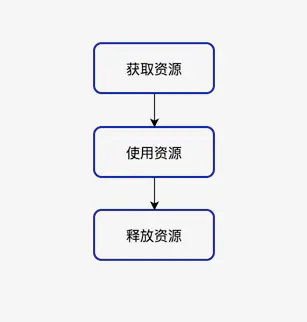
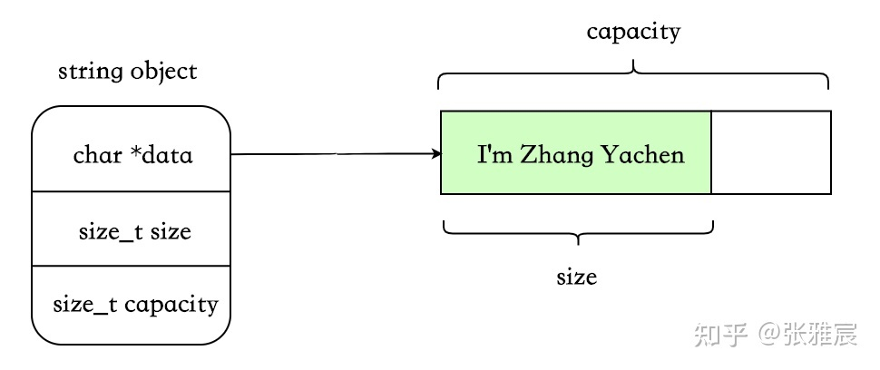

## 1. RAII

### 什么是RAII

RAII （Resource Acquisition Is Initialization）,也称为“资源获取就是初始化”，是**C++语言的一种管理资源、避免泄漏的惯用法**。C++标准保证任何情况下，已构造的对象最终会销毁，即它的析构函数最终会被调用。简单的说，RAII 的做法是使用一个对象，在其构造时获取资源，在对象生命期控制对资源的访问使之始终保持有效，最后在对象析构的时候释放资源。

RAII是C++的发明者Bjarne Stroustrup提出的概念，“资源获取即初始化”也就是说**在构造函数中申请分配资源，在析构函数中释放资源**。因为C++的语言机制保证了，当一个对象创建的时候，自动调用构造函数，当对象超出作用域的时候会自动调用析构函数。所以，在RAII的指导下，我们应该使用类来管理资源，将资源和对象的生命周期绑定。

RAII技术被认为是C++中管理资源的最佳方法，进一步引申，使用RAII技术也可以实现安全、简洁的状态管理，编写出优雅的异常安全的代码。它利用栈对象在离开作用域后自动析构的语言特点，将受限资源的生命周期绑定到该对象上，当对象析构时以达到自动释放资源的目的。

> 简单而言RAII就是指资源在我们拿到时就已经初始化，一旦不在需要该资源就可以自动释放该资源。
>
> 　　对于C++来说，资源在构造函数中初始化（可以再构造函数中调用单独的初始化函数），在析构函数中释放或清理。常见的情形就是在函数调用中创建C++对象时分配资源，在C++对象出了作用域时将其自动清理和释放（不管这个对象是如何出作用域的，不管是否因为某个中间步骤不满足条件而导致提前返回，也不管是否正常走完全部流程后返回）。

### 资源管理问题

　什么是资源呢？在计算机系统中，资源是数量有限且对系统正常运行具有一定作用的元素。比如堆上分配的内存、文件句柄、线程、数据库连接、网络连接、网络套接字、互斥锁和内存等等，它们属于系统资源。由于系统的资源是有限的，就好比自然界的石油，铁矿一样，不是取之不尽，用之不竭的，所以，我们在编程使用系统资源时，都必须遵循一个步骤：获取资源--->使用资源--->释放资源

　　操作系统的资源是有限的，当我们向操作系统索取资源，使用完后应即时归还给操作系统，这是一个良好的编程习惯，资源获取操作流程如下图：



内存只是资源的一种，在这里我们讨论一下更加广义的资源管理。比如说文件的打开与关闭、windows中句柄的获取与释放等等。按照常规的RAII技术需要写一堆管理它们的类，有的时候显得比较麻烦。但是如果手动释放，通常还要考虑各种异常处理，比如说：

+ 每当处理需要配对的获取/释放函数调用的资源时，都应该将资源封装在一个对象中，实现自动资源释放。

智能指针（std::shared_ptr和std::unique_ptr）即RAII最具代表的实现，使用智能指针，可以实现自动的内存管理，再也不需要担心忘记delete造成的内存泄漏。毫不夸张的来讲，有了智能指针，代码中几乎不需要再出现delete了。

```cpp
#include <iostream> 
 
using namespace std; 
 
int main() 
{ 
    int *testArray = new int [10]; 
    // Here, you can use the array 
    delete [] testArray; 
    testArray = NULL ; 
    return 0; 
}
```

上述例子简单，但是如果程序很复杂的时候，需要为所有的new 分配的内存delete掉，导致极度臃肿，效率下降，更可怕的是，程序的可理解性和可维护性明显降低了，当操作增多时，处理资源释放的代码就会越来越多，越来越乱。如果某一个操作发生了异常而导致释放资源的语句没有被调用，怎么办？这个时候，RAII机制就可以派上用场了。

再来一个例子：

```cpp
#include <iostream> 
using namespace std; 
 
bool OperationA(); 
bool OperationB(); 
 
int main() 
{ 
    int *testArray = new int [10]; 
 
    // Here, you can use the array 
    if (!OperationA()) 
    { 
        // If the operation A failed, we should delete the memory 
        delete [] testArray; 
        testArray = NULL ; 
        return 0; 
    } 
 
    if (!OperationB()) 
    { 
        // If the operation A failed, we should delete the memory 
        delete [] testArray; 
        testArray = NULL ; 
        return 0; 
    } 
 
    // All the operation succeed, delete the memory 
    delete [] testArray; 
    testArray = NULL ; 
    return 0; 
} 
 
bool OperationA() 
{ 
    /*Do some operation, if the operate succeed, then return true, else return false */ 
    return false ; 
} 
 
bool OperationB() 
{ 
    /*Do some operation, if the operate succeed, then return true, else return false*/
    return true ; 
}
```

上述这个例子的模型，在实际中是经常使用的，我们不能期待每个操作都是成功返回的，所以，每一个操作，我们需要做出判断，上述例子中，当操作失败时，然后，释放内存，返回程序。上述的代码，极度臃肿，效率下降，更可怕的是，程序的可理解性和可维护性明显降低了，当操作增多时，处理资源释放的代码就会越来越多，越来越乱。如果某一个操作发生了异常而导致释放资源的语句没有被调用，怎么办？这个时候，RAII机制就可以派上用场了。

### 如何使用RAII

当我们在一个函数内部使用局部变量，当退出了这个局部变量的作用域时，这个变量也就别销毁了；当这个变量是类对象时，这个时候，就会自动调用这个类的析构函数，而这一切都是自动发生的，不要程序员显示的去调用完成。这个也太好了，RAII就是这样去完成的。

由于系统的资源不具有自动释放的功能，而C++中的类具有自动调用析构函数的功能。如果把资源用类进行封装起来，对资源操作都封装在类的内部，在析构函数中进行释放资源。当定义的局部变量的生命结束时，它的析构函数就会自动的被调用，如此，就不用程序员显示的去调用释放资源的操作了。现在，我们就用RAII机制来完成上面的例子。代码如下：

```cpp
#include <iostream> 
using namespace std; 
 
class ArrayOperation 
{ 
public : 
    ArrayOperation() 
    { 
        m_Array = new int [10]; 
    } 
 
    void InitArray() 
    { 
        for (int i = 0; i < 10; ++i) 
        { 
            *(m_Array + i) = i; 
        } 
    } 
 
    void ShowArray() 
    { 
        for (int i = 0; i <10; ++i) 
        { 
            cout<<m_Array[i]<<endl; 
        } 
    } 
 
    ~ArrayOperation() 
    { 
        cout<< "~ArrayOperation is called" <<endl; 
        if (m_Array != NULL ) 
        { 
            delete[] m_Array;
            m_Array = NULL ; 
        } 
    } 
 
private : 
    int *m_Array; 
}; 
 
bool OperationA(); 
bool OperationB(); 
 
int main() 
{ 
    ArrayOperation arrayOp; 
    arrayOp.InitArray(); 
    arrayOp.ShowArray(); 
    return 0;
}
```

上面这个例子没有多大的实际意义，只是为了说明RAII的机制问题。下面说一个具有实际意义的例子：

```cpp
#include <iostream>
#include <windows.h>
#include <process.h>
 
using namespace std;
 
CRITICAL_SECTION cs;
int gGlobal = 0;
 
class MyLock
{
public:
    MyLock()
    {
        EnterCriticalSection(&cs);
    }
 
    ~MyLock()
    {
        LeaveCriticalSection(&cs);
    }
 
private:
    MyLock( const MyLock &);
    MyLock operator =(const MyLock &);
};
 
void DoComplex(MyLock &lock ) 
{
}
 
unsigned int __stdcall ThreadFun(PVOID pv) 
{
    MyLock lock;
    int *para = (int *) pv;
 
    DoComplex(lock);
 
    for (int i = 0; i < 10; ++i)
    {
        ++gGlobal;
        cout<< "Thread " <<*para<<endl;
        cout<<gGlobal<<endl;
    }
    return 0;
}
 
int main()
{
    InitializeCriticalSection(&cs);
 
    int thread1, thread2;
    thread1 = 1;
    thread2 = 2;
 
    HANDLE handle[2];
    handle[0] = ( HANDLE )_beginthreadex(NULL , 0, ThreadFun, ( void *)&thread1, 0, NULL );
    handle[1] = ( HANDLE )_beginthreadex(NULL , 0, ThreadFun, ( void *)&thread2, 0, NULL );
    WaitForMultipleObjects(2, handle, TRUE , INFINITE );
    return 0;
}
```

这个例子可以说是实际项目的一个模型，当多个进程访问临界变量时，为了不出现错误的情况，需要对临界变量进行加锁；上面的例子就是使用的Windows的临界区域实现的加锁。但是，在使用CRITICAL_SECTION时，EnterCriticalSection和LeaveCriticalSection必须成对使用，很多时候，经常会忘了调用LeaveCriticalSection，此时就会发生死锁的现象。当我将对CRITICAL_SECTION的访问封装到MyLock类中时，之后，我只需要定义一个MyLock变量，而不必手动的去显示调用LeaveCriticalSection函数。

上述两个例子都是RAII机制的应用，理解了上面的例子，就应该能理解了RAII机制的使用了。

### 总结

​    说了这么多了，RAII的本质内容是用对象代表资源，把管理资源的任务转化为管理对象的任务，将资源的获取和释放与对象的构造和析构对应起来，从而确保在对象的生存期内资源始终有效，对象销毁时资源一定会被释放。说白了，就是拥有了对象，就拥有了资源，对象在，资源则在。所以，RAII机制是进行资源管理的有力武器，C++程序员依靠RAII写出的代码不仅简洁优雅，而且做到了异常安全。在以后的编程实际中，可以使用RAII机制，让自己的代码更漂亮。


## 2. string

### string实现方式

C++中有三种方式可以实现string类型，这里的三种方式是指存储字符串的策略，分别是：

+ eager copy
+ COW（Copy-On-Write）
+ SSO（Short-String-Optimization）

string中比较重要的三个字段：

+ char \*data：指向存放字符串的首地址（在 SSO 的某些实现方案中可能没有此字段）
+ size_t size：字符串长度
+ size_t capacity：字符串容量

### eager copy

#### 解释

这个是最简单、最好理解的一种，在每次拷贝时将原 string 对应的内存以及所持有的动态资源完整地复制一份，即没有任何特殊处理。



优点：

- 实现简单。
- 每个对象互相独立，不用考虑那么多乱七八糟的场景。

缺点：

- 字符串较大时，拷贝浪费空间，浪费时间。

#### 实现代码

```cpp
class EC_String
{
public:
	~EC_String();
	EC_String() = default;
	EC_String(const char* str) ;
	EC_String(const EC_String& other) ;
	EC_String(EC_String&& other) ;
	EC_String& operator=(const EC_String& other) ;
	EC_String& operator=(EC_String&& other) ;
	friend std::ostream& operator<<(std::ostream& out, const EC_String& str);
	
	size_t max_size()const { return INT_MAX; }
	size_t size()const { return _size; }
	size_t capacity()const { return _capacity; }
private:
	size_t _size{0};
	size_t _capacity{16};
	char* _data{nullptr};
};

size_t grow_to(size_t _Count,size_t _Capacity,size_t _MaxSize)
{
	if (_Capacity < 32) {
		_Capacity = _Capacity + 16;
	}
	else {
		_Capacity = _MaxSize - _Capacity / 2 < _Capacity
			? 0 : _Capacity + _Capacity / 2;	// try to grow by 50%
	}
	if (_Capacity < _Count)
		_Capacity = _Count;

	return (_Capacity);
}

EC_String::~EC_String()
{
	if (_data)
		delete[] _data;
}

EC_String::EC_String(const char* str)
{
	_size = strlen(str);
	if(_capacity <= _size)
		_capacity = grow_to(_size + 1, _capacity, max_size());
	_data = new char[_capacity];
	strcpy_s(_data, _capacity, str);
}

EC_String::EC_String(const EC_String& other)
{
	if (_capacity <= other._size)
		_capacity = grow_to(_size + 1, _capacity, max_size());
	
	EC_String ts(other._data);
	std::swap(*this, ts);
}

EC_String::EC_String(EC_String&& other)
{
	_size = other._size;
	_capacity = other._capacity;
	_data = other._data;
	other._data = nullptr;

}

EC_String& EC_String::operator=(const EC_String& other)
{
	if (this == &other)
		return *this;

	if (_capacity <= other._size)
		_capacity = grow_to(_size + 1, _capacity, max_size());

	EC_String ts(other._data);
	std::swap(*this, ts);
	return *this;
}

EC_String& EC_String::operator=(EC_String&& other)
{
	if (this == &other)
		return *this;

	if (_data)
		delete[] _data;

	_size = other._size;
	_capacity = other._capacity;
	_data = other._data;
	other._data = nullptr;

	return *this;
}

std::ostream& operator<<(std::ostream& out, const EC_String& str)
{
	if (!str._data)
		return out;

	for (int i = 0; i < str._size; i++)
	{
		out << str._data[i];
	}
	return out;
}
```


### cow

#### 解释

这个也算是计算机里的基本思想了。不同于 eager copy 的每次拷贝都会复制，此种实现方式为写时复制，即 copy-on-write。只有在某个 string 要对共享对象进行修改时，才会真正执行拷贝。

由于存在共享机制，所以需要一个`std::atomic<size_t>`，代表被多少对象共享。


写时复制：


优点：

- 字符串空间较大时，减少了分配、复制字符串的时间。

缺点：

- refcount 需要原子操作，性能有损耗。
- 某些情况下会带来意外的开销。比如非 const 成员使用[]，这会触发 COW，因为无法知晓应用程序是否会对返回的字符做修改。典型的如**[Legality of COW std::string implementation in C++11](https://link.zhihu.com/?target=https%3A//stackoverflow.com/questions/12199710/legality-of-cow-stdstring-implementation-in-c11)**中举的例子：

```cpp
std::string s("str");
const char* p = s.data();
{
    std::string s2(s);
    (void) s[0];         // 触发COW
}
std::cout << *p << '\n';      // p指向的原有空间已经无效
```

- 其他更细节的缺点可以参考：**[std::string 的 Copy-on-Write：不如想象中美好](https://link.zhihu.com/?target=https%3A//www.cnblogs.com/promise6522/archive/2012/03/22/2412686.html)**

#### 实现代码

```cpp
class RefCount
{
public:
	RefCount(size_t useCnt):_useCount(useCnt) {}
	size_t& useCount() { return _useCount; }
	void inc() { ++_useCount; }
	void dec() { --_useCount; }
	void destroy() { delete this; }
protected:
	size_t _useCount{0};	//引用数量
};

class StringRefCount : public RefCount
{
public:
	size_t size;
	size_t capacity;
	char* data;
	StringRefCount(const char* str)
		:RefCount(1)
	{
		size = strlen(str);
		if (capacity <= size)
			capacity = grow_to(size + 1, capacity, INT_MAX);
		data = new char[capacity];
		strcpy_s(data, capacity, str);
	}
};

int main()
{

	return 0;
}

class COW_String
{
public:
private:
};
```

https://zhuanlan.zhihu.com/p/348614098

[C++string的实现](https://blog.csdn.net/qq_53558968/article/details/118428448)

[string 扩容策略](https://blog.csdn.net/WhereIsHeroFrom/article/details/108817346)

[c++再探string之eager-copy、COW和SSO方案](http://www.javashuo.com/article/p-hmfkpwap-b.html)

### sso

#### 解释

#### 实现代码

COW 写时复制，短字符串优化

COW（Copy-On-Write）,也称为"写时拷贝"。


## 3. Copy And Swap

Copy And Swap，也称为"拷贝交换技术"。


```cpp
class Widget
{
    ...
private:
    Bitmap* pb;
}
Widget& Widget::operator=(const Widget& rhs)
{
    Bitmap* pOrig = pb;
    pb = new Bitmap(*rhs.pb);
    delete pOrig;
    return *this;
}
```

对于上述的类Widget定义是没有办法直接使用`copy and swap`技术的，原因是这个Widget的类定义，没有实现对资源的自动管理。也就是说他的析构函数上没有对`Bitmap* pb`进行释放。以a=b为例，`copy and swap`的核心是，先生成b的一份复制体c，然后把a里面旧的数据和资源与c进行交换，然后析构c，在析构c的时候，会把a原来旧的资源释放掉。所以要求c在析构的时候能够自己释放资源。同时我们还需要实现一个swap函数，用户交换a与c的数据。

综上要使用`copy and swap`技术，Widget类还需要一个能够管理资源的析构函数， 还需要一个swap函数，还需要一个拷贝构造函数(需要用这个函数生成复制体)。有了这些前提条件，才能使用该技术。

```cpp
typedef int Bitmap;
const int MAX = 10;
class Widget
{
public:
    Widget()
    {
        pb = new int[MAX]();
    }
    Widget(const Widget&rhs)
    {
        pb = new int[MAX]();
    	std::copy(rhs.pb, rhs.pb+MAX, pb);
    }
    void swap(Widget&a, Widget &c)
    {
        using std::swap;
        swap(a.pb,b.pb);
    }
    ~Widget()
    {
        delete[] pb;
    }
    Widget& operator= (const Widget& rhs)
    {
        Widget tmp(rhs);
        swap(*this,tmp);
        return *this;
    }
private:
    Bitmap* pb;
}
```

在上述的拷贝赋值函数中，我们先利用拷贝构造函数生成了一个复制体tmp，注意tmp里面的资源是独立的，自己维护的，只不过资源内容和复制主体一模一样而已。
 之后通过swap，把*this 内的数据与复制体交换。这里交换的只是指针索引，实际数据资源的位置并没有变化，只是归属发生了变化。
 最后return后，我们如愿赋值到了我们想要的数据。赋值前的老数据我们交换给了tmp，并且在函数体退出后，tmp自动释放了老数据。