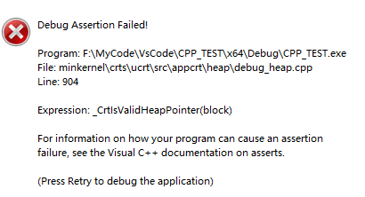
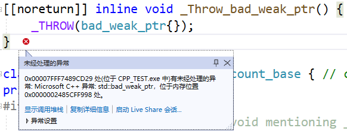
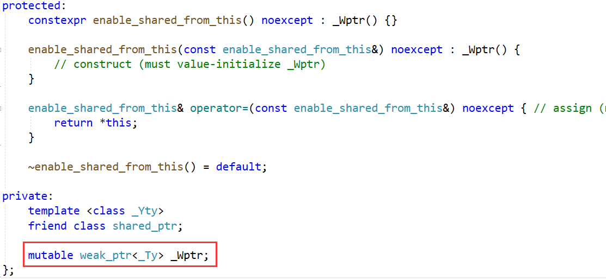

# VS中内存泄漏检测方法

首先来看一下内存泄漏的案例，以及如何检测内存泄漏。

[CSDN参考](https://www.cnblogs.com/bugfly/p/3917767.html)

**1）实质：**
内存泄漏并非指内存在物理上的消失，而是应用程序分配某段内存后，由于设计错误，导致在释放该段内存之前就失去了对该段内存的控制，从而造成了内存的浪费；

**2）原理：**
内存泄露的关键就是记录分配的内存和释放内存的操作，看看能不能匹配。跟踪每一块内存的生命周期；

**3）方法：**不同开发环境有不同的检测方法，在VS中使用时，需加上

```cpp
#define _CRTDBG_MAP_ALLOC
#include<crtdbg.h>
```

crtdbg.h的作用是将malloc和free函数映射到它们的调试版本_malloc_dbg和_free_dbg，这两个函数将跟踪内存分配和释放（在Debug版本中有效）

```cpp
_CrtDumpMemoryLeaks();
```

函数将显示当前内存泄露，也就是说程序运行到此行代码时的内存泄露，所有未销毁的对象都会报出内存泄露，因此要让这个函数尽量放到最后(放在主函数return 0；前面即可)。

```cpp
//Vs中检测内存泄漏代码，C/C++通用
#ifdef _DEBUG

#ifdef  __cplusplus
#include<iostream>
#define new   new( _CLIENT_BLOCK, __FILE__, __LINE__)
#else
#define _CRTDBG_MAP_ALLOC
#include<malloc.h>
#include<crtdbg.h>
#include<stdlib.h>
#endif //  __cplusplus

#else
#include<malloc.h>
#endif
//用于atexit注册，会在程序退出时自动调用
void Exit()
{
	_CrtDumpMemoryLeaks();
}
```

测试代码

```cpp
int main()
{
	atexit(Exit);
	int* p = new int[5];
	//delete[] p;
	return 0;
}
/* 输出窗口中显示：
Detected memory leaks!
Dumping objects ->
{157} normal block at 0x00C5E690, 20 bytes long.
 Data: <                > CD CD CD CD CD CD CD CD CD CD CD CD CD CD CD CD 
Object dump complete.
*/
```

# 智能指针

## 简介

智能指针是一个模板类，封装了裸指针，可以对指针进行安全的操作。

+ 使用RAII特点，将对象生命周期使用栈来管理
+ 智能指针区分了所有权，因此使用责任更为清晰
+ 智能指针大量使用操作符重载和函数内联特点，调用成本和裸指针无差别

## 为什么要使用智能指针

一句话：智能指针就是帮我们C++程序员管理动态分配的内存的，它会帮助我们自动释放new出来的内存，从而避免内存泄漏！

内存泄漏指由于疏忽或错误造成程序未能释放已经不再使用的内存的情况，这是C和C++程序员的噩梦之一。

## unique_ptr

unique_ptr是一种定义在<memory>中的智能指针(smart pointer)。它持有对对象的独有权——两个unique_ptr不能指向一个对象，不能进行复制操作只能进行移动操作。

unique_ptr对象是管理的对象的唯一拥有者：因为当unique_ptr对象释放时会删除它们的托管对象，而不考虑其他指针是否仍然指向相同的对象，从而使指向那里的其他指针指向无效的位置。

unique_ptr对象复制了有限的指针功能，通过操作符*和->(用于单个对象)或操作符\[](用于数组对象)提供对其托管对象的访问。出于安全考虑，它们不支持指针算术运算，只支持移动赋值(禁用复制赋值)。

### 构造对象

可以使用unique_ptr提供的构造函数构造对象，可以构造对象，也可以构造数组！

```cpp
std::unique_ptr<Test> p1(new Test);
std::unique_ptr<Test[]> p2(new Test[5]);
```

大家会发现，上面的代码写起来有点麻烦，Test类型在同一个语句中需要写两个，有点冗余，而且构造数组时也容易忘记写数组大小。有没有更轻松的方法呢？必须有！

```cpp
auto p3 = std::make_unique<Test>();
auto p4 = std::make_unique<Test[]>(5);
//make_unique_for_overwrite
```

使用`make_unique`构造，然后使用auto自动类型推导，就很方便了。

```cpp
unique_ptr<Test> up = p1;				//尝试引用已删除的函数
unique_ptr<Test> up1 = std::move(p1);	//可以移动
```

值得注意的是，`unique_ptr`禁用了拷贝和赋值操作，只能进行移动。

### 删除器

在某些时候，默认的释放操作不能满足咱们的需要，这个时候就需要自定义删除器。

```cpp
void del_global(Test* ptr){delete ptr;}					//全局函数
auto del_lambda = [](Test* ptr) {delete ptr; };			//lambda
std::function<void(Test*)> del_function = del_lambda;	//函数包装器
struct Del_Object										//仿函数
{
	void operator()(Test* ptr)
	{
		delete ptr;
	}
};

int main()
{
   	std::unique_ptr<Test, decltype(del_global)*>	p2(new Test, del_global);
	std::unique_ptr<Test, decltype(del_lambda)>		p3(new Test, del_lambda);
	std::unique_ptr<Test, decltype(del_function)>	p4(new Test, del_function);
	std::unique_ptr<Test, decltype(Del_Object())>	p5(new Test, Del_Object());
    
    return 0;
}
```

> 注意:自定义删除器无法通过std::make_unique来指定。可以通过`get_deleter`获取删除器。

### 指针使用

**判断**

因为重载了`operator bool()`函数，所以可以直接判断，指针是否为nullptr。

```cpp
if(p1)
{
    
}
if(!p1)
{
    
}
```

**解引用**

因为重载了`operator*()`函数，所以可以直接对指针解引用。

```cpp
*p1;
```

**访问成员**

因为重载了`operator->()`函数，所以可以直接获取对象的成员。

```cpp
p1->~Test();
```

**下标访问**

因为重载了`operator[]()`函数，如果管理的是数组，则可以通过下标访问元素。

```cpp
p1[n];
```

### 获取/释放

#### get

使用`get()`获取管理的对象原生指针，如果unique_ptr为空则返回nullptr。

注意，对这个函数的调用不会使unique_ptr释放指针的所有权(即，它仍然负责在某个时刻删除托管数据)。因此，该函数返回的值不能用于构造新的托管指针。

```cpp
void test()
{
	int* pp = nullptr;
	{
		auto p = std::make_unique<int>(2);
		std::cout << *p << std::endl;
		pp = p.get();
	}
	std::cout << *pp << std::endl;	//输出垃圾值
}
```

#### release

使用`release()`可以返回原生指针并**释放所有权**(智能指针管理的指针会变为nullptr)。

这个调用不会销毁管理对象，但是unique_ptr对象从删除对象的责任中解脱出来。其他实体必须在某个时刻负责删除对象。

```cpp
void test()
{
	auto p = std::make_unique<int>(23);
	auto pp = p.release();			//智能指针p不在管理pp对象了
	delete pp;						//需要自己释放内存
}
```

#### reset

使用`reset()`释放unique_ptr管理的对象，有一个可选参数，如果为nullptr，则只会释放对象，并指向nullptr。如果传递了对象指针，则释放之后unique_ptr会接管传递的对象。

```cpp
void test()
{
	unique_ptr<int> up;
				
	up.reset(new int(-22));		//获取指针的所有权
	cout << *up << endl;

	up.reset(new int(666));		//释放管理的内存，获取新的指针
	cout << *up << endl;

	up.reset();						//释放管理的内存
}
```


## shared_ptr

unique_ptr是一个独享指针，同一时刻只能有一个unique_ptr指向一个对象，而shared_ptr是一个共享指针，同一时刻可以有多个shared_ptr指向同一对象，但会记录有多少个shared_ptrs共同指向一个对象。这便是所谓的引用计数（reference counting）。

一旦最后一个这样的指针被销毁，也就是一旦某个对象的引用计数变为0，这个对象会被自动删除。这在**非环形数据结构**中防止资源泄露很有帮助。

### 构造对象

可以使用shared_ptr提供的构造函数构造对象，可以构造对象，也可以构造数组！

```cpp
std::shared_ptr<Test> sp(new Test);
std::shared_ptr<Test[]> sp1(new Test[5]);
```

大家会发现，上面的代码写起来有点麻烦，Test类型在同一个语句中需要写两个，有点冗余，而且构造数组时也容易忘记写数组大小。有没有更轻松的方法呢？必须有！

```cpp
auto sp2 = std::make_shared<Test>();
//值得会注意的是，使用make_shared不支持创建数组
//auto sp3 = std::make_shared<Test>(5);
```

使用`make_shared`构造，然后使用auto自动类型推导，就很方便了。

### 删除器

在某些时候，默认的释放操作不能满足咱们的需要，这个时候就需要自定义删除器。

```cpp
std::shared_ptr<Test> sp(new Test, [](auto* ptr) {delete ptr; });
```

### 指针使用

和unique_ptr一样

### 获取/释放

#### use_count

使用use_count获取所指对象的引用计数。如果这是一个空的shared_ptr，函数返回零。

库实现不需要保留任何特定所有者集的计数，因此调用此函数可能效率不高。要具体检查use_count是否为1，可以使用member unique代替，这样可能更快。

#### unique

检查所管理对象是否仅由当前shared_ptr管理。

#### get

同unique_ptr;

#### reset

```cpp
void reset();					//仅释放
void reset(_Ux* _Px);			//释放，并接管_Px
void reset(_Ux* _Px, _Dx _Dt)	//释放，并接管_Px,并给_Px指定_Dt删除器
```


## week_ptr

### 简介

shared_ptr可以用来避免内存泄漏，可以自动释放内存。但是在使用中可能存在**循环引用**，使引用计数失效，从而导致内存泄漏的情况。如下代码所示：

```cpp
class Widget
{
public:
	Widget() { std::cout << __FUNCTION__ << std::endl; }
	~Widget() { std::cout << __FUNCTION__ << std::endl; }
	void setParent(std::shared_ptr<Widget>& parent) { _ptr = parent; }
private:
	std::shared_ptr<Widget> _ptr;
};

int main()
{
	{
		std::shared_ptr<Widget> w1 = std::make_shared<Widget>();
		std::shared_ptr<Widget> w2 = std::make_shared<Widget>();
		std::cout << w1.use_count() << " " << w2.use_count() << std::endl;
		w1->setParent(w2);
		w2->setParent(w1);
		std::cout << w1.use_count() << " " << w2.use_count() << std::endl;
	}

	return 0;
}
```

输出结果:

```cpp
Widget::Widget
Widget::Widget
1 1
2 2
```

我们发现，并没有调用析构函数，也就是对象没有释放，为什么会发生这样的事情呢？

+ w1->\_ptr 引用了w2，w2->\_ptr 引用了w1，这样就形成了循环引用。
+ 当w1超出作用域，释放的时候，发现管理的对象引用计数不为1，则不释放对象
+ 当w2超出作用域，释放的时候，发现管理的对象引用计数也不为1，也不是放对象
+ 这样就发生了内存泄漏！


week_ptr是对shared_ptr 对象的一种弱引用，它不会增加对象的引用计数。week_ptr和shared_ptr之间可以相互转换， shared_ptr可以直接赋值给week_ptr，week_ptr可通过调用lock函数来获得shared_ptr(如果对象已经被释放，则返回一个空的shared_ptr)。

### 解决循环引用

shared_ptr智能指针的循环引用导致的内存泄漏问题，可以通过weak_ptr解决。只需要将`std::shared_ptr<Widget> _ptr`改为weak_ptr：

```cpp
std::weak_ptr<Widget> _ptr;
```

输出结果为:

```cpp
Widget::Widget
Widget::Widget
1 1
1 1
Widget::~Widget
Widget::~Widget
```

### weak_ptr函数

+ **use_count()：**获取当前观察的资源的引用计数
+ **expired()：**判断所观察资源是否已经释放
+ **lock()：**返回一个指向共享对象的shared_ptr，如果对象被释放，则返回一个空shared_ptr：

> 使用场景：weak_ptr不改变其所共享的shared_ptr实例的引用计数，那就可能存在weak_ptr指向的对象被释放掉这种情况。
> 这时就不能使用weak_ptr直接访问对象。必须用`expired()`判断weak_ptr指向对象是否存在！

## 返回this指针

先来看一个问题，如果用两个shared_ptr去管理，同一个对象会怎么样？

```cpp
class SObject
{
public:
	SObject() { std::cout << __FUNCTION__ << std::endl; }
	~SObject() { std::cout << __FUNCTION__ << std::endl; }
private:
};

int main()
{
	SObject* obj = new SObject;
	std::shared_ptr<SObject> sp(obj);
	std::shared_ptr<SObject> sp1(obj);

	return 0;
}
```

当main函数结束是，sp和sp1都释放管理的资源，这就导致了obj被重复释放了，如下图：



怎么办呢？很简单，我们让sp1，从sp拷贝过来就行！

```cpp
SObject* obj = new SObject;
std::shared_ptr<SObject> sp(obj);
std::shared_ptr<SObject> sp1(sp);
```

这样确实能解决问题，但是很难保证自己不写错，所以需要一个可靠的方法！

有的同学可能会这样说，直接在类里面定义一个shared_ptr指针，然后提供一个成员函数返回不就好了吗？咱们来试试！

```cpp
class SObject 
{
public:
	SObject():_ptr(this)
	{ std::cout << __FUNCTION__ << std::endl; }
	~SObject() { std::cout << __FUNCTION__ << std::endl; }
	std::shared_ptr<SObject> getPtr() { return _ptr; }
private:
	std::shared_ptr<SObject> _ptr;
}

int main()
{
	SObject* obj = new SObject;
    
	auto sp = obj->getPtr();
	auto sp1 = obj->getPtr();
	std::cout << sp.use_count() << " " << sp1.use_count() << std::endl;
	if (!sp)
	{
		std::cout << "is nullptr" << std::endl;
	}
	return 0;
}
```

输出结果为：

```cpp
SObject::SObject
3 3
```

咦！为啥对象没有释放呢？因为在类里面把shared_ptr作为了成员，并管理了自己，那么永远得不到释放！

那咋办呢？实际上C++给我们提供了一个很好的解决方案：把我们自己的继承自`std::enable_shared_from_this`这个模板类即可！

```cpp
class SObject :public std::enable_shared_from_this<SObject>
{
public:
	SObject(){ std::cout << __FUNCTION__ << std::endl; }
	~SObject() { std::cout << __FUNCTION__ << std::endl; }
};

int main()
{
	SObject* obj = new SObject;
	
	auto sp = obj->shared_from_this();
	auto sp1 = obj->shared_from_this();
	std::cout << sp.use_count() << " " << sp1.use_count() << std::endl;
	if (!sp)
	{
		std::cout << "is nullptr" << std::endl;
	}

	return 0;
}
```

调试一下，咦！中断了：



为什么中断了呢？

如上图所示，异常位置是在弱指针处，弱指针实际上是智能共享指针的辅助指针，它主要负责监控智能指针的声明周期，弱指针本身的构造和析构都不会对引用计数进行修改，纯粹是作为一个助手监视shared_ptr管理的资源是否存在。

弱指针的初始化是通过智能指针的构造函数来实现的，在上面的代码中对智能指针初始化时并没有使用构造函数的方式，因为弱指针是没有正常进行初始化的。也因为此，在运行上面的程序时，编译器抛出了异常。

因此，在使用上述方法时必须要使用智能指针的构造函数先初始化一个智能指针。

```cpp
int main()
{
	//先申请再构造指针指针
	//SObject* obj = new SObject;
	//std::shared_ptr<SObject> spp(obj);
	//或直接构造智能指针↓
	auto obj = std::make_shared<SObject>();

	//获取指向obj的智能指针
	auto sp = obj->shared_from_this();
	auto sp1 = obj->shared_from_this();

	std::cout << sp.use_count() << " " << sp1.use_count() << std::endl;
	if (!sp)
	{
		std::cout << "is nullptr" << std::endl;
	}
	return 0;
}
```

直接构造出智能指针管理SObject对象，然后再获取指向本对象的指针，就没问题了~~

**enable_shared_from_this部分代码**



从上面的代码中可以看出，share_ptr是std::enable_shared_from_this的友元类，实际上在，对智能指针进行初始化时除了完成obj的初始化外，还做了额外的工作，既通过前面std::enable_shared_from_this的继承使得后面对智能指针进行初始化时同时初始化了弱指针。

> 使用场景：当一个类被共享智能指针 `share_ptr` 管理，且在类的成员函数里需要把当前类对象作为参数传给其他函数时，这时就需要传递一个指向自身的 `share_ptr`。

