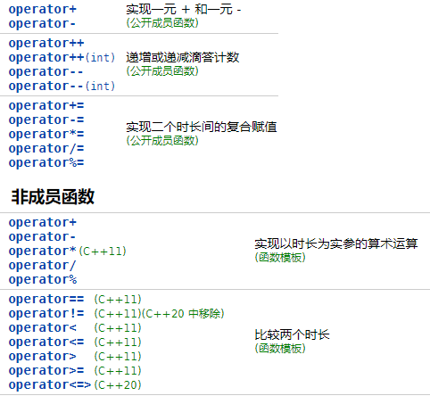
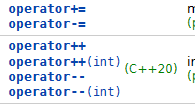
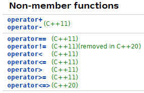

# std::ratio

类模板 `std::ratio` 及相关的模板提供编译时有理数(整数和分数的集合)算术支持。此模板的每个实例化都准确表示任一有限有理数。

此模板的每个实例化都准确表示任一确定有理数，只要分子 `Num` 与分母 `Denom` 能表示为 [std::intmax_t](https://zh.cppreference.com/w/cpp/types/integer) 类型的编译时常量。另外， `Denom` 不可为零且不可等于最负的值。

约分分子和分母到最简。

```cpp
std::ratio<2, 10> r;
std::cout << r.num << std::endl;	//1
std::cout << r.den << std::endl;	//5
```

可以通过`type`类型获约分后的类型`std::ratio<2, 10>::type`

另外，如果分子分母都是负数，那么分子分母都将变为正整数。

```cpp
std::ratio<-2, -10> r;
std::cout << r.num << std::endl;	//1
std::cout << r.den << std::endl;	//5
```

还有，如果只有分子或分母中的一个是负数，那么负号将移到分子上。

```cpp
std::ratio<2, -10> r;
std::cout << r.num << std::endl;	//-1
std::cout << r.den << std::endl;	//5
```

标准库提供数个对应 SI( 国际单位制) ratio的方便别名 ：

```cpp
using atto  = ratio<1, 1000000000000000000LL>;
using femto = ratio<1, 1000000000000000LL>;
using pico  = ratio<1, 1000000000000LL>;
using nano  = ratio<1, 1000000000>;
using micro = ratio<1, 1000000>;
using milli = ratio<1, 1000>;
using centi = ratio<1, 100>;
using deci  = ratio<1, 10>;								//十分之一(一比十)
using deca  = ratio<10, 1>;								//十(十比一)
using hecto = ratio<100, 1>;
using kilo  = ratio<1000, 1>;
using mega  = ratio<1000000, 1>;
using giga  = ratio<1000000000, 1>;
using tera  = ratio<1000000000000LL, 1>;
using peta  = ratio<1000000000000000LL, 1>;
using exa   = ratio<1000000000000000000LL, 1>;
```

## 编译时有理数算术

提供数个别名模板，它们在编译时进行 `ratio` 实例上的算术。

| 在标头 `<ratio>` 定义                                        |                                          |
| ------------------------------------------------------------ | ---------------------------------------- |
| [ratio_add](https://zh.cppreference.com/w/cpp/numeric/ratio/ratio_add) | 在编译时相加两个 `ratio` 对象 (别名模板) |
| [ratio_subtract](https://zh.cppreference.com/w/cpp/numeric/ratio/ratio_subtract) | 在编译时相减两个 `ratio` 对象 (别名模板) |
| [ratio_multiply](https://zh.cppreference.com/w/cpp/numeric/ratio/ratio_multiply) | 在编译时相乘两个 `ratio` 对象 (别名模板) |
| [ratio_divide](https://zh.cppreference.com/w/cpp/numeric/ratio/ratio_divide) | 在编译时相除两个 `ratio` 对象 (别名模板) |

example：

```cpp
std::ratio_add<nano, micro>::type;
```

## 编译时有理数比较

提供数个类模板，它们在编译时进行 `ratio` 实例上的比较运算。

| 在标头 `<ratio>` 定义                                        |                                                          |
| ------------------------------------------------------------ | -------------------------------------------------------- |
| [ratio_equal](https://zh.cppreference.com/w/cpp/numeric/ratio/ratio_equal) | 在编译时比较两个 `ratio` 对象的相等性 (类模板)           |
| [ratio_not_equal](https://zh.cppreference.com/w/cpp/numeric/ratio/ratio_not_equal) | 在编译时比较两个 `ratio` 对象的不相等性 (类模板)         |
| [ratio_less](https://zh.cppreference.com/w/cpp/numeric/ratio/ratio_less) | 在编译时比较两个 `ratio` 对象的*小于*关系 (类模板)       |
| [ratio_less_equal](https://zh.cppreference.com/w/cpp/numeric/ratio/ratio_less_equal) | 在编译时比较两个 `ratio` 对象的*小于或等于*关系 (类模板) |
| [ratio_greater](https://zh.cppreference.com/w/cpp/numeric/ratio/ratio_greater) | 在编译时比较两个 `ratio` 对象的*大于*关系 (类模板)       |
| [ratio_greater_equal](https://zh.cppreference.com/w/cpp/numeric/ratio/ratio_greater_equal) | 在编译时比较两个 `ratio` 对象的*大于或等于*关系 (类模板) |

example：

```cpp
std::ratio_equal<std::ratio<10>, std::ratio<10>>::value;	//true
```

# std::chrno

chrno是C++日期时间库，以各种精度跟踪时间的类型的灵活汇集。

`chrono` 库定义三种主要类型以及工具函数和常用 using别名。

- `clock` 时钟
- `duration` 时长
- `time_point `时间点

## duration

### 定义对象

`std::chrono::duration` 表示时长，时长由时间跨度组成，定义为某时间单位的某个计次数。例如，“ 42 秒”可表示为由 42 个 1 秒时间点位的计次所组成的时长

`duration`类模板定义如下：

```cpp
template <class _Rep, class _Period = ratio<1,1>> 
class duration;
```

+ **_Rep：**表示一种数值类型，用来表示_Period的数量，比如int、float、double...

+ **_Period：**是`std::ratio`类型，用来表示（用秒表示的）单位，比如second、milisecond...

比如，想要表示一个秒数，代码如下：

```cpp
std::chrono::duration<long long,std::ratio<1,1>> mysec(10);			//mysec表示10秒
```

> std::chrono 命名空间名太长了，可以简化一下 `	namespace co = std::chrono;`

因为`duration`第二个模板默认值就是`std::ratio<1,1>`，所以还可以简写为如下形式：

```cpp
co::duration<long long> mysec(10);
```

如果想要表示分钟怎么办呢？

```cpp
std::chrono::duration<long long, std::ratio<1, 60>> myminute(10);	//myminute表示10分钟
```

上述代码中`std::ratio`比例为1/60，表示一分钟等于60秒。

### 辅助类型

其实不需要这么复杂，因为常用的时长类型已经被预定义好了！如下表所示：

| 类型                           | 定义                                                         |
| ------------------------------ | ------------------------------------------------------------ |
| **std::chrono::nanoseconds**   | duration<long long, nano>                                    |
| **std::chrono::microseconds**  | duration<long long, micro>;                                  |
| **std::chrono::milliseconds**  | duration<long long, milli>;                                  |
| **std::chrono::seconds**       | duration<long long>;                                         |
| **std::chrono::minutes**       | duration<int, ratio<60>>;                                    |
| **std::chrono::hours**         | duration<int, ratio<3600>>;                                  |
| std::chrono::days (C++20 起)   | duration<int, ratio_multiply<ratio<24>, hours::period>>;     |
| std::chrono::weeks (C++20 起)  | duration<int, ratio_multiply<ratio<7>, days::period>>;       |
| std::chrono::months (C++20 起) | duration<int, ratio_multiply<ratio<146097, 400>, days::period>>; |
| std::chrono::years (C++20 起)  | duration<int, ratio_divide<years::period, ratio<12>>>;       |

用辅助类型定义对象就非常简单了！

```cpp
chrono::seconds longtime(60);		//60秒
chrono::days	mydays(30);			//30天
```

当然，其实有更方便的方法，C++为我们提供了字面量重载函数。

### 字面量
在内联命名空间 `std::literals::chrono_literals` 定义 
| 字面量函数        |                    含义                                |
| ------------------------------------------------------------ | -------------------------------------------------- |
| [operator""h](https://zh.cppreference.com/w/cpp/chrono/operator""h)(C++14) | 表示小时的 **std::chrono::duration** 字面量 (函数) |
| [operator""min](https://zh.cppreference.com/w/cpp/chrono/operator""min)(C++14) | 表示分钟的 **std::chrono::duration** 字面量 (函数) |
| [operator""s](https://zh.cppreference.com/w/cpp/chrono/operator""s)(C++14) | 表示秒的 **std::chrono::duration** 字面量 (函数)   |
| [operator""ms](https://zh.cppreference.com/w/cpp/chrono/operator""ms)(C++14) | 表示毫秒的 **std::chrono::duration** 字面量 (函数) |
| [operator""us](https://zh.cppreference.com/w/cpp/chrono/operator""us)(C++14) | 表示微秒的 **std::chrono::duration** 字面量 (函数) |
| [operator""ns](https://zh.cppreference.com/w/cpp/chrono/operator""ns)(C++14) | 表示纳秒的 **std::chrono::duration** 字面量 (函数) |

注意：字面量后缀 `d` 和 `y` 不指代 `days` 和 `years` ，而是分别指代 [`day`](https://zh.cppreference.com/w/cpp/chrono/day) 和 [`year`](https://zh.cppreference.com/w/cpp/chrono/year) 。  (C++20 起) 

```cpp
chrono::seconds longtime = 60s;
chrono::days	monthOfDays = 30d;	//error:“初始化”: 无法从“std::chrono::day”转换为“std::chrono::days”
```

### 成员函数

#### 获取计数

首先，我们来定义一个表示分钟的时长对象。

```cpp
chrono::minutes mins;
```

除了初始化之外，还可以给它赋值。

```cpp
mins = 20min;
```

要获取值，则可以通过成员函数`count`获取。

```cp
std::cout << mins << "  " << mins.count()  << std::endl;
```

运行结果为：`20min  20`

从上面可以看到，也能直接输出`duration`对象，只不过会加上单位作为后缀。如果输出的不是预定义的类型，则会有不一样的效果。

```cpp
std::cout << chrono::duration<long long, std::ratio<1, 20>>(5) << std::endl;
```

运行结果为：`5[1/20]s`

那么最大能表示多少分钟，最小能表示多分钟呢？可以通过下面的静态方法获取！

```cpp
std::cout << mins.zero() << " " << mins.min() << " " << mins.max() << std::endl;
```

运行结果为：`0min -2147483648min 2147483647min`

#### 转换

如果需要把分钟转成秒，则可以通过函数[duration_cast](https://zh.cppreference.com/w/cpp/chrono/duration/duration_cast)实现。

```cpp
auto s = chrono::duration_cast<chrono::seconds>(mins).count();
std::cout <<"20 minute is " << s << " seconds" << std::endl;
```

运行结果为：`20 minute is 1200 seconds`

下面代码把分钟转成小时：

```cpp
auto h = chrono::duration_cast<chrono::hours>(mins).count();
std::cout << "20 minute is " << h << " hours" << std::endl;
```

运行结果为：`20 minute is 0 hours`

咦！竟然是0小时？没错这个是没有小数部分的，那如果要不满一小时，算一小时怎么办呢？答案是使用`ceil`函数进行向上取整的转换。

```cpp
auto h = chrono::ceil<chrono::hours>(mins).count();
std::cout << "20 minute is " << h << " hours" << std::endl;
```

运行结果为：`20 minute is 1 hours`

同样还有向下取整函数`floor`、就近取整函数`round`。

如果你的时长是一个负值，还可以通过`abs`获取绝对值。

#### 算术运算



## clock

时钟由起点（或纪元）及计次频率组成。例如，时钟可以拥有 1970 年 1 月 1 日的纪元，和每一秒的计次。 

C++ 定义数种时钟类型：


### system_clock

类 `std::chrono::system_clock` 表示系统范围的实时挂钟。

首先，获取当前时间。

```cpp
auto currentTime =  chrono::system_clock::now();
```

> system_clock是获取从协调世界时 (UTC) 1970 年 1 月 1 日星期四 00:00:00 开始的时间。

可以直接输出。

```cpp
std::cout << currentTime << std::endl;
```

运行结果为：`2023-07-28 14:20:15.4173841`

还提供了`to_time_t`和`from_time_t`函数，让系统时钟时间点和time_t之间进行转换。

```cpp
//转换系统时钟时间点为time_t
time_t t = chrono::system_clock::to_time_t(currentTime);
//转换time_t到系统时钟时间点
auto nowTime = chrono::system_clock::from_time_t(time(nullptr));
```

注意：`chrono::system_clock::now();`函数返回的是一个时间点([time_point](#time_point))对象。

### steady_clock 

std::chrono::steady_clock表示单调时钟。这个时钟的时间点不会随着物理时间的向前移动而减少，并且这个时钟的滴答之间的时间是恒定的。这个时钟与挂钟时间无关(例如，它可以是自上次重新启动以来的时间)，最适合测量时间间隔。

只有一个静态函数，即获取时间。

```cpp
static time_point now();
```

还有一个静态常量，用来判断是否是steady时钟。

```cpp
static constexpr bool is_steady;
```

### high_resolution_clock 

std::chrono::high_resolution_clock 类表示实现提供的具有最小滴答周期(精度最高)的时钟。它可以是std::chrono::system_clock或std::chrono::steady_clock的别名，也可以是第三个独立时钟(看具体实现)。


## time_point

时间点是从特定时钟的纪元开始经过的时间时长。

```cpp
chrono::system_clock::time_point nowTime =  chrono::system_clock::now();
```

可以通过函数获取自1970年以来开始的时长(chrono::system_clock::duration)(纳秒数)。

```cpp
std::cout << nowTime.time_since_epoch() << std::endl;
```

运行结果为：`16905550612558537[1/10000000]s`

除此之外，还支持各种运算：

+ 成员函数



+ 非成员函数



https://www.coder.work/article/6593595

# std::filesystem(C++17)

Filesystem库提供了对文件系统及其组件(如路径、常规文件和目录)执行操作的工具。

先搞清楚一些概念：

- **文件：**持有数据的文件系统对象，能被写入或读取，或二者皆可。文件拥有名称及属性，属性之一是文件类型：
  - *目录*：表现为目录条目的容器的文件，目录条目标识其他文件（其中一些可以是另外的嵌套的目录）。讨论到具体文件时，包含该文件目录条目的目录是其*父目录*。父目录能以相对路径名 ".." 表示。
  - *硬链接*：关联一个名字到一个既存文件的目录条目。若支持多重硬链接，则文件在最后一个到它的硬链接被移除后才被移除。
  - *符号链接*：关联一个名词到一个路径的目录条目，路径可以存在亦可不存在。
  - *常规文件*：不是其他文件类型的文件。

- **文件名：**命名一个文件的字符串。名称 "." （点）与 ".." （双点）在库层次拥有特殊含义。
- **路径：**标识一个文件的元素序列。它以可选的 *根名* （例如 Windows 上的 "C:" 或 "//server" ）开始，后随可选的 *根目录* （例如 Unix 上的 "/" ），后随零或更多个文件名（除了最后一个都必须是目录或到目录的链接）的序列。表示路径的字符串（*路径名*）的原生格式（如哪些字符被用作分隔符）与字符编码是实现定义的，库提供路径的可移植表示。

## path

类型 `path` 的对象表示文件系统上的路径。只有路径的语法外观得到处理：路径名可能表示不存在的路径，或甚至不允许存在于当前文件系统或操作系统的路径。

路径可以隐式地与**std::basic_string**进行转换，这使得可以将它们与其他文件api一起使用。

### Member functions

| 函数                                                         | 描述                                          |
| ------------------------------------------------------------ | --------------------------------------------- |
| [assign](https://en.cppreference.com/w/cpp/filesystem/path/assign) | 分配内容(会把原来的内容清空，和operatro=一样) |
| **连接**                                                     |                                               |
| [append]()<br/>[operator/=](https://en.cppreference.com/w/cpp/filesystem/path/append) | 使用目录分隔符('/','\\')向路径追加元素        |
| [concat]()<br/>[operator+=](https://en.cppreference.com/w/cpp/filesystem/path/concat) | 连接两个路径而不引入目录分隔符                |
| **修改**                                                     |                                               |
| [clear](https://en.cppreference.com/w/cpp/filesystem/path/clear) | 清空内容                                      |
| [make_preferred](https://en.cppreference.com/w/cpp/filesystem/path/make_preferred) | 将目录分隔符转换为首选目录分隔符              |
| [remove_filename](https://en.cppreference.com/w/cpp/filesystem/path/remove_filename) | 移除文件名路径组件                            |
| [replace_filename](https://en.cppreference.com/w/cpp/filesystem/path/replace_filename) | 用另一个路径替换最后一个路径组件              |
| [replace_extension](https://en.cppreference.com/w/cpp/filesystem/path/replace_extension) | 替换扩展名                                    |
| [swap](https://en.cppreference.com/w/cpp/filesystem/path/swap) | 交换两个路径                                  |
| **获取不同格式的路径**                                       |                                               |
| [c_str]()<br/>[native]()<br/>[operator string_type](https://en.cppreference.com/w/cpp/filesystem/path/native) | 返回路径的本机版本                            |
| [string]()<br/>[wstring]()<br/>[u8string]()<br/>[u16string]()<br/>[u32string](https://en.cppreference.com/w/cpp/filesystem/path/string) | 将本机路径名格式的路径转换为字符串            |
| [generic_string]()<br/>[generic_wstring]()<br/>[generic_u8string]()<br/>[generic_u16string]()<br/>[generic_u32string](https://en.cppreference.com/w/cpp/filesystem/path/generic_string) | 返回转换为字符串的通用路径名格式的路径        |
| **比较**                                                     |                                               |
| [compare](https://en.cppreference.com/w/cpp/filesystem/path/compare) | 按字典顺序比较两个路径的词法表示              |
| **生成**                                                     |                                               |
| [lexically_normal]()                                         | 将路径转换为标准形式                          |
| [lexically_relative]()                                       | 将路径转换为相对形式                          |
| [lexically_proximate](https://en.cppreference.com/w/cpp/filesystem/path/lexically_normal) | 将路径转换为近似形式                          |
| **分解**                                                     |                                               |
| [root_name](https://en.cppreference.com/w/cpp/filesystem/path/root_name) | 返回路径的根名称(如果存在)                    |
| [root_directory](https://en.cppreference.com/w/cpp/filesystem/path/root_directory) | 返回路径的根目录(如果存在)                    |
| [root_path](https://en.cppreference.com/w/cpp/filesystem/path/root_path) | 返回路径的根路径(如果存在)                    |
| [relative_path](https://en.cppreference.com/w/cpp/filesystem/path/relative_path) | 返回相对于根路径的路径                        |
| [parent_path](https://en.cppreference.com/w/cpp/filesystem/path/parent_path) | 返回父路径的路径                              |
| [filename](https://en.cppreference.com/w/cpp/filesystem/path/filename) | 返回文件名路径组件                            |
| [stem](https://en.cppreference.com/w/cpp/filesystem/path/stem) | 返回主干路径组件(文件名不带最终扩展名)        |
| [extension](https://en.cppreference.com/w/cpp/filesystem/path/extension) | 返回文件扩展名路径组件                        |
| **查询**                                                     |                                               |
| [empty](https://en.cppreference.com/w/cpp/filesystem/path/empty) | 检查路径是否为空                              |
| [has_root_path]()<br>[has_root_name]()<br/>[has_root_directory]()<br/>[has_relative_path]()<br/>[has_parent_path]()<br/>[has_filename]()<br/>[has_stem]()<br/>[has_extension](https://en.cppreference.com/w/cpp/filesystem/path/has_path) | 检查相应的路径元素是否为空                    |
| [is_absolute]()<br>[is_relative](https://en.cppreference.com/w/cpp/filesystem/path/is_absrel) | 检查root_path()是否唯一标识文件系统位置       |
| **迭代器**                                                   |                                               |
| [begin]()<br>[end](https://en.cppreference.com/w/cpp/filesystem/path/begin) | 迭代器以元素序列的形式访问路径                |


### Non-member functions

| 定义在命名空间 `std::filesystem`                             |                                  |
| ------------------------------------------------------------ | -------------------------------- |
| [swap(std::filesystem::path)](https://en.cppreference.com/w/cpp/filesystem/path/swap2) | 交换两个路径                     |
| [hash_value](https://en.cppreference.com/w/cpp/filesystem/path/hash_value) | 计算路径对象(函数)的哈希值       |
| [operator==]()<br>[operator<=>](https://en.cppreference.com/w/cpp/filesystem/path/operator_cmp)(C++20) | 按字典顺序比较两个路径           |
| [operator/](https://en.cppreference.com/w/cpp/filesystem/path/operator_slash) | 使用目录分隔符连接两个路径       |
| [operator<<]()<br>[operator>>](https://en.cppreference.com/w/cpp/filesystem/path/operator_ltltgtgt) | 在带引号的路径上执行流输入和输出 |

| File types                                                   |                                             |
| ------------------------------------------------------------ | ------------------------------------------- |
| [is_block_file](https://en.cppreference.com/w/cpp/filesystem/is_block_file) | 检查给定路径是否指向块设备(函数)            |
| [is_character_file](https://en.cppreference.com/w/cpp/filesystem/is_character_file) | 检查给定的路径是否指向字符设备(函数)        |
| [is_directory](https://en.cppreference.com/w/cpp/filesystem/is_directory) | 检查给定的路径是否指向一个目录(函数)        |
| [is_empty](https://en.cppreference.com/w/cpp/filesystem/is_empty) | 检查给定的路径是否指向空文件或目录(函数)    |
| [is_fifo](https://en.cppreference.com/w/cpp/filesystem/is_fifo) | 检查给定路径是否引用命名管道(函数)          |
| [is_other](https://en.cppreference.com/w/cpp/filesystem/is_other) | 检查参数是否引用了“其他”文件(函数)          |
| [is_regular_file](https://en.cppreference.com/w/cpp/filesystem/is_regular_file) | 检查参数是否引用常规文件(函数)              |
| [is_socket](https://en.cppreference.com/w/cpp/filesystem/is_socket) | 检查参数是否引用了一个命名的IPC套接字(函数) |
| [is_symlink](https://en.cppreference.com/w/cpp/filesystem/is_symlink) | 检查参数是否引用符号链接(函数)              |
| [status_known](https://en.cppreference.com/w/cpp/filesystem/status_known)( | 检查文件状态是否已知(函数)                  |

| [absolute](https://en.cppreference.com/w/cpp/filesystem/absolute) | 组成一个绝对路径                                         |
| ------------------------------------------------------------ | -------------------------------------------------------- |
| [canonical]()<br>[weakly_canonical](https://en.cppreference.com/w/cpp/filesystem/canonical) | 组成一个规范路径                                         |
| [relative]()<br>[proximate](https://en.cppreference.com/w/cpp/filesystem/relative) | 合成一个相对路径(函数)                                   |
| [copy](https://en.cppreference.com/w/cpp/filesystem/copy)    | 复制文件或目录(函数)                                     |
| [copy_file](https://en.cppreference.com/w/cpp/filesystem/copy_file) | 复制文件内容(函数)                                       |
| [copy_symlink](https://en.cppreference.com/w/cpp/filesystem/copy_symlink) | 复制一个符号链接(函数)                                   |
| [create_directory]()<br/>[create_directories](https://en.cppreference.com/w/cpp/filesystem/create_directory) | 创建新目录(函数)                                         |
| [create_hard_link](https://en.cppreference.com/w/cpp/filesystem/create_hard_link) | 创建一个硬链接(函数)                                     |
| [create_symlink]()<br/>[create_directory_symlink](https://en.cppreference.com/w/cpp/filesystem/create_symlink) | 创建一个符号链接(函数)                                   |
| [current_path](https://en.cppreference.com/w/cpp/filesystem/current_path) | 返回或设置当前工作目录(函数)                             |
| [exists](https://en.cppreference.com/w/cpp/filesystem/exists) | 检查path是否引用了现有的文件系统对象(函数)               |
| [equivalent](https://en.cppreference.com/w/cpp/filesystem/equivalent) | 检查两个路径是否指向同一个文件系统对象(function)         |
| [file_size](https://en.cppreference.com/w/cpp/filesystem/file_size) | 返回文件的大小(函数)                                     |
| [hard_link_count](https://en.cppreference.com/w/cpp/filesystem/hard_link_count) | 返回指向特定文件(函数)的硬链接数。                       |
| [last_write_time](https://en.cppreference.com/w/cpp/filesystem/last_write_time) | 获取或设置最后一次数据修改的时间(函数)。                 |
| [permissions](https://en.cppreference.com/w/cpp/filesystem/permissions) | 修改文件访问权限(函数)                                   |
| [read_symlink](https://en.cppreference.com/w/cpp/filesystem/read_symlink) | 获取符号链接(函数)的目标。                               |
| [remove]()<br/>[remove_all](https://en.cppreference.com/w/cpp/filesystem/remove) | 删除文件或空目录，递归地删除文件或目录及其所有内容(函数) |
| [rename](https://en.cppreference.com/w/cpp/filesystem/rename) | 移动或重命名文件或目录(函数)                             |
| [resize_file](https://en.cppreference.com/w/cpp/filesystem/resize_file) | 通过截断或零填充改变常规文件的大小(函数)                 |
| [space](https://en.cppreference.com/w/cpp/filesystem/space)  | 确定文件系统(函数)上的可用空闲空间                       |
| [status]()<br>[symlink_status](https://en.cppreference.com/w/cpp/filesystem/status) | 确定文件属性确定文件属性，检查符号链接目标(函数)         |
| [temp_directory_path](https://en.cppreference.com/w/cpp/filesystem/temp_directory_path) | 返回适合存放临时文件的目录                               |

## directory_entry

std::filesystem::directory_entry表示目录项。该对象将路径作为成员存储，还可以在目录迭代期间存储其他文件属性(硬链接计数、状态、符号链接状态、文件大小和最后写时间)。

### Member functions

| 修改                                                         |                                                              |
| ------------------------------------------------------------ | ------------------------------------------------------------ |
| [operator=](https://en.cppreference.com/w/cpp/filesystem/directory_entry/operator%3D) | 分配的内容                                                   |
| [assign](https://en.cppreference.com/w/cpp/filesystem/directory_entry/assign) | 分配的内容                                                   |
| [replace_filename](https://en.cppreference.com/w/cpp/filesystem/directory_entry/replace_filename) | 设置文件名                                                   |
| [refresh](https://en.cppreference.com/w/cpp/filesystem/directory_entry/refresh) | 更新缓存的文件属性                                           |
| 观察                                                         |                                                              |
| [path]()<br/>[operator const path&](https://en.cppreference.com/w/cpp/filesystem/directory_entry/path) | 返回目录项所引用的路径                                       |
| [exists](https://en.cppreference.com/w/cpp/filesystem/directory_entry/exists) | 检查目录项是否引用现有的文件系统对象(是否存在)               |
| [is_block_file](https://en.cppreference.com/w/cpp/filesystem/directory_entry/is_block_file) | 检查目录项是否指向块设备                                     |
| [is_character_file](https://en.cppreference.com/w/cpp/filesystem/directory_entry/is_character_file) | 检查目录项是否是字符设备                                     |
| [is_directory](https://en.cppreference.com/w/cpp/filesystem/directory_entry/is_directory) | 检查目录项是否是目录                                         |
| [is_fifo](https://en.cppreference.com/w/cpp/filesystem/directory_entry/is_fifo) | 检查目录项是否是命名管道                                     |
| [is_other](https://en.cppreference.com/w/cpp/filesystem/directory_entry/is_other) | 检查目录项是否是“其他”文件                                   |
| [is_regular_file](https://en.cppreference.com/w/cpp/filesystem/directory_entry/is_regular_file) | 检查目录项是否是常规文件                                     |
| [is_socket](https://en.cppreference.com/w/cpp/filesystem/directory_entry/is_socket) | 检查目录条目是否是一个命名的IPC套接字                        |
| [is_symlink](https://en.cppreference.com/w/cpp/filesystem/directory_entry/is_symlink) | 检查目录项是否是符号链接                                     |
| [file_size](https://en.cppreference.com/w/cpp/filesystem/directory_entry/file_size) | 返回目录项所指向的文件的大小                                 |
| [hard_link_count](https://en.cppreference.com/w/cpp/filesystem/directory_entry/hard_link_count) | 返回指向目录项所指向的文件的硬链接数                         |
| [last_write_time](https://en.cppreference.com/w/cpp/filesystem/directory_entry/last_write_time) | 获取或设置目录项所引用的文件的最后一次数据修改的时间         |
| [status]()<br/>[symlink_status](https://en.cppreference.com/w/cpp/filesystem/directory_entry/status) | 该目录项指定的文件的状态<br>该目录项指定的文件的Symlink_status |
| [operator==]()<br/>[operator<=>](https://en.cppreference.com/w/cpp/filesystem/directory_entry/operator_cmp) | 比较两个目录项                                               |

### Non-member functions

| 函数                                                         | 描述                     |
| ------------------------------------------------------------ | ------------------------ |
| [operator<<](https://en.cppreference.com/w/cpp/filesystem/directory_entry/operator_ltlt) | 对目录项执行流输出(函数) |

## directory_iterator

directory_iterator是一个LegacyInputIterator()，它遍历目录的directory_entry元素(但不访问子目录)。迭代顺序没有指定，只是每个目录项只访问一次。跳过特殊的路径名.和..。

> 遗留输入迭代器(LegacyInputIterator) 仅保证单趟算法的有效性：一旦自增**遗留输入迭代器(LegacyInputIterator)** ，则所有其先前值的副本都可能失效。

首先，使用指定的路径创建迭代器。

```cpp
std::filesystem::directory_iterator it("./");
```

然后，遍历目录。

```cpp
for (auto& entry : dir_it)
{
	std::cout << entry << std::endl;
}
```

或者通过迭代器遍历，值得注意的是，迭代器遍历之后不能再次使用，必须重新创建。

```cpp
std::filesystem::directory_iterator dir_it("./");
for (auto it = std::filesystem::begin(dir_it); 
     dir_it != std::filesystem::end(dir_it); it++)
{
	std::cout << *it << std::endl;
}
```

## recursive_directory_iterator

std::filesystem::recursive_directory_iterator是一个LegacyInputIterator，它遍历目录的directory_entry元素，并递归地遍历所有子目录的条目。迭代顺序没有指定，只是每个目录项只访问一次。

除了和**directory_iterator**一样遍历目录外，还提供了一些方法。

+ 获取当前递归深度

  ```cpp
  int depth() const;
  ```

+ 检查当前目录是否禁用递归

  ```cpp
  bool recursion_pending() const;
  ```

+ 禁用递归，直到下一个增量

  ```cpp
  void disable_recursion_pending()
  ```

+ 将迭代器在目录层次结构中向上移动一级

  ```cpp
  void pop();					//异常版本
  void pop(error_code& _Ec);	//错误码版本
  ```

  

