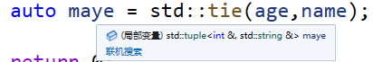
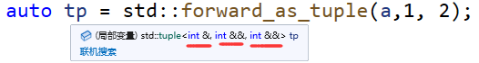
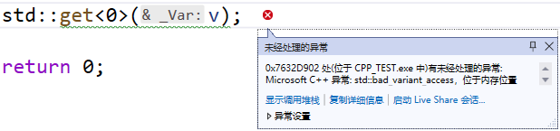
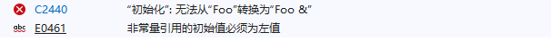

# std::initializer_list

为了编写能够处理不同数量实参（但是类型相同），C++11新标准提供了std::initializer_list的方法。

+ 普通函数使用

```cpp
void showMsg(const std::initializer_list<std::string>& list)
{
	for (auto& n : list)
	{
		cout << n << " ";
	}
	cout << endl;
}
showMsg({ "hello","world","嘿嘿"});
```

+ 构造函数使用

```cpp
template<typename T,size_t _size>
class Array
{
public:
	Array() {}
	Array(const std::initializer_list<T>& list) 
	{
		size_t i = 0;
		for (auto& v : list)
		{
			_arr[i++] = v;
		}
	}
	constexpr size_t size()const { return _size; }
	T& operator[](int index)
	{
		return _arr[index];
	}
	T _arr[_size]{ T() };
};

Array<int, 10> arr = { 1,2,3,4,5,6 };
for (int i = 0; i < arr.size(); i++)
{
	cout << arr[i] << " ";
}
```

前面我们使用数组时，能直接使用聚合初始化参数列表的方式，指定多个初始值，非常方便！现在有了`std::initializer_list`我们也可以让我们的类支持这种方式了！欧耶~

# std::pair

pair 类模板定义在`<utility>`头文件中，所以在使用该类模板之前，需引入此头文件。

std::pair主要的作用是将两个数据组合成一个数据，两个数据可以是同一类型或者不同类型。例如std::pair<int,float> 或者 std：：pair<double,double>等。pair实质上是一个结构体，其主要的两个成员变量是first和second，这两个变量可以直接使用。

初始化一个pair可以使用构造函数。

```cpp
std::pair<int,std::string> maye(15,"maye");
```

也可以使用std::make_pair函数。

```cpp
auto zc = std::make_pair(25,"yue");
```

访问存储的数据。

```cpp
std::cout <<"age:" << maye.first << " name:" << maye.second << std::endl;
```

# std::tuple

tuple(元组)是将不同类型的元素打包到一个对象中的对象，就像pair对象对元素对所做的那样，但可以泛化为任意数量的元素。

从概念上讲，它们类似于普通的旧数据结构(类c结构)，但没有命名的数据成员，而是按tuple中的顺序访问其元素。

在日常项目研发中，我们可以使用 **std::tuple** 来包装返回多个参数类型的对象：

```cpp
auto foo()
{
    return std::make_tuple(2.333, 666, "hoho", true);
}
```

定义一个tuple对象。

```cpp
std::tuple<int, std::string, double> info(18, "maye", 59.5);
```

上面的操作有点麻烦，我们还可以使用`make_tuple`函数来简化。

```cpp
auto maye =  std::make_tuple(18, "maye", 59.5);
```

那么如何获取元素呢？C++提供了`get`函数用于获取指定索引的元素。

```cpp
std::cout<<" age:"<< std::get<0>(maye)
		 <<" name:"<<std::get<1>(maye)
	 	 <<" socre:"<<std::get<2>(maye);
```

当不知道元素的类型时，应该如何获取元素的类型呢？C++提供了类模板`tuple_element`来获取类型

```cpp
//std::tuple_element<2, decltype(maye)>::type <==> double
std::tuple_element<2, decltype(maye)>::type socre = std::get<2>(maye);
```

tuple存储的元素个数可以通过类模板`tuple_size`获取。

```cpp
std::cout << "tuple size :" << std::tuple_size<decltype(maye)>() << std::endl;;
```

还可以把多个tuple拼接在一起哦！

```cpp
auto newMaye = std::tuple_cat(maye, std::make_tuple("湖南省长沙市"));
std::cout << " age:" << std::get<0>(newMaye)
	<< " name:" << std::get<1>(newMaye)
	<< " socre:" << std::get<2>(newMaye)
	<< " address:" << std::get<3>(newMaye);
```

为了方便的获取tuple中的每个元素，提供了`tie`函数，用于对tuple进行解包。

```cpp
auto maye =  std::make_tuple(18, "maye", 59.5);

int age;
const char* name;

std::tie(age, name, std::ignore) = maye;
std::cout << age << " " << name << std::endl;
```

std::ignore用来忽略参数，对于解包过程中不需要获取的元素可以使用它来占位。

除此之外，`tie`函数还可以用来生成对元素的引用tuple(左值引用，tie参数也只支持左值)。

```cpp
template< class... Types >
constexpr tuple<Types&...> tie( Types&... args ) noexcept;
```

举个栗子：

```cpp
int age = 1;
std::string name = "maye";
auto maye = std::tie(age,name);
```



同样，还有可以接受右值的函数`std::forward_as_tuple`,该函数生成的 tuple 在以右值为参数时拥有右值引用数据成员，否则拥有左值引用数据成员。

```cpp
int a = 55;
auto tp = std::forward_as_tuple(a,1, 2);
```



举个例子，观察一下tie和forward_as_tuple的区别

```cpp
auto t = std::make_tuple(1, Name("玩蛇"), 59.5);
std::cout << "-------------" << std::endl;
auto t1 = std::forward_as_tuple(1, Name("玩蛇"), 59.5);
```

运行结果为：

```cpp
构造函数
移动构造函数
-------------
构造函数
```

可以看出`forward_as_tuple`是直接引用的参数，所以不会拷贝也不会进行移动，只需要构造一次，效率会高一点。

## 分段构造

`std :: piecewise_construct`它是一个分段构造常量，这个常量值作为第一个参数传递，构造一个对象以选择构造函数表单，该表单通过将两个元组对象的元素转发到它们各自的构造函数来构造其成员。

```cpp
std::pair<int,std::vector<Foo>> pr(
	std::piecewise_construct,
	std::forward_as_tuple(2),
	std::forward_as_tuple(2,Foo("hello"))
	
);
std::cout << "------------"<<pr.second.size() << std::endl;

std::pair<int, std::vector<Foo>> pi(2, { 2,Foo("hello")});
```

程序运行结果为:

```cpp
有参构造函数
拷贝构造函数
拷贝构造函数
------------2
有参构造函数
拷贝构造函数
拷贝构造函数
拷贝构造函数
拷贝构造函数
```

从输出结果可以看出，使用分段构造可以减少对象的拷贝次数，提高效率。

## std::apply

`std::apply`将tuple作为指定函数的参数，并调用。

```cpp
void printStudent(int age, const std::string& name)
{
	std::cout << age << " " << name << std::endl;
}

int main()
{
	std::apply(printStudent, std::make_pair(2,"hello"));
	return 0;
}
```

## std::make_from_tuple

把tuple作为参数构造对象。

```cpp
struct Student
{
	int age;
	std::string name;
};

int main()
{
	auto stu =  std::make_from_tuple<Student>(std::make_pair(13, "顽石"));
	std::cout << stu.age << " " << stu.name << std::endl;

	return 0;
}
```


# std::variant(C++17)

`std::variant` 是c++17 引入的一个类型，其作用类似于union，但是比union的功能强大的多。

union可以储存多种类型数据，但缺点有很多：

1. 对象不知道它们当前持有的值的类型。
2. 不能从union中派生类。    

 对于`std:: variant`， C++标准库提供了一个封闭的区分联合(这意味着有一个指定的可能类型列表，可以指定你要指的是哪种类型)，其中：

1. 当前值的类型总是已知的；
2. 可以有任何指定类型的成员；
3. 可以派生类。
4. 不容许保有引用、数组，或类型void;

> std::variant在头文件variant中定义

**定义variant对象**

使用`variant`时，需要指定所有可能存储的数据类型，初始化时，只要是在模板中指定的数据类型即可，如下：

```cpp
std::variant<int,char,std::string> v = "maye";
```

除了指定初始值之外，在定义之后可以通过`emplace`方法来放置新值。

```cpp
//设置指定索引的值
v.emplace<0>('A');
//设置指定类型的值
v.emplace<std::string>("hello");
```

如果存储的类型支持初始化列表(构造函数支持`std::initializer_list<int>`)，也可以使用`emplace`进行放置。

```cpp
class Foo
{
public:
	Foo() = default;
	Foo(std::initializer_list<int> list, const std::string& tag)
	{
		std::ostream_iterator<int> it(std::cout, ",");
		std::copy(list.begin(), list.end(), it);
		std::cout  << tag << std::endl;
	}
};

std::variant<Foo> var;
var.emplace<0>({ 1,2,3,4,5,6 }, "foo");
```

想要获取存储的值的索引和对应索引的数据类型，则可以通过如下代码：

```cpp
std::variant<int, std::string> v;
//获取当前值索引(如果没有初始值，默认为0)
std::cout << v.index() << std::endl;
//获取指定索引对应的值的类型
std::variant_alternative<1,decltype(v)>::type;	//等价std::variant_alternative_t<1, decltype(v)>;
```

还可以通过`variant_alternative`类模板获取`variant`的类型模板参数个数：

```cpp
//获取variant能够存储的不同类型数据的数量
std::cout << std::variant_size<decltype(v)>::value << std::endl;//等价std::variant_size_v<decltype(v);	
```

值已经存放好了，那么如何获取当前存储的值呢？

```cpp
std::variant<int, std::string> v = "hello";	
	std::cout <<v.index()<<" "
		<< std::get<1>(v)<<" "			//根据索引获取
		<< std::get<std::string>(v)	//根据类型获取
		<< std::endl;
```

通过`std::get`函数即可获取指定索引或指定类型的值。

值得注意的是，如果指定的索引或类型，不是当前存储的值类型，则会抛出`std::bad_variant_access`异常，如下所示：

```cpp
std::cout<<	std::get<0>(v)<<std::endl;
```



因此，在获取值之前最好通过`std::holds_alternative`函数判断一下，是否保存有指定类型的值。

```cpp
if (std::holds_alternative<int>(v))
{
	std::cout << "int value is " << std::get<int>(v) << std::endl;
}
else if (std::holds_alternative<std::string>(v))
{
	std::cout << "string value is " << std::get<std::string>(v) << std::endl;
}
```

除此之外，还可以通过`std::get_if`获取存储值的指针，失败返回nullptr

```cpp
std::cout << std::get_if<int>(&v) << "\n" << std::get_if<1>(&v);
```

无论是通过`holds_alternative`还是`get_if`去判断当前值类型，都需要手动获取值。C++还提供了`std::visit`函数用来获取当前值。

函数格式定义如下：

```cpp
template <class _Callable, class... _Variants, class = void_t<_As_variant<_Variants>...>>
constexpr auto visit(_Callable&& _Obj, _Variants&&... _Args);
```

1) _Obj 为可调用对象(函数)

2) _Args 为需要获取值的variant列表(1个或多个)

使用方式如下：

+ 获取一个variant的值

```cpp
std::visit([](auto&& arg)
	{
		using T = std::decay_t<decltype(arg)>;
		if constexpr (std::is_same_v<T, int>)
		{
			std::cout <<"arg is an intger with value:" << arg << std::endl;
		}
		else if constexpr (std::is_same_v<T, std::string>)
		{
			std::cout << "arg is an std::string with value:" << arg << std::endl;
		}
	},v);
```

+ 获取多个variant的值

```cpp
int main()
{
	std::variant<int, std::string> v = "hello";
	std::variant<int, std::string> v1 = 520;
	
	std::visit([](auto&& arg,auto && arg1)
		{
			std::cout << "arg" << std::endl;
			using T = std::decay_t<decltype(arg)>;
			if constexpr (std::is_same_v<T, int>)...

			std::cout << "arg1" << std::endl;
			using TT = std::decay_t<decltype(arg1)>;
			if constexpr (std::is_same_v<TT, int>) ...
		},v,v1);

	return 0;
}
```

## 异常无效值

在存储值的过程中如果发生异常，则值会丢失。

```cpp
struct S {
	operator int() { throw 42; }
};

//异常无值
int main()
{

	std::variant<int> s;
	try
	{
		s.emplace<0>(S());
	}
	catch (...)
	{
		std::cout <<std::boolalpha<< s.valueless_by_exception() << std::endl;
		if (s.index() == std::variant_npos)
		{
			std::cout << "valueless by exception" << std::endl;
		}
	}

	return 0;
}
```

## std::monostate

类 monostate 用作variant的替代类型，以使变体类型默认可构造。

举个栗子：

```cpp
class Person
{
public:
	Person(int age, const std::string& name) {}
};

std::variant<Person> v;
```

当variant指定的第一个类型没有默认构造函数的时候，如果不在定义的时候进行初始化，编译时会报错：


这个问题很好解决，比如把第一个改为可以默认构造的类型，比如int：

```cpp
std::variant<int,Person> v;
```

但是这样会让variant能够存储int，不是我们想要的结果，所以C++提供了一个专门的类(monostate)来替代。

```cpp
std::variant<std::monostate,Person> v;
```

monostate实际上是一个空类，定义如下：

```cpp
struct monostate {};
```

# std::any(C++17)

 一般来说，C++是一种具有类型绑定和类型安全性的语言。值对象声明为具有特定类型，该类型定义哪些操作是可能的以及它们的行为方式。值对象不能改变它们的类型。

std: any是一种值类型，它能够更改其类型，同时仍然具有类型安全性。也就是说，对象可以保存任意类型的值，但是它们知道当前保存的值是哪种类型。在声明此类型的对象时，不需要指定可能的类型。

诀窍在于，对象同时拥有包含的值和使用typeid包含值的类型。因为这个值可以有任何大小，所以可以在堆上分配内存，鼓励实现避免小对象的动态分配。也就是说，如果分配一个字符串，对象将为该值分配内存并复制该字符串，同时也在内部存储分配的字符串。稍后，可以执行运行时检查来确定当前值的类型，并使用any_cast<该值的类型>获取值。

**定义`any`对象**

1) 直接定义无需初始化

```cpp
std::any v;
```

2) 定义的同时给定一个任意类型的值

```cpp
std::any v = "hello";
```

3) 使用`std::make_any`创建对象

```cpp
auto n = std::make_any<int>(2);						//n == 2
auto s = std::make_any<std::string>(5, 'X');		//s == XXXXX
```

如果不知道any对象是否存储有值，则可以通过`has_value`方法进行判断。

```cpp
if (v.has_value())
{
	std::cout << "has value,type name is " << v.type().name() << std::endl;
}
else
{
	std::cout << "no value" << std::endl;
}
```

注意到上面代码中使用了`v.type().name()`，方法type()返回值的类型信息`type_info&`，并通过方法name获取变量的类型名。输出结果如下：

```cpp
has value,type name is char const * __ptr64
```

如果想要重置值，`reset`方法可以帮你达到这个目的。

```cpp
std::cout << v.has_value() << std::endl;	//true
v.reset();
std::cout << v.has_value() << std::endl;	//false
```

如果想要重新设置值，`emplace`方法或者`operator=`可以实现此目的。

```cpp
v.emplace<int>(1314520);
v = 22;
```

最后就是获取any存储的值了，提供了`any_cast`函数，有两种不同的重载版本。

```cpp
template <class _ValueType>
_ValueType* any_cast(any* const _Any)
    
template <class _Ty>
remove_cv_t<_Ty> any_cast(const any& _Any)    
```

1. 获取值指针(失败返回nullptr)

```cpp
if (int* p = std::any_cast<int>(&v))
{
	std::cout << "value is intger with value:" << *p << std::endl;
}
else if(const char** p = std::any_cast<const char*>(&v))
{
	std::cout << "value is const char* with value:" << *p << std::endl;
}
```

2. 获取值(失败抛出std::bad_any_cast异常)

```cpp
try
{
	v = "hello wrold";
	int a = std::any_cast<int>(v);
}
catch (const std::exception& e)
{
	std::cout << "has exception:" << e.what() << std::endl;
}
```

# std::bitset

bitset就像一个bool类型的数组一样，但是有空间优化——bitset中的一个元素只占1 bit。

bitset有一个特性：整数类型和布尔数组都能转化成bitset。

在定义bitset时，要明确bitset含有多少位，须在尖括号内给出它的长度值：**给出的长度值必须是常量表达式**。

**定义对象**

1）空对象，所有值都是false

```cpp
std::bitset<32> actives;
```

2）用整数来初始化

```cpp
std::bitset<32> actives(0xFFFFFFFF);
```

3)  用字符串初始化

1. 默认解析字符'0'、'1'

```cpp
std::bitset<8> actives2("10101011");
```

2. 自己指定表示true和false的字符

```cpp
const char* str = "tfttfftt";
std::bitset<8> actives3(str, 8, 'f', 't');
```

t表示true，f表示false，8表示str中的八个数据放入bitset

**访问元素**

`bitset`提供了[]来访问指定位置的元素。

```cpp
for(size_t i = 0;i < bits.size();i++)
{
    std::cout<<bits[i];
}
```

和[]功能相同的方法还有`test`，唯一的区别是test访问越界会抛异常。

```cpp
bool b1 = bits.test(0);
bool b2 = bits[0];
```

还提供了`count`方法，获取值为true的数量。

```cpp
std::bitset<8> bits("10101011");
std::cout<<bits.count()<<std::endl;	//5
```

注意：`size`方法是返回总元素数量，即构造对象时传递的大小。

还有一些函数用来检查是否所有位都是true、包含一个true或没有位设置为true。他们是以下三个函数。

```cpp
bool all() const;		//检查是否所有位都是true
bool any() const;		//检查是否有任何一个位是true
bool none() const;		//检查是否没有位是true
```

**转换**

bitset还可以直接转为整数或字符串。

```cpp
auto str =  bits.to_string(/*'A','B'*/);
auto ln = bits.to_ulong();
auto lln = bits.to_ullong();

std::cout << str << " " << ln << " " << lln << std::endl;
```

**设置值**

如果`bitset`是默认构造的，那么所有的值都是false，如果想要让所有的值都为true，则可以调用`set`方法。

```cpp
std::bitset<8> bits;
bits.set();
```

`set`方法还可以用来设置指定位置的值。

```cpp
bits.set(0, false);
```

注意：位置是从最低位开始的，编号从0开始。(从右往左编号)

与`set`对应的方法是`reset`，它可以让所有值又重新变为false。

```cpp
bits.reset();
```

`reset`方法也可以用来设置指定位置的值为false。

```cpp
bits.reset(1);
```

`fip`可以用来翻转所有位(即取反)；

```cpp
bits.flip();
bits.flip(1);
```

除了上面介绍的方法之外，还提供了很多操作符重载函数：

```cpp
operator&=
operator|=
operator^=
operator~
operator<<=
operator>>=
operator<<
operator>>
```


# Structured Bindings(C++17)

结构化绑定（Structured Bindings）是C++17加入的特性，它允许将一个结构体或元组的成员绑定到命名的变量上，从而可以方便地访问结构体或元组的成员。

## 简单使用

有一个如下结构体：

```cpp
struct Foo
{
	int age{};
	std::string name;
};
```

定义一个Foo对象。

```cpp
Foo foo = { 15,"maye" };
```

通常我们都是直接通过对象名访问成员的，如`foo.age;foo.name`。有了结构化绑定，可以直接把结构体的成员绑定到指定的变量上。

```cpp
auto [age, name] = foo;
```

在这里，age和name就是所谓的结构化绑定。将结构体的成员分解初始化了age、name变量。

结构化绑定对于返回结构或数组的函数特别有用。

```cpp
Foo getFoo()
{
	return { 15,"hello" };
}
```

此时我们可以直接通过结构化绑定拿到结构体的成员，而不需要定义Foo对象接受返回值。

```cpp
auto [age, name] = getFoo();
```

另一个比较有意思的使用地方在于可以增加代码可读性，例如输出map中所有的键值对。map如下：

```cpp
std::map<int, std::string> mymap = { {1, "壹"}, {2, "贰"}, {3, "叁"} };
```

结构化绑定之前我们遍历给定的是无意义的el。

```cpp
for (const auto& el : mymap) 
{
	std::cout << el.first << ": " << el.second << std::endl;
}
```

有了结构体绑定之后，我们只需要`[key, val]`。

```cpp
for (const auto& [key, val] : mymap)
{
	std::cout << key << ": " << val << std::endl;
}
```

在这里我们可以清晰的看出结构化绑定的语义。

## 详细描述

### 绑定原理

思考一下上面写过的结构化绑定代码：

```cpp
auto [age, name] = foo;
```

是直接把foo的成员分别赋值给了age和name吗？

其实不是的，其操作应该和以下代码类似：

```cpp
{
	auto  tmp = foo;
	auto  age = tmp.age;
	auto  name = tmp.name;
}
```

这里需要注意一点的是，`age`与`name`不是`tmp.age`与`tmp.name`的引用。它们只是这两个成员的拷贝本。其中tmp是匿名变量，所以我们不能直接访问`tmp.age`与`tmp.name`，但是可以访问`age`与`name`，例如：

```cpp
std::cout << age << " " << name << std::endl;
```

让我们在Foo内加点东西：

```cpp
struct Foo
{
	Foo(int age, const std::string& name) :age(age), name(name) 
	{
		std::cout << "构造函数" << std::endl;
	}
	Foo(const Foo& other) 
	{
		age = other.age;
		name = other.name;
		std::cout << "拷贝构造函数" << std::endl;
	}
	~Foo()
	{
		std::cout << "析构函数" << std::endl;
	}
	int age{};
	std::string name;
};
```

然后观察一下以下代码输出结果。

```cpp
Foo foo = { 15,"maye" };
auto [age, name] = foo;
std::cout << age << " " << name << std::endl;
```

运行结果为：

```txt
构造函数
拷贝构造函数
15 maye
析构函数
析构函数
```

可以看出确实在结构化绑定时，把foo拷贝了一份，生成了临时对象(拷贝构造函数执行了)。

这样的话效率就比较低，要是能直接引用foo变量就好了！！！

### 修饰符

结构化绑定中我们可以使用一些修饰符，如：`const`和`&`。

让我们修改上面的测试代码：

```cpp
auto& [age, name] = foo;	//auto后面加上了引用
```

再运行程序观察结果：

```cpp
构造函数
15 maye
析构函数
```

从结果可以看出，加上引用修饰符后，果然减少了一次拷贝，这样效率就大大提高了！

而且，此时可以直接通过修改`age`或`name`修改foo的成员。

```cpp
auto& [age, name] = foo;
std::cout << age << " " << name << std::endl;

age = 666;
name = "玩蛇";

std::cout << foo.age << " " << foo.name << std::endl;
```

所以，在一般的情况下，最好还在auto之前加上const关键字，声明为常引用。

而且，如果不加const并把foo修改为`getFoo`函数，将会报错错误：

```cpp
auto& [age, name] = getFoo();
```



只需要在auto之前加上const，声明为常引用即可！

```cpp
const auto& [age, name] = getFoo();
```

### 移动语义

结构化绑定也支持移动语义。

先给Foo添加一个移动构造函数，方便观察结果。

```cpp
	Foo(Foo&& other)noexcept
	{
		age = other.age;
		name = std::move(other.name);
		std::cout << "移动构造函数" << std::endl;
	}
```

修改测试代码：

```cpp
auto [age, name] = std::move(foo);
std::cout << age << " " << name << std::endl;
std::cout << foo.age << " " << foo.name << std::endl;
```

程序运行结果为:

```cpp
构造函数
移动构造函数
15 maye
15
析构函数
析构函数
```

可以看到确实已经移动成功了！

### 使用场景

原则上，结构化绑定可以应用于public成员、C-Style数组、类似tuple对象。具体如下：

- 非静态成员、结构体或类中的非静态成员(都必须是public)
- 原生数组 绑定到每个元素
- 任何类型，使用类似tuple的API

使用的时候需要元素或数据成员的数量必须匹配结构化绑定的名字的个数。不能跳过任何一个元素，也不能使用同一个名字多次，如果你不想处理某个元素可以取名为`_`，以避免命名冲突。

切记不要在同一命名空间使用同名绑定变量。

```cpp
const auto& [age, name] = foo;	//ok
const auto& [age, name] = foo;	//error age name重定义了
```

#### 结构体和类

结构化绑定不适用于继承，所有非静态数据成员必须在同一个类中。

```cpp
struct A
{
	int a1{ 1 };
	int a2{ 2 };
};
struct B : public A {};
struct C : public A
{
	int c1{ 3 };
	int c2{ 4 };
};

struct D {};
struct E :public D 
{
	int e1{11};
	int e2{ 12 };
};

int main()
{
	const auto& [a1, a2] = A();		//全部来自A
	const auto& [b1, b2] = B();		//全部来自基类A
	//const auto& [c1,c2] = C();	//error C3643: "C": 无法分解 "C" 和 "A" 中具有非静态数据成员的类型
	const auto& [e1, e2] = E();		//全部来自子类E

	return 0;
}
```

#### 原生数组

数组长度已知的情况下，可以结构化绑定到多个变量上。

```cpp
int arr[2] = { 1,2 };
auto [x, y] = arr;
```

同样可以对std::array进行结构化绑定。

#### std::array

```cpp
std::array<int, 4> getArray();
auto [i,j,k,l] = getArray();
```

同样，如果需要更改原生数组里面的值可以改为：

```cpp
std::array<int, 4> stdarr{1, 2, 3, 4};
auto& [i, j, k, l] = stdarr;
i += 10;
```

#### std::tuple

```cpp
std::tuple<char, float, std::string> getTuple() 
{
  return std::make_tuple('1', 6.6, "hello");
}
auto [a, b, c] = getTuple();
```

#### std::pair

处理关联/无序容器的insert()调用的返回值，使用结构化绑定使代码可读性更强，可以更加清晰的表达自己的一图，而不是依赖与std::pair的first与second。

C++ 17之前写法：

```cpp
std::map<std::string, int> coll;
auto ret = coll.insert({"new",42});
if (!ret.second) {
  // if insert failed, handle error using iterator pos:
}
```


C++17之后：

```cpp
std::map<std::string, int> coll;
if (auto [pos, ok] = coll.insert({ "new",42 }); !ok) {
	// if insert failed, handle error using iterator pos:
}
```

可以看到C++17提供了一种表达力更强的带初始化的if。


# std::span(C++20)

std::span是一个模板类，在头文件`<span>`中定义。

`std::span` 是一个提供对象的相接序列的非拥有视图，简单来说就是一个不拥有所有权的包装器，通过它可以操作顺序容器(数组、array、vector、deque、string)。

```cpp
template<
    class T,								//元素类型；必须是完整对象类型且非抽象类
    std::size_t Extent = std::dynamic_extent//	序列中的元素数，或若它为动态则为 std::dynamic_extent
> class span;
```

定义一个数组，用span进行观察。

```cpp
int nums[] = { 1,2,3,4,5 };
std::span sn_nums(nums);
```

它提供了前向迭代器和反向迭代器，意味着可以正反遍历。

```cpp
for (auto& v : sn_nums)
{
	std::cout << v << " ";
}
std::cout << std::endl;
for (auto it = sn_nums.rbegin(); it != sn_nums.rend(); it++)
{
	std::cout << *it << " ";
}
std::cout << std::endl;
```

当然，既然是顺序容器，那么下标操作是不能少的，也就是[]

```cpp
for (size_t i = 0; i < sn_nums.size(); i++)
{
	std::cout << sn_nums[i] << " ";
}
std::cout << std::endl;
```

还可以通过`front`和`back`方法访问，第一个和最后一个元素；通过`data`获取数据指针。

除了上面用过的`size`方法之外，还有一个`size_bytes`方法可以获取以字节表示的序列大小。

```cpp
std::cout << "size is " << sn_nums.size() << std::endl;
std::cout << "size_bytes is " << sn_nums.size_bytes() << std::endl;
```

运行结果为：

```cpp
size is 5
size_bytes is 20
```

如果你需要检查序列是否为空，则可以调用`empty`方法。

## 子视图

除了基本的操作之外，还可以很方便的获取子视图。

比如，要把`nums`数组中的前三个元素作为一个单独的视图，可以使用`first`方法。

```cpp
auto newSpan = sn_nums.first<3>(); //<==>	sn_nums.first(3);
std::cout << newSpan.size() << std::endl;	//3
for (auto& v : newSpan)
{
	std::cout << v << " ";					//1 2 3
}
```

如果要获取末尾N个元素组成的子序列，则可以使用`last`方法。

如果要获取中间N个元素组成的子序列，则可以使用`subspan`方法。

```cpp
auto newSpan = sn_nums.subspan<1,3>();	//2 3 4
```

## 底层字节视图

如果还想以字节的方式观察序列，也给我们提供了两个非成员函数，`as_bytes`和`as_writable_bytes`，`as_bytes`返回的字节视图是不能修改的，而`as_writable_bytes`是可以修改的。

```cpp
auto bytes =  std::as_bytes(sn_nums);
for (auto& v : bytes)
{
	std::cout << std::hex 
		<< std::to_underlying(v)<<","		//把枚举转到其底层类型(枚举底层都是整数 char、short、int...)
		<<std::to_integer<int>(v) << " ";	//把byte转为指定的整型
	//int n = std::to_integer<int>(v);
	//std::cout << std::hex <<"\\x" << n;
}
```

+ as_writable_bytes修改

```cpp
auto bytes_w = std::as_writable_bytes(sn_nums);
bytes_w[0] = std::byte{ 9 };
```

# std::expected(C++23)

