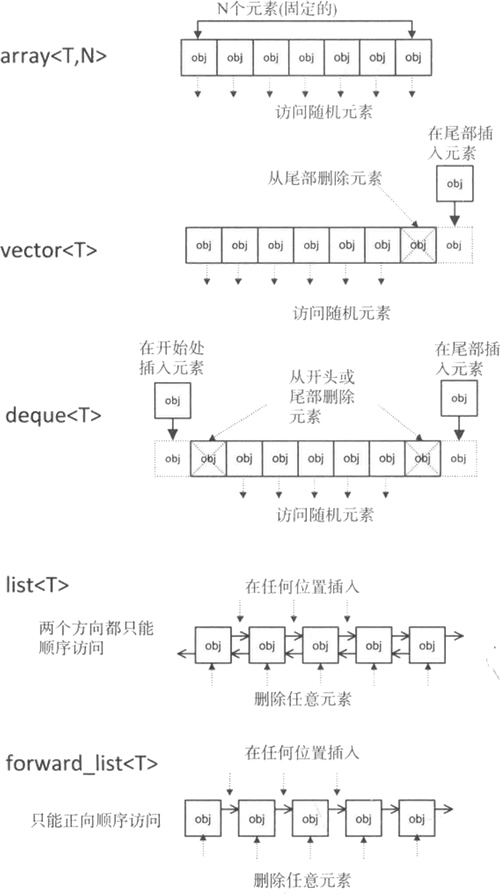

#  容器是什么？

在实际的开发过程中，合理组织数据的存取与选择处理数据的算法同等重要，存取数据的方式往往会直接影响到对它们进行增删改查操作的复杂程度和时间消耗。事实上，当程序中存在对时耗要求很高的部分时，[数据结构](http://c.biancheng.net/data_structure/)的选择就显得尤为重要，有时甚至直接影响程序执行的成败。

值得一提的是，之前我们一直在不断地重复实现一些诸如链表、顺序表等等这些常见的数据结构，这些代码使用起来往往都十分类似，只是为了适应不同数据的变化，可能需要在一些细节上做不同的处理。

那么大家有没有想过，是不是可以重复利用那些已有的实现来完成当前的任务呢？当然是可行的，有些读者已经亲自编写并实现了动态数组类、链表类、集合类等程序，并精心维护着。其实，[STL](http://c.biancheng.net/stl/) 中提供了专家级的几乎我们所需要的各种容器，功能更好，复用性更高。

简单的理解容器，它就是一些模板类的集合，但和普通模板类不同的是，容器中封装的是组织数据的方法（也就是数据结构）。STL 提供有 3 类标准容器，分别是**序列容器**、**关联容器**和**哈希容器**。它们各自的含义如表 1 所示。

| 容器种类 | 功能                                                         |
| -------- | ------------------------------------------------------------ |
| 序列容器 | 主要包括 vector 向量容器、list 列表容器以及 deque 双端队列容器。<br>之所以被称为序列容器，是因为元素在容器中的位置同元素的值无关，<br>即容器不是排序的。将元素插入容器时，指定在什么位置，元素就会位于什么位置。 |
| 关联容器 | 包括 set 集合容器、multiset多重集合容器、map映射容器以及 multimap 多重映射容器。<br/>排序容器中的元素默认是由小到大排序好的，即便是插入元素，元素也会插入到适当位置。<br/>所以关联容器在查找时具有非常好的性能。 |
| 哈希容器 | [C++](http://c.biancheng.net/cplus/) 11 新加入 4 种关联式容器，分别是 unordered_set 哈希集合、unordered_multiset 哈希多重集合、<br/>unordered_map 哈希映射以及 unordered_multimap 哈希多重映射。和排序容器不同，哈希容器中的元素是未排序的，元素的位置由哈希函数确定。 |

> 以上 3 类容器的存储方式完全不同，因此使用不同容器完成相同操作的效率也大不相同。所以在实际使用时，要善于根据想实现的功能，选择合适的容器。有关这些容器的具体用法，本章后续会逐个进行介绍。

## 序列式容器

### 简介

所谓序列容器，即以线性排列（类似普通数组的存储方式）来存储某一指定类型（例如 int、double 等）的数据，需要特殊说明的是，该类容器并不会自动对存储的元素按照值的大小进行排序。

需要注意的是，序列容器只是一类容器的统称，并不指具体的某个容器，序列容器大致包含以下几类容器：

- array<T,N>（数组容器）：表示可以存储 N 个 T 类型的元素，是 [C++](http://c.biancheng.net/cplus/) 本身提供的一种容器。此类容器一旦建立，其长度就是固定不变的，这意味着不能增加或删除元素，只能改变某个元素的值；
- vector<T>（向量容器）：用来存放 T 类型的元素，是一个长度可变的序列容器，即在存储空间不足时，会自动申请更多的内存。使用此容器，在尾部增加或删除元素的效率最高（时间复杂度为 O(1) 常数阶），在其它位置插入或删除元素效率较差（时间复杂度为 O(n) 线性阶，其中 n 为容器中元素的个数）；
- deque<T>（双端队列容器）：和 vector 非常相似，区别在于使用该容器不仅尾部插入和删除元素高效，在头部插入或删除元素也同样高效，时间复杂度都是 O(1) 常数阶，但是在容器中某一位置处插入或删除元素，时间复杂度为 O(n) 线性阶；
- list<T>（链表容器）：是一个长度可变的、由 T 类型元素组成的序列，它以双向链表的形式组织元素，在这个序列的任何地方都可以高效地增加或删除元素（时间复杂度都为常数阶 O(1)），但访问容器中任意元素的速度要比前三种容器慢，这是因为 list<T> 必须从第一个元素或最后一个元素开始访问，需要沿着链表移动，直到到达想要的元素。
- forward_list<T>（正向链表容器）：和 list 容器非常类似，只不过它以单链表的形式组织元素，它内部的元素只能从第一个元素开始访问，是一类比链表容器快、更节省内存的容器。

> 注意，其实除此之外，stack<T> 和 queue<T> 本质上也属于序列容器，只不过它们都是在 deque 容器的基础上改头换面而成，通常更习惯称它们为容器适配器，我们会在后续的课程中学习它们。

下图说明了可供使用的序列容器以及它们之间的区别。



上图中每种类型容器写出的操作都可以高效执行，但进行除此之外的其他操作，效率会稍差一些。

### 常见的成员函数

序列容器包含一些相同的成员函数，它们的功能也相同，本教程会在某个容器的上下文中详细介绍下面的每个函数，但对于每种类型的容器不会重复介绍它们的细节。

下表展示了 array、vector 和 deque 容器的函数成员，它们中至少有两个容器实现了同样的函数成员。

| 函数成员         | 函数功能                                                     | array<T,N> | vector<T> | deque<T> |
| ---------------- | ------------------------------------------------------------ | ---------- | --------- | -------- |
| begin()          | 返回指向容器中第一个元素的迭代器。                           | 是         | 是        | 是       |
| end()            | 返回指向容器最后一个元素所在位置后一个位置的迭代器，通常和 begin() 结合使用。 | 是         | 是        | 是       |
| rbegin()         | 返回指向最后一个元素的迭代器。                               | 是         | 是        | 是       |
| rend()           | 返回指向第一个元素所在位置前一个位置的迭代器。               | 是         | 是        | 是       |
| cbegin()         | 和 begin() 功能相同，只不过在其基础上，增加了 const 属性，不能用于修改元素。 | 是         | 是        | 是       |
| cend()           | 和 end() 功能相同，只不过在其基础上，增加了 const 属性，不能用于修改元素。 | 是         | 是        | 是       |
| crbegin()        | 和 rbegin() 功能相同，只不过在其基础上，增加了 const 属性，不能用于修改元素。 | 是         | 是        | 是       |
| crend()          | 和 rend() 功能相同，只不过在其基础上，增加了 const 属性，不能用于修改元素。 | 是         | 是        | 是       |
| assign()         | 用新元素替换原有内容。                                       | -          | 是        | 是       |
| operator=()      | 复制同类型容器的元素，或者用初始化列表替换现有内容。         | 是         | 是        | 是       |
| size()           | 返回实际元素个数。                                           | 是         | 是        | 是       |
| max_size()       | 返回元素个数的最大值。这通常是一个很大的值，一般是 232-1，所以我们很少会用到这个函数。 | 是         | 是        | 是       |
| capacity()       | 返回当前容量。                                               | -          | 是        | -        |
| empty()          | 判断容器中是否有元素，若无元素，则返回 true；反之，返回 false。 | 是         | 是        | 是       |
| resize()         | 改变实际元素的个数。                                         | -          | 是        | 是       |
| shrink _to_fit() | 将内存减少到等于当前元素实际所使用的大小。                   | -          | 是        | 是       |
| front()          | 返回第一个元素的引用。                                       | 是         | 是        | 是       |
| back()           | 返回最后一个元素的引用。                                     | 是         | 是        | 是       |
| operator[]()     | 使用索引访问元素。                                           | 是         | 是        | 是       |
| at()             | 使用经过边界检査的索引访问元素。                             | 是         | 是        | 是       |
| push_back()      | 在序列的尾部添加一个元素。                                   | -          | 是        | 是       |
| insert()         | 在指定的位置插入一个或多个元素。                             | -          | 是        | 是       |
| emplace()        | 在指定的位置直接生成一个元素。                               | -          | 是        | 是       |
| emplace_back()   | 在序列尾部生成一个元素。                                     | -          | 是        | 是       |
| pop_back()       | 移出序列尾部的元素。                                         | -          | 是        | 是       |
| erase()          | 移出一个元素或一段元素。                                     | -          | 是        | 是       |
| clear()          | 移出所有的元素，容器大小变为 0。                             | -          | 是        | 是       |
| swap()           | 交换两个容器的所有元素。                                     | 是         | 是        | 是       |
| data()           | 返回指向容器中第一个元素的指针。                             | 是         | 是        | -        |

list 和 forward_list 容器彼此非常相似，forward_list 中包含了 list 的大部分成员函数，而未包含那些需要反向遍历的函数。

下表展示了 list 和 forward_list 的函数成员。

| 函数成员        | 函数功能                                                     | list<T> | forward_list<T> |
| --------------- | ------------------------------------------------------------ | ------- | --------------- |
| begin()         | 返回指向容器中第一个元素的迭代器。                           | 是      | 是              |
| end()           | 返回指向容器最后一个元素所在位置后一个位置的迭代器。         | 是      | 是              |
| rbegin()        | 返回指向最后一个元素的迭代器。                               | 是      | -               |
| rend()          | 返回指向第一个元素所在位置前一个位置的迭代器。               | 是      | -               |
| cbegin()        | 和 begin() 功能相同，只不过在其基础上，增加了 const 属性，不能用于修改元素。 | 是      | 是              |
| before_begin()  | 返回指向第一个元素前一个位置的迭代器。                       | -       | 是              |
| cbefore_begin() | 和 before_begin() 功能相同，只不过在其基础上，增加了 const 属性，即不能用该指针修改元素的值。 | -       | 是              |
| cend()          | 和 end() 功能相同，只不过在其基础上，增加了 const 属性，不能用于修改元素。 | 是      | 是              |
| crbegin()       | 和 rbegin() 功能相同，只不过在其基础上，增加了 const 属性，不能用于修改元素。 | 是      | -               |
| crend()         | 和 rend() 功能相同，只不过在其基础上，增加了 const 属性，不能用于修改元素。 | 是      | -               |
| assign()        | 用新元素替换原有内容。                                       | 是      | 是              |
| operator=()     | 复制同类型容器的元素，或者用初始化列表替换现有内容。         | 是      | 是              |
| size()          | 返回实际元素个数。                                           | 是      | -               |
| max_size()      | 返回元素个数的最大值，这通常是一个很大的值，一般是 232-1，所以我们很少会用到这个函数。 | 是      | 是              |
| resize()        | 改变实际元素的个数。                                         | 是      | 是              |
| empty()         | 判断容器中是否有元素，若无元素，则返回 true；反之，返回 false。 | 是      | 是              |
| front()         | 返回容器中第一个元素的引用。                                 | 是      | 是              |
| back()          | 返回容器中最后一个元素的引用。                               | 是      | -               |
| push_back()     | 在序列的尾部添加一个元素。                                   | 是      | -               |
| push_front()    | 在序列的起始位置添加一个元素。                               | 是      | 是              |
| emplace()       | 在指定位置直接生成一个元素。                                 | 是      | -               |
| emplace_after() | 在指定位置的后面直接生成一个元素。                           | -       | 是              |
| emplace_back()  | 在序列尾部生成一个元素。                                     | 是      | -               |
| cmplacc_front() | 在序列的起始位生成一个元索。                                 | 是      | 是              |
| insert()        | 在指定的位置插入一个或多个元素。                             | 是      | -               |
| insert_after()  | 在指定位置的后面插入一个或多个元素。                         | -       | 是              |
| pop_back()      | 移除序列尾部的元素。                                         | 是      | -               |
| pop_front()     | 移除序列头部的元素。                                         | 是      | 是              |
| reverse()       | 反转容器中某一段的元素。                                     | 是      | 是              |
| erase()         | 移除指定位置的一个元素或一段元素。                           | 是      | -               |
| erase_after()   | 移除指定位置后面的一个元素或一段元素。                       | -       | 是              |
| remove()        | 移除所有和参数匹配的元素。                                   | 是      | 是              |
| remove_if()     | 移除满足一元函数条件的所有元素。                             | 是      | 是              |
| unique()        | 移除所有连续重复的元素。                                     | 是      | 是              |
| clear()         | 移除所有的元素，容器大小变为 0。                             | 是      | 是              |
| swap()          | 交换两个容器的所有元素。                                     | 是      | 是              |
| sort()          | 对元素进行排序。                                             | 是      | 是              |
| merge()         | 合并两个有序容器。                                           | 是      | 是              |
| splice()        | 移动指定位置前面的所有元素到另一个同类型的 list 中。         | 是      | -               |
| splice_after()  | 移动指定位置后面的所有元素到另一个同类型的 list 中。         | -       | 是              |

> 注意，大家没有必要死记这些表，它们仅供参考。在深入了解到容器是如何组织元素以后，你会本能地知道哪个容器能使用哪些成员函数。

### array

#### 简介

array 容器是 C++11 标准中新增的序列容器，简单地理解，它就是在 C++ 普通数组的基础上，添加了一些成员函数和全局函数。在使用上，它比普通数组更安全（原因后续会讲），且效率并没有因此变差。

和其它容器不同，array 容器的大小是固定的，无法动态的扩展或收缩，这也就意味着，在使用该容器的过程无法借由增加或移除元素而改变其大小，它只允许访问或者替换存储的元素。

array 容器以类模板的形式定义在 <array> 头文件，并位于命名空间 std 中，如下图所示：

```cpp
template <typename T, size_t N>
class array;
```

在 array<T,N> 类模板中，T 用于指明容器中的存储的具体数据类型，N 用于指明容器的大小，需要注意的是，这里的 N 必须是常量，不能用变量表示。

array容器的初始化和普通数组一致，除此之外，array 容器还提供有很多功能实用的成员函数。

| 成员函数            | 功能                                                         |
| ------------------- | ------------------------------------------------------------ |
| begin()             | 返回指向容器中第一个元素的随机访问迭代器。                   |
| end()               | 返回指向容器最后一个元素之后一个位置的随机访问迭代器，通常和 begin() 结合使用。 |
| rbegin()            | 返回指向最后一个元素的随机访问迭代器。                       |
| rend()              | 返回指向第一个元素之前一个位置的随机访问迭代器。             |
| cbegin()            | 和 begin() 功能相同，只不过在其基础上增加了 const 属性，不能用于修改元素。 |
| cend()              | 和 end() 功能相同，只不过在其基础上，增加了 const 属性，不能用于修改元素。 |
| crbegin()           | 和 rbegin() 功能相同，只不过在其基础上，增加了 const 属性，不能用于修改元素。 |
| crend()             | 和 rend() 功能相同，只不过在其基础上，增加了 const 属性，不能用于修改元素。 |
| size()              | 返回容器中当前元素的数量，其值始终等于初始化 array 类的第二个模板参数 N。 |
| max_size()          | 返回容器可容纳元素的最大数量，其值始终等于初始化 array 类的第二个模板参数 N。 |
| empty()             | 判断容器是否为空，和通过 size()==0 的判断条件功能相同，但其效率可能更快。 |
| at(n)               | 返回容器中 n 位置处元素的引用，该函数自动检查 n 是否在有效的范围内，如果不是则抛出 out_of_range 异常。 |
| front()             | 返回容器中第一个元素的直接引用，该函数不适用于空的 array 容器。 |
| back()              | 返回容器中最后一个元素的直接应用，该函数同样不适用于空的 array 容器。 |
| data()              | 返回一个指向容器首个元素的[指针](http://c.biancheng.net/c/80/)。利用该指针，可实现复制容器中所有元素等类似功能。 |
| fill(val)           | 将 val 这个值赋值给容器中的每个元素。                        |
| array1.swap(array2) | 交换 array1 和 array2 容器中的所有元素，但前提是它们具有相同的长度和类型。 |

另外，在 <array> 头文件中还重载了 get() 全局函数，该重载函数的功能是访问容器中指定的元素，并返回该元素的引用。

> 正是由于 array 容器中包含了 at() 这样的成员函数，使得操作元素时比普通数组更安全。（访问越界会有异常）

```cpp
int main()
{
	std::array<int, 10> nums = { 1,2,3,4 };
	//使用get获取指定下标的元素
	std::cout << std::get<2>(nums) << std::endl;
    //使用[]获取元素
    std::cout << nums[0] << std::endl;

	return 0;
}
```

除此之外，还可以使用to_array将普通的数组转为array容器。

```cpp
int counts[] = { 1,5,7,9 };
auto counts_array = std::to_array(counts);
```

#### 普通数组的“升级版

array本质上就是对普通数组的封装，然后提供了一系列的操作函数，但是在作为参数进行传递时，能携带大小信息，这是普通数组不能比拟的。

```cpp
void showArray(std::array<int, 10> arr)
{
	for (size_t i = 0; i < arr.size(); i++)
	{
		std::cout << i << " ";
	}
}

int main()
{
	std::array<int, 10> arr = { 1,2,3,4 };
	showArray(arr);
	return 0;
}
```

### vector

#### 简介

vector 容器是 STL中最常用的容器之一，它和 array 容器非常类似，都可以看做是对 C++普通数组的“升级版”。不同之处在于，array 实现的是静态数组（容量固定的数组），而 vector 实现的是一个动态数组，即可以进行元素的插入和删除，在此过程中，vector 会动态调整所占用的内存空间，整个过程无需人工干预。

vector 容器以类模板 vector<T>（ T 表示存储元素的类型）的形式定义在 <vector> 头文件中，并位于 std 命名空间中。

#### 创建vector方式

创建 vector 容器的方式有很多，大致可分为以下几种。

1）创建一个空vector

```cpp
std::vector<double> values;
```

注意，这是一个空的 vector 容器，因为容器中没有元素，所以没有为其分配空间。当添加第一个元素（比如使用 push_back() 函数）时，vector 会自动分配内存。

在创建好空容器的基础上，还可以像下面这样通过调用 reserve() 成员函数来增加容器的容量：

```cpp
values.reserve(20);
```

这样就设置了容器的内存分配，即至少可以容纳 20 个元素。注意，如果 vector 的容量在执行此语句之前，已经大于或等于 20 个元素，那么这条语句什么也不做；另外，调用 reserve() 不会影响已存储的元素，也不会生成任何元素，即 values 容器内此时仍然没有任何元素。


2）除了创建空 vector 容器外，还可以在创建的同时指定初始值以及元素个数，比如：

```cpp
std::vector<int> primes {2, 3, 5, 7, 11, 13, 17, 19};
```

这样就创建了一个含有 8 个素数的 vector 容器


3) 在创建 vector 容器时，也可以指定元素个数：

```cpp
std::vector<double> values(20);
```

如此，values 容器开始时就有 20 个元素，它们的默认初始值都为 0。

如果不想用 0 作为默认值，也可以指定一个其它值，例如：

```cpp
std::vector<double> values(20, 1.0);
```


4）通过存储元素类型相同的其它 vector 容器，也可以创建新的 vector 容器，例如：

```cpp
std::vector<char>value1(5, 'c');std::vector<char>value2(value1);
```

由此，value2 容器中也具有 5 个字符 'c'。在此基础上，如果不想复制其它容器中所有的元素，可以用一对[指针](http://c.biancheng.net/c/80/)或者迭代器来指定初始值的范围，例如：

```cpp
int array[]={1,2,3};
std::vector<int>values(array, array+2);//values 将保存{1,2}
std::vector<int>value1{1,2,3,4,5};
std::vector<int>value2(std::begin(value1),std::begin(value1)+3);//value2保存{1,2,3}
```

由此，value2 容器中就包含了 {1,2,3} 这 3 个元素。

#### 包含的成员函数

相比 array 容器，vector 提供了更多了成员函数供我们使用，它们各自的功能如表 1 所示。

| 函数成员         | 函数功能                                                     |
| ---------------- | ------------------------------------------------------------ |
| begin()          | 返回指向容器中第一个元素的迭代器。                           |
| end()            | 返回指向容器最后一个元素所在位置后一个位置的迭代器，通常和 begin() 结合使用。 |
| rbegin()         | 返回指向最后一个元素的迭代器。                               |
| rend()           | 返回指向第一个元素所在位置前一个位置的迭代器。               |
| cbegin()         | 和 begin() 功能相同，只不过在其基础上，增加了 const 属性，不能用于修改元素。 |
| cend()           | 和 end() 功能相同，只不过在其基础上，增加了 const 属性，不能用于修改元素。 |
| crbegin()        | 和 rbegin() 功能相同，只不过在其基础上，增加了 const 属性，不能用于修改元素。 |
| crend()          | 和 rend() 功能相同，只不过在其基础上，增加了 const 属性，不能用于修改元素。 |
| size()           | 返回实际元素个数。                                           |
| max_size()       | 返回元素个数的最大值。这通常是一个很大的值，一般是 232-1，所以我们很少会用到这个函数。 |
| resize()         | 改变实际元素的个数。                                         |
| capacity()       | 返回当前容量。                                               |
| empty()          | 判断容器中是否有元素，若无元素，则返回 true；反之，返回 false。 |
| reserve()        | 增加容器的容量。                                             |
| shrink _to_fit() | 将内存减少到等于当前元素实际所使用的大小。                   |
| operator[ ]      | 重载了 [ ] 运算符，可以向访问数组中元素那样，通过下标即可访问甚至修改 vector 容器中的元素。 |
| at()             | 使用经过边界检查的索引访问元素。                             |
| front()          | 返回第一个元素的引用。                                       |
| back()           | 返回最后一个元素的引用。                                     |
| data()           | 返回指向容器中第一个元素的指针。                             |
| assign()         | 用新元素替换原有内容。                                       |
| push_back()      | 在序列的尾部添加一个元素。                                   |
| pop_back()       | 移出序列尾部的元素。                                         |
| insert()         | 在指定的位置插入一个或多个元素。                             |
| erase()          | 移出一个元素或一段元素。                                     |
| clear()          | 移出所有的元素，容器大小变为 0。                             |
| swap()           | 交换两个容器的所有元素。                                     |
| emplace()        | 在指定的位置直接生成一个元素。                               |
| emplace_back()   | 在序列尾部生成一个元素。                                     |

#### 元素访问

##### 访问单个元素

首先，vector 容器可以向普通数组那样访问存储的元素，甚至对指定下标处的元素进行修改，比如：

```cpp
#include <iostream>
#include <vector>
using namespace std;
int main()
{
    vector<int> values{1,2,3,4,5};
    //获取容器中首个元素
    cout << values[0] << endl;
    //修改容器中下标为 0 的元素的值
    values[0] = values[1] + values[2] + values[3] + values[4];
    cout << values[0] << endl;
    return 0;
}
```

值得一提的是，`容器名[n]`这种获取元素的方式，需要确保下标 n 的值不会超过容器的容量（可以通过 capacity() 成员函数获取），否则会发生越界访问的错误（在debug模式下越界也会中断）。幸运的是，和 array 容器一样，vector 容器也提供了 at() 成员函数，当传给 at() 的索引会造成越界时，会抛出`std::out_of_range`异常。

```cpp
    std::vector<int> values{1, 2, 3, 4, 5};
	std::cout << values[5] << std::endl;
	std::cout << values.at(5) << std::endl;
```

> 可能有这样一个疑问，即为什么 vector 容器在重载 [] 运算符时，没有实现边界检查的功能呢？答案很简单，因为性能。如果每次访问元素，都去检查索引值，无疑会产生很多开销。当不存在越界访问的可能时，就能避免这种开销。

除此之外，vector 容器还提供了 2 个成员函数，即 front() 和 back()，它们分别返回 vector 容器中第一个和最后一个元素的引用，通过利用这 2 个函数返回的引用，可以访问（甚至修改）容器中的首尾元素。

```cpp
#include <iostream>
#include <vector>
using namespace std;
int main()
{
    vector<int> values{1,2,3,4,5};
    cout << "values 首元素为：" << values.front() << endl;
    cout << "values 尾元素为：" << values.back() << endl;
    //修改首元素
    values.front() = 10;
    cout <<"values 新的首元素为：" << values.front() << endl;
    //修改尾元素
    values.back() = 20;
    cout << "values 新的尾元素为：" << values.back() << endl;
    return 0;
}
```

另外，vector 容器还提供了 data() 成员函数，该函数的功能是返回指向容器中首个元素的[指针](http://c.biancheng.net/c/80/)。通过该指针也可以访问甚至修改容器中的元素。比如：

```cpp
#include <iostream>
#include <vector>
using namespace std;
int main()
{
    vector<int> values{1,2,3,4,5};
    //输出容器中第 3 个元素的值
    cout << *(values.data() + 2) << endl;
    //修改容器中第 2 个元素的值
    *(values.data() + 1) = 10;
    cout << *(values.data() + 1) << endl;
    return 0;
}
```

##### 访问多个元素

如果想访问 vector 容器中多个元素，可以借助 size() 成员函数，该函数可以返回 vector 容器中实际存储的元素个数。例如：

```cpp
#include <iostream>
#include <vector>
using namespace std;
int main()
{
    vector<int> values{1,2,3,4,5};
    //从下标 0 一直遍历到 size()-1 处
    for (int i = 0; i < values.size(); i++) {
        cout << values[i] << " ";
    }
    return 0;
}
```

或者也可以使用基于范围的循环，此方式将会逐个遍历容器中的元素。比如：

```cpp
#include <iostream>
#include <vector>
using namespace std;
int main()
{
    vector<int> values{1,2,3,4,5};
    for (auto&& value : values)
        cout << value << " ";
    return 0;
}
```

另外还可以使用 vector 迭代器遍历 vector 容器，这里以 begin()/end() 为例：

```cpp
#include <iostream>
#include <vector>
using namespace std;
int main()
{
    vector<int> values{1,2,3,4,5};
    for (auto first = values.begin(); first < values.end(); ++first) {
        cout << *first << " ";
    }
    return 0;
}
```

#### 添加元素

要知道，向 vector 容器中添加元素的唯一方式就是使用它的成员函数，如果不调用成员函数，非成员函数既不能添加也不能删除元素。这意味着，vector 容器对象必须通过它所允许的函数去访问，迭代器显然不行。

##### push_back()

```cpp
void push_back(const _Ty& _Val);
```

该成员函数的功能是在 vector 容器尾部添加一个元素，用法也非常简单

##### emplace_back()

```cpp
template <class... _Valty>
decltype(auto) emplace_back(_Valty&&... _Val);
```

该函数功能和 push_back() 相同，都是在 vector 容器的尾部添加一个元素。

既然它们实现的功能是一样的，那么 C++ 11 标准中为什么要多此一举呢？

##### emplace_back()和push_back()的区别

emplace_back() 和 push_back() 的区别，就在于底层实现的机制不同。push_back() 向容器尾部添加元素时，首先会创建这个元素，然后再将这个元素拷贝或者移动到容器中（如果是拷贝的话，事后会自行销毁先前创建的这个元素）；而 emplace_back() 在实现时，则是直接在容器尾部创建这个元素，省去了拷贝或移动元素的过程。

```cpp
class Foo
{
public:
	Foo() { std::cout << "构造函数" << std::endl; }
	Foo(const Foo&) { std::cout << "拷贝构造" << std::endl; }
	Foo(Foo&&) { std::cout << "移动构造" << std::endl; }
};

int main()
{
	std::vector<Foo> foos;
	std::cout << "push_back:" << std::endl;
	foos.push_back(Foo());

	std::vector<Foo> foos1;
	std::cout << "emplace_back:" << std::endl;
	foos1.emplace_back();
	
	return 0;
}
```

运行结果为:

```txt
push_back:
构造函数
移动构造
emplace_back:
构造函数
```

在此基础上，读者可尝试将 testDemo 类中的移动构造函数注释掉，再运行程序会发现，运行结果变为：

```cpp
push_back:
构造函数
拷贝构造
emplace_back:
构造函数
```

由此可以看出，push_back() 在底层实现时，会优先选择调用移动构造函数，如果没有才会调用拷贝构造函数。

显然完成同样的操作，push_back() 的底层实现过程比 emplace_back() 更繁琐，换句话说，emplace_back() 的执行效率比 push_back() 高。因此，在实际使用时，建议大家优先选用 emplace_back()。

除此之外，emplace_back在添加构造函数有多个参数的对象时，不需要自己提前构建对象，只需要把构造函数的参数作为emplace_back的参数即可：

```cpp
class Foo
{
public:
	Foo(int age,const std::string& name) { std::cout << "构造函数"<<age<<" "<<name << std::endl; }
	Foo(const Foo&) { std::cout << "拷贝构造" << std::endl; }
};

int main()
{
	std::vector<Foo> foos;
	std::cout << "push_back:" << std::endl;
	foos.push_back(Foo(1,"maye"));

	std::vector<Foo> foos1;
	std::cout << "emplace_back:" << std::endl;
	foos1.emplace_back(2,"顽石");
	
	return 0;
}
```

#### 插入元素

vector容器提供了 insert() 和 emplace() 这 2 个成员函数，用来实现在容器指定位置处插入元素。

##### insert

insert() 函数的功能是在 vector 容器的指定位置插入一个或多个元素。该函数的语法格式有多种

| 语法格式                        | 用法说明                                                     |
| ------------------------------- | ------------------------------------------------------------ |
| iterator insert(pos,elem)       | 在迭代器 pos 指定的位置之前插入一个新元素elem，并返回表示新插入元素位置的迭代器。 |
| iterator insert(pos,n,elem)     | 在迭代器 pos 指定的位置之前插入 n 个元素 elem，并返回表示第一个新插入元素位置的迭代器。 |
| iterator insert(pos,first,last) | 在迭代器 pos 指定的位置之前，插入其他容器（不仅限于vector）中位于 [first,last) 区域的所有元素，并返回表示第一个新插入元素位置的迭代器。 |
| iterator insert(pos,initlist)   | 在迭代器 pos 指定的位置之前，插入初始化列表（用大括号{}括起来的多个元素，中间有逗号隔开）中所有的元素，并返回表示第一个新插入元素位置的迭代器。 |

下面的例子，演示了如何使用 insert() 函数向 vector 容器中插入元素。

```cpp
#include <iostream> 
#include <vector> 
#include <array> 
using namespace std;
int main()
{
    std::vector<int> demo{1,2};
    //第一种格式用法
    demo.insert(demo.begin() + 1, 3);//{1,3,2}

    //第二种格式用法
    demo.insert(demo.end(), 2, 5);//{1,3,2,5,5}

    //第三种格式用法
    std::array<int,3>test{ 7,8,9 };
    demo.insert(demo.end(), test.begin(), test.end());//{1,3,2,5,5,7,8,9}

    //第四种格式用法
    demo.insert(demo.end(), { 10,11 });//{1,3,2,5,5,7,8,9,10,11}

    for (int i = 0; i < demo.size(); i++) {
        cout << demo[i] << " ";
    }
    return 0;
}
```

##### emplace

emplace()用于在 vector 容器指定位置之前插入一个新的元素。注意，emplace() 每次只能插入一个元素，而不是多个。

该函数的语法格式如下：

```cpp
template <class... _Valty>
iterator emplace(const_iterator _Where, _Valty&&... _Val)
```

其中，_Where为指定插入位置的迭代器；... _Val 表示与新插入元素的构造函数相对应的多个参数；该函数会返回表示新插入元素位置的迭代器。


和emplace_back类似，通过 insert() 函数向 vector 容器中插入 testDemo 类对象，需要调用类的构造函数和移动构造函数（或拷贝构造函数）；而通过 emplace() 函数实现同样的功能，只需要调用构造函数即可。

简单的理解，就是 emplace() 在插入元素时，是在容器的指定位置直接构造元素，而不是先单独生成，再将其复制（或移动）到容器中。因此，在实际使用中，推荐大家优先使用 emplace()。

#### 删除元素

前面提到，无论是向现有 vector 容器中访问元素、添加元素还是插入元素，都只能借助 vector 模板类提供的成员函数，但删除 vector 容器的元素例外，完成此操作除了可以借助本身提供的成员函数，还可以借助一些全局函数。

基于不同场景的需要，删除 vecotr 容器的元素，可以使用下表所示的函数（或者函数组合）。

| 函数                      | 功能                                                         |
| ------------------------- | ------------------------------------------------------------ |
| [pop_back()](#pop_back()) | 删除 vector 容器中最后一个元素，该容器的大小（size）会减 1，但容量（capacity）不会发生改变。 |
| erase(where)              | 删除 vector 容器中 pos 迭代器指定位置处的元素，并返回指向被删除元素下一个位置元素的迭代器。该容器的大小（size）会减 1，但容量（capacity）不会发生改变。 |
| swap(beg)、pop_back()     | 先调用 swap() 函数交换要删除的目标元素和容器最后一个元素的位置，然后使用 pop_back() 删除该目标元素。 |
| erase(beg,end)            | 删除 vector 容器中位于迭代器 [beg,end)指定区域内的所有元素，并返回指向被删除区域下一个位置元素的迭代器。该容器的大小（size）会减小，但容量（capacity）不会发生改变。 |
| remove()                  | 删除容器中所有和指定元素值相等的元素，并返回指向最后一个元素下一个位置的迭代器。值得一提的是，调用该函数不会改变容器的大小和容量。 |
| clear()                   | 删除 vector 容器中所有的元素，使其变成空的 vector 容器。该函数会改变 vector 的大小（变为 0），但不是改变其容量。 |

##### pop_back()

pop_back() 成员函数的用法非常简单，它不需要传入任何的参数，也没有返回值，一旦调用将会删除最后一个元素。

##### erase(where)

如果想删除 vector 容器中指定位置处的元素，可以使用 erase(where) 成员函数

其中，where为指定被删除元素位置的迭代器，同时该函数会返回一个指向删除元素所在位置下一个位置的迭代器。

另外，如果不在意容器中元素的排列顺序，可以结合 swap() 和 pop_back() 函数，同样可以实现删除容器中指定位置元素的目的。

```cpp
int main()
{
	std::vector<int> vec = { 1,2,3,4,5 };
	//要删除的元素和最后一个元素交换
	std::swap(*(vec.begin() + 1), *(vec.end() - 1));
	//std::swap(vec[0], vec[4]);		//与上面的等同

	for (auto v : vec)
	{
		std::cout << v << " ";
	}
	vec.pop_back();
	std::cout << std::endl;
	for (auto v : vec)
	{
		std::cout << v << " ";
	}

	return 0;
}
```

##### erase(first,last)

当然，除了删除容器中单个元素，还可以删除容器中某个指定区域内的所有元素，同样可以使用 erase() 成员函数实现。该函数有 2 种基本格式，前面介绍了一种，这里使用另一种：

```cpp
iterator erase(const_iterator _First, const_iterator _Last) 
```

其中 first 和 last 是指定被删除元素区域的迭代器，同时该函数会返回指向此区域之后一个位置的迭代器。

```cpp
#include <vector>
#include <iostream>
using namespace std;

int main()
{
    std::vector<int> demo{ 1,2,3,4,5 };
    //删除 2、3
    auto iter = demo.erase(demo.begin()+1, demo.end() - 2);
    cout << "size is :" << demo.size() << endl;
    cout << "capacity is :" << demo.capacity() << endl;

    for (int i = 0; i < demo.size(); i++) {
        cout << demo[i] << " ";
    }
    return 0;
}
```

运行结果为：

```cpp
size is :3
capacity is :5
1 4 5
```

可以看到，和删除单个元素一样，删除指定区域内的元素时，也会将该区域后续的元素前移，并缩小容器的大小。

##### remove

如果要删除容器中和指定元素值相同的所有元素，可以使用 remove() 函数，该函数定义在 `<algorithm>` 头文件中。例如：

```cpp
int main()
{
	std::vector<int> vec = { 1,3,3,4,5 };
	//删除vec中值为3的元素，返回待删除的第一个元素迭代器
	auto dit = std::remove(vec.begin(), vec.end(), 3);

	std::cout << "size is :" << vec.size() << std::endl;
	std::cout << "capacity is :" << vec.capacity() << std::endl;

	//输出所有元素
	for (auto v : vec)
	{
		std::cout << v << " ";
	}
	std::cout << std::endl;
	//输出未删除的元素
	for (auto it = vec.begin(); it != dit; it++)
	{
		std::cout << *it << " ";
	}

	return 0;
}
```

运行结果为：

```txt
size is :5
capacity is :5
1 4 5 4 5
1 4 5
```

注意，在对容器执行完 remove() 函数之后，由于该函数并没有改变容器原来的大小和容量，因此无法使用之前的方法遍历容器，而是需要向程序中那样，借助 remove() 返回的迭代器完成正确的遍历。

> remove() 的实现原理是，在遍历容器中的元素时，一旦遇到目标元素，就做上标记，然后继续遍历，直到找到一个非目标元素，即用此元素将最先做标记的位置覆盖掉，同时将此非目标元素所在的位置也做上标记，等待找到新的非目标元素将其覆盖。因此，如果将上面程序中 demo 容器的元素全部输出，得到的结果为 `1 4 5 4 3 5`。

另外还可以看到，既然通过 remove() 函数删除掉 demo 容器中的多个指定元素，该容器的大小和容量都没有改变，其剩余位置还保留了之前存储的元素。我们可以使用 erase() 成员函数删掉这些 "无用" 的元素。

```cpp
int main()
{
	std::vector<int> vec = { 1,3,3,4,5 };
	//删除vec中值为3的元素，返回待删除的第一个元素迭代器
	auto dit = std::remove(vec.begin(), vec.end(), 3);
	vec.erase(dit, vec.end());

	std::cout << "size is :" << vec.size() << std::endl;
	std::cout << "capacity is :" << vec.capacity() << std::endl;

	//输出所有元素
	for (auto v : vec)
	{
		std::cout << v << " ";
	}

	return 0;
}
```

> remove函数还有一个兄弟版本remove_if，此函数可以自定义删除条件。

##### clear

如果想删除容器中所有的元素，则可以使用 clear() 成员函数

#### 迭代器失效

对于序列式容器，当元素被删除后，其后的所有元素的迭代器都会失效，这是因为vector，deque都是连续存储的一段空间，所以当对其进行erase操作时，其后的每一个元素都会向前移一个位置。

```cpp
int main()
{
	std::vector<int> vec = { 1,3,3,4,5};
	
	for (auto it = vec.begin(); it != vec.end();  it++)
	{
		if (*it > 3)
			vec.erase(it);
	}

	for (auto v : vec)
	{
		std::cout << v << " ";
	}

	return 0;
}
```

运行结果：


给出的报错信息是：vector iterator not incrementable。已经失效的迭代器不能进行++操作，所以程序中断了。不过vector的erase操作可以返回下一个有效的迭代器，所以只要我们每次执行删除操作的时候，将下一个有效迭代器返回就可以顺利执行后续操作了，代码修改如下：

```cpp
int main()
{
	std::vector<int> vec = { 1,3,3,4,5};
	
	for (auto it = vec.begin(); it != vec.end(); )
	{
		if (*it > 3)
			it = vec.erase(it);
		else
			it++;
	}

	for (auto v : vec)
	{
		std::cout << v << " ";
	}

	return 0;
}
```

这样删除后it指向的元素后，返回的是下一个元素的迭代器，这个迭代器是vector内存调整过后新的有效的迭代器。此时就可以进行正确的删除与访问操作了。

上面举了删除元素造成的vector迭代器失效问题，对于vector的插入元素也可以同理得到验证。

```cpp
int main()
{
	std::vector<int> vec = { 1,3,3,4,5};
	
	auto first = vec.begin();
	std::cout << "first " << *first << std::endl;

	vec.push_back(99);
	
	//插入元素后，让原来的迭代器失效了
	std::cout << "first " << *first << std::endl;


	return 0;
}
```

运行结果为:


在未添加元素之前，我们保存了开始迭代器，而在添加时，因为会重新开辟内存空间，导致迭代器失效了。


#### 避免不必要的扩容

 vector 容器看做是一个动态数组。换句话说，在不超出 vector 最大容量限制（max_size() 成员方法的返回值）的前提下，该类型容器可以自行扩充容量来满足用户存储更多元素的需求。

值得一提的是，vector 容器扩容的整个过程，和 realloc() 函数的实现方法类似，大致分为以下 4 个步骤：

1. 分配一块大小是当前 vector 容量几倍的新存储空间。注意，多数 STL 版本中的 vector 容器，其容器都会以 2 的倍数增长，也就是说，每次 vector 容器扩容，它们的容量都会提高到之前的 2 倍；
2. 将 vector 容器存储的所有元素，依照原有次序从旧的存储空间复制到新的存储空间中；
3. 析构掉旧存储空间中存储的所有元素；
4. 释放旧的存储空间。

通过以上分析不难看出，vector 容器的扩容过程是非常耗时的，并且当容器进行扩容后，之前和该容器相关的所有指针、迭代器以及引用都会失效。因此在使用 vector 容器过程中，我们应尽量避免执行不必要的扩容操作。

要实现这个目标，可以借助 vector 模板类中提供的 reserve() 成员方法。不过在讲解如何用 reserve() 方法避免 vector 容器进行不必要的扩容操作之前，vector 模板类中还提供有几个和 reserve() 功能类似的成员方法，很容易混淆，这里有必要为读者梳理一下，如表 1 所示。

| 成员方法   | 功能                                                         |
| ---------- | ------------------------------------------------------------ |
| size()     | 告诉我们当前 vector 容器中已经存有多少个元素，但仅通过此方法，无法得知 vector 容器有多少存储空间。 |
| capacity() | 告诉我们当前 vector 容器总共可以容纳多少个元素。如果想知道当前 vector 容器有多少未被使用的存储空间，可以通过 capacity()-size() 得知。注意，如果 size() 和 capacity() 返回的值相同，则表明当前 vector 容器中没有可用存储空间了，这意味着，下一次向 vector 容器中添加新元素，将导致 vector 容器扩容。 |
| resize(n)  | 强制 vector 容器必须存储 n 个元素，注意，如果 n 比 size() 的返回值小，则容器尾部多出的元素将会被析构（删除）；如果 n 比 size() 大，则 vector 会借助默认构造函数创建出更多的默认值元素，并将它们存储到容器末尾；如果 n 比 capacity() 的返回值还要大，则 vector 会先扩增，在添加一些默认值元素。 |
| reserve(n) | 强制 vector 容器的容量至少为 n。注意，如果 n 比当前 vector 容器的容量小，则该方法什么也不会做；反之如果 n 比当前 vector 容器的容量大，则 vector 容器就会扩容。 |

通过对以上几个成员方法功能的分析，我们可以总结出一点，即只要有新元素要添加到 vector 容器中而恰好此时 vector 容器的容量不足时，该容器就会自动扩容。

因此，避免 vector 容器执行不必要的扩容操作的关键在于，在使用 vector 容器初期，就要将其容量设为足够大的值。换句话说，在 vector 容器刚刚构造出来的那一刻，就应该借助 reserve() 成员方法为其扩充足够大的容量。

举个例子，假设我们想创建一个包含 1~1000 的 vector<int>，通常会这样实现：

```cpp
vector<int>myvector;
for (int i = 1; i <= 1000; i++) {
    myvector.push_back(i);
}
```

值得一提的是，上面代码的整个循环过程中，vector 容器会进行 2~10 次自动扩容（多数的 STL 标准库版本中，vector 容器通常会扩容至当前容量的 2 倍，而这里 1000≈2^10），程序的执行效率可想而知。

在上面程序的基础上，下面代码演示了如何使用 reserve() 成员方法尽量避免 vector 容器执行不必要的扩容操作：

```cpp
vector<int>myvector;
myvector.reserve(1000);
cout << myvector.capacity();
for (int i = 1; i <= 1000; i++) {
    myvector.push_back(i);
}
```

相比前面的代码实现，整段程序在运行过程中，vector 容器的容量仅扩充了 1 次，执行效率大大提高。

当然在实际场景中，我们可能并不知道 vector 容器到底要存储多少个元素。这种情况下，可以先预留出足够大的空间，当所有元素都存储到 vector 容器中之后，再去除多余的容量。

关于怎样去除 vector 容器多余的容量，可以借助该容器模板类提供的 shrink_to_fit() 成员方法，另外后续还会讲解如何使用 swap() 成员方法去除 vector 容器多余的容量，两种方法都可以。


vector 模板类中提供有一个 shrink_to_fit() 成员方法，该方法的功能是将当前 vector 容器的容量缩减至和实际存储元素的个数相等。例如:

```cpp
int main()
{
	std::vector<int> vec;
	for (size_t i = 0; i < 20; i++)
	{
		vec.push_back(i);
	}
	std::cout << "before" << std::endl;
	std::cout << "capacity is " << vec.capacity() << std::endl;
	std::cout << "size is " << vec.size() << std::endl;

	vec.shrink_to_fit();

	std::cout << "\nafter" << std::endl;
	std::cout << "capacity is " << vec.capacity() << std::endl;
	std::cout << "size is " << vec.size() << std::endl;

	return 0;
}
```

运行结果为:

```txt
before
capacity is 28
size is 20

after
capacity is 20
size is 20
```

显然，vector 容器的容量由 28 缩减到了 20。

##### 利用swap()方法去除vector多余容量

除此之外，vector 模板类中还提供有 swap() 成员方法，该方法的基础功能是交换 2 个相同类型的 vector 容器（交换容量和存储的所有元素），但其也能用于去除 vector 容器多余的容量。

如下代码所示，把`vec.shrink_to_fit();`换成交换即可：

```cpp
	{
		auto tmp = vec;
		std::swap(vec, tmp);
		//vec.swap(tmp);	//与上面的等价
	}
```

此行代码的执行流程可细分为以下 3 步：

1) 先执行auto tmp = vec;，此表达式会调用 vector 拷贝构造函数，从而创建出一个临时的 vector 容器tmp。

> 注意，vector 模板类中的拷贝构造函数只会为拷贝的元素分配存储空间。换句话说，tmp临时容器中没有空闲的存储空间，其容量等于存储元素的个数。

2) 然后借助 swap() 成员方法对 tmp临时容器和 vec容器进行调换，此过程不仅会交换 2 个容器存储的元素，还会交换它们的容量。

3) 当超出tmp作用域时，临时的 tmp容器会被销毁，其占据的存储空间都会被释放。注意，这里释放的其实是vec容器原来所占用的存储空间。

经过以上 3 个步骤，就成功的将 vec容器的容量由 28缩减至 20。

##### 利用swap()方法清空vector容器

swap() 方法还可以用来清空 vector 容器。

```cpp
	{
		std::vector<int> tmp;
		std::swap(vec,tmp);
		//vec.swap(tmp);	//与上面的等价
	}
```

只需要让vec与一个空容器进行交换即可！

#### vector\<bool>不是存储bool类型元素的vector容器！

特别需要提醒的是，在使用 vector 容器时，要尽量避免使用该容器存储 bool 类型的元素，即避免使用 vector<bool>。

具体来讲，不推荐使用 vector<bool> 的原因有以下 2 个：

1. 严格意义上讲，vector<bool> 并不是一个 STL 容器；
2. vector<bool> 底层存储的并不是 bool 类型值。

大家可能会感到有些困惑，别着急，继续往下读。

值得一提的是，对于是否为 STL 容器，C++ 标准库中有明确的判断条件，其中一个条件是：如果 cont 是包含对象 T 的 STL 容器，且该容器中重载了 [ ] 运算符（即支持 operator[]），则以下代码必须能够被编译：

```cpp
T *p = &cont[0];
```

此行代码的含义是，借助 operator[ ] 获取一个 cont<T> 容器中存储的 T 对象，同时将这个对象的地址赋予给一个 T 类型的指针。

这就意味着，如果 vector<bool> 是一个 STL 容器，则下面这段代码是可以通过编译的：

```cpp
//创建一个 vector<bool> 容器
vector<bool>cont{0,1};
//试图将指针 p 指向 cont 容器中第一个元素
bool *p = &cont[0];
```

但不幸的是，此段代码不能通过编译。原因在于 vector<bool> 底层采用了独特的存储机制。

实际上，为了节省空间，vector<bool> 底层在存储各个 bool 类型值时，每个 bool 值都只使用一个比特位（二进制位）来存储。也就是说在 vector<bool> 底层，一个字节可以存储 8 个 bool 类型值。在这种存储机制的影响下，operator[ ] 势必就需要返回一个指向单个比特位的引用，但显然这样的引用是不存在的。

同样对于指针来说，其指向的最小单位是字节，无法另其指向单个比特位。综上所述可以得出一个结论，即上面第 2 行代码中，用 = 赋值号连接 bool *p 和 &cont[0] 是矛盾的。

由于 vector<bool> 并不完全满足 C++ 标准中对容器的要求，所以严格意义上来说它并不是一个 STL 容器。可能有读者会问，既然 vector<bool> 不完全是一个容器，为什么还会出现在 C++ 标准中呢？

这和一个雄心勃勃的试验有关，还要从前面提到的代理对象开始说起。由于代理对象在 C++ 软件开发中很受欢迎，引起了 C++ 标准委员会的注意，他们决定以开发 vector<bool> 作为一个样例，来演示 STL 中的容器如何通过代理对象来存取元素，这样当用户想自己实现一个基于代理对象的容器时，就会有一个现成的参考模板。

然而开发人员在实现 vector<bool> 的过程中发现，既要创建一个基于代理对象的容器，同时还要求该容器满足 C++ 标准中对容器的所有要求，是不可能的。由于种种原因，这个试验最终失败了，但是他们所做过的尝试（即开发失败的 vector<bool>）遗留在了 C++ 标准中。

> 至于将 vector<bool> 遗留到 C++ 标准中，是无心之作，还是有意为之，这都无关紧要，重要的是让读者明白，vector<bool> 不完全满足 C++ 标准中对容器的要求，尽量避免在实际场景中使用它！

那么，如果在实际场景中需要使用 vector<bool> 这样的存储结构，该怎么办呢？很简单，可以选择使用 deque<bool>、vector<char> 或者 bitset 来替代 vector<bool>。

要知道，deque 容器几乎具有 vecotr 容器全部的功能（拥有的成员方法也仅差 reserve() 和 capacity()），而且更重要的是，deque 容器可以正常存储 bool 类型元素。

> 有关 deque 容器的具体用法，后续章节会做详细讲解。

还可以考虑用 bitset 代替 vector<bool>，其本质是一个模板类，可以看做是一种类似数组的存储结构。和后者一样，bitset 只能用来存储 bool 类型值，且底层存储机制也采用的是用一个比特位来存储一个 bool 值。

和 vector 容器不同的是，bitset 的大小在一开始就确定了，因此不支持插入和删除元素；另外 bitset 不是容器，所以不支持使用迭代器。

### deque

deque 是 double-ended queue 的缩写，又称双端队列容器。

deque 容器和 vecotr 容器有很多相似之处，比如：

- deque 容器也擅长在序列尾部添加或删除元素（时间复杂度为`O(1)`），而不擅长在序列中间添加或删除元素。
- deque 容器也可以根据需要修改自身的容量和大小。

和 vector 不同的是，deque 还擅长在序列头部添加或删除元素，所耗费的时间复杂度也为常数阶`O(1)`。并且更重要的一点是，deque 容器中存储元素并不能保证所有元素都存储到连续的内存空间中。

> 当需要向序列两端频繁的添加或删除元素时，应首选 deque 容器。

deque 容器以模板类 deque<T>（T 为存储元素的类型）的形式在 <deque> 头文件中，并位于 std 命名空间中。

#### 相对于vector增加的函数

和 vector 相比，额外增加了实现在容器头部添加和删除元素的成员函数，同时删除了 capacity()、reserve() 和 data() 成员函数。

|函数成员|函数功能|
| ------------ | -------------------------- |
| push_back()  | 在序列的尾部添加一个元素。 |
| push_front() | 在序列的头部添加一个元素。 |
| pop_back()   | 移除容器尾部的元素。       |
| pop_front()  | 移除容器头部的元素。       |
| emplace_front() | 在容器头部生成一个元素。和 push_front() 的区别是，该函数直接在容器头部构造元素，省去了复制移动元素的过程。 |
| emplace_back()  | 在容器尾部生成一个元素。和 push_back() 的区别是，该函数直接在容器尾部构造元素，省去了复制移动元素的过程。 |

### list

[STL](http://c.biancheng.net/stl/) list 容器，又称双向链表容器，即该容器的底层是以双向链表的形式实现的。这意味着，list 容器中的元素可以分散存储在内存空间里，而不是必须存储在一整块连续的内存空间中。
|函数成员|函数功能|
| ----------- | ------------------------------------------------------------ |
| splice()    | 将一个 list 容器中的元素插入到另一个容器的指定位置。         |
| remove(val) | 删除容器中所有等于 val 的元素。                              |
| remove_if() | 删除容器中满足条件的元素。                                   |
| unique()    | 删除容器中相邻的重复元素，只保留一个。                       |
| merge()     | 合并两个事先已排好序的 list 容器，并且合并之后的 list 容器依然是有序的。 |
| sort()      | 通过更改容器中元素的位置，将它们进行排序。                   |
| reverse()   | 反转容器中元素的顺序。                                       |

### forward_list

forward_list 是 [C++](http://c.biancheng.net/cplus/) 11 新添加的一类容器，其底层实现和 list 容器一样，采用的也是链表结构，只不过 forward_list 使用的是单链表，而 list 使用的是双向链表

forward_list 容器具有和 list 容器相同的特性，即擅长在序列的任何位置进行插入元素或删除元素的操作，但对于访问存储的元素，没有其它容器（如 array、vector）的效率高。

另外，由于单链表没有双向链表那样灵活，因此相比 list 容器，forward_list 容器的功能受到了很多限制。比如，由于单链表只能从前向后遍历，而不支持反向遍历，因此 forward_list 容器只提供前向迭代器，而不是双向迭代器。这意味着，forward_list 容器不具有 rbegin()、rend() 之类的成员函数。


那么，既然 forward_list 容器具有和 list 容器相同的特性，list 容器还可以提供更多的功能函数，forward_list 容器有什么存在的必要呢？

当然有，forward_list 容器底层使用单链表，也不是一无是处。比如，存储相同个数的同类型元素，单链表耗用的内存空间更少，空间利用率更高，并且对于实现某些操作单链表的执行效率也更高。

> 效率高是选用 forward_list 而弃用 list 容器最主要的原因，换句话说，只要是 list 容器和 forward_list 容器都能实现的操作，应优先选择 forward_list 容器。

