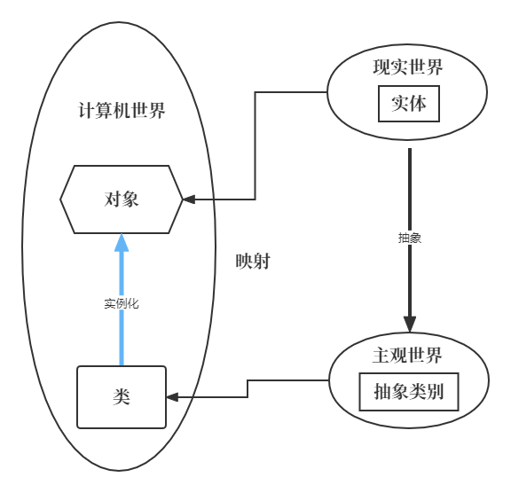
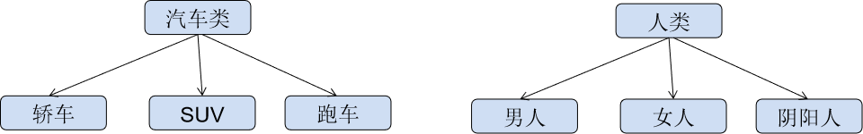

# 类和对象

## 面向对象

### 概念

面向对象编程（Object-Oriented Programming，简称OOP）是一种**编程范式**，它使用“**对象**”来设计应用程序和计算机程序。它利用了抽象、封装、继承和多态这些概念。

面向对象是一种对**现实世界理解和抽象**的方法，是计算机编程技术发展到一定阶段后的产物。

面向对象是相对于面向过程来讲的，面向对象方法`把相关的数据和方法组织为一个整体`来看待，从更高的层次来进行系统建模，更贴近事物的自然运行模式。

+ 面向过程：关注“怎么做”（步骤），就是分析出解决问题所需要的步骤，然后用函数把这些步骤一步一步实现，使用的时候一个一个依次调用就可以了。
+ 面向对象：关注“谁来做”（对象），是把构成问题事务分解成各个对象，建立对象的目的不是为了完成一个步骤，而是为了描述某个事物在整个解决问题的步骤中的行为。

### 四大特性

面相对象编程以类（Class）和对象（Object）作为组织代码的基本单元，并将封装，抽象，继承，多态四个特性作为代码设计和实现的基石。

#### 1、抽象(Abstraction)

抽象是将一类对象的**共同特征**总结出来构造类的过程，包括**数据抽象**和**行为抽象**两方面。数据抽象关注对象的哪些**属性**，而行为抽象关注对象的哪些**动作**。

+ 属性抽象 -->表示世界中一类事物的特征，就是对象的属性。比如鸟有翅膀，羽毛等(类的属性)

+ 行为抽象 -->表示世界中一类事物的行为，就是对象的行为。比如鸟会飞，会叫(类的方法)

#### 2、封装(Encapsulation)

封装是把**数据**和**操作数据的方法**绑定起来，对数据的访问只能通过已定义的接口。封装隐藏了对象的内部实现，只提供接口与外部世界交互。在C++中，封装通常通过访问修饰符（如`private`, `public`, `protected`）来实现。

封装保证了模块具有较好的独立性，使得程序维护修改较为容易。对应用程序的修改仅限于类的内部，因而可以将应用程序修改带来的影响减少到最低限度。

#### 3、继承(Inheritance)

继承是从**已有类创建新类**的一种机制。子类继承父类的属性和方法，同时可以添加新的属性和方法或重写部分方法。继承使得**代码重用**成为可能，例如，一个“汽车”类可以继承一个“交通工具”类的通用特性，同时添加特定于汽车的功能。

#### 4、多态(Polymorhism)

多态是指允许不同类的对象对同一消息作出响应的能力。在多态中，可以用父类类型的指针或引用来引用子类的实例。这意味着不同子类的对象可以被统一处理，而具体调用哪个子类的方法则取决于对象的实际类型。这增加了程序的灵活性。

**通过对面向对象编程的四大基础特性的深入理解和应用，我们可以构建出既强大又灵活的软件系统。这些特性共同作用，使得OOP成为了现代软件开发中不可或缺的一部分。**

### 什么是类和对象




#### 什么是类？

类，即类别：类是具有相似属性和行为的一组实例集合



#### 什么是对象？

在生活中，像张三，李四，王五，这样真真正正存在人的实体，我们称这些实体为对象。

在计算机中，类的实例就是对象。

## 类的定义和对象实例化

### 类的定义

**类**是一种用户定义的数据类型，它作为对象的蓝图。类定义了一组属性（数据成员）和方法（成员函数），这些属性和方法在创建类的对象时被封装在一起。对象是类的实例，通过类创建，并可以访问类的公共成员和函数。

要定义一个类，需要使用关键字 `struct`或`class`，后跟类名和一对花括号，其中包含数据成员和成员函数的定义。

例如，我们可以定义一个 `Person` 类来描述人的基本特征和行为：

```cpp
struct Person {
	//属性(成员变量)
	int id;
	std::string name;

	//行为(成员函数)
	void printInfo() {
		std::println("id: {}, name: {}", id, name);
	}
};
```

其中，属性就是对人类的描述，定义为类的**成员变量**；行为就是人类能做的动作，定义为类的**成员函数**。

### 对象实例化

定义好了类，就可以使用类来实例化对象了，实例化对象非常类似于声明基本类型的变量。

例如，定义 `Person` 类的两个对象：

```cpp
Person maye;				//定义在栈区
Person* zay = new Person;	//定义在堆区
```

可以使用直接成员访问运算符` .`或`->` 来访问类的对象的公共数据成员。

```cpp
maye.id = 1001;
maye.name = "maye";
maye.printInfo();

zay->id = 1002;
zay->name = "zay";
zay->printInfo();
delete zay;
```

当然，也可以在创建对象时，直接初始化成员变量：

```cpp
Person maye(1001, "maye");				
Person* zay = new Person(1002, "zay");
```

### 类成员变量初始化

在前面的测试中，我们都需要自己访问成员变量，然后赋值之后才能访问，否则就是垃圾值！其实可以直接在定义成员变量时，直接初始化的。

```cpp
struct Foo{
    //基础类型初始化
    int counter = 0;
    double pi = 3.1415;
    bool isReady = false;
    
    //使用花括号初始化
    int width{100};
    int height{50};
    
    //对象初始化
    std::string name{"Default Name"};
    
    //常量也可以初始化
    const int MaxSize = 1024;
    const char* ClassName = "Foo";
};
```

这样，就可以给一些成员变量设置默认值了。

## 访问控制(权限)

在C++中，类的访问权限通过`public`、`protected`和`private`三个关键字来定义，分别控制类成员在类内、类外以及继承中的可访问性。这种机制是面向对象编程中数据封装的重要体现。

- **公有权限（public）：**公有成员可以在类的内部和外部直接访问。通常用于定义类的接口函数，以便外部调用。
- **私有权限（private）：**私有成员只能在类的内部访问，类外无法直接访问。通常用于存储类的内部数据，需通过公有函数或友元函数间接访问。
- **保护权限（protected）：**保护成员只能在类的内部和派生类中访问，类外无法直接访问。适用于需要在继承中共享但不希望外部访问的成员。

### 私有成员

一般情况下，我们会将类的成员变量设置为私有，然后通过接口(成员函数)让外部间接访问私有成员。

如下所示，定义一个Point类，类里面定义了两个私有变量！

```cpp
struct Point {
private:    //私有，外部无法直接访问
    int m_x;
    int m_y;
};
```

`m_x`和`m_y`都是私有变量，在类的外部无法直接访问。

> 私有变量一般会使用`m_`或`_`开头以示区别，当然这只是一种约定俗成的规则，没有强制性~

注意，此时如果创建对象，则不能使用括号进行初始化了，因为在外部是无法访问私有成员的。

```cpp
 Point pos(1,2);		//error
 Point pos{1,2};		//error
```

必须在定义变量时直接初始化，或者提供接口进行赋值。

```cpp
struct Point {
	...
public:	
	void init(int x,int y) {
		m_x = x;
		m_y = y;
	}
};
```

使用`init`函数：

```cpp
Point pos;
pos.init(19,40);
```

### 公有成员

私有成员无法访问，那么如何在外部获取私有成员的值呢？这就需要通过公有函数向外部提供接口进行访问了！

```cpp
struct Point {
private:    //私有，外部无法直接访问
    int m_x;
    int m_y;
public:     //公有，外部可以直接访问
    //get方法:获取成员变量的值
    int x() { return m_x; }
    int y() { return m_y; }

    //set方法:给成员变量设置值
    void setX(int x) { m_x = x; }
    void setY(int y) { m_y = y; }
};
```

通过getter方法和setter方法能获取和修改成员变量的值！

> Getter方法和Setter方法是面向对象编程中常用的方法，用于访问和修改对象的属性（成员变量）。
>
> Getter方法（也称为访问器）用于获取对象的属性值。它通常是一个公共的非静态方法，不接受任何参数，并返回属性的值。Getter方法的命名常以"get"开头(C++中通常不以get开头)，后面跟着属性的名称。
>
> Setter方法（也称为修改器）用于修改对象的属性值。它通常是一个公共的非静态方法，接受一个参数，并用参数的值来更新属性的值。Setter方法的命名常以"set"开头，后面跟着属性的名称。例如，如果有一个名为"m_x"的属性，对应的Setter方法命名为"setX"。

**返回引用**

在某些时候，如果不太想提供getter和setter方法，可以通过返回引用实现获取和修改！

```cpp
public:
    int& rx() { return m_x; }
    int& ry() { return m_y; }
```

测试如下：

```cpp
Point pos;
pos.rx() = 10;
pos.ry() = 20;

std::println("x:{} y:{}", pos.rx(), pos.ry());
```

### class和struct的区别

在 C++ 中，`class` 和 `struct` 都用于定义自定义数据类型，封装数据和函数。它们的主要区别在于**默认访问权限**和**默认继承方式**，以及一些历史和设计习惯上的差异。

#### 默认访问权限

- **`class`**：默认成员（变量和函数）为 **`private`**。
- **`struct`**：默认成员为 **`public`**。

```cpp
class MyClass {
    int x;  // 默认private，类外部无法直接访问
};

struct MyStruct {
    int y;  // 默认public，类外部可直接访问
};

int main() {
    MyClass obj1;
    // obj1.x = 10;  // 错误：无法访问private成员
    
    MyStruct obj2;
    obj2.y = 20;  // 合法：public成员可直接访问
}
```

####  默认继承方式

- **`class`**：默认继承方式为 **`private`**。
- **`struct`**：默认继承方式为 **`public`**。

```cpp
class Base { public: int value; };

class DerivedClass : Base { /* ... */ };  // 默认为private继承
struct DerivedStruct : Base { /* ... */ };  // 默认为public继承

int main() {
    DerivedStruct s;
    s.value = 10;  // 合法：public继承，value仍为public
    
    DerivedClass c;
    // c.value = 10;  // 错误：private继承，value变为private
}
```

#### 设计意图

- **`class`**：更适合实现**面向对象的抽象**，如封装、继承、多态，通常用于定义复杂类型。
- **`struct`**：历史上源于 C 语言，主要用于**数据聚合**（Data Aggregate），即简单地封装数据。

## 成员函数申明和定义分离

如果一个类只被一个程序使用，那么类的声明（Declaration）和成员函数的定义（Definition）可以直接写在程序的开头。但是，如果一个类被多个程序使用，这样做的重复工作量就很大了，效率就太低了。在面向对象的程序开发中，一般做法就是将类的声明（其中包含成员函数的声明）放在指定的头.h文件中，用户如果想用该类，只要把有关的.h头文件包含进来即可，不必在程序中重复书写类的声明，提高编程的效率。

也就是说申明和定义分离有如下好处：

- **代码组织**：将接口（声明）和实现分开，使头文件（`.h`/`.hpp`）专注于类的定义，源文件（`.cpp`）专注于功能实现。
- **编译效率**：修改实现文件不需要重新编译所有包含头文件的代码，减少编译时间。
- **信息隐藏**：用户只需包含头文件即可使用类，无需关心具体实现细节。
- **复用性**：头文件可被多个源文件包含，实现共享。

### 分离声明和实现

例如，有如下`User`类！

```cpp
class  User{
private:
	int _id;
	std::string _name;

public:
	int id() { return _id; }
	void setId(int id) { _id = id; }

	const std::string& name() { return _name; }
	void setName(const std::string& name) { _name = name; }
};

```

#### 类内部声明/外部实现

**声明**

声明可以放到`User.h`头文件中。

```cpp
class  User{
private:
	int _id;
	std::string _name;

public:
	int id();
	void setId(int id);

	const std::string& name();
	void setName(const std::string& name);
};
```

**实现**

实现可以放到`User.cpp`源文件中。

```cpp
int User::id() { return _id; }
void User::setId(int id) { _id = id; }

const std::string& User::name() { return _name; }
void User::setName(const std::string& name) { _name = name; }
```

通常会将申明放到头文件中，实现放到源文件中~

#### 内联函数的分离

内联函数的实现必须在头文件中，但必须通过`inline`关键字明确声明：

```cpp
class  User{
private:
	int _id;
	std::string _name;

public:
	inline int id();
	inline void setId(int id);

	inline const std::string& name();
	inline void setName(const std::string& name);
};


inline int User::id() { return _id; }
inline void User::setId(int id) { _id = id; }

inline const std::string& User::name() { return _name; }
inline void User::setName(const std::string& name) { _name = name; }
```

### 分离的优缺点

- **优点**：
  - 代码结构清晰，便于维护。
  - 减少编译依赖，提高编译速度。
  - 实现细节隐藏，增强安全性。
- **缺点**：
  - 文件数量增多，项目结构更复杂。
  - 模板类的实现必须放在头文件中，部分破坏了分离原则。
