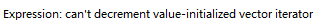
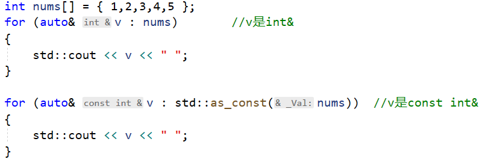

# 迭代器

## 简介

迭代器(iterator)是一种抽象的设计概念，在容器中指出一个位置、或成对使用以划定一个区域，用来限定操作所涉及到的数据范围。

迭代器提供一种方法，使之能够依序寻访某个容器所含的各个元素，而又无需暴露该容器的内部表示方式。(实际上是封装了指针的类)

迭代器是STL的关键所在，STL的中心思想在于将容器(container)和算法(algorithms)分开，彼此独立设计，最后再一贴胶着剂将他们撮合在一起。从技术角度来看，容器和算法的泛型化并不困难，C++的class template和function template可分别达到目标，如果设计出两这个之间的良好的胶着剂，才是大难题。

迭代器的种类:

|      种类      |                             功能                             |                  操作                   |
| :------------: | :----------------------------------------------------------: | :-------------------------------------: |
|   输入迭代器   |                     提供对数据的只读访问                     |          只读，支持++、==、!=           |
|   输出迭代器   |                     提供对数据的读写访问                     |              读写，支持++               |
|   前向迭代器   |               提供读写操作，并能向前推进迭代器               |          读写，支持++、==、!=           |
|   双向迭代器   |               提供读写操作，并能向前和向后操作               |           读写，支持++、--，            |
| 随机访问迭代器 | 提供读写操作，并能以跳跃的方式访问容器的任意数据，是功能最强的迭代器 | 读写，支持++、--、[n]、-n、<、<=、>、>= |

## 迭代器概念引入

### 数组遍历

以往我们遍历数组，都是使用下标法，简单，清晰！有如下数组:

```cpp
//容器
int arr[5] = { 1,2,3,4,5 };
```

+ 下标法遍历

```cpp
for (int i = 0; i < 5; i++)
{
	cout << arr[i] << " ";
}
```

+ 基于范围的for循环

```cpp
for(auto& v : arr)
{
    cout << v << " ";
}
```

为啥能使用基于范围的for循环遍历数组呢？因为只要知道了数组的开始和结束就能去遍历了，看看如下遍历方法，你就明白了！

+ 指针法遍历

```cpp
int* iter = arr;
for (iter = arr; iter != arr + 5; iter++)
{
	cout << *iter << " ";
}
```

+ 迭代器方式

```cpp
using  iterator = int*;
iterator begin = arr;
iterator end = arr + 5;
for (iterator it = begin; it != end; it++)
{
	cout << *it << " ";
}
```

## 自定义迭代器

接下来，把上面的迭代器(using  iterator = int*)改成类。

### 前向迭代器

```cpp
template<typename T>
class Iterator
{
public:
	Iterator() = default;
	Iterator(T ptr) :_ptr(ptr) {}
	bool operator!=(const Iterator& right)
	{
		return _ptr != right._ptr;
	}
	Iterator operator++(int)
	{
		auto tmp = *this;
		++_ptr;
		return tmp;
	}
	Iterator& operator++()
	{
		++_ptr;
		return *this;
	}
	auto& operator*()
	{
		return *_ptr;
	}

	T operator->()
	{
		reutrn _ptr;
	}
private:
	T _ptr{ nullptr };
};
```

定义名为Iterator的迭代器模板类，并重载了!=、++、*、->运算符。如果需要支持更多操作(比如--、>、<等)可自行添加。

**测试基本类型**

```cpp
int test_baseType()
{
	int nums[5] = { 1,2,3,4,5 };

	Iterator begin(nums);
	Iterator end(nums + 5);
	for (auto it = begin ;it != end;++it)
	{
		std::cout << *it << " ";
	}

	return 0;
}
```

**测试类**

因为重载了->运算符，所以可以通过->访问迭代器所表示的对象的成员。

```cpp
struct Intger
{
	Intger(int number) :value(number) {}
	int value;
};

int test_classType()
{
	Intger nums[5] = { 1,2,3,4,5 };

	Iterator begin(nums);
	Iterator end(nums + 5);
	for (auto it = begin; it != end; ++it)
	{
		std::cout << it->value << " ";
	}

	return 0;
}
```

### 反向迭代器

同理，可以实现反向迭代器。

```CPP
template<typename T>
class Reverse_Iterator
{
public:
	Reverse_Iterator() = default;
	Reverse_Iterator(T ptr) :_ptr(ptr) {}
	bool operator!=(const Reverse_Iterator& right)
	{
		return _ptr != right._ptr;
	}
	Reverse_Iterator operator++(int)
	{
		auto tmp = *this;
		--_ptr;
		return tmp;
	}
	Reverse_Iterator& operator++()
	{
		--_ptr;
		return *this;
	}
	auto& operator*()
	{
		auto tmp = _ptr;
		return *--tmp;
	}

	T operator->()
	{
		auto tmp = _ptr;
		return --tmp;
	}
private:
	T _ptr{ nullptr };
};
```

**测试**

```cpp
int test_baseType()
{
	int nums[5] = { 1,2,3,4,5 };

	Reverse_Iterator begin(nums+5);
	Reverse_Iterator end(nums);
	for (auto it = begin ;it != end;++it)
	{
		std::cout << *it <<" ";
	}

	return 0;
}
```

### 链表迭代器

迭代器最重要的一点就是统一了容器的访问方式，对于顺序容器来说迭代器的实现很简单，定义一个迭代器类，然后包装++，--等操作即可。那么对于链表来说，想要实现功能类似的迭代器怎么办呢？

> 链表和顺序表的遍历方式完全不同，如果都提供了迭代器遍历，那么他们的访问方式将会一致，对于我们来说会非常方便！

#### 写一个链表

首先，写出节点类型：

```cpp
template<typename T>
struct Node
{
	Node(const T& v) :data(v), next{ nullptr } {}
	T data;
	Node* next;
};
```

然后，写出链表：

```cpp
template<typename T>
class SForwardList
{
public:
	SForwardList(){}
	SForwardList(const std::initializer_list<T>& list) 
	{
		for (auto& v : list)
		{
			push_back(v);
		}
	}
	~SForwardList() 
	{
		Node<T>* curNode = _head;
		Node<T>* delNode = nullptr;
		while (curNode)
		{
			delNode = curNode;
			curNode = curNode->next;
			delete[] delNode;
		}
	}
	void push_back(const T& value)
	{
		Node<T>* node = new Node<T>(value);
		if (!_head)
		{
			_head = node;
			_tail = node;
		}
		else
		{
			_tail->next = node;
			_tail = node;
		}
	}
	friend std::ostream& operator<<(std::ostream& out, const SForwardList& list)
	{
		Node<T>* curNode = list._head;
		out << "SForwardList(";
		while (curNode)
		{
			out << curNode->data;
			if (curNode->next)
				out<< ",";
			curNode = curNode->next;
		}
		out << ")";
		return out;
	}
private:
	Node<T>* _head{ nullptr };
	Node<T>* _tail{ nullptr };
};
```

测试：

```cpp
const SForwardList<int> list = {1,2,3,4,5,6,7,8};
cout << list << endl;
```

Ok! 没问题了。

#### 实现迭代器

接下来实现迭代器来遍历链表。

> 针对特定容器的迭代器可以写在类外，也可以写在类中！！

```cpp
template<typename T>
class _SForwardList_iterator
{
public:
	_SForwardList_iterator() {};
	_SForwardList_iterator(T* ptr) :_ptr(ptr) {};
	bool operator!=(const _SForwardList_iterator& it)
	{
		return _ptr != it._ptr;
	}
	_SForwardList_iterator operator++()
	{
		_ptr = _ptr->next;
		return _ptr;
	}
	typename  T::value_type & operator*()
	{
		return _ptr->data;
	}
private:
	T* _ptr{ nullptr };
};
```

`SForwardList`类中添加如下代码：

```cpp
public:
using iterator = _SForwardList_iterator<Node<T>>;
public:
iterator begin() { return iterator(_head); }
iterator end() { return iterator(nullptr); }
```

测试一下:

```cpp
for (auto& v : list)
{
	//v = 5;
	cout << v << " ";
}
for( SForwardList<int>::iterator it = list.begin();it!=list.en();it++)
{
    std::cout<<*it<<" ";
}
```

好了，能运行起来了！

注意：因为单链表只支持从前往后依次访问元素，所以只支持前向迭代。

## 迭代器适配器

### 迭代器辅助函数

#### 获取迭代器

我们已经对 C++ STL标准库提供的std::vector、std::list已经有了基本了解。其实无论什么容器，内部提供有 begin() 和 end() 成员方法，C++ STL 标准库中还提供有同名且具有相同功能的 begin() 和 end() 全局函数。

在实际的使用场景中，begin() 和 end() 函数往往会一起使用的。根据作用对象的不同，begin() 和 end() 函数可细分为以下 2 个功能。

##### 数组作为参数

将指定数组传给 begin() 函数，其会返回一个指向该数组首个元素的指针；将指定数组传给 end() 函数，其会返回一个指向数组中最后一个元素之后位置的指针。

数组作为参数时，end() 函数的语法格式和 begin() 函数也完全一样，这里仅给出了 begin() 函数的语法格式：

```cpp
template <class _Ty, size_t _Size>
constexpr _Ty* begin(_Ty (&_Array)[_Size]);
```

其中 T 为数组中存储元素的类型，N 为数组的长度；(&arr)[N] 表示以引用的方式传递数组作为参数。也就是说begin、end函数必须传递一个数组，而不能是一个指针。

**举个栗子：**

```cpp
int main()
{
	int nums[] = { 1,2,3,4,5 };
	for (int* it = std::begin(nums); it != std::end(nums); it++)
	{
		std::cout << *it << " ";
	}

	//以下写法错误，不能讲指针作为begin和end的参数
	/*
	int* pnums = nums;
	for (int* it = std::begin(pnums); it != std::end(pnums); it++)
	{
		std::cout << *it << " ";
	}
	*/

	return 0;
}
```

除此之外还有rbegin、rend支持数组作为参数。

**举个栗子：**

```cpp
int main()
{
	int nums[] = { 1,2,3,4,5 };
	for (std::reverse_iterator<int*> it = std::rbegin(nums); 
         it != std::rend(nums); it++)
	{
		std::cout << *it << " ";
	}

	return 0;
}
```


##### 容器作为参数

当将某个具体容器（比如 cont）作为参数分别传给 begin() 和 end() 函数时，其中 begin() 底层会执行 cont.begin() 语句，而 end() 底层会执行 cont.end() 语句，它们最终会将得到的迭代器作为函数的返回值反馈回来。

容器作为参数除了上面数组支持的begin/end、rbegin/rend函数之外还支持cbegin/cend、crbegin/crend函数。

当作用对象为容器时，end() 和 begin() 函数的语法格式是完全一样的，这里以 begin() 函数为例，有以下 2 种格式：

```cpp
//① 非 const 修改的容器作为参数，begin() 函数返回的为非 const 类型的迭代器
template <class _Container>
auto begin(const _Container& _Cont);
//② 传入 const 修饰的容器，begin() 函数返回的为 const 类型的迭代器
template <class _Container>
auto begin(_Container& _Cont)
```

其中，cont 表示指定的容器；同时，函数会返回一个有特定指向的迭代器，且此迭代器的类型也取决于 cont 容器。

举个例子：

```cpp
int main() 
{
    //创建并初始化 vector 容器
    std::vector<int> vec{ 1,2,3,4,5 };
    //调用 begin() 和 end() 函数遍历 myvector 容器
    for (auto it = begin(vec); it != end(vec); ++it)
        cout << *it << ' ';
    return 0;
}
```

#### std::size

std::size用于获取容器/数组大小

```cpp
template <class _Container>
constexpr auto size(const _Container& _Cont)
     
template <class _Ty, size_t _Size>
constexpr size_t size(const _Ty (&)[_Size])
```

#### std::empty

std::size用于判断容器/数组是否为空

```cpp
template <class _Container>
constexpr auto empty(const _Container& _Cont)
    
template <class _Ty, size_t _Size>
constexpr bool empty(const _Ty (&)[_Size])    

template <class _Elem>
constexpr bool empty(initializer_list<_Elem> _Ilist)    
```

#### std::distance

```cpp
template <class _InIt>
_Iter_diff_t<_InIt> distance(_InIt _First, _InIt _Last)
```

first 和 last 都是迭代器，该函数的功能是计算 first 和 last 之间的距离。注意：对随机访问迭代器才有意义(数组、顺序表)

#### std::advance

```cpp
template <class _InIt, class _Diff>
void advance(_InIt& _Where, _Diff _Off)
```

\_Where表示某个迭代器，\_Off为整数。该函数的功能是将\_Where迭代器前进或后退 \_Off 个位置。

#### std::next

std::next用于获取指定迭代器的写一个迭代器，指定的迭代器至少为前向迭代器

```cpp
template <class _InIt>
next(_InIt _First, _Iter_diff_t<_InIt> _Off = 1)
```

#### std::prev

std::prev用于获取指定迭代器的上一个迭代器，指定的迭代器至少为双向迭代器

```cpp
template <class _BidIt>
_BidIt prev(_BidIt _First, _Iter_diff_t<_BidIt> _Off = 1)
```

#### std::data

std::data用于获取容器/数组的data(即底层指针)

```cpp
template <class _Container>
constexpr auto data(_Container& _Cont); 

template <class _Container>
constexpr auto data(const _Container& _Cont);

template <class _Ty, size_t _Size>
constexpr _Ty* data(_Ty (&_Array)[_Size]);

template <class _Elem>
constexpr const _Elem* data(initializer_list<_Elem> _Ilist);
```

### std::reverse_iterator

#### 简介

反向迭代器适配器（reverse_iterator），可简称为反向迭代器或逆向迭代器，常用来对容器进行反向遍历，即从容器中存储的最后一个元素开始，一直遍历到第一个元素。

值得一提的是，反向迭代器底层可以选用双向迭代器或者随机访问迭代器作为其基础迭代器。不仅如此，通过对 ++（递增）和 --（递减）运算符进行重载，使得：

- 当反向迭代器执行 ++ 运算时，底层的基础迭代器实则在执行 -- 操作，意味着反向迭代器在反向遍历容器；
- 当反向迭代器执行 -- 运算时，底层的基础迭代器实则在执行 ++ 操作，意味着反向迭代器在正向遍历容器。

#### 使用

reverse_iterator 模板类中共提供了 3 种创建反向迭代器的方法，这里以 vector<int> 容器的随机访问迭代器作为基础迭代器为例。

**1)** 调用该类的默认构造方法，即可创建了一个不指向任何对象的反向迭代器，例如：

```cpp
std::reverse_iterator<std::vector<int>::iterator> it;
```

注意：由于此迭代器不指向任何对象，因而对于此迭代器的所有操作都是非法的；比如对it进行解引用时，会出现如下中断错误。



此错误表示迭代器已经失效了，无法进行操作！！！

**2)** 当然，在创建反向迭代器的时候，我们可以直接将一个基础迭代器作为参数传递给新建的反向迭代器。例如：

```cpp
std::vector<int> vec = { 1,2,3,4,5 };

std::reverse_iterator<std::vector<int>::iterator> my_rbegin(vec.end());
std::reverse_iterator<std::vector<int>::iterator> my_rend(vec.begin());
for (std::reverse_iterator<std::vector<int>::iterator> it = my_rbegin;
	it != my_rend; ++it)
{
	std::cout << *it << " ";
}
//5 4 3 2 1
```

我们知道，反向迭代器是通过操纵内部的基础迭代器实现逆向遍历的，但是反向迭代器的指向和底层基础迭代器的指向并不相同。

也就是说，反向迭代器的指向和其底层基础迭代器的指向具有这样的关系，即反向迭代器的指向总是距离基础迭代器偏左 1 个位置；反之，基础迭代器的指向总是距离反向迭代器偏右 1 个位置处。它们的关系如图 1 所示。


> 其中，begin 和 end 表示基础迭代器，r(begin) 和 r(end) 分别表示有 begin 和 end 获得的反向迭代器。

**3)** 除了第 2 种初始化方式之外，reverse_iterator 模板类还提供了一个复制（拷贝）构造函数，可以实现直接将一个反向迭代器复制给新建的反向迭代器。比如：

```cpp
std::reverse_iterator<std::vector<int>::iterator> my_rbegin(vec.rbegin());
std::reverse_iterator<std::vector<int>::iterator> my_rend(vec.rend());
for (auto it = my_rbegin;
	it != my_rend; ++it)
{
	std::cout << *it << " ";
}
```


### std::insert_iterator

#### 简介

插入迭代器适配器（insert_iterator），简称插入迭代器或者插入器，其功能就是向指定容器中插入元素。值得一提的是，根据插入位置的不同，C++ STL 标准库提供了 3 种插入迭代器，如表 1 所示。

| 迭代器适配器          | 功能                                                         |
| --------------------- | ------------------------------------------------------------ |
| back_insert_iterator  | 在指定容器的尾部插入新元素，但前提必须是提供有 push_back() 成员方法的容器（包括 vector、deque 和 list）。 |
| front_insert_iterator | 在指定容器的头部插入新元素，但前提必须是提供有 push_front() 成员方法的容器（包括 list、deque 和 forward_list）。 |
| insert_iterator       | 在容器的指定位置之前插入新元素，前提是该容器必须提供有 insert() 成员方法。 |

#### back_insert_iterator

back_insert_iterator 迭代器可用于在指定容器的末尾处添加新元素。

需要注意的是，由于此类型迭代器的底层实现需要调用指定容器的 push_back() 成员方法，这就意味着，此类型迭代器并不适用于 STL 标准库中所有的容器，它只适用于包含 push_back() 成员方法的容器。

> C++ STL 标准库中，提供有 push_back() 成员方法的容器包括 vector、deque 和 list。

和反向迭代器不同，back_insert_iterator 插入迭代器的定义方式仅有一种，其语法格式如下：

```cpp
std::back_insert_iterator<Container> back_it (container);
```

其中，Container 用于指定插入的目标容器的类型；container 用于指定具体的目标容器。

```cpp
std::vector<int> vec = { 1,2,3,4,5 };
std::back_insert_iterator<std::vector<int>> back_it(vec);
```

在此基础上，back_insert_iterator 迭代器模板类中还对赋值运算符（=）进行了重载，借助此运算符，我们可以直接将新元素插入到目标容器的尾部。例如：

```cpp
int main()
{
	std::vector<int> vec;
	std::back_insert_iterator<std::vector<int>> back_it(vec);
	back_it = 5;
	back_it = 4;
	back_it = 3;
	back_it = 2;
	back_it = 1;
	for (auto v : vec)
	{
		std::cout << v << " ";
	}
	return 0;
}
```

除此之外，C++ STL 标准库为了方便用户创建 back_insert_iterator 类型的插入迭代器，提供了 back_inserter() 函数，其语法格式如下：

```cpp
template <class _Container>
back_insert_iterator<_Container> back_inserter(_Container& _Cont) noexcept
{
    return back_insert_iterator<_Container>(_Cont);
}
```

其中，Container 表示目标容器的类型。

显然在使用该函数时，只需要为其传递一个具体的容器（vector、deque 或者 list）做参数，此函数即可返回一个 back_insert_iterator 类型的插入迭代器。因此，上面程序中的第 9 行代码，可替换成如下语句：

```
auto back_it = std::back_inserter(vec);
```

通过接收 back_inserter() 的返回值，我们也可以得到完全一样的 back_it 插入迭代器。

#### front_insert_iterator

和 back_insert_iterator 正好相反，front_insert_iterator 迭代器的功能是向目标容器的头部插入新元素。

并且，由于此类型迭代器的底层实现需要借助目标容器的 push_front() 成员方法，这意味着，只有包含 push_front() 成员方法的容器才能使用该类型迭代器。

> C++ STL 标准库中，提供有 push_front() 成员方法的容器，仅有 deque、list 和 forward_list。

值得一提的是，定义 front_insert_iterator 迭代器的方式和 back_insert_iterator 完全相同，并且 C++ STL 标准库也提供了 front_inserter() 函数来快速创建该类型迭代器。

```cpp
int main()
{
	std::list<int> int_list;
	std::front_insert_iterator<std::list<int>> back_it(int_list);
	back_it = 5;
	back_it = 4;
	back_it = 3;
	back_it = 2;
	back_it = 1;
	for (auto v : int_list)
	{
		std::cout << v << " ";
	}
	return 0;
}
```

#### insert_iterator

当需要向容器的任意位置插入元素时，就可以使用 insert_iterator 类型的迭代器。

需要说明的是，该类型迭代器的底层实现，需要调用目标容器的 insert() 成员方法。但幸运的是，STL 标准库中所有容器都提供有 insert() 成员方法，因此 insert_iterator 是唯一可用于关联式容器的插入迭代器。

定义 insert_iterator 类型迭代器的语法格式如下：

```cpp
insert_iterator(_Container& _Cont, _Wrapped_iter _Where)
```

其中，Container 表示目标容器的类型，参数 container 表示目标容器，而 it 是一个基础迭代器，表示新元素的插入位置。

和前 2 种插入迭代器相比，insert_iterator 迭代器除了定义时需要多传入一个参数，它们的用法完全相同。除此之外，C++ STL 标准库中还提供有 inserter() 函数，可以快速创建 insert_iterator 类型迭代器。

```cpp
int main()
{
	std::vector<int> vec = {1,2,3};
	std::insert_iterator<std::vector<int>> insert_it(vec,vec.begin()+1);
	insert_it = 3;
	insert_it = 1;
	insert_it = 4;
	for (auto v : vec)
	{
		std::cout << v << " ";
	}
	return 0;
}
```

> 需要注意的是，如果 insert_iterator 迭代器的目标容器为关联式容器，由于该类型容器内部会自行对存储的元素进行排序，因此我们指定的插入位置只起到一个提示的作用，即帮助关联式容器从指定位置开始，搜索正确的插入位置。但是，如果提示位置不正确，会使的插入操作的效率更加糟糕。

### stream_iterator

流迭代器适配器（stream_iterator），简称流迭代器，其功能就是从指定的流读取/写入数据。介于流对象又可细分为输入流对象（istream）和输出流对象（ostream），C++ STL 标准库中，也对应的提供了 2 类流迭代器：

| 迭代器适配器     | 功能                     |
| ---------------- | ------------------------ |
| istream_iterator | 用来读取输入流中的数据   |
| ostream_iterator | 用来将数据写入到输出流中 |

#### istream_iterator

   istreambuf_iterator 输入流缓冲区迭代器的功能是从指定的流缓冲区中读取指定类型的数据。

> 值得一提的是，该类型迭代器本质是一个输入迭代器，即假设 p 是一个输入流迭代器，则其只能进行 ++p、p++、*p 操作，同时迭代器之间也只能使用 == 和 != 运算符。

##### 读取基本类型

```cpp
int main()
{
	//通过流迭代器获取char类型数据
	{
		//std::cin.unsetf(std::ios::skipws);		//如果需要获取空格，取消掉跳过空白字符标志即可
		std::istream_iterator<char> in(std::cin);
		std::istream_iterator<char> eof;			//创建用于表示结束的迭代器,对于接受char类的迭代器来说，只有按下Ctrl+Z才能结束输入
		std::string str(in, eof);
		std::println("{}", str);
	}

	//通过流迭代器获取double类型数据
	{
		std::istream_iterator<double> in(std::cin);
		std::istream_iterator<double> eof;			//创建用于表示结束的迭代器,遇到不是浮点型/整型的数据时结束输入
		std::vector<int> vec(in, eof);
		std::println("{}", vec);
	}

	//通过流迭代器初始化容器
	{
		std::istream_iterator<int> in(std::cin);
		std::vector<int> nums(in, std::istream_iterator<int>());
		std::println("{}", nums);
	}
	
	return 0;
}
```

##### 读取类

```cpp
int main2()
{
	//1，流迭代器从cin读取数据
	{
		std::istream_iterator<Student> in(std::cin);
		std::istream_iterator<Student> eof;

		std::vector<Student> stus(in, eof);
		for (auto& s : stus) {
			std::cout << s << std::endl;
		}
	}
    
	//2，流迭代器从stringstream读取数据
	{
		std::stringstream ss("1 maye 2 tianming 3 玩蛇");
		std::istream_iterator<Student> in(ss);
		std::istream_iterator<Student> eof;

		std::vector<Student> stus(in, eof);
		for (auto& s : stus) {
			std::cout << s << std::endl;
		}
	}
	//3，流迭代器从ifstream读取数据
	{
		std::ifstream ifs("students.txt");
		if (!ifs) {
			std::cerr << "students.txt open failed" << std::endl;
			return;
		}
		std::istream_iterator<Student> in(ifs);
		std::istream_iterator<Student> eof;

		std::vector<Student> stus(in, eof);
		for (auto& s : stus) {
			std::cout << s << std::endl;
		}
	}
	return 0;
}
```

#### ostream_iterator

  和 istreambuf_iterator 输入流缓冲区迭代器恰恰相反，ostreambuf_iterator 输出流缓冲区迭代器用于将字符元素写入到指定的流缓冲区中。

>  实际上，该类型迭代器本质上是一个输出迭代器，这意味着假设 p 为一个输出迭代器，则它仅能执行 ++p、p++、*p=t 以及 *p++=t 操作。

另外，和 ostream_iterator 输出流迭代器一样，istreambuf_iterator 迭代器底层也是通过重载赋值（=）运算符实现的。换句话说，即通过赋值运算符，每个赋值给输出流缓冲区迭代器的字符元素，都会被写入到指定的流缓冲区中。

```cpp
int main()
{
	std::ostream_iterator<const char*> out_it(std::cout,",");

	out_it = "hello";
	out_it = "wrold";
	out_it = "maye";

	return 0;
}
```


out_it第一个参数为输出流对象，第二个参数为写入数据之后，每个数据之间的分隔字符串。

输出流迭代器常和 copy() 函数连用，即作为该函数第 3 个参数：

```cpp
	//准备输出的数据
	std::vector<Student> stus = {
		{100,"maye"},
		{101,"hello"},
		{102,"world"},
	};

	//输出到标准输出
	std::copy(stus.begin(), stus.end(), std::ostream_iterator<Student>(std::cout, " | "));

	std::println();

	//输出到字符串流
	std::stringstream ss;
	std::copy(stus.begin(), stus.end(), std::ostream_iterator<Student>(ss, " | "));
	std::println("{}", ss.str());

	//输出到文件流
	std::ofstream of("xxx.txt");
	if (of.is_open()) {
		std::copy(stus.begin(), stus.end(), std::ostream_iterator<Student>(of, " | "));
	}
```

### streambuf_iterator

流缓冲迭代器适配器（streambuf_iterator），简称流缓冲迭代器，其功能也是从指定的流读取/写入数据，但是只能处理char类型数据。(和stream_iterator的区别在于stream_iterator更接近底层不会忽略空白字符)介于流对象又可细分为输入流对象（istream）和输出流对象（ostream），C++ STL 标准库中，也对应的提供了 2 类流迭代器：

| 迭代器适配器        | 功能                     |
| ------------------- | ------------------------ |
| istreambuf_iterator | 用来读取输入流中的数据   |
| ostreambuf_iterator | 用来将数据写入到输出流中 |

```cpp
int main()
{
	//通过流缓冲迭代器获取char类型数据，也只能获取char类型的数据，因为构造函数需要basic_istream<_Elem, _Traits>对象
	//cin就是basic_istream<char, char_traits<char>>;这个类型的，所以只能获取char
	//通过流迭代器获取char类型数据
	std::istreambuf_iterator<char> in(std::cin);
	std::istreambuf_iterator<char> eof;			//创建用于表示结束的迭代器,对于接受char类的迭代器来说，只有按下Ctrl+Z才能结束输入
	std::string str(in, eof);
	std::println("{}", str);

	//ostreambuf_iterator
	{
		std::ostreambuf_iterator<char> out_it(std::cout);
		for (size_t i = 0; i < 26; i++)
		{
			out_it = 'a' + i;
		}

	}
	
	return 0;
}
```


### move_iterator

  move_iterator 迭代器适配器，又可简称为移动迭代器，其可以实现以移动而非复制的方式，将某个区域空间中的元素移动至另一个指定的空间。

例如：

```cpp
int main()
{
	std::vector<std::string> strings = { "one","two","three" };
	std::vector<std::string> strings1;

	std::move_iterator<std::vector<std::string>::iterator> move_begin(strings.begin());
	std::move_iterator<std::vector<std::string>::iterator> move_end(strings.end());

	strings1.assign(move_begin, move_end);

	std::cout << "\nstrings:";	//strings已经变为空了
	for (auto& s : strings)
	{
		std::cout << s << " ";
	}
	std::cout <<"\nstrings1";	//strings里面的元素全部移动到string1中来了
	for (auto& s : strings1)
	{
		std::cout << s << " ";
	}
    
	return 0;
}
```

除此之外，C++ STL 标准库为了方便用户创建 move_iterator类型的插入迭代器，提供了 make_move_iterator() 函数，其语法格式如下：

```cpp
template <class _Iter>
move_iterator<_Iter> make_move_iterator(_Iter _It);
```

## 其他

C++17增加了as_const，可以将左值转成const类型，返回的是const引用类型。

```cpp
template <class _Ty>
constexpr add_const_t<_Ty>& as_const(_Ty& _Val);
```




[](http://c.biancheng.net/view/vip_7732.html)

[](https://blog.csdn.net/qq_37529913/article/details/119859888)

