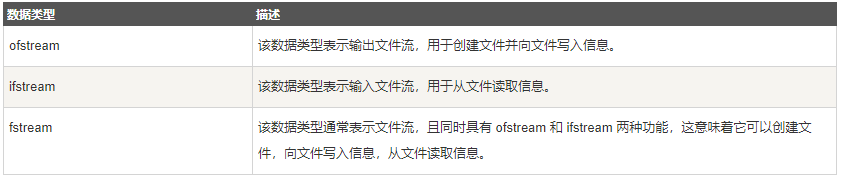

# IO流

## 输入输出流

- `istream` - 输入流基类
- `ostream` - 输出流基类
- `iostream` - 输入/输出流基类

## 文件流

### 简介

文件：字节流，程序员以字符为单位建立程序和数据项，计算机按位模式操作和处理这些字符，如何从文件读取流和向文件写入流。这就需要用到 C++ 中另一个标准库 fstream，它定义了三个新的数据类型：




### 使用

#### 打开文件

```cpp
fstream file("maye.txt");
```

可以通过构造函数指定文件名，并打开;默认就是以可读可写的方式打开的，但是文件不存在会打开失败！

```cpp
file.open("maye.txt", ios::in | ios::out | ios::trunc);
```

也可以使用open函数打开文件，使用open必须传递打开模式`ios::in`为可读，`ios::out`为可写，`ios::trunc`为文件不存在时创建，存在则清空所有内容(`ios::trunc`必须与`ios::out`搭配使用)。

```cpp
if (!file)	//if (!file.is_open())	//两种判断方式都可以
{
	cout << "open error:" << strerror(file.rdstate());
}
else
{
	cout << "open successed";
}
```

使用时必须判断是否打开成功，并查看错误原因。

使用完毕之后并不需要手动关闭文件，但是如果想提前关闭可以使用close()函数。

#### 读取文件

文件打开之后，就可以进行读写了，注意打开模式，`ios::in`为可读，`ios::out`为可写。

创建stu.txt文件，并写入以下内容，并测试读取！

```css
123 顽石 男
456 微笑 男
789 天明 男
110 莫影 男
```

##### 使用>>读取

```cpp
std::string buf;
while (!file.eof())
{
	file >> buf;
	cout << buf << " ";
	if (file.peek() == '\n')
	{
		cout << endl;
	}
}
```

注意，使用>>读取，遇到空格会截断，所以需要循环的去读取，而且还需要自己判断是不是\n。

##### 使用read()读取

```cpp
char buf[200] ={0};
file.read(buf, 200);
cout << buf;
```

值得注意的是，我们并不知道文件有多大，所以并不能很好的指定读取的大小，从而一次性把文件读取完成。可以先获取文件大小然后再读取。

```cpp
file.seekp(0,ios::end);
int64_t len = file.tellp();
file.seekp(0,ios::beg);

char* buf = new char[len + 1] {0};
file.read(buf, len);
cout << buf;

delete[] buf;
```

##### 使用std::getline读取

如果想直接读取到std::string里面，则需要使用std::getline。

	std::string buf;
	std::getline(file, buf);
	cout << buf;
这样读取只能读取一行，如果想要读取多行，则需要使用循环。

```cpp
std::string buf;
while (!file.eof())
{
	std::getline(file, buf);
	cout << buf << endl;
}
```

#### 写入文件

如果想要追加写入文件，请添加打开模式`ios::app`

如果想要二进制读写，请添加打开模式`ios::binary`

##### 使用<<写入

##### 使用write写入

### 打开模式

| 模式标记                          | 适用对象                  | 作用                                                         |
| --------------------------------- | ------------------------- | ------------------------------------------------------------ |
| ios::in                           | ifstream fstream          | 打开文件用于读取数据。如果文件不存在，则打开出错。           |
| ios::out                          | ofstream fstream          | 打开文件用于写入数据。如果文件不存在，则新建该文件；如果文件原来就存在，则打开时清除原来的内容。 |
| ios::app                          | ofstream fstream          | 打开文件，用于在其尾部添加数据。如果文件不存在，则新建该文件。 |
| ios::ate                          | ifstream                  | 打开一个已有的文件，并将文件读指针指向文件末尾（读写指 的概念后面解释）。如果文件不存在，则打开出错。 |
| ios:: trunc                       | ofstream                  | 打开文件时会清空内部存储的所有数据，单独使用时与 ios::out 相同。 |
| ios::binary                       | ifstream ofstream fstream | 以二进制方式打开文件。若不指定此模式，则以文本模式打开。     |
| ios::in \| ios::out               | fstream                   | 打开已存在的文件，既可读取其内容，也可向其写入数据。文件刚打开时，原有内容保持不变。如果文件不存在，则打开出错。 |
| ios::in \| ios::out               | ofstream                  | 打开已存在的文件，可以向其写入数据。文件刚打开时，原有内容保持不变。如果文件不存在，则打开出错。 |
| ios::in \| ios::out \| ios::trunc | fstream                   | 打开文件，既可读取其内容，也可向其写入数据。如果文件本来就存在，则打开时清除原来的内容；如果文件不存在，则新建该文件。 |

### 文件位置指针

istream 和 ostream 都提供了用于重新定位文件位置指针的成员函数。这些成员函数包括关于 istream 的 seekg（"seek get"）和关于 ostream 的 seekp（"seek put"）。

seekg 和 seekp 的参数通常是一个长整型。第二个参数可以用于指定查找方向。
查找方向：

+ ios::beg	默认的，从流的开头开始定位
+ ios::cur	从流的当前位置开始定位
+ ios::end	从流的末尾开始定位


## 字符串流

在C语言中，我们使用sscanf和sprintf来对字符串进行格式化，格式控制非常不方便，在C++中有了更方便的操作。

> 使用头文件<sstream>添加对字符串流的支持。

### 打开字符串流

```cpp
stringstream stream(ios::out | ios::in);
```

如果要同时支持格式化和反格式化，则需要指定打开模式`ios:in`和`ios::out`。

```cpp
stream << 1 <<" " << "234"s <<" "<< 5.20;
```

使用stream对象，把需要的数据全部格式化，这里每个数据之间用空格隔开，方便等会反格式化。(反格式化以空格为分割字符)

```cpp
cout << stream.str()<<endl;
```

当然在反格式化之前，我们使用stream.str()查看已经格式化的数据。

```cpp
int a;
float b;
string s;
```

首先我们定义三个对象，来接受从stream中反格式化的数据。

```cpp
stream >> a >> s >> b;
cout << a <<" " << s << " " << b << endl;
```

然后直接使用>>把每个数据都获取到，并输出查看。

### 从string反格式化

stringstream对象还可以绑定一个string对象，直接对string进行操作。

```cpp
string buf = "1 234 5.20";
stringstream stream(buf);
```

先准备一个string对象，然后构造stringstream，默认以可读可写方式打开，如有需要，可以自己传递第二个参数。

	int a;
	float b;
	string s;
	stream >> a >> s >> b;
	cout << a << " " << s << " " << b << endl;
接下来就和上面的方法一样了。

如果在反格式化之后需要写入内容，是写入不了的，需要调用stream.clear()对格式进行清除。

```cpp
stream.clear();
stream << "@@" << " ##";
cout << stream.str();
```


添加了clear之后，写入成功，写入的数据从流的开头写入的，但是我们需要在已有的内容后面追加，该怎么办呐？

```cpp
stringstream stream(buf,ios::app | ios::in | ios::out);
```

只需要在构造stringstream对象的时候，添加上`ios::app`以追加的模式写入即可！


## 重定向流

https://blog.csdn.net/SCHOLAR_II/article/details/115520548

```cpp
#include <iostream>
#include <fstream>

using namespace std;
int main() {

    // cout
    ofstream fout("out.txt");
    //用 rdbuf() 重新定向，返回旧输出流缓冲区指针
     streambuf * originalOutBuf = cout.rdbuf(fout.rdbuf());

    cout << "cout output test" << endl;

    //恢复cout
    cout.rdbuf(originalOutBuf);
    fout.close();

    cout << "cout output test 2" << endl;

    return 0;
}

```

# 自定义格式化器

## 自定义format

`std::format`的格式字符串，只能传递编译时常量，如下所示代码，将不能运行。

```cpp
const std::string fmt = "{} {}";
std::cout << std::format(fmt, 1, "nihao") << std::endl;	//对即时函数的调用不是常量表达式
```

如果有这种需求怎么办呢?这就要自己实现一个format函数了！实现如下：

```cpp
namespace hdy {
	template<typename ...Args>
	auto format(std::string_view fmt, Args&& ...args)
	{
		return std::vformat(fmt, std::make_format_args(args...));
	}
}
```

调用它！

```cpp
std::cout << hdy::format(fmt, 1, "nihao") << std::endl;	//调用自己写的format可以
```

这样就能使用任何类型的字符串类型了！

> std::print或std::println格式字符串，只支持编译时常量，不能使用变量！如果你想用先定义格式，可以使用宏定义或者编译时常量。
>
> ```c
> constexpr char const* str = "{} {}";		//编译时常量
> std::println(str, 1, "nihao");				//可以使用
> ```

## 自定义格式化简介

C++20 引入了新的 `<format>` 库，提供了类型安全的字符串格式化功能。除了内置类型的格式化支持外，你还可以为自定义类型创建格式化器。

首先，咱们来看一下基本使用，虽然前面学过~

```cpp
std::cout << std::format("{1} {2} {0}", "world", "hello", 1)<<std::endl;
```

输出：`hello 1 world`

在这些例子中，我们使用了简单的内置类型，比如整形和字符串。接下来我们将会为自定义类型实现Format库的支持。

## 基本格式化

定义一个Point类。

```cpp
struct Point{
	float x;
	float y;
};
```

要格式化，我们可以使用如下方法：

```cpp
Point pos{ 23,67 };
//1,std::cout
std::cout << "(" << pos.x << "," << pos.y << ")" << std::endl;
//2,std::format
std::cout << std::format("({},{})", pos.x, pos.y) << std::endl;
```

但是都比较麻烦，能否直接用std::format直接格式化Point类呢?

```cpp
//3,formater
std::cout << std::format("{}", pos) << std::endl;
```

> 报错了：Cannot format an argument. To make T formattable, provide a formatter<T> specialization.
>
> 翻译为：无法格式化参数。若要使 T 可格式化，请提供一个 formatter<T> 的特化。

也就是说，要想格式化自定义类型，必须要自己实现一个formatter模板类的特化版本！

```cpp
//特化formatter模板
template<>
struct std::formatter<Point> {

	constexpr auto parse(std::format_parse_context& ctx) {
		return ctx.begin();
	}

	auto format(const Point& pos, std::format_context& ctx)const
	{
		return std::format_to(ctx.out(), "({},{})", pos.x, pos.y);
	}
};
```

再次运行程序，即可正常输出了！

**注意：**特化的`std::formatter<Point>`类，中必须要有`parse`和`format`函数。

+ `parse`函数用于解析格式，并返回迭代器
+ `format`函数用于格式化，并返回迭代器

## 格式化vector\<Point>

当我们使用std::vector存储Point时，并不能直接试用format格式化，也需要自己提供格式化器！

```c
std::vector<Point> points(5, Point{ 1,2 });
std::cout << std::format("{}", points) << std::endl;
```

提供如下formatter格式化器，还支持手动传递分割符！

```cpp
template<>
struct std::formatter<std::vector<Point>> {
	std::string_view delimiter = ",";
	
	constexpr auto parse(std::format_parse_context& ctx) {
		auto it = ctx.begin();
		if (it == ctx.end())
			return it;

		//解析分割符
		if (*it != '}') {
			delimiter = std::string_view(it, it + 1);
			++it;
		}

		if (it != ctx.end() && *it != '}')
			throw std::format_error("Invalid format args for QuotableString.");

		return it;
	}

	auto format(const std::vector<Point>& pos, std::format_context& ctx)const
	{
		std::ostringstream ss;
		for (auto& p : pos) {
			ss << std::format("{}", p) << delimiter;
		}
		auto str = ss.str();
		str.pop_back();
        //将数据拷贝到输出流中
		return std::copy(str.begin(), str.end(), ctx.out());
	}
};
```

使用案例：

```cpp
std::cout << std::format("{:#}", points) << std::endl;
```

## 自定义格式

如果想要自定义格式怎么办呢?

先定义一个日期类。

```cpp
struct Date {
    int year;
    int month;
    int day;
};
```

再定义日期的格式化类。

```cpp
template <>
struct std::formatter<Date> {
	std::string_view format_str = "%Y-%m-%d"; // 默认格式

	constexpr auto parse(std::format_parse_context& ctx) {
		auto it = ctx.begin();
		auto end = ctx.end();

		if (it == end) {
			return it;
		}
		if (*it == '}')
			return end;

		auto p = it;
		while (*p != '}') { p++; }

		format_str = std::string_view(it,p);

		//for (size_t i = 0; i < fmt.size(); ++i) {
		//	if (fmt[i] == '%' && i + 1 < fmt.size()) {
		//		switch (fmt[i + 1]) {
		//		case 'Y': format_str += "%Y"; break;
		//		case 'm': format_str += "%m"; break;
		//		case 'd': format_str += "%d"; break;
		//		default: format_str += fmt.substr(i, 2); break;
		//		}
		//		++i;
		//	}
		//	else {
		//		format_str += fmt[i];
		//	}
		//}
		return p;
	}

	auto format(const Date& date, std::format_context& ctx) const {
		std::ostringstream oss;

		for (size_t i = 0; i < format_str.size(); ++i) {
			if (format_str[i] == '%' && i + 1 < format_str.size()) {
				switch (format_str[i + 1]) {
				case 'Y': oss << std::format("{:04}", date.year); break;
				case 'm': oss << std::format("{:02}", date.month); break;
				case 'd': oss << std::format("{:02}", date.day); break;
				default: oss << format_str.substr(i, 2); break;
				}
				++i;
			}
			else {
				oss << format_str[i];
			}
		}

		return std::format_to(ctx.out(), "{}", oss.str());
	}
};
```

测试

```cpp
int main()
{
	Date today{ 2023, 11, 15 };

	// 默认格式
	std::cout << std::format("{}", today) << std::endl;          // 输出: 2023-11-15

	// 自定义格式
	std::cout << std::format("{:%Y/%m/%d}", today) << std::endl; // 输出: 2023/11/15
	std::cout << std::format("{:%d-%m-%Y}", today) << std::endl; // 输出: 15-11-2023
	std::cout << std::format("{:%Y年%m月%d日}", today) << std::endl; // 输出: 2023年11月15日
	return 0;
}
```

