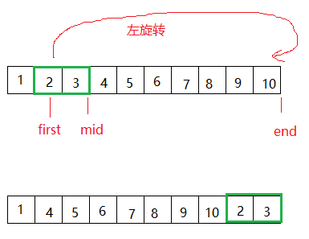

# STL算法

<algorithm>头文件定义了一个专门设计用于元素范围的函数集合。

STL中算法大致分为四类：     

1、非可变序列算法：指不直接修改其所操作的容器内容的算法。   

2、可变序列算法：指可以修改它们所操作的容器内容的算法。     

3、排序算法：包括对序列进行排序和合并的算法、搜索算法以及有序序列上的集合操作。     

4、数值算法：对容器内容进行数值计算。   以下对所有算法进行细致分类并标明功能：

### 非质变算法(17个)

非质变算法：算法不会改变容器的数据。

#### [**all_of**](https://cplusplus.com/reference/algorithm/all_of/)

测试范围内所有元素的状态

```cpp
void test()
{
	vector<int>  vec = { 1,3,5,7,9 };
	if (all_of(vec.begin(), vec.end(), [](int n)->bool {return n % 2; }))
	{
		cout << "所有元素都是奇数" << endl;
	}	
}
```

#### [**any_of**](https://cplusplus.com/reference/algorithm/any_of/)

测试范围内的任何元素是否满足条件

```cpp
void test()
{
	vector<int>  vec = { 1,3,-5,7,9 };
	if (any_of(vec.begin(), vec.end(), [](int n)->bool {return n<0; }))
	{
		cout << "范围内有负数" << endl;
	}	
}
```

#### [**none_of**](https://cplusplus.com/reference/algorithm/none_of/)

测试是否没有元素满足条件

```cpp
void test()
{
	vector<int>  vec = { 1,3,5,7,9 };
	if (none_of(vec.begin(), vec.end(), [](int n)->bool {return n<0; }))
	{
		cout << "范围内没有小于0的数" << endl;
	}	
}
```


#### [**for_each**](https://cplusplus.com/reference/algorithm/for_each/)

将函数应用到范围

```cpp
void test()
{
	vector<int>  vec = { 1,3,5,7,9 };
	for_each(vec.begin(), vec.end(), [](int n) {cout << n << " "; });
	
}
```

#### [**find**](https://cplusplus.com/reference/algorithm/find/)

在范围内找到值

```cpp
void test()
{
	vector<int>  vec = { 1,3,5,7,9 };
	auto it = find(vec.begin(), vec.end(), 5);
	if (it != vec.end())
	{
		cout << "found it:" << *it << endl;
	}
	else
	{
		cout << "not found" << endl;
	}
}
```

#### [**find_if**](https://cplusplus.com/reference/algorithm/find_if/)

查找范围内的元素

```cpp
void test()
{
	vector<int>  vec = { 1,3,5,7,9 };
    //查找第一个大于2的元素
	auto it = find_if(vec.begin(), vec.end(), [](int n) {return n > 2; });
	if (it != vec.end())
	{
		cout << "found it:" << *it << endl;
	}
	else
	{
		cout << "not found" << endl;
	}
}
```


#### [**find_if_not**](https://cplusplus.com/reference/algorithm/find_if_not/)

查找范围内的元素，not表示否定，上面的例子，使用find_if_not就表示查找不大于2的元素(小于或等于2的元素)

```cpp
void test()
{
	vector<int>  vec = { 1,3,5,7,9 };
	auto it = find_if_not(vec.begin(), vec.end(), [](int n) {return n > 2; });
	if (it != vec.end())
	{
		cout << "found it:" << *it << endl;
	}
	else
	{
		cout << "not found" << endl;
	}
}
```


#### [**find_end**](https://cplusplus.com/reference/algorithm/find_end/)

```cpp
template <class _FwdIt1, class _FwdIt2
_FwdIt1 find_end(_FwdIt1 const _First1, const _FwdIt1 _Last1, const _FwdIt2 _First2, const _FwdIt2 _Last2)
```

在[first1,last1)范围内搜索由[first2,last2)定义的序列的最后一次出现，并返回指向其第一个元素的迭代器，如果没有出现，则返回指向last1的迭代器。

两个范围中的元素都使用操作符==(或在版本(2)中使用pred)进行顺序比较:只有当[first2,last2)的所有元素都为真时，才认为[first1,last1)的子序列是匹配的

```cpp
void test()
{
	vector<int>  vec = { 1,2,3,4,5,1,2,3,4,5 };
	int sub1[] = { 1,2,3 };

	// 使用默认的比较:
	auto it = std::find_end(vec.begin(), vec.end(), sub1, sub1 + 3);

	if (it != vec.end())
		std::cout << "sub1 最后发现的位置 " << (it - vec.begin()) << '\n';

	int sub2[] = { 1,2 };

	// 使用谓词的比较:查找vec中最比[1,2]大的序列的最后一次出现的位置
	it = std::find_end(vec.begin(), vec.end(), sub2, sub2 + 2,
		[](int a, int b) {return a > b; });

	if (it != vec.end())
		std::cout << "sub2 最后发现的位置 " << (it - vec.begin()) << '\n';
}
```

#### [**find_first_of**](https://cplusplus.com/reference/algorithm/find_first_of/)

```cpp
template <class _FwdIt1, class _FwdIt2>
_FwdIt1 find_first_of(const _FwdIt1 _First1, const _FwdIt1 _Last1, const _FwdIt2 _First2,
    const _FwdIt2 _Last2)
```

返回一个迭代器，指向范围[first1,last1)中与[first2,last2)中的任何元素匹配的第一个元素。如果没有找到这样的元素，函数返回last1。

[first1,last1)中的元素使用操作符==(或在版本(2)中使用pred)与[first2,last2)中的每个值进行顺序比较，直到匹配为止。

```cpp
void test()
{
	int arr[] = { 1,3,1,4,5,2,0 };
	int sub[] = { 5,3 };
	auto it = find_first_of(arr, arr + 7,sub,sub+2);
	if (it != arr + 7)
	{
		cout << "在arr中找到与sub中匹配的元素" <<*it<< endl;
	}
	else
	{
		cout << "not found" << endl;
	}
}
```


#### [**adjacent_find**](https://cplusplus.com/reference/algorithm/adjacent_find/)

求范围内相等的相邻元素，在[first,last]范围内搜索匹配的两个连续元素的第一次出现，并返回指向这两个元素中的第一个的迭代器，如果没有找到这样的对，则返回指向最后一个的迭代器。

```cpp
void test()
{
	int arr[] = { 1,3,3,4,5,2,0,6,6 };
	vector<int> vec(arr, arr + 9);
	auto it = adjacent_find(vec.begin(), vec.end());
	if (it != vec.end())
		cout << "第一对重复的元素是:" << *it << endl;

	it = adjacent_find(it + 1, vec.end(), [](int a, int b) {return a == b; });
	if (it != vec.end())
		cout << "第二对重复的元素是:" << *it << endl;
}
```

#### [**count**](https://cplusplus.com/reference/algorithm/count/)

在范围内计算值的出现次数

```cpp
void test()
{
	int arr[] = { 1,3,3,4,5,2,0,6,6 };
	vector<int> vec(arr, arr + 9);
	long long cnt = count(vec.begin(), vec.end(), 3);
	cout << "3出现次数:" << cnt << endl;
```

#### [**count_if**](https://cplusplus.com/reference/algorithm/count_if/)

返回满足范围条件的元素个数

```cpp
void test()
{
	int arr[] = { 1,3,3,4,5,2,0,6,6 };
	vector<int> vec(arr, arr + 9);
	long long 	//统计大于4的元素个数
	cnt = count_if(vec.begin(), vec.end(), [](int n) {return n > 4; });
	cout << "大于4的元素个数:" << cnt << endl;
}
```

#### [**mismatch**](https://cplusplus.com/reference/algorithm/mismatch/)

返回满足范围条件的元素个数，比较范围[first1,last1]中的元素与从first2开始的范围中的元素，并返回两个序列中第一个不匹配的元素。

```cpp
void test()
{
	vector<int> vec;
	for (int i = 1; i < 6; i++)
	{
		vec.push_back(i * 10);	//10 20 30 40 50 
	}

	int nums[] = { 10,20,30,70,88 };
	auto mpair = mismatch(vec.begin(), vec.end(), nums);
	if (mpair.first != vec.end())
	{
		cout << "第一个不匹配的元素:" << *mpair.first << " and " << *mpair.second << endl;
	}

	mpair = mismatch(vec.begin(), vec.end(), nums, [](int a, int b) {return a == b; });
	if (mpair.first != vec.end())
	{
		cout << "第一个不匹配的元素:" << *mpair.first << " and " << *mpair.second << endl;
	}
}
```


#### [**equal**](https://cplusplus.com/reference/algorithm/equal/)

测试两个范围内的元素是否相等，比较元素个数为两个序列中最短的那个序列的元素个数。

```cpp
void test()
{
	vector<int> vec = { 1,2,3,4,5 };
	vector<int> vec2 = vec;
	if (equal(vec.begin(), vec.end(), vec2.begin()))
	{
		cout << "两个序列的内容相等" << endl;
	}
	else
	{
		cout << "两个序列的内容不相等" << endl;
	}

	vec2.push_back(6);
	vec2.push_back(7);
	//vec：1 2 3 4 5
	//vec2:1 2 3 4 5 6 7
	if (equal(vec.begin(),vec.end(),vec2.begin(),vec2.begin()+vec.size()))
	{
		cout << "两个序列的内容相等" << endl;
	}
	else
	{
		cout << "两个序列的内容不相等" << endl;
	}

	//使用谓词:
	if (equal(vec.begin(), vec.end(), vec2.begin(),
		[](int a, int b)
		{
			return a == b;
		}))
	{
		cout << "两个序列的内容相等" << endl;
	}
	else
	{
		cout << "两个序列的内容不相等" << endl;
	}
}
```

#### [**equal_range**](#)

功能类似equal，返回一对iterator，第一个表示lower_bound，第二个表示upper_bound。

```cpp
void test()
{
	vector<int> vec = { 10,20,30,30,20,10,10,20 };

	//必须先排序:因为equal_range使用了二分查找
	sort(vec.begin(), vec.end());
	auto mpair = equal_range(vec.begin(), vec.end(), 20);
	cout << *mpair.first << " " << *mpair.second << endl;
}
```

#### [**is_permutation**](https://cplusplus.com/reference/algorithm/is_permutation/)

比较范围[first1,last1)中的元素与从first2开始的范围中的元素，如果两个范围中的所有元素都匹配，则返回true，即使顺序不同。

```cpp
void test()
{
	vector<int> vec = { 1,2,3,4,5 };
	vector<int> vec1 = { 5,4,3,2,1 };
	if (is_permutation(vec.begin(), vec.end(), vec1.begin()))
	{
		cout << "vec vec1两个是排列不同的相同序列" << endl;
	}
}
```

#### [**search**](https://cplusplus.com/reference/algorithm/search/)

```cpp
(1)
template <class ForwardIt, class FwdItPat>
ForwardIt1 search(const ForwardIt _First1, const ForwardIt _Last1, const FwdItPat _First2, const FwdItPat _Last2);
(2)
template <class ForwardIt, class FwdItPat, class _Pr>
ForwardIt search(ForwardIt _First1, ForwardIt _Last1, const FwdItPat _First2,const FwdItPat _Last2, _Pr _Pred);
(3)
template <class ForwardIt, class _Searcher>
ForwardIt search(const ForwardIt _First, const ForwardIt _Last, const _Searcher& _Search); 
```

1,2) 搜索范围 `[`first`, `last`)` 中元素子序列 `[`s_first`, `s_last`)` 首次出现的位置。

​		1) 元素用 operator== 比较。

​		2) 元素用给定的二元谓词 pred 比较。

3) 在范围 `[`first`, `last`)` 中以 searcher 构造函数中指定的模式进行搜索。

标准库提供下列搜索器：

| [default_searcher](https://zh.cppreference.com/w/cpp/utility/functional/default_searcher)(C++17) | 标准 C++ 库搜索算法实现 (类模板)           |
| ------------------------------------------------------------ | ------------------------------------------ |
| [boyer_moore_searcher](https://zh.cppreference.com/w/cpp/utility/functional/boyer_moore_searcher)(C++17) | Boyer-Moore 搜索算法实现 (类模板)          |
| [boyer_moore_horspool_searcher](https://zh.cppreference.com/w/cpp/utility/functional/boyer_moore_horspool_searcher)(C++17) | Boyer-Moore-Horspool 搜索算法实现 (类模板) |

**example：**

+ 1,2) 案例，在arr中查找sub序列。

```cpp
int main()
{
	int arr[] = { 1,2,3,4,5,6,7 };
	int sub[] = { 3,4,5 };
	auto it = std::search(std::begin(arr), std::end(arr), std::begin(sub), std::end(sub));
	if (it != std::end(arr))
	{
		std::cout << "found " << *it << std::endl;
	}
	else
	{
		std::cout << "not found" << std::endl;
	}

	return 0;
}
```

+ 3）搜索器案例

```cpp
int main()
{
    ...
    //直接把上面的案例中的first2，last2 用std::default_searcher包起来，传递进去    
	auto it = std::search(std::begin(arr), std::end(arr), std::default_searcher(std::begin(sub), std::end(sub)));
    ...
	return 0;
}
```

当然，搜索器更多用于对字符串进行查找的场景。因为`boyer_moore`和`boyer_moore_horspool`算法是一种高效的字符串匹配算法。

有如下字符串：

```cpp
	std::string code = (R"(
	int arr[] = { 1,2,3,4,5,6,7 };
	int sub[] = { 3,4,5 };
	auto it = std::search(std::begin(arr), std::end(arr), std::default_searcher(std::begin(sub), std::end(sub)));
	if (it != std::end(arr))
	{
		std::cout << "found " << *it << std::endl;
	}
	else
	{
		std::cout << "not found" << std::endl;
	}begin)");
```

使用search查找code中的所有begin：

```cpp
{
	std::string sub = "begin";
	auto it = code.begin();
	do
	{
		//先查找一次
		it = std::search(it, code.end(), sub.begin(), sub.end());
		if (it != code.end())
		{
			std::cout << "found index is " << it - code.begin() << std::endl;
			//跳过刚找到的，继续往下查找
			std::advance(it, sub.end() - sub.begin());
		}
	} while (it != code.end());
}
```

使用searcher搜索器查找code中所有的begin:

```cpp
{
	std::boyer_moore_searcher bms(sub.begin(), sub.end());
	for (auto itp = bms(code.begin(), code.end()); itp.first != code.end();)
	{

		std::cout << "find sub string in text string, start pos is "
			<< itp.first - code.begin() << std::endl;

		itp = bms(itp.second, code.end());
	}
}
```

bms()返回的是一对迭代器`std::pair<It1,It2>`，如果搜索到那么first指向code中第一个字符的位置(即first表示‘b’)，second表示first的下一个位置(对于这里来说，就是‘e’)；

下一次查找是从second开始的，如`itp = bms(itp.second, code.end());`;

#### [**search_n**](https://cplusplus.com/reference/algorithm/search_n/)

搜索范围[first,last)中元素的值为val的数量是否为count，每个元素的比较值都等于val(或pred返回true)。

该函数返回指向第一个此类元素的迭代器，如果没有找到此类序列则返回指向最后一个元素的迭代器。

```cpp
void test()
{
	vector<int> vec = { 10,20,30,30,20,10,10,20 };
	auto it = search_n(vec.begin(), vec.end(), 2, 30);
	if (it != vec.end())
	{
		cout << "找到了两个30 第一次出现在位置:" << it - vec.begin() << endl;
	}
	else
	{
		cout << "match not found" << endl;
	}
}
```


### 质变算法(30个)

质变算法：算法会改变容器的数据

#### [**copy**](https://cplusplus.com/reference/algorithm/copy/)

将范围[first,last)中的元素复制到Dest开始的范围中。

该函数返回一个指向目标范围末端的迭代器(该迭代器指向复制的最后一个元素后面的元素)。

范围不能重叠，result不能指向范围内的元素(第一个，最后一个)。对于这种情况，请参阅copy_backward。

```cpp
void test()
{
	vector<int> vec(5);
	int nums[] = {1,2,3,4,5};
	//要确保vec空间足够，可以使用vec.resize(n)来调整vec的大小
	copy(nums,nums+5,vec.begin());
}
```

#### [**copy_n**](https://cplusplus.com/reference/algorithm/copy_n/)

将first开始的范围中的前n个元素复制到result开始的范围中。

该函数返回一个指向目标范围末端的迭代器(指向复制的最后一个元素的下一个位置)。

如果n是负的，函数什么都不做。

如果范围重叠，则result所指向的范围中的某些元素可能具有未定义但有效的值。

```cpp
void test()
{
	vector<int> vec(5);
	int nums[] = {1,2,3,4,5};
	//要确保vec空间足够，可以使用vec.resize(n)来调整vec的大小
	copy(nums,nums+5,vec.begin());

	vec.clear();
	vec.resize(3);	//目标容器的大小必须和拷贝的数量一致
	copy_n(nums, 3, vec.begin());
}
```

#### [**copy_if**](https://cplusplus.com/reference/algorithm/copy_if/)

拷贝范围内的某些元素

```cpp
void test()
{
	vector<int> vec(5);
	int nums[] = {1,2,3,4,5};

	copy_if(nums, nums + 5, vec.begin(), [](int n)
		{
			return n > 3;
		});
}
```


#### [**copy_backward**](https://cplusplus.com/reference/algorithm/copy_backward/)

向后复制范围内额元素(从右往左)

将范围[first,last]中的元素从end开始复制到以result结束的范围。

该函数返回指向目标范围内第一个元素的迭代器。

结果范围的元素顺序与[first,last)完全相同。要反转它们的顺序，请参阅reverse_copy。

```cpp
void test()
{
	vector<int> vec(5);
	int nums[] = {1,2,3,4,5};

	copy_backward(nums, nums + 5, vec.end());
}
```


#### [**move**](https://cplusplus.com/reference/algorithm/move/)

将范围[first，last)中的元素移动到从结果开始的范围中。`即实现了移动语义，如果容器里面存的对象有指针，则会移动，普通数据类型和copy一样`

```cpp
void test()
{
	vector<string> names = { "顽石","hello","world" };
	vector<string> foo(3);

	cout << "names contains " << endl;
	for (auto& str : names)cout <<"[" << str << "] ";
	cout << endl;
	cout << "foo contains " << endl;
	for (auto& str : foo)cout << "[" << str << "] ";
	cout <<"\n\n" << endl;

	cout << "Moving ranges..." << endl;
	move(names.begin(), names.end(), foo.begin());
	cout << "names contains " << endl;
	for (auto& str : names)cout << "[" << str << "] ";
	cout << endl;
	cout << "foo contains " << endl;
	for (auto& str : foo)cout << "[" << str << "] ";
	cout << endl;

	cout << "Moving Container" << endl;
	names = std::move(foo);

}
```

#### [**move_backward**](https://cplusplus.com/reference/algorithm/move_backward/)

向后移动范围内的元素

#### [**swap**](https://cplusplus.com/reference/algorithm/swap/)

交换两个对象的值

#### [**swap_ranges**](https://cplusplus.com/reference/algorithm/swap_ranges/)

交换两个范围的值

```cpp
void test()
{
	vector<string> names = { "顽石","hello","world" };
	vector<string> foo(3);
	swap(names, foo);
	swap_ranges(foo.begin(), foo.end()-1, names.begin());
}
```

#### [**iter_swap**](https://cplusplus.com/reference/algorithm/iter_swap/)

交换由两个迭代器指向的对象的值

```cpp
void test()
{
	std::vector<int> vec = { 1,2,3,4,5 };
	std::iter_swap(vec.begin(), vec.end()-2);
}
```

#### [**transform**](https://cplusplus.com/reference/algorithm/transform/)

**一元操作：**将指定范围[first，last]内的元素应用操作函数，并将每次操作返回的值存储在以`_Dest`开头的范围内。

**二元操作：**将指定范围[first1，last2]内的元素作为第一个参数，并使用范围内以开头[first2,...]的相应参数作为第二个参数。每次调用返回的值存储在以`_Dest`开头的范围内。

```cpp
void test()
{
	std::vector<int> vec = { 1,2,3,4,5 };
	std::vector<int> foo(vec.size());	//等价foo.resize(vec.size())
	//一元操作
	std::transform(vec.begin(), vec.end(), foo.begin(), [](int& i){return i + 1;});
										//foo：2 3 4 5 6
	//二元操作
	std::transform(vec.begin(), vec.end(), foo.begin(), vec.begin(), std::plus<int>());
										//vec：3 5 7 9 11
}
```

#### [**replace**](https://cplusplus.com/reference/algorithm/replace/)

把指定范围内指定的值，替换成新值

```cpp
void test()
{
    	int nums[] = { 10, 20, 30, 30, 20, 10, 10, 20 };
	std::replace(std::begin(nums), std::end(nums), 20, 99);
								//nums：10 99 30 30 99 10 10 99
}
```

#### [**replace_if**](https://cplusplus.com/reference/algorithm/replace_if/)

替换范围内的值

```cpp
std::replace_if(std::begin(nums), std::end(nums), [](auto& n) 
                {
                    return n == 99; 
                }, 66);
```

#### [**replace_copy**](https://cplusplus.com/reference/algorithm/replace_copy/)

替换范围内的值，并拷贝到以_Dest开始的范围

```cpp
void test()
{
	int nums[] = { 10, 20, 30, 30, 20, 10, 10, 20 };
	std::vector<int> vec(8);
	std::replace_copy(std::begin(nums), std::end(nums), vec.begin(), 20, 99);
											//vec：10 99 30 30 99 10 10 99
}
```

#### [**replace_copy_if**](https://cplusplus.com/reference/algorithm/replace_copy_if/)

同上

```cpp
int main()
{
	int nums[] = { 10, 20, 30, 30, 20, 10, 10, 20 };
	std::vector<int> vec(8);
	std::replace_copy_if(std::begin(nums), std::end(nums), vec.begin(), [](int& n) {return n == 20; }, 99);
}
```

#### [**fill**](https://cplusplus.com/reference/algorithm/fill/)

填充范围内的元素

```cpp
std::vector<int> vec(8);
std::fill(vec.begin(), vec.end(), 2);	//vec: 2 2 2 2 2 2 2 2
```

#### [**fill_n**](https://cplusplus.com/reference/algorithm/fill_n/)

填充以`_Dest`开始的连续count个元素

```cpp
std::fill_n(vec.begin(), 3, 55);		//vec: 55 55 55 2 2 2 2 2
```

#### [**generate**](https://cplusplus.com/reference/algorithm/generate/)

使用函数生成的值，替换区间元素

```cpp
std::generate(vec.begin(), vec.end(), []{return rand() % 100;});
```

#### [**generate_n**](https://cplusplus.com/reference/algorithm/generate_n/)

和generate函数类似

```cpp
std::generate_n(vec.begin(), 3, [] {static int i = 0; return i--; });
```

#### [**remove**](https://cplusplus.com/reference/algorithm/remove/)

从范围内删除指定元素

#### [**remove_if**](https://cplusplus.com/reference/algorithm/remove_if/)


#### [**remove_copy**](https://cplusplus.com/reference/algorithm/remove_copy/)

Copy range removing value (function template)

#### [**remove_copy_if**](https://cplusplus.com/reference/algorithm/remove_copy_if/)

Copy range removing values (function template)

#### [**unique**](https://cplusplus.com/reference/algorithm/unique/)

删除范围内的连续重复项

#### [**unique_copy**](https://cplusplus.com/reference/algorithm/unique_copy/)

删除范围内的连续重复项，并拷贝

#### [**reverse**](https://cplusplus.com/reference/algorithm/reverse/)

反转(颠倒)范围元素

#### [**reverse_copy**](https://cplusplus.com/reference/algorithm/reverse_copy/)

Copy range reversed (function template)

#### [**rotate**](https://cplusplus.com/reference/algorithm/rotate/)

左旋范围内的元素

```cpp
	std::vector<int> vec;
	for (int i = 1; i < 10; ++i)
		vec.push_back(i);		//vec: 1 2 3 4 5 6 7 8 9

	std::rotate(vec.begin()+1, vec.begin() + 3, vec.end());
								//vec:1 4 5 6 7 8 9 2 3
```



#### [**rotate_copy**](https://cplusplus.com/reference/algorithm/rotate_copy/)

Copy range rotated left (function template)

#### [**shuffle**](https://cplusplus.com/reference/algorithm/shuffle/)

使用生成器(函数模板)随机重新排列范围内的元素

```cpp
std::shuffle(vec.begin(), vec.end(), std::default_random_engine(time(NULL)));
```

#### [sample](https://zh.cppreference.com/w/cpp/algorithm/sample)(C++17)

从一个序列中随机选择 n 个元素

```cpp
std::vector<int> dest(5);
std::sample(vec.begin(), vec.end(), dest.begin(), 5, std::default_random_engine(time(NULL)));
```

###  **Partitions 划分(5个)**

所谓划分是指，在一个容器中，将满足条件的元素与不满足条件的元素分开放置，比如：一个整型数组，将偶数放在数组前边，将奇数放到数组后面，这样就是划分了。

#### [is_partitioned](https://zh.cppreference.com/w/cpp/algorithm/is_partitioned)

判断范围是否已按给定的谓词划分

```cpp
void test()
{
	std::vector<int> vec;
	for (size_t i = 0; i < 10; i++)
	{
		vec.push_back(i);
	}

	auto par_fun = [](int i) {return i % 2 == 0; };
	if (std::is_partitioned(vec.begin(), vec.end(), par_fun))
	{
		std::cout << "数组已经是划分好的,偶数在前面，奇数在后边" << std::endl;
	}
	else
	{
		std::cout << "暂未划分" << std::endl;
	}
}
```

#### [partition](https://zh.cppreference.com/w/cpp/algorithm/partition)

将范围中的元素分为两组

```cpp
std::partition(vec.begin(), vec.end(), par_fun);
```

#### [partition_copy](https://zh.cppreference.com/w/cpp/algorithm/partition_copy)

将范围中的元素分为两组，并将这两组拷贝到以dest开始的容器

```cpp
std::vector<int> dest1(10), dest2(10);
std::partition_copy(vec.begin(), vec.end(),dest1.begin(), dest2.begin(), par_fun);
```

#### [stable_partition](https://zh.cppreference.com/w/cpp/algorithm/stable_partition)

将范围中的元素分为两组，同时保留其相对顺序

std::stable_partition(vec.begin(), vec.end(), par_fun);

#### [partition_point](https://zh.cppreference.com/w/cpp/algorithm/partition_point)

定位已划分范围的划分点

```cpp
auto par_point = std::partition_point(vec.begin(), vec.end(), par_fun);
std::cout <<"划分点元素为:" << *par_point << std::endl;
```

### Sorting 排序(6个)

#### [is_sorted](https://zh.cppreference.com/w/cpp/algorithm/is_sorted)

检查范围是否已按升序排列

```cpp
std::cout << std::boolalpha << std::is_sorted(vec.begin(), vec.end()) << std::endl;
```

#### [is_sorted_until](https://zh.cppreference.com/w/cpp/algorithm/is_sorted_until)

从指定范围找出已经排好序的最后一个迭代器，默认为升序

```cpp
auto it = std::is_sorted_until(vec.begin(), vec.end());
std::cout << (it - vec.begin()) << " elements sorted" << std::endl;
```

#### [sort](https://zh.cppreference.com/w/cpp/algorithm/sort)

对指定范围进行排序，默认升序

```cpp
std::sort(vec.begin(), vec.end(),std::greater<int>());
```

#### [partial_sort](https://zh.cppreference.com/w/cpp/algorithm/partial_sort)

重新排列范围内的元素，以使前面的元素是整个区域中最小的元素并按升序排序(可以指定排序规则)，而其余元素则没有任何特定顺序。

```cpp
void partial_sort(_RanIt _First, _RanIt _Mid, _RanIt _Last)
```

将[first,last)之间的元素进行排序，但是只排序(mid-first)个元素。

```cpp
int main()
{
	std::vector<int> vec = {1,8,5,3,2,4,7,0,9,5};

	std::partial_sort(vec.begin(), vec.begin() + 5, vec.end());

	for (auto v : vec)
	{
		std::cout << v << " ";
	}
	return 0;
}
```

运行结果为`0 1 2 3 4 8 7 5 9 5`

#### [partial_sort_copy](https://zh.cppreference.com/w/cpp/algorithm/partial_sort_copy)

对范围内的元素进行复制并部分排序

```cpp
int main()
{
	std::vector<int> vec = {1,8,5,3,2,4,7,0,9,5};
	
	std::vector<int> dest(5);
	std::partial_sort_copy(vec.begin(), vec.begin() + 5, dest.begin(), dest.end());;

	for (auto v : dest)
	{
		std::cout << v << " ";
	}
	return 0;
}
```

运行结果为`1 2 3 5 8`

#### [stable_sort](https://zh.cppreference.com/w/cpp/algorithm/stable_sort)

将范围内的元素排序，同时保持相等的元素之间的顺序(稳定排序)

### 二分查找(4个)

二分查找必须在已经排序好的范围上操作

[lower_bound](https://zh.cppreference.com/w/cpp/algorithm/lower_bound)


[upper_bound](https://zh.cppreference.com/w/cpp/algorithm/upper_bound)


[binary_search](https://zh.cppreference.com/w/cpp/algorithm/binary_search)


[equal_range](https://zh.cppreference.com/w/cpp/algorithm/equal_range)

### 集合操作(7个)

集合操作必须在已经排序好的范围上操作

#### [merge](https://zh.cppreference.com/w/cpp/algorithm/merge)

将两个序列合并，合并之后任然有序；可以根据序列的排序方式给merge指定排序方式

```cpp
int main()
{
	std::vector<int> vec = {1,2,3,4,5};
	std::vector<int> vec1 = {6,7,8,9,10};
	std::vector<int> dest(vec.size() + vec1.size());

	std::merge(vec.begin(), vec.end(), vec1.begin(), vec1.end(), dest.begin());

	for (auto v : dest)
	{
		std::cout << v << " ";
	}
	return 0;
}
```

#### [inplace_merge](https://zh.cppreference.com/w/cpp/algorithm/inplace_merge)

归并二个相继的*已排序*范围 `[first, middle)` 及 `[middle, last)` 为一个*已排序*范围 `[first, last)` 。

```cpp
std::vector<int> vec = { 5,6,7,1,2,3,4,5 };
std::inplace_merge(vec.begin(), vec.begin() + 3, vec.end());
```

#### [includes](https://zh.cppreference.com/w/cpp/algorithm/includes)

如果排序区域包含排序区域中的所有元素，则返回 true。范围内的元素应已按照相同的标准（或）进行排序。

```cpp
void test()
{
	std::vector<int> vec = {1,2,3,4,5,6,7,8,9};
	std::vector<int> subvec = {5,6,7};
	if (std::includes(vec.begin(), vec.end(), subvec.begin(), subvec.end()))
	{
		std::cout << "vec include subvec" << std::endl;
	}
}
```

#### [set_difference](https://zh.cppreference.com/w/cpp/algorithm/set_difference)

求差集，只保留第一个范围的元素

```cpp
int main()
{
	int first[] = { 5,10,15,20,25 };
	int second[] = { 50,40,30,20,10 };

	std::sort(first, first + 5);
	std::sort(second, second + 5);

	std::vector<int> dest(10);

	auto it = std::set_difference(first, first + 5, second, second + 5, dest.begin());
	dest.resize(it - dest.begin());	//缩减大小


	for (auto v : dest)
	{
		std::cout << v << " ";
	}
	return 0;
}
```

输出结果为`5 15 25`

#### [set_symmetric_difference](https://zh.cppreference.com/w/cpp/algorithm/set_symmetric_difference)

求差集，两个范围的元素都保留

把上面的代码的`set_difference`替换成`set_symmetric_difference`后，输出结果为`5 15 25 30 40 50`

#### [set_intersection](https://zh.cppreference.com/w/cpp/algorithm/set_intersection)

求交集

#### [set_union](https://zh.cppreference.com/w/cpp/algorithm/set_union)

求并集

### 最大/最小操作(7个)

#### [max](https://zh.cppreference.com/w/cpp/algorithm/max)

求最大值，可以自己指定比较规则。

```cpp
int main()
{
	auto n1 = std::max({1,2,3,4,5});
	auto n2 = std::max({ 1,2,3,4,5 }, [](int left, int right) {return left > right; });
	auto n3 = std::max(1, 2);
	auto n4 = std::max(4, 8, std::greater<int>());
	//n1：5
	//n2：1
	//n3: 2
	//n4：4
	
	return 0;
}
```

#### [min](https://zh.cppreference.com/w/cpp/algorithm/min)

同max

#### [minmax](https://zh.cppreference.com/w/cpp/algorithm/minmax)

求最小值和最大值,用法同max，返回`std::pair`，first为最小值，second为最大值

#### [max_element](https://zh.cppreference.com/w/cpp/algorithm/max_element)

求范围内最大元素

```cpp
int main()
{
	std::vector<int> vec = { 1,3,6,4,28,7,2 };

	auto it =  std::max_element(vec.begin(), vec.end());
	std::cout << "max element is " << *it << std::endl;
	
	return 0;
}
```

#### [min_element](https://zh.cppreference.com/w/cpp/algorithm/min_element)

同max_element

#### [minmax_element](https://zh.cppreference.com/w/cpp/algorithm/minmax_element)

同`minmax`，只不过返回的是一对迭代器。

#### [clamp](https://zh.cppreference.com/w/cpp/algorithm/clamp)(C++17)

```cpp
template<class T>
constexpr const T& clamp( const T& v, const T& lo, const T& hi );

template<class T, class Compare>
constexpr const T& clamp( const T& v, const T& lo, const T& hi, Compare comp );
```

1) 若 `v` 小于 `lo` ，则返回 `lo` ；若 `v` 大于 `hi` ，则返回 `hi` ；否则返回 `v` 。使用 operator< 比较值。

2) 同 (1) ，不过使用 `comp` 比较值。

若 `lo` 的值大于 `hi` 则行为未定义。

```cpp
auto v =  std::clamp(-2, 0, 10);
std::cout << v << std::endl;
```

### 比较操作(3个)

#### [equal](https://zh.cppreference.com/w/cpp/algorithm/equal)

判断两个范围的元素是否相等

```cpp
int main()
{
	std::vector<int> vec = { 1,2,3,4,5 };
	std::vector<int> vec1 = { 1,2,3,4,5 };
	
	std::cout << std::boolalpha 
		<< std::equal(vec.begin(), vec.end(), vec1.begin()) << std::endl;

	return 0;
}
```

#### [lexicographical_compare](https://zh.cppreference.com/w/cpp/algorithm/lexicographical_compare)

检查第一个范围 `[first1, last1)` 是否按字典序*小于*第二个范围 `[first2, last2)`。

字典序比较是拥有下列属性的操作：

- 逐元素比较两个范围。
- 首个不匹配元素定义范围是否按字典序*小于*或*大于*另一个。
- 如果一个范围是另一个的前缀，那么较短的范围*小于*另一个。
- 如果两个范围拥有等价元素和相同长度，那么范围按字典序*相等*。
- 空范围按字典序*小于*任何非空范围。
- 两个空范围按字典序*相等*。

```cpp
int main()
{
	char first[] = "apple";         // 5 letters
	char second[] = "Applement";    // 9 letters

	if (std::lexicographical_compare(first, first + 5, second, second + 5))
	{
		std::cout << first << " is less than " << second << std::endl;
	}
	else
	{
		std::cout << first << " is greater than " << second << std::endl;
	}

	if (std::lexicographical_compare(first, first + 5, second, second + 9, [](char c1, char c2)
		{return toupper(c1)< toupper(c2);}))
	{
		std::cout << first << " is less than " << second << std::endl;
	}
	else
	{
		std::cout << first << " is greater than " << second << std::endl;
	}

	return 0;
}
```


#### [lexicographical_compare_three_way](https://zh.cppreference.com/w/cpp/algorithm/lexicographical_compare_three_way)(C++20)

```cpp
(1)
template< class InputIt1, class InputIt2, class Cmp >
constexpr auto lexicographical_compare_three_way( InputIt1 first1, InputIt1 last1,
                                                  InputIt2 first2, InputIt2 last2,
                                                  Cmp comp)
-> decltype(comp(*first1, *first2));

(2)
template< class InputIt1, class InputIt2 >
constexpr auto lexicographical_compare_three_way( InputIt1 first1, InputIt1 last1,
                                                  InputIt2 first2, InputIt2 last2);
```

用三路比较，以字典序比较二个范围 [first1, last1) 和 [first2, last2) ，并产生最强可应用比较类别类型的结果。

1) 返回两个范围中首对按照 `comp` 不等价的元素间的序，若它们存在，否则（若一个范围按照 `comp` 等价于另一个范围的前缀）返回两个范围长度间的序。

2)等价于：

```
return std::lexicographical_compare_three_way(
    first1, last1, first2, last2, std::compare_three_way());
```

举个栗子：

```cpp
int main()
{
	char first[] = "apple";         // 5 letters
	char second[] = "Applement";    // 9 letters

	auto ret = std::lexicographical_compare_three_way(first, first + 5, second, second + 5);
	if (ret == 0/*ret == std::strong_ordering::equal*/)
	{
		std::cout << "equal" << std::endl;
	}
	else if (ret > 0/*ret == std::strong_ordering::greater*/)
	{
		std::cout << "greater" << std::endl;
	}
	else if (ret < 0/*ret == std::strong_ordering::less*/)
	{
		std::cout << "less" << std::endl;
	}

	return 0;
}
```

### 排列操作(3个)

#### [is_permutation](https://zh.cppreference.com/w/cpp/algorithm/is_permutation)

判断一个序列是否为另一个序列的排列

```cpp
int main()
{
	std::vector<int> vec = { 1,2,3,4,5 };
	std::vector<int> vec1 = { 3,1,2,5,4 };

	std::cout << std::is_permutation(vec.begin(), vec.end(), vec1.begin()) << std::endl;

	return 0;
}
```

#### [next_permutation](https://zh.cppreference.com/w/cpp/algorithm/next_permutation)

变换范围 `[first, last)` 为来自所有按相对于 `operator<` 或 `comp` 的字典序的下个排列。若这种排列存在则返回 true ，否则变换范围为首个排列（如同用 `std::sort(first, last)` ）并返回 false 。

```cpp
int main()
{
	std::string s = "aba";
	std::sort(s.begin(), s.end());
	do {
		std::cout << s << '\n';
	} while (std::next_permutation(s.begin(), s.end()));

	return 0;
}
```

运行结果为：

```cpp
aab
aba
baa
```

可以看出序列是越来越大的。

#### [prev_permutation](https://zh.cppreference.com/w/cpp/algorithm/prev_permutation)

与next_permutation正好相反

```cpp
int main()
{
	std::string s = "aba";
	std::sort(s.begin(), s.end(),std::greater<int>());
	do {
		std::cout << s << '\n';
	} while (std::prev_permutation(s.begin(), s.end()));

	return 0;
}
```

运行结果为:

```cpp
baa
aba
aab
```

可以看出序列是越来越小的。

### 数值运算(11个)

#### [iota](https://zh.cppreference.com/w/cpp/algorithm/iota)

#### [accumulate](https://zh.cppreference.com/w/cpp/algorithm/accumulate)

#### [inner_product](https://zh.cppreference.com/w/cpp/algorithm/inner_product)

#### [adjacent_difference](https://zh.cppreference.com/w/cpp/algorithm/adjacent_difference)

#### [partial_sum](https://zh.cppreference.com/w/cpp/algorithm/partial_sum)

#### [reduce](https://zh.cppreference.com/w/cpp/algorithm/reduce)(C++17)

#### [exclusive_scan](https://zh.cppreference.com/w/cpp/algorithm/exclusive_scan)(C++17)

#### [inclusive_scan](https://zh.cppreference.com/w/cpp/algorithm/inclusive_scan)(C++17)

#### [transform_reduce](https://zh.cppreference.com/w/cpp/algorithm/transform_reduce)(C++17)

#### [transform_exclusive_scan](https://zh.cppreference.com/w/cpp/algorithm/transform_exclusive_scan)(C++17)

#### [transform_inclusive_scan](https://zh.cppreference.com/w/cpp/algorithm/transform_inclusive_scan)(C++17)


### 堆算法(4个) 

**make_heap:** 把指定范围内的元素生成一个堆。重载版本使用自定义比较操作。

**pop_heap:**   并不真正把最大元素从堆中弹出，而是重新排序堆。它把first和last-1交换，然后重新生成一个堆。可使用容器的back来访问被"弹出"的元素或者使用pop_back进行真正的删除。重载版本使用自定义的比较操作。  

**push_heap:**   假设first到last-1是一个有效堆，要被加入到堆的元素存放在位置last-1，重新生成堆。在指向该函数前，必须先把元素插入容器后。重载版本使用指定的比较操作。

**sort_heap:**   对指定范围内的序列重新排序，它假设该序列是个有序堆。重载版本使用自定义比较操作 