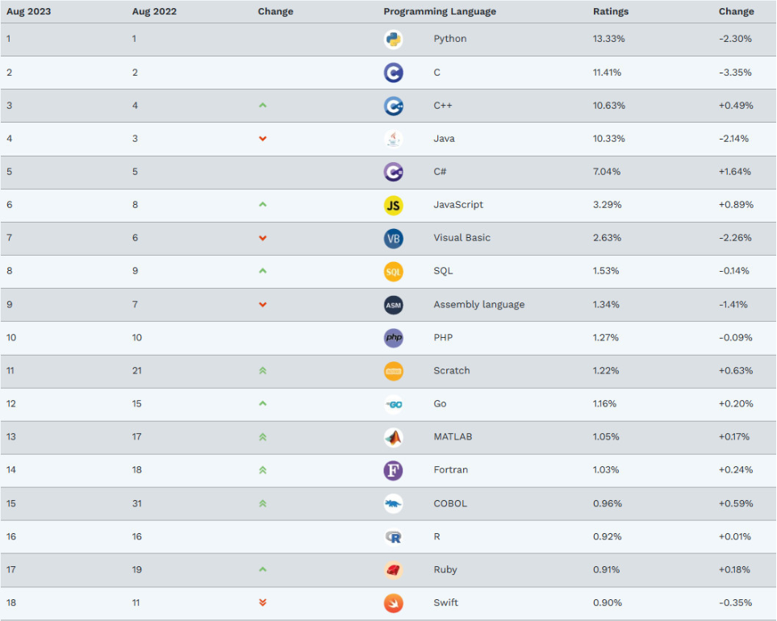
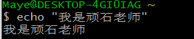
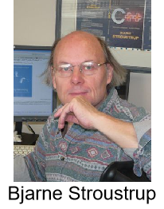
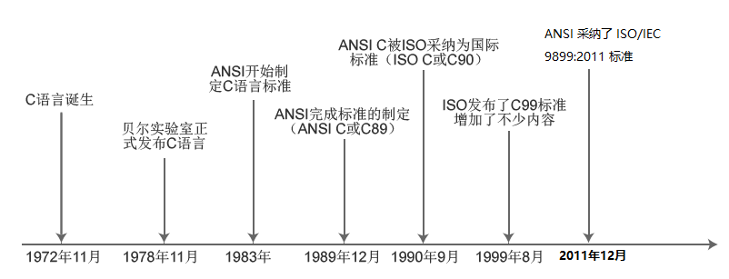
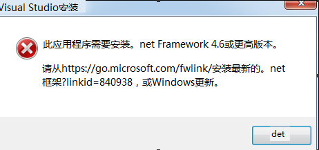
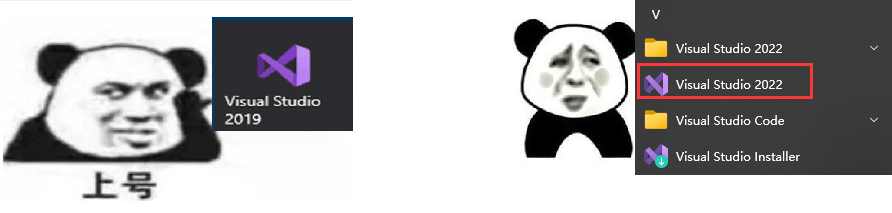
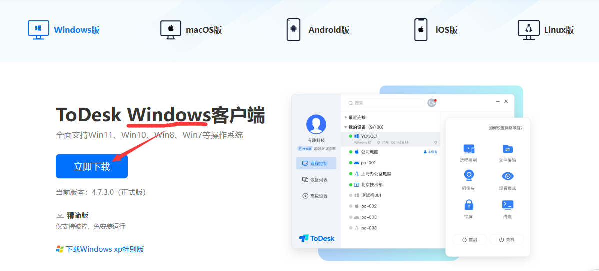

# C语言从入门到入土

讲师：顽石老师（江湖人称：顽石哥）

---

## 1. 上课安排

**上课时间：**每周1、3、5 晚上19:30—21:30


**作业布置：**

1. 每节课下课都有作业，在下节课上课之前提交哦~
   2. 作业提交到强森老师QQ邮箱<507817159@qq.com>

**录播、课件、代码：**下课10分钟之内上传到`QQ群文件`和`百度网盘`

**答疑时间：**

1. 周一至周六：12:00-22:00 （正常上班时间，回复一般较快）
2. 周日和法定节假日，另行通知！有问题可以先发给老师，看到就会回复滴~

>PS：上课出Bug很正常，请不要报警！QAQ


## 2. 编程介绍

### 2.1 什么是编程？

编程就是让计算机代码解决某个问题，对某个计算体系规定一定的运算方式，使计算体系按照该计算方式运行，并最终得到相应结果的过程。

为了使计算机能够理解人的意图，人类就必须将需解决的问题的思路、方法和手段通过计算机能够理解的形式告诉计算机，使得计算机能够根据人的指令一步一步去工作，完成某种特定的任务。这种人和计算体系之间交流的过程就是编程。

### 2.2 什么是程序？

程序其实就是编程完成之后的结果，编程编程，编写出程序让计算机去执行。

"程序"一词来源于生活，通常指完成某些事务的既定方式和过程(行事的先后次序；工作步骤)。

比如要把大象放进冰箱：步骤就是，打开冰箱门->放入冰箱->关闭冰箱门

**计算机中的程序：**是为了让计算机执行某些操作或解决某个问题，而编写的一系列按照特定顺序组织的计算机数据和指令的集合。


### 2.3  编程语言

要想写出各种程序，就必须使用编程语言；何为编程语言？一言以蔽之，即人与计算机交流的语言。

那么世界上有多少种编程语言呢？当我查遍网络之后，仍然没有找到准确答案，只知道几千的数量是有的，但是我们常用的也就几十来个，其中最常见的便是C语言、C++、Java、Python、C#、JavaScript、GO、Swift等这几种，主要是这几种比较流行，使用的人也较多，并且容易找工作。

大家常常看到的[Tiobe编程语言排行榜]([TIOBE Index - TIOBE](https://www.tiobe.com/tiobe-index/))，排在前列的也是这几个。C语言不是第一就是第二，C++即将超越C语言成为第二。



虽然有这么多种语言，但是最开始的语言是什么？如何发展的？

**机器语言**

机器语言是低级语言，也称为二进制代码语言，是一种使用0、1表示的二进制代码编写指令以执行计算机操作的语言。机器语言的特点是计算机可以直接识别，不需要进行任何翻译。

**汇编语言**

汇编语言是面向机器的程序设计语言。为了减轻开发者使用二进制代码编程的痛苦，用英文字母或符号串来替代机器语言的二进制码，这样就把不易理解和使用的机器语言变成了汇编语言。因此，汇编语言要比机器语言更便于阅读和理解

**高级语言**

由于汇编语言依赖于硬件体系，并且助记符号数量比较多，所以其运用起来仍然不够方便。为了使程序语言能更贴近人类的自然语言，同时又不依赖于计算机硬件，于是产生了高级语言。这种语言，其语法形式类似于英文，并且因为不需要对硬件进行直接操作，因此易于被普通人所理解与使用。其中影响较大、使用普遍的高级语言有Fortran、ALGOL、Basic、COBOL、LISP、Pascal、PROLOG、C、C++、VC、VB、Delphi、Java等。

### 2.4 人与程序的交互方式

程序是为了解决问题而出现的，我们需要传递数据给程序，让程序去解决，那么怎么样才能控制或者说和程序交互呢？

+ **自然交互：**语音控制、动作控制


+ **图形化界面：**这种方式简单直观，使用者易于接受，容易上手操作。


+ **命令行方式：**需要有一个控制台，输入特定的指令，让计算机完成一些操作。较为麻烦，需要记录住一些命令。



## 3. C语言

### 3.1 C语言发展史

早期操作系统都是用汇编语言编写的，由于汇编语言依赖于计算机硬件，程序的可读性和可移植性都不是很好。为了提高可读性和可移植性，人们开始寻找一种语言，这种语言既要具有高级语言的特性，又不能失去低级语言的优点。于是，C语言产生了。

C语言是在BCPL语言（简称B语言）的基础上发展和完善起来的，而B语言是由UNIX的研制者丹尼斯·里奇（Dennis Ritchie）和肯·汤普逊（Ken Thompson）于1970年研制出来的。1972年，AT&T Bell实验室的程序员丹尼斯·里奇第一次把B语言改为C语言。

最初，C语言运行于AT&T的多用户、多任务的UNIX操作系统上。后来，丹尼斯·里奇用C语言改写了UNIX C的编译程序，UNIX操作系统的开发者肯·汤普逊又用C语言成功地改写了UNIX，从此开创了编程史上的新篇章。UNIX成为第一个不是用汇编语言编写的主流操作系统。

尽管C语言是在大型商业机构和学术界的研究实验室中研发的，但是当开发者们为第一台个人计算机提供C编译系统之后，C语言就得以广泛传播，并为大多数程序员所接受。对MS-DOS操作系统来说，系统软件和实用程序都是用C语言编写的。Windows操作系统大部分也是用C语言编写的。

C语言是一种面向过程的语言，同时具有高级语言和汇编语言的优点。C语言可以广泛应用于不同的操作系统，如UNIX、MS-DOS、Microsoft Windows及Linux等。

在C语言基础上发展起来的有支持多种程序设计风格的C++语言，网络上广泛使用的Java和JavaScript，以及微软的C#语言等。也就是说，学好C语言之后，再学习其他语言就会比较轻松。



### 3.2 C语言标准的变迁



## 4. 工具安装

欲善工事，先利其器。


### 4.1 VS

Microsoft Visual Studio IDE（简称VS）是微软公司推出的开发工具集，也是目前最流行的Windows平台应用程序的集成开发环境之一。Visual Studio不仅可以编写C语言程序，还可以开发C++、C#、ASP.NET等，用其编写的代码适用于微软支持的所有平台。

> 有点大，你忍耐一下，安装它需要硬盘需要有最起码5GB，而且还需要电脑有一定的配置，才能运行无压力。

#### 4.1.1 下载与安装

+ 进入[VS官网](https://visualstudio.microsoft.com/zh-hans/)下载VS2022。


> Visual Studio 2022 Professional：TD244-P4NB7-YQ6XK-Y8MMM-YWV2J

+ 下载之后双击exe进入安装。
+ 如果弹出提示框，说.net framework版本过低，请进入[官网](https://dotnet.microsoft.com/zh-cn/download/dotnet-framework)下载最新版本，之后再重新安装Vs。



安装完成之后，可能桌面没有快捷方式，那么请打开开始菜单栏，进行寻找。



#### 4.1.2 安装拓展

扩展是一个加载项，可用于通过添加新功能或集成现有工具来自定义和增强 Visual Studio 体验。 扩展复杂程度不一，但是其主要用途在于提高工作效率并满足工作流需求。

[插件商店](https://marketplace.visualstudio.com/vs)

+ Microsoft visual studio installer projects [创建安装程序]
+ Doxygen Comments [自动创建Doxygen注释]
+ Force UTF-8(With BOM) [保存文件时自动转换为UTF-8 with bom]


### 4.2 ToDesk

在学习的过程中，难免会遇到文字难以描述清楚的问题，那么咱们可以给你远程解答，so 先装上ToDesk！

+ 进入ToDesk[官网](https://www.todesk.com/download.html)，下载Windows版本。



### 4.3 有道翻译

学习基础知识的时候，英语并不重要，但是偶尔报错是英语就尴尬了，所以，我们要使用工具干掉它！！

进入有道翻译[官网](https://fanyi.youdao.com/download-Windows?keyfrom=dict_web_banner)，下载客户端。


### 4.4 Everything

Everything 是速度最快的文件名搜索工具，其速度之快令人震惊，百G硬盘几十万个文件，可以在几秒钟之内完成索引；文件名搜索瞬间呈现结果。它小巧免费，界面简洁，实时跟踪更新，轻松分享文件索引，支持通配符、正则表达式，可以通过HTTP或FTP分享搜索结果。

进入[Everything官网](https://www.voidtools.com/zh-cn/downloads/)，下载64位安装版。


## 5.第一个C程序

### 1.Hello World

'Hello,World!' 中文意思是“你好，世界”。因为 *[The C Programming Language](https://baike.baidu.com/item/The C Programming Language/1838395)* 中使用它做为第一个演示程序，后来的程序员在学习编程或进行设备调试时延续了这一习惯。

创建一个VS项目，输入以下代码：

```c
#include<stdio.h>
int main()
{
    printf("hello world\n");
    return 0;
}
```

**解析：**

+ `#include<stdio.h>` #include为头文件包含指令；stdio.h为标准输入输出头文件。
+ `int main()` 为入口函数原型，程序中有且只能有一个
+ `printf` 为标准输出函数
+ 每条语句都以分号结尾
+ `return 0` 表示主函数正常退出

### 2. 注释

是指解释字句的文字，用来对代码进行解释。

**建议：**

+ 一般情况下，代码中有效注释量必须在20%以上。

  注释的原则是有助于对程序的阅读和理解，在该加的地方都加上，注释不宜太多也不能太少，注释语言必须准确、易懂、简介。

+ 边写代码边注释，修改代码时要相应修改注释，保证注释和代码的一致性。

+ 通过对函数或过程、变量、结构等正确的命名以及合理地组织代码的结构，使代码成为自注释的。

**注释方法：**

+ 方式一：单行注释，使用双斜杠注释 `// 这里是注释`;
+ 方式二：多行注释，使用斜杠和\*号搭配 `/* 这里是注释 */`;

### 3. 文件

在编程的过程中，可能会用到很多的文件，我们对常用的进行简单介绍。

+ .c 源文件：即存储咱们编写的代码的文件
+ .h 头文件：即存储类型、函数的声明，宏定义等代码的文件
+ .exe 可执行文件：即编写的源文件生成的可以直接执行的二进制文件

### 4. main函数

在C语言程序中，main主函数是程序的入口，而且在整个项目的源代码中，有且只有一个main主函数。

```c
int main()
{
    return 0;
}
```

其函数的返回类型是int型。main函数的返回值是返回给系统的，如果main函数运行正常，就返回0，否则就返回相应的错误代码。通过错误代码，就可以判断出程序出错的原因。

一些C语言的初学者习惯将返回类型写成void，这实际上是不正确的。C语言规定了main函数只有两种正确的写法。

+ 第一种：即我们平时写的不带参数的版本，实际上如果不带参数标准的做法是在括号内写上void

```c
int main(void)
{
    return 0;
}
```

+ 第二种：完整参数版本

```c
int main(int argc,char*argv[])
{
    return 0; 
}
```

**错误版本：**

```c
void main()
{
    
}

main()
{
    
}
```

### 5. 程序闪退

在刚开始写C语言程序的时候，编写好程序运行之后发现程序运行之后，弹出的运行结果窗口仅仅是弹出来一下就不见了，这时候有三种解决办法。

+ 在return 0;之前加上getchar();

```c
#include<stdio.h>
int main()
{
    printf("海纳百川，有容奶大\n");
    getchar();
    return 0;
}
```

+ 在return 0;之前加上system("pause")，这种方法还需要加上<stdlib.h>头文件

```c
#include<stdio.h>
#include<stdlib.h>
int main()
{
    printf("海纳百川，有容奶大\n");
    system("pause");
    return 0;
}
```

+ 最粗暴的方法，不需要任何头文件。在return 0;之前加上while(1);

```c
#include<stdio.h>
int main()
{
    printf("海纳百川，有容奶大\n");
    while(1);
    return 0;
}
```

## 6. 常见错误

### 常见错误

+ error C2065: “printf（”: 未声明的标识符

  ```c
  printf（"hello world\n");
  ```

  问题：在编程的过程中，记得所有符号都用英文。

+ error C2143: 语法错误: 缺少“;”(在“return”的前面)

  ```c
  printf("hello world\n")
  return 0;
  ```

  问题：C语言语句以分号结尾，一个完整的语句后面不要忘记加分号。

+ error LNK2019: 无法解析的外部符号 _main，函数 "int __cdecl invoke_main(void)" (?invoke_main@@YAHXZ) 中引用了该符号

  ```c
  int mian()
  {
  	printf("hello world\n");
  	return 0;
  }
  ```

  问题：不要把入口函数main写成mian了。

+ error LNK2005: _main 已经在 hello.obj 中定义（ fatal error LNK1169: 找到一个或多个多重定义的符号）

  `main.c`

  ```c
  #include<stdio.h>
  
  int main()
  {
  	printf("hello world\n");
  	return 0;
  }
  ```

  `hello.c`

  ```c
  #include<stdio.h>
  int main()
  {
  	printf("hello 顽石老师\n");
  	return 0;
  }
  ```

  问题：在同一个项目中，如果存在多个源文件，函数名是不能重复的。

+ fatal error C1075: “{”: 未找到匹配令牌

  ```c
  #include<stdio.h>
  
  int main()
  {
  	printf("hello 顽石老师\n");
  	return 0;
  
  ```

  问题：大括号、小括号、尖括号一定要匹配。

## 7. 常用快捷键

**visual studio  快捷键大全各位同学每个都熟悉一下哦，不一定都能用上，用的时候可以在这里来查找**

**1)，回到上一个光标位置/前进到下一个光标位置**

+ 回到上一个光标位置：使用组合键<Ctrl + ->； 

+ 前进到下一个光标位置：<Ctrl + Shift + - >。 

**2)，复制/剪切/删除整行代码** 

+ 如果你想复制一整行代码，只需将光标移至该行，再使用组合键“Ctrl+C”来完成复制操作，而无需选择整行。 

+ 如果你想剪切一整行代码，只需将光标移至该行，再使用组合键“Ctrl+X”来完成剪切操作，而无需选择整行。 

+ 如果你想删除一整行代码，只需将光标移至该行，再使用组合键“Ctrl+L”来完成剪切操作，而无需选择整行。 

**3)，撤销/反撤销** 

+ 撤销：使用组合键“Ctrl+Z”进行撤销操作； 

+ 反撤销：使用组合键“Ctrl+Y”进行反撤销操作。 

**4)，向前/向后搜索** 

+ 使用组合键“Ctrl+I”； 

+ 键入待搜索文本（将光标移至搜索词输入框位置即可开始输入）； 

+ 键入搜索文本后，可以使用组合键“Ctrl+I”及“Ctrl+Shift+I”前后定位搜索结果，搜索结果会被高亮显示。 

+ 要结束搜索，可以按“ESC”键或者点击查找框右侧的关闭按钮。 

**[补充]**选择一个单词后，按组合键“Ctrl+F”也可调出查找框口，且搜索结果也会被高亮显示。 

**5)，框式选择** 

+ 使用组合键“Shift+Alt+方向键（或鼠标）”即可完成框式选择。框式选择允许你同时对代码行和列进行选择。这对批量删除某些代码很方便的哦。 
+ 也可以按住Alt键，用鼠标选择。

**6)，在光标所在行的上面或下面插入一行** 

+ 组合键“Ctrl+Enter”：在当前行的上面插入一个空行； 

+ 组合键“Ctrl+Shift+Enter”：在当前行的下面插入一个空行。 

**7)，定位到行首与行尾** 

+ home 键：定位到当前行的行首； 
+ end 键：定位到当前行的行尾。 

**8)，选中从光标起到行首(尾)间的代码** 

+ 选中从光标起到行首间的代码：使用组合键“Shift + Home”； 

+ 选中从光标起到行尾间的代码：使用组合键“Shift + End”。 

**9)，快速移动代码块** 

+ 选中要移动的代码：使用组合键alt+上下键 

**10)，调用智能提示**

+ 方法 1：使用组合键“Ctrl+J”； 

+ 方法 2：使用组合键“Alt+→”。

**11)，调用参数信息提示** 

+ 对于某些函数体较大的函数来说，想轻松地确认参数在函数内部的使用情况是件比较麻烦的事情。这时可以将光标置于参数名上，再按组合键“Ctrl+Shif+空格”，参数被使用的地方会被高亮显示。 

**12)，快速切换窗口** 

+ 使用组合键“Ctrl+Tab”（此时可以打开 IDE 的导航，获得鸟瞰视图）。 

**13)，快速隐藏或显示当前代码段** 

+ 使用组合键“Ctrl+M,M”（记住：要按两次 M 哦）。 

**14)，跳转到指定的某一行** 

+ 方法 1：组合键“Ctrl+G”； 

+ 方法 2：单击状态栏中的行号。 

**15)，注释/取消注释** 

+ 组合键“Ctrl+Shift+/”； 

**16)，全屏显示/退出全屏显示** 

+ 使用组合键“ Shift + Alt + Enter ”。 

**17)，定义与引用** 

+ 转跳到定义：F12 或 Ctrl + 鼠标左键； 

+ 查找所有引用：使用组合键“Shift+F12”。 

**18)，查找和替换** 

+ 查找：使用组合键“Ctrl+F”； 

+ 替换：使用组合键“Ctrl+H”。 

**19)，大小写转换** 

+ 转小写：使用组合键“Ctrl+ U”； 
+ 转大写：使用组合键“Ctrl + Shift + U”。 

**20)，格式化代码**

+  使用组合键"Ctrl + K + D"

**21)，调试相关** 

1）调试（启动）：F5； 

2）调试（重新启动）：使用组合键“Ctrl+Shift+F5”； 

3）调试（开始执行不调试）：使用组合键“Ctrl+F5”； 

4）调试（逐语句）：F11； 

5）调试（逐过程）：F10； 

6）设置断点：F9。 