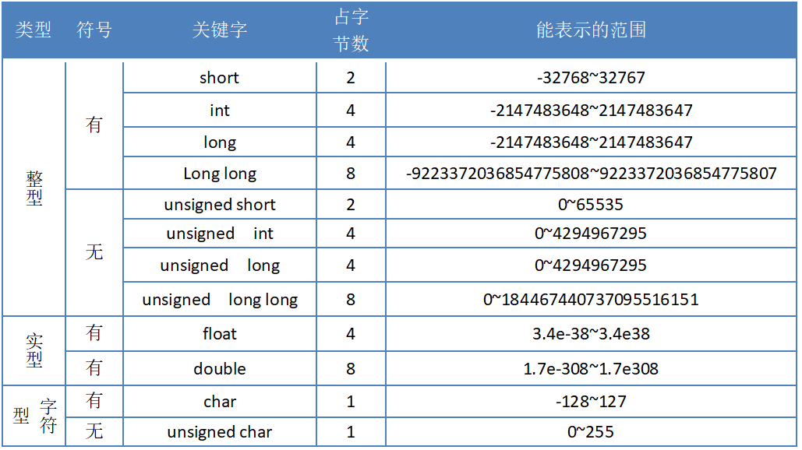

> 顽石老师整理^V^

## 进制对照表

| 十进制   | 0    | 1    | 2    | 3    | 4    | 5    | 6    | 7    | 8    | 9    | 10   | 11   | 12   | 13   | 14   | 15   |
| -------- | ---- | ---- | ---- | ---- | ---- | ---- | ---- | ---- | ---- | ---- | ---- | ---- | ---- | ---- | ---- | ---- |
| 二进制   | 0000 | 0001 | 0010 | 0011 | 0100 | 0101 | 0110 | 0111 | 1000 | 1001 | 1010 | 1011 | 1100 | 1101 | 1110 | 1111 |
| 八进制   | 0    | 1    | 2    | 3    | 4    | 5    | 6    | 7    | 10   | 11   | 12   | 13   | 14   | 15   | 16   | 17   |
| 十六进制 | 0    | 1    | 2    | 3    | 4    | 5    | 6    | 7    | 8    | 9    | A    | B    | C    | D    | E    | F    |

## 2的n次方表

| 2^0  | 2^1  | 2^2  | 2^3  | 2^4   | 2^5    | 2^6     | 2^7      | 2^8       | 2^9        | 2^10        |
| ---- | ---- | ---- | ---- | ----- | ------ | ------- | -------- | --------- | ---------- | ----------- |
| 1    | 10   | 100  | 1000 | 10000 | 100000 | 1000000 | 10000000 | 100000000 | 1000000000 | 10000000000 |
| 1    | 2    | 4    | 8    | 16    | 32     | 64      | 128      | 256       | 512        | 1024        |

## 32个关键字

| 类型           | 关键字   | 解释               |
| -------------- | -------- | ------------------ |
| 基本数据类型   | void     | 空类型             |
|                | char     | 字符型             |
|                | int      | 整型               |
|                | float    | 单精度浮点型       |
|                | double   | 双精度浮点型       |
| 类型修饰关键字 | short    | 短整型             |
|                | long     | 长整型             |
|                | signed   | 有符号             |
|                | unsigned | 无符号             |
| 存储类别关键字 | auto     | 自动变量           |
|                | static   | 静态变量           |
|                | register | 寄存器变量         |
|                | extren   | 外部变量           |
|                | const    | 常量               |
|                | volatile | 变量               |
| 复杂类型关键字 | struct   | 结构体             |
|                | union    | 联合(共用体)       |
|                | enum     | 枚举               |
|                | typedef  | 给类型取别名       |
|                | sizeof   | 求类型或变量大小   |
| 跳转语句       | return   | 函数返回           |
|                | continue | 循环继续           |
|                | break    | 跳出循环或switch   |
|                | goto     | 无条件跳转         |
| 分支语句       | if       | 条件语句           |
|                | else     | 否定分支(与if连用) |
|                | switch   | 开关语句(多重分支) |
|                | case     | 分支标记           |
|                | default  | 开关语句中的其他   |
| 循环           | for      | for循环            |
|                | do       | do...while循环     |
|                | while    | while循环          |
| 新增其他       | _Bool    | 布尔类型           |

## 占位符(格式控制符)

| 格式控制符 |                             作用                             |
| :--------: | :----------------------------------------------------------: |
|     %d     |            输出有符号的十进制整数（包括char类型）            |
|     %u     |            输出无符号的十进制整数（包括char类型）            |
|     %f     | 输出float类型的浮点数（输入时小数形式和指数形式都可以识别）  |
|    %lf     | 输出double类型的浮点数（输入时小数形式和指数形式都可以识别） |
|     %c     |                         输出单个字符                         |
|     %s     |                          输出字符串                          |
|     %p     |                      以整数形式输出指针                      |
|  %x 或 %X  |                     以十六进制的方式输出                     |
|     %o     |                  用来输出无符号的八进制整数                  |
|     %e     |  以指数形式输出浮点数（输入时小数形式和指数形式都可以识别）  |
|     %g     | 自适应输出小数或者指数形式（输入时小数形式和指数形式都可以识别） |

## ASCII码表

## 转义字符

| 转义字符 | 意义                                | ASCII码值（十进制） |
| -------- | ----------------------------------- | ------------------- |
| \a       | 响铃(BEL)                           | 007                 |
| \b       | 退格(BS) ，将当前位置移到前一列     | 008                 |
| \f       | 换页(FF)，将当前位置移到下页开头    | 012                 |
| \n       | 换行(LF) ，将当前位置移到下一行开头 | 010                 |
| \r       | 回车(CR) ，将当前位置移到本行开头   | 013                 |
| \t       | 水平制表(HT) （跳到下一个TAB位置）  | 009                 |
| \v       | 垂直制表(VT)                        | 011                 |
| \\       | 代表一个反斜线字符''\'              | 092                 |
| \'       | 代表一个单引号（撇号）字符          | 039                 |
| \"       | 代表一个双引号字符                  | 034                 |
| \?       | 代表一个问号                        | 063                 |
| \0       | 空字符(NUL)                         | 000                 |
| \ddd     | 1到3位八进制数所代表的任意字符      | 三位八进制          |
| \xhh     | 十六进制所代表的任意字符            | 十六进制            |

## 基本数据类型

## 运算符优先级和结合性

## 文件操作模式

| 模式 | 含义       | 说明                                                         |
| ---- | ---------- | ------------------------------------------------------------ |
| r    | 只读       | 文件必须存在，否则打开失败                                   |
| w    | 只写       | 若文件存在，则清除原文件内容后写入；否则，新建文件后写入     |
| a    | 追加只写   | 若文件存在，则位置指针移到文件末尾，在文件尾部追加写人，故该方式不 删除原文件数据；若文件不存在，则打开失败 |
| r+   | 读写       | 文件必须存在。在只读 r 的基础上加 '+' 表示增加可写的功能。下同 |
| w+   | 读写       | 新建一个文件，先向该文件中写人数据，然后可从该文件中读取数据 |
| a+   | 读写       | 在” a”模式的基础上，增加可读功能                             |
| rb   | 二进制读   | 功能同模式”r”，区别：b表示以二进制模式打开。下同             |
| wb   | 二进制写   | 功能同模式“w”。二进制模式                                    |
| ab   | 二进制追加 | 功能同模式”a”。二进制模式                                    |
| rb+  | 二进制读写 | 功能同模式"r+”。二进制模式                                   |
| wb+  | 二进制读写 | 功能同模式”w+”。二进制模式                                   |
| ab+  | 二进制读写 | 功能同模式”a+”。二进制模式                                   |

> 学到对应阶段，需要把所有表都熟悉熟悉