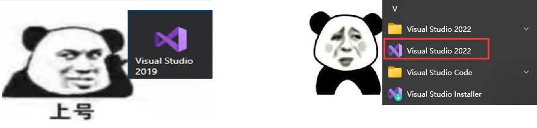

# C语言从入门到入土

讲师：顽石老师（江湖人称：顽石哥）

---

## 1. 上课安排

**上课时间：**每周1、3、5 晚上19:30—21:30

**作业布置：**

1. 每节课下课都有作业，在下节课上课之前提交哦~
   2. 作业提交到强森老师QQ邮箱<507817159@qq.com>

**录播、课件、代码：**下课10分钟之内上传到`QQ群文件`和`百度网盘`

**答疑时间：**

1. 周一至周六：12:00-22:00 （正常上班时间，回复一般较快）
2. 周日和法定节假日，另行通知！有问题可以先发给老师，看到就会回复滴~

>PS：上课出Bug很正常，请不要报警！QAQ

### 课程内容

**咱们的课程学哪些东西呢？**

直播课：C语言、C++、数据结构与算法、Qt、Windows、Linux

录播课：MySQL、设计模式、C++多线程

## 2. 编程介绍

### 2.1 什么是编程？

编程就是让计算机代码解决某个问题，对某个计算体系规定一定的运算方式，使计算体系按照该计算方式运行，并最终得到相应结果的过程。

为了使计算机能够理解人的意图，人类就必须将需解决的问题的思路、方法和手段通过计算机能够理解的形式告诉计算机，使得计算机能够根据人的指令一步一步去工作，完成某种特定的任务。这种人和计算体系之间交流的过程就是编程。

### 2.2 什么是程序？

程序其实就是编程完成之后的结果，编程编程，编写出程序让计算机去执行。

"程序"一词来源于生活，通常指完成某些事务的既定方式和过程(行事的先后次序；工作步骤)。

比如要把大象放进冰箱：步骤就是，打开冰箱门->放入冰箱->关闭冰箱门

**计算机中的程序：**是为了让计算机执行某些操作或解决某个问题，而编写的一系列按照特定顺序组织的计算机数据和指令的集合。

### 2.3  编程语言

要想写出各种程序，就必须使用编程语言；何为编程语言？一言以蔽之，即人与计算机交流的语言。

那么世界上有多少种编程语言呢？当我查遍网络之后，仍然没有找到准确答案，只知道几千的数量是有的，但是我们常用的也就几十来个，其中最常见的便是C语言、C++、Java、Python、C#、JavaScript、GO、Swift等这几种，主要是这几种比较流行，使用的人也较多，并且容易找工作。

大家常常看到的[Tiobe编程语言排行榜]([TIOBE Index - TIOBE](https://www.tiobe.com/tiobe-index/))，排在前列的也是这几个。C语言不是第一就是第二，C++即将超越C语言成为第二。

虽然有这么多种语言，但是最开始的语言是什么？如何发展的？

**机器语言**

机器语言是低级语言，也称为二进制代码语言，是一种使用0、1表示的二进制代码编写指令以执行计算机操作的语言。机器语言的特点是计算机可以直接识别，不需要进行任何翻译。

**汇编语言**

汇编语言是面向机器的程序设计语言。为了减轻开发者使用二进制代码编程的痛苦，用英文字母或符号串来替代机器语言的二进制码，这样就把不易理解和使用的机器语言变成了汇编语言。因此，汇编语言要比机器语言更便于阅读和理解

**高级语言**

由于汇编语言依赖于硬件体系，并且助记符号数量比较多，所以其运用起来仍然不够方便。为了使程序语言能更贴近人类的自然语言，同时又不依赖于计算机硬件，于是产生了高级语言。这种语言，其语法形式类似于英文，并且因为不需要对硬件进行直接操作，因此易于被普通人所理解与使用。其中影响较大、使用普遍的高级语言有Fortran、ALGOL、Basic、COBOL、LISP、Pascal、PROLOG、C、C++、VC、VB、Delphi、Java等。

### 2.4 人与程序的交互方式

程序是为了解决问题而出现的，我们需要传递数据给程序，让程序去解决，那么怎么样才能控制或者说和程序交互呢？

+ **自然交互：**语音控制、动作控制

+ **图形化界面：**这种方式简单直观，使用者易于接受，容易上手操作。

+ **命令行方式：**需要有一个控制台，输入特定的指令，让计算机完成一些操作。较为麻烦，需要记录住一些命令。

## 3. C语言

### 3.1 C语言发展史

早期操作系统都是用汇编语言编写的，由于汇编语言依赖于计算机硬件，程序的可读性和可移植性都不是很好。为了提高可读性和可移植性，人们开始寻找一种语言，这种语言既要具有高级语言的特性，又不能失去低级语言的优点。于是，C语言产生了。

C语言是在BCPL语言（简称B语言）的基础上发展和完善起来的，而B语言是由UNIX的研制者丹尼斯·里奇（Dennis Ritchie）和肯·汤普逊（Ken Thompson）于1970年研制出来的。1972年，AT&T Bell实验室的程序员丹尼斯·里奇第一次把B语言改为C语言。

最初，C语言运行于AT&T的多用户、多任务的UNIX操作系统上。后来，丹尼斯·里奇用C语言改写了UNIX C的编译程序，UNIX操作系统的开发者肯·汤普逊又用C语言成功地改写了UNIX，从此开创了编程史上的新篇章。UNIX成为第一个不是用汇编语言编写的主流操作系统。

尽管C语言是在大型商业机构和学术界的研究实验室中研发的，但是当开发者们为第一台个人计算机提供C编译系统之后，C语言就得以广泛传播，并为大多数程序员所接受。对MS-DOS操作系统来说，系统软件和实用程序都是用C语言编写的。Windows操作系统大部分也是用C语言编写的。

C语言是一种面向过程的语言，同时具有高级语言和汇编语言的优点。C语言可以广泛应用于不同的操作系统，如UNIX、MS-DOS、Microsoft Windows及Linux等。

在C语言基础上发展起来的有支持多种程序设计风格的C++语言，网络上广泛使用的Java和JavaScript，以及微软的C#语言等。也就是说，学好C语言之后，再学习其他语言就会比较轻松。

### 3.2 C语言标准的变迁

### 3.3 C语言的特点

C语言是一种通用的程序设计语言，主要用来进行系统程序设计，具有如下特点。

#### 1．高效性

从C语言的发展历程可以看到，它继承了低级语言的优点，代码运行效率高，并具有良好的可读性和编写性。一般情况下，C语言生成的目标代码的执行效率只比汇编程序低10%~20%。

#### 2．灵活性

C语言中的语法不拘一格，可在原有语法基础上进行创造、复合，从而给程序员更多想象和发挥的空间。

#### 3．功能丰富

除C语言中所具有的类型外，还可以使用丰富的运算符和自定义结构类型来表达复杂的数据类型，完成所需要的功能。

#### 4．表达力强

C语言的语法形式与人们惯用的自然语言相似，书写形式自由，结构规范，通过简单的控制语句即可轻松控制程序流程，完成烦琐的程序要求。

#### 5．移植性好

作为高级语言，C语言具有良好的可移植性。在不同的操作系统下，只需要简单地修改甚至不用修改，即可进行跨平台的程序开发操作。正是由于C语言拥有上述优点，因此它在程序开发中备受青睐。

### 3.4 学习常见疑惑

## 4. 工具安装

欲善工事，先利其器。

### 4.1 VS

Microsoft Visual Studio IDE（简称VS）是微软公司推出的开发工具集，也是目前最流行的Windows平台应用程序的集成开发环境之一。Visual Studio不仅可以编写C语言程序，还可以开发C++、C#、ASP.NET等，用其编写的代码适用于微软支持的所有平台。

> 有点大，你忍耐一下，安装它需要硬盘需要有最起码5GB，而且还需要电脑有一定的配置，才能运行无压力。

#### 4.1.1 下载与安装

+ 进入[VS官网](https://visualstudio.microsoft.com/zh-hans/)下载VS2022。

> Visual Studio 2022 Professional：TD244-P4NB7-YQ6XK-Y8MMM-YWV2J

+ 下载之后双击exe进入安装。
+ 如果弹出提示框，说.net framework版本过低，请进入[官网](https://dotnet.microsoft.com/zh-cn/download/dotnet-framework)下载最新版本，之后再重新安装Vs。

安装完成之后，可能桌面没有快捷方式，那么请打开开始菜单栏，进行寻找。

#### 4.1.2 安装拓展

扩展是一个加载项，可用于通过添加新功能或集成现有工具来自定义和增强 Visual Studio 体验。 扩展复杂程度不一，但是其主要用途在于提高工作效率并满足工作流需求。

[插件商店](https://marketplace.visualstudio.com/vs)

+ Microsoft visual studio installer projects [创建安装程序]
+ Doxygen Comments [自动创建Doxygen注释]
+ Force UTF-8(With BOM) [保存文件时自动转换为UTF-8 with bom]

### 4.2 向日葵

在学习的过程中，难免会遇到文字难以描述清楚的问题，那么咱们可以给你远程解答，so 先装上小菊花！

+ 进入向日葵[官网](https://sunlogin.oray.com/download?categ=personal)，下载Windows版本。

### 4.3 有道翻译

学习基础知识的时候，英语并不重要，但是偶尔报错是英语就尴尬了，所以，我们要使用工具干掉它！！

进入有道翻译[官网](https://fanyi.youdao.com/download-Windows?keyfrom=dict_web_banner)，下载客户端。

## 5. 电脑知识

### 1. 电脑桌面

桌面（Desktop），是指打开计算机并成功登录系统之后看到的显示器主屏幕区域，是计算机用语。桌面的定义广泛，它包括任务栏和桌面图标 。

#### 桌面图标

图标是具有明确指代含义的计算机图形。而桌面图标是软件标识，界面中的图标是功能标识。

> 通过桌面图标可以快速运行指定的程序，实际上是一个快捷方式。

#### 任务栏

任务栏又分为**开始菜单**、**工具栏**和**托盘菜单**。

+ “开始菜单”按钮可以访问程序、文件夹和计算机设置。桌面文件一般存放在C盘，用户名下的“桌面”文件夹内。

+ “工具栏”提供了快捷访问程序的功能，以及正在运行的程序的展示。
+ “托盘菜单”是任务栏右下角的区域，当某些程序最小化，或者关闭时，可以隐藏到托盘菜单。

### 2. 截图

很多时候我们都需要用到截图功能来截取自己的电脑屏幕，但是很多同学并不知道在怎么截图，其实方法有很多种，在这里给大家介绍几种，以后就可以高效的截图了。

#### 系统自带

##### 方法一

　　按“**Print screen键**”截图，按下Prtsc键我们可以截取整个屏幕的内容，然后可以直接打开画图工具，直接粘贴使用。也可以粘贴在聊天窗口或者Word文档中，之后再选择保存即可 。

##### 方法二　

按“**Alt + Print screen键**”截图，这个快捷键只截取当前活动窗口的内容，例如我们打开那种软件，然后我们可以使用Alt+Prtsc组合键截图，截屏的界面就是软件显示界面，不是全屏范围的，更为精准一些。(通过这种方式的截图也可以直接粘贴使用。)

##### 方法三

　通过截图工具。打开开始菜单，接着找到`J`开头的程序，其中就有[截图和草图]啦，点击选择它即可使用。

##### 方法四

使用win10快速截图工具，`Win + Shift + S`打开截图工具，在上面可以选择截图类型，截图之后会自动保存到粘贴板。

#### 软件功能

##### QQ截图

如果登录了QQ，则可以使用`Ctrl + Alt + A`进行截图。

##### 微信截图

如果登录了微信，则可以使用`Alt + A`进行截图。

#### 总结

这么多的截图方法，就不要让你的手机献丑了！

> PS：如有代码问题，截图请大气一点，不要抠抠搜搜，截图一点点，啥也看不到，有报错，需要把报错和代码都发出来！

不要用手机拍照！不要用手机拍照！不要用手机拍照！

### 3. 文件系统

#### 文件

持有数据的文件系统对象，拥有名称及属性，属性中最重要的就是文件类型，主要有如下几种：

+ **目录(文件夹)**

表现为目录项的容器的文件，目录项标识其他文件（其中一些可以是另外的嵌套的目录）。讨论到具体文件时，包含该文件的目录是其*父目录*。父目录能以相对路径名 ".." 表示。

+ **硬链接**

关联一个名字到一个既存文件的目录条目。若支持多重硬链接，则文件在最后一个到它的硬链接被移除后才被移除。

+ **符号链接**

关联一个名词到一个路径的目录条目，路径可以存在亦可不存在。

+ **常规文件**

不是其他文件类型的文件。

#### 路径

路径标识文件所在的路径。

+ 相对路径 
  + `./hello/hello.txt` 当前目录下面的hello目录下面的hello.txt文件
  + `../test/src/` 上级目录下面的test目录下面的src目录
+ 绝对路径
  + `C:/windows`
  + `D:/course/C/从入门到入土.avi`

#### 拓展名(后缀名)

常规文件一般都有拓展名，但是很多时候，电脑默认不会显示拓展名，这个时候就需要打开拓展名的显示了！

##### Win10

打开文件资源管理器，点击查看-勾选上显示文件拓展名，就可以看到了。

##### Win7

打开文件资源管理器，点击工具-文件夹选项-查看-找到`隐藏已知文件类型的拓展名`，取消勾选即可！

##### Win11

和Win10类似！

> 除非你知道你在做什么，否则禁止修改文件后缀。尤其是音频和视频，修改编码需要格式转换工具！

### 4. 解压缩

#### 压缩介绍

**什么是压缩？**

如果从互联网上下载了许多程序和文件，可能会遇到很多压缩文件。这种压缩机制是一种很方便的发明，尤其是对网络用户，因为它可以减小文件中的比特和字节总数，使文件能够通过较慢的互联网连接实现更快传输，此外还可以减少文件的磁盘占用空间。

压缩，即对算法对文件进行处理，从而使文件体积变小，便于存储和传输。

**压缩作用**

1. 节省磁盘空间；

2. 可以把多个文件压缩成一个压缩包，此功能在发送邮件时用处比较大，因为邮件附件多个文件通常要一个个的上传，把多个文件压缩成一个压缩包后就可以完成一次上传了；

3. 可以把一个大文件分解压缩成多个小压缩包，此功能在文件拷贝中作用比较大，比如说你有个300M的文件需要拷贝到别的电脑中，而你的U盘只有256M，这时候你就可以用压缩软件把文件分成两个150M的压缩包然后分别拷贝就行了；

4. 此外部分软件如7-zip可以实现对文件的压缩保密保护，就是在形成压缩包的时候添加解压密码，这样生成的压缩包别人没有密码是无法打开的，可以起到一定的文件保密作用。

**压缩算法**

有很多不同的压缩文件格式，例如ZIP、[RAR](https://baike.baidu.com/item/RAR/2502036?fromModule=lemma_inlink)、[7Z](https://baike.baidu.com/item/7Z/3651842?fromModule=lemma_inlink)等，实际上这只是不同的压缩规范，就算是同样的格式，例如都是ZIP，其中的压缩算法可能也是不一样的，例如ZIP可以使用Shrinking、Reducing、Deflate等算法。

某个压缩文件压缩率高不高，不但要看其文件格式，更要看其具体使用的算法（例如ZIP和7Z都可以使用Deflate算法） 。

**压缩格式**

rar、zip、7z、CAB、ARJ、LZH、TAR、GZ、ACE、UUE、BZ2、JAR、ISO，以及MPQ。

平时常见的jpg，MP4等格式的音视频文件也属于压缩文件（只不过需要特殊的软件来打开，解码等）。

在下载了文件后，计算机可使用WinRar或Stuffit这样的程序来展开文件，将其复原到原始大小。如果一切正常，展开的文件与压缩前的原始文件将完全相同。压缩包是计算机[压缩文件](https://baike.baidu.com/item/压缩文件?fromModule=lemma_inlink)、[文件夹](https://baike.baidu.com/item/文件夹/23609397?fromModule=lemma_inlink)的载体。

#### 压缩软件

WinRAR，好压(Haozip)，WinZip，[7-Zip](https://7-zip.org/)，[BandiZip](http://www.bandisoft.com/)，WinMount，Peazip，UHARC，FreeARC，360压缩等。

其中WinRAR和WinZip是[收费软件](https://baike.baidu.com/item/收费软件/15608466?fromModule=lemma_inlink)，Winmount、好压(Haozip)、Peazip、360压缩、BandiZip和7-Zip是免费软件。

> 我使用的是7-zip，因为它简单，简介，无广告，无弹窗，[软件](./assets/software/)只有1M多

### 5. 环境变量与注册表

#### 1. 环境变量

环境变量（environment variables）一般是指在操作系统中用来指定操作系统运行环境的一些参数，如：临时文件夹位置和系统文件夹位置等。

环境变量是在操作系统中一个具有特定名字的对象，它包含了一个或者多个应用程序所将使用到的信息。

例如Windows和DOS操作系统中的path环境变量，当要求系统运行一个程序而没有告诉它程序所在的完整路径时，系统除了在当前目录下面寻找此程序外，还应到path中指定的路径去找。用户通过设置环境变量，来更好的运行进程。

**打开环境变量**

+ 按下`win+R`快捷键，打开运行对话框，输入命令`sysdm.cpl`，然后按下图进行操作。

  

+ `win+s`打开搜索框，输入`env`或`系统环境变量`

  

#### 2. 注册表

注册表（Registry）是Microsoft Windows中的一个重要的数据库，用于存储系统和应用程序的设置信息。

**打开注册表**

+ 使用命令`regedit`打开

+ `Win + x`搜索`regedit`或`注册表编辑器`

> **友情慎重提醒，操作注册表有可能造成系统故障**，若您是对Windows注册表不熟悉、不了解或没有经验的Windows操作系统用户建议尽量不要随意操作注册表。

### 6. 腾讯电脑管家

现在腾讯电脑管家变的与之前不一样了，不会直接安装腾讯自家的软件，无广告，无多余功能，界面简介\~一个字，爽~

电脑管家提供了一个工具箱子，里面有很多好用的软件。

#### 5.1 桌面整理

**第一，桌面整理，肯定可以对桌面进行整理啦~**

**第二，它支持快捷全局搜索，而且，媲美 Everthing** 

​	你可以自定义一个快捷键，那么，就可以快速地检索任何一份你想要的文件了

#### 5.2 文件粉碎

在某些时候，删除文件时会出现`已经被占用无法删除`，这个时候就可以使用文件粉碎工具进行删除！

在编写程序时，也经常遇到一下错误，这个时候，就必须强制删除生成的exe了！

### 7. 提高打字效率

打字是一种技能，并不是所有的人都可以达到飞速击键的状态。

1、注意自己打字的姿势：第一步要做到背挺直，眼睛离键盘大约半米左右，双手食指自然的放在`F`和`J`键上。

2、熟悉键盘的键位：注意打字时不要只用一个手指去打，一定要让每个手指都有分工。

3、手指的正确位置：注意手指的正确位置。

4、不看键盘打字(盲打)：把字母的位置印在脑海里。

> 在`F`和`J`键上有一个小杠，利用这个来记住键位。

5、善于利用快捷方式：在打字中Ctrl+Shift是切换输入法，Ctrl+空格是切换中英文输入法

6、开始练习时慢一点，不要着急

## 6. 最后

冬夜读书示子聿/陆游

古人学问无遗力，少壮工夫老始成。

纸上得来终觉浅，绝知此事要躬行。

