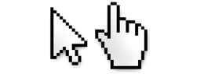
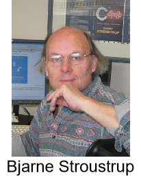
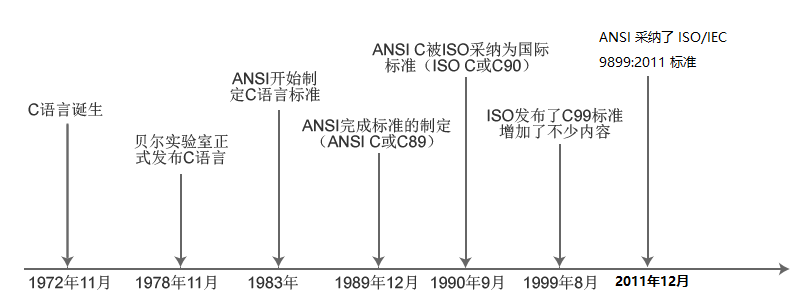

# C语言从入门到入土

讲师：顿开教育-顽石老师（江湖人称：顽石哥）

---

## 1. 上课安排

**上课时间：**每周1、3、5 晚上20:00—22:00


**作业布置：**

		1. 每节课下课都有作业，在下节课上课之前提交哦~
  		2. 作业提交到顽石老师QQ邮箱<823861087@qq.com>

**录播、课件、代码：**下课30分钟之内上传到`QQ群文件`和`百度网盘`

**答疑时间：**

		1. 周一至周六：13:00-23:00 （正常上班时间，回复一般较快）
  		2. 周日和法定节假日，另行通知！有问题可以先发给老师，看到就会回复滴~

>PS：上课出Bug很正常，请不要报警！QAQ


### 课程内容

**咱们的课程学哪些东西呢？**

直播课：C语言、C++、数据结构与算法、Qt、Windows、Linux

录播课：MySQL、设计模式、C++多线程


## 2. 编程介绍

### 2.1 什么是程序？

"程序"一词来源于生活，通常指完成某些事务的既定方式和过程(行事的先后次序；工作步骤)。

比如要把大象放进冰箱：步骤就是，打开冰箱门->放入冰箱->关闭冰箱门

**计算机中的程序：**是为了让计算机执行某些操作或解决某个问题，而编写的一系列按照特定顺序组织的计算机数据和指令的集合。


### 2.2 程序分类

计算机中的程序分为很多种：

+ 系统应用程序
+ 桌面应用程序
+ 驱动应用程序
+ 网络应用程序
+ 手机应用程序
+ 物联网应用程序
+ ...


### 2.3 人与程序的交互方式

程序是为了解决问题而出现的，我们需要传递数据给程序，让程序去解决，那么怎么样才能控制或者说和程序交互呢？

+ **自然交互：**语音控制、动作控制


+ **图形化界面：**这种方式简单直观，使用者易于接受，容易上手操作。



+ **命令行方式：**需要有一个控制台，输入特定的指令，让计算机完成一些操作。较为麻烦，需要记录住一些命令。


### 2.4 什么是编程语言？

在了解编程语言之前，我们先来了解一下咱们人类的语言。语言是人类进行沟通交流的表达方式，语言是生物同类之间由于沟通需要而制定的具有统一编码解码标准的声音(图像)指令。

是不是很好理解？

那么编程语言（programming language）可以简单的理解为一种计算机和人都能识别的语言，能够实现人与机器之间的交流和沟通，而计算机编程语言主要包括**机器语言**，**汇编语言**以及**高级语言**。

+ 机器语言：机器语言是机器能直接识别的程序语言或指令代码(即，用二进制表示的指令集合)，无需经过翻译，每一操作码在计算机内部都有相应的电路来完成它，或指不经翻译即可为机器直接理解和接受的程序语言或指令代码。
+ 汇编语言：即第二代计算机语言，用一些容易理解和记忆的缩写单词来代替一些特定的机器语言指令。
+ 高级语言：计算机语言具有高级语言和低级语言之分。而高级语言又主要是相对于汇编语言而言的，它是较接近自然语言和数学公式的编程，基本脱离了机器的硬件系统，用人们更易理解的方式编写程序。**编写的程序称之为源程序**

## 3. C语言

### 3.1 C语言发展史

1970，美国AT&T公司贝尔实验室（AT&T Bell Laboratory）的研究员Ken Thompson闲来无事，手痒难耐，想玩一个他自己编的，模拟在太阳系航行的电子游戏——Space Travel。他背着老板，找到了台空闲的机器——PDP-7。但这台机器没有操作系统，而游戏必须使用操作系统的一些功能，于是他着手为PDP-7开发操作系统。后来，这个操作系统被命名为——UNIX(汇编语言编写)。

1971年，同样酷爱Space Travel的丹尼斯·里奇为了能早点儿玩上游戏，加入了汤普森的开发项目，合作开发UNIX。他的主要工作是改造B语言，使其更成熟。

1972年，美国贝尔实验室的丹尼斯·里奇在B语言的基础上最终设计出了一种新的语言，他取了BCPL的第二个字母作为这种语言的名字，这就是C语言。

1973年初，C语言的主体完成。汤普森和里奇迫不及待地开始用它完全重写了UNIX。此时，编程的乐趣使他们已经完全忘记了那个“Space Travel”，一门心思地投入到了UNIX和C语言的开发中。随着UNIX的发展，C语言自身也在不断地完善。直到2022年，各种版本的UNIX内核和周边工具仍然使用C语言作为最主要的开发语言，其中还有不少继承Thompson和里奇之手的代码。



### 3.2 C语言标准的变迁



### 3.2 C语言编译过程

C语言编写的程序叫做源程序，是不能直接运行的，需要通过一系列的步骤，讲源代码转换为可执行程序。

步骤分别为：

+ 预处理：

  + 处理所有的注释，以空格替代
  + 展开所有宏定义，并删除#define
  + 处理条件编译指令`#if、#ifdef、#elif、#else、#endif`
  + 处理#include，展开被包含的文件
  + 保留编译器需要使用的#pragma指令

  ```sh
  gcc -E file.c - o file.i
  ```

+ 编译：对预处理后的文件进行词法分析，语法分析和语义分析

  + 词法分析：分析关键字，标示符，立即数等是否合法
  + 语法分析：分析表达式是否遵循语法规则
  + 语义分析：在语法分析的基础上进一步分析表达式是否合法

  ```sh
  gcc -S file.i -o file.s
  ```

+ 汇编：

  + 汇编器将汇编代码转变为机器的可以执行指令
  + 每条汇编语句几乎都对应一条机器指令

  ```sh
  gcc -c file.s -o file.o
  ```

+ 链接：将不同部分的代码和数据合并成为一个单一文件，这个文件可以被执行

  ```sh
  gcc file.o
  ```

### 3.3 学习常见疑惑


[微软官网](https://www.microsoft.com/zh-cn/)

## 4. 工具安装


### 4.1 Visual Studio

#### 4.1.1 Microsoft Visual Studio IDE是什么?

Microsoft Visual Studio是VS的全称。 是微软公司的开发工具包系列产品。

+ **Q：Vs能写C/C++吗？**
  A：不仅能写C/C++，还能写python、C sharp等

+ **Q：为什么要用Vs，没有别的写代码的软件了吗？**
  A：Vs是高度集成的编程环境，使用简单，无需复杂的配置和调试，别的软件不太推荐，有需要可自己摸索

+ **Q：缺点是啥？**
  A：唯一不好的，就是软件有点大，3~5G左右，需要电脑有一定的配置，才能运行无压力。

#### 4.1.2 VS下载与安装

+ 进入[VS官网](https://visualstudio.microsoft.com/zh-hans/)下载VS2022。


> Visual Studio 2022 Professional：TD244-P4NB7-YQ6XK-Y8MMM-YWV2J

+ 下载之后双击exe进入安装。
+ 如果弹出提示框，说.net framework版本过低，请进入[官网](https://dotnet.microsoft.com/zh-cn/download/dotnet-framework)下载最新版本，之后再重新安装Vs。


#### 安装拓展

[插件商店](https://marketplace.visualstudio.com/vs)

+ Microsoft visual studio installer projects [创建安装程序]
+ Doxygen Comments [自动创建Doxygen注释]
+ Force UTF-8(With BOM) [保存文件时自动转换为UTF-8 with bom]

安装完成之后，可能桌面没有快捷方式，那么请打开开始菜单栏，进行寻找。


### 4.2 向日葵

在学习的过程中，难免会遇到文字难以描述清楚的问题，那么咱们可以给你远程解答，so 先装上小菊花！

+ 进入向日葵[官网](https://sunlogin.oray.com/download?categ=personal)，下载Windows版本。


### 4.3 英语那点事

学习基础知识的时候，英语并不重要，但是偶尔报错是英语就尴尬了，所以，我们要使用工具干掉它！！

进入有道翻译[官网](https://www.youdao.com/)，下载客户端。


## 5. 最后
<p style="font-size:20pt;text-align:center;">冬夜读书示子聿/陆游</p>

<p style="font-size:20pt;text-align:center;">古人学问无遗力，少壮工夫老始成。</p>
<p style="font-size:20pt;text-align:center;">纸上得来终觉浅，绝知此事要躬行。</p>


## 6. 电脑知识

### 1. 电脑桌面

桌面（Desktop），是指打开计算机并成功登录系统之后看到的显示器主屏幕区域，是计算机用语。桌面的定义广泛，它包括任务栏和桌面图标 。

#### 桌面图标

图标是具有明确指代含义的计算机图形。而桌面图标是软件标识，界面中的图标是功能标识。

> 通过桌面图标可以快速运行指定的程序，实际上是一个快捷方式。

#### 任务栏

任务栏又分为**开始菜单**、**工具栏**和**托盘菜单**。

+ “开始菜单”按钮可以访问程序、文件夹和计算机设置。桌面文件一般存放在C盘，用户名下的“桌面”文件夹内。

+ “工具栏”提供了快捷访问程序的功能，以及正在运行的程序的展示。
+ “托盘菜单”是任务栏右下角的区域，当某些程序最小化，或者关闭时，可以隐藏到托盘菜单。

### 2. 截图

很多时候我们都需要用到截图功能来截取自己的电脑屏幕，但是很多同学并不知道在怎么截图，其实方法有很多种，在这里给大家介绍几种，以后就可以高效的截图了。

#### 系统自带

##### 方法一

　　按“**Print screen键**”截图，按下Prtsc键我们可以截取整个屏幕的内容，然后可以直接打开画图工具，直接粘贴使用。也可以粘贴在聊天窗口或者Word文档中，之后再选择保存即可 。


##### 方法二　

按“**Alt + Print screen键**”截图，这个快捷键只截取当前活动窗口的内容，例如我们打开那种软件，然后我们可以使用Alt+Prtsc组合键截图，截屏的界面就是软件显示界面，不是全屏范围的，更为精准一些。(通过这种方式的截图也可以直接粘贴使用。)

##### 方法三

　通过截图工具。打开开始菜单，接着找到`J`开头的程序，其中就有[截图和草图]啦，点击选择它即可使用。


##### 方法四

使用win10快速截图工具，`Win + Shift + S`打开截图工具，在上面可以选择截图类型，截图之后会自动保存到粘贴板。


#### 软件功能

##### QQ截图

如果登录了QQ，则可以使用`Ctrl + Alt + A`进行截图。

##### 微信截图

如果登录了微信，则可以使用`Alt + A`进行截图。

#### 总结

这么多的截图方法，就不要让你的手机献丑了！

> PS：如有代码问题，截图请大气一点，不要抠抠搜搜，截图一点点，啥也看不到，有报错，需要把报错和代码都发出来！


不要用手机拍照！不要用手机拍照！不要用手机拍照！


### 3. 解压缩

#### 压缩介绍

**什么是压缩？**

如果从互联网上下载了许多程序和文件，可能会遇到很多压缩文件。这种压缩机制是一种很方便的发明，尤其是对网络用户，因为它可以减小文件中的比特和字节总数，使文件能够通过较慢的互联网连接实现更快传输，此外还可以减少文件的磁盘占用空间。

压缩，即对算法对文件进行处理，从而使文件体积变小，便于存储和传输。

**压缩作用**

1. 节省磁盘空间；

2. 可以把多个文件压缩成一个压缩包，此功能在发送邮件时用处比较大，因为邮件附件多个文件通常要一个个的上传，把多个文件压缩成一个压缩包后就可以完成一次上传了；

3. 可以把一个大文件分解压缩成多个小压缩包，此功能在文件拷贝中作用比较大，比如说你有个300M的文件需要拷贝到别的电脑中，而你的U盘只有256M，这时候你就可以用压缩软件把文件分成两个150M的压缩包然后分别拷贝就行了；

4. 此外部分软件如7-zip可以实现对文件的压缩保密保护，就是在形成压缩包的时候添加解压密码，这样生成的压缩包别人没有密码是无法打开的，可以起到一定的文件保密作用。

**压缩算法**

有很多不同的压缩文件格式，例如ZIP、[RAR](https://baike.baidu.com/item/RAR/2502036?fromModule=lemma_inlink)、[7Z](https://baike.baidu.com/item/7Z/3651842?fromModule=lemma_inlink)等，实际上这只是不同的压缩规范，就算是同样的格式，例如都是ZIP，其中的压缩算法可能也是不一样的，例如ZIP可以使用Shrinking、Reducing、Deflate等算法。

某个压缩文件压缩率高不高，不但要看其文件格式，更要看其具体使用的算法（例如ZIP和7Z都可以使用Deflate算法） 。

**压缩格式**

rar、zip、7z、CAB、ARJ、LZH、TAR、GZ、ACE、UUE、BZ2、JAR、ISO，以及MPQ。

平时常见的jpg，MP4等格式的音视频文件也属于压缩文件（只不过需要特殊的软件来打开，解码等）。

在下载了文件后，计算机可使用WinRar或Stuffit这样的程序来展开文件，将其复原到原始大小。如果一切正常，展开的文件与压缩前的原始文件将完全相同。压缩包是计算机[压缩文件](https://baike.baidu.com/item/压缩文件?fromModule=lemma_inlink)、[文件夹](https://baike.baidu.com/item/文件夹/23609397?fromModule=lemma_inlink)的载体。

#### 压缩软件

WinRAR，好压(Haozip)，WinZip，[7-Zip](https://7-zip.org/)，[BandiZip](http://www.bandisoft.com/)，WinMount，Peazip，UHARC，FreeARC，360压缩等。

其中WinRAR和WinZip是[收费软件](https://baike.baidu.com/item/收费软件/15608466?fromModule=lemma_inlink)，Winmount、好压(Haozip)、Peazip、360压缩、BandiZip和7-Zip是免费软件。

> 我使用的是7-zip，因为它简单，简介，无广告，无弹窗，[软件](./assets/software/)只有1M多

### 4. 环境变量

环境变量（environment variables）一般是指在操作系统]中用来指定操作系统运行环境的一些参数。

环境变量是在操作系统中一个具有特定名字的对象，它包含了一个或者多个应用程序所将使用到的信息。例如Windows和DOS操作系统中的path环境变量，当要求系统运行一个程序而没有告诉它程序所在的完整路径时，系统除了在当前目录下面寻找此程序外，还应到path中指定的路径去找。用户通过设置环境变量，来更好的运行进程。


### 5. 注册表

注册表（Registry）是Microsoft Windows中的一个重要的数据库，用于存储系统和应用程序的设置信息。

#### 打开注册表

1. 使用命令`regedit`打开
2. `Win + S`搜索“注册表编辑器”

正常情况下，你可以右击开始菜单，选择当中的运行，然后输入regedit或regedit.exe点击确定就能打开Windows操作系统自带的注册表编辑器了，**友情慎重提醒，操作注册表有可能造成系统故障**，若您是对Windows注册表不熟悉、不了解或没有经验的Windows操作系统用户建议尽量不要随意操作注册表。


### 6. 文件名

文件名(由文件主名和扩展名组成)是文件存在的标识，操作系统根据文件名来对其进行控制和管理。不同的操作系统对文件命名的规则略有不同，即文件名的格式和长度因系统而异。为了方便人们区分计算机中的不同文件，而给每个文件设定一个指定的名称。

#### 命名规则

主要命名规则如下：

（1）文件名最长可以使用255个字符。

（2）可以使用扩展名，扩展名用来表示文件类型，也可以使用多间隔符的扩展名。如win.ini.txt是一个合法的文件名，但其文件类型由最后一个扩展名决定。

（3）文件名中允许使用空格，但不允许使用下列字符（英文输入法状态）：< > / \ | : " * ?

（4）windows系统对文件名中字母的大小写在显示时有不同，但在使用时不区分大小写。

> UNIX/LINUX系统区分文件名的大小写，而有些系统则不区分，如WINDOWS。UNIX/LINUX系统中，hello.c文件与helloc文件对于系统来说没有什么区别,加上了扩展名.c与不加都一样,系统都不知道那是个什么文件，只是用户加上.c后，方便用户明白那是C语言源码文件。


#### 如何打开文件拓展名

很多时候，电脑不会显示拓展名，这个时候就需要打开拓展名的显示了！

##### Win10

打开文件资源管理器，点击查看-勾选上显示文件拓展名，就可以看到了。


##### Win7

打开文件资源管理器，点击工具-文件夹选项-查看-找到`隐藏已知文件类型的拓展名`，取消勾选即可！


##### Win11

和Win10类似！


> <font color='red'>除非你知道你在做什么，否则禁止修改文件后缀。</font>尤其是音频和视频，修改编码需要格式转换工具！


### 7. 腾讯电脑管家

现在腾讯电脑管家变的与之前不一样了，不会直接安装腾讯自家的软件，无广告，无多余功能，界面简介\~一个字，爽~

电脑管家提供了一个工具箱子，里面有很多好用的软件。


#### 5.1 桌面整理

**第一，桌面整理，肯定可以对桌面进行整理啦~**


**第二，它支持快捷全局搜索，而且，媲美 Everthing** 

​	你可以自定义一个快捷键，那么，就可以快速地检索任何一份你想要的文件了


#### 5.2 文件粉碎

在某些时候，删除文件时会出现`已经被占用无法删除`，这个时候就可以使用文件粉碎工具进行删除！

在编写程序时，也经常遇到一下错误，这个时候，就必须强制删除生成的exe了！


### 8. 软件下载与安装

1. 认准官网

### 9. 搜索(百度)技巧

关键词

### 10.提问的艺术

