## VS使用

### 创建项目并运行

+ 安装完成之后，找到VS打开它

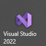

+ 打开之后，可以看到开始使用页；左边是最近使用过的项目，点击直接可以打开；想要创建新项目，点击右下角的**创建新项目**即可

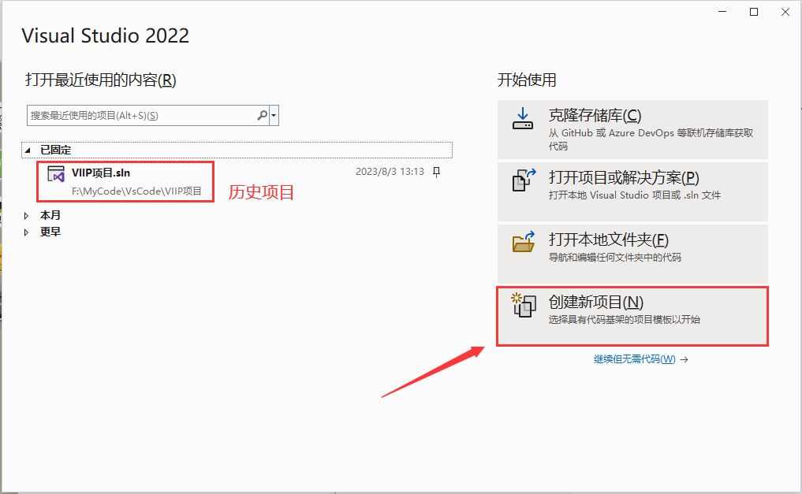

+ 选择创建新项目，就来到了项目选择页；选择C++语言，空项目即可！

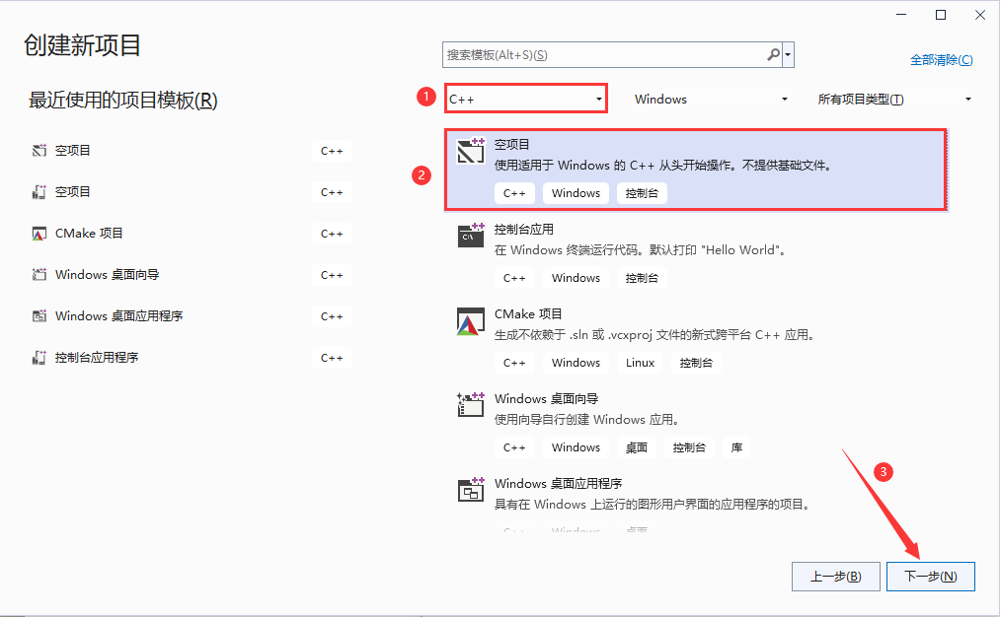

+ 然后写好项目名称、选择项目存放位置即可

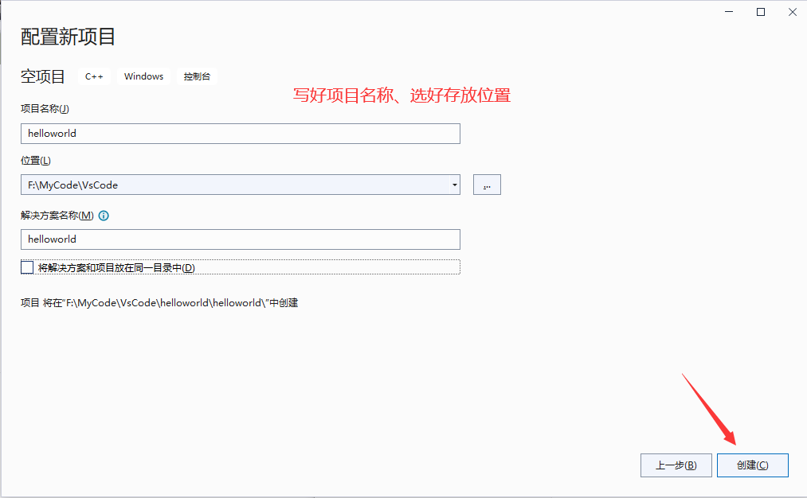

+ 点击创建，即可进入主界面，但是主界面里面除了`解决方案管理器`之外什么都没有；
+ 所以，先得创建一个源文件，才能进行代码的编写，如下图所示。

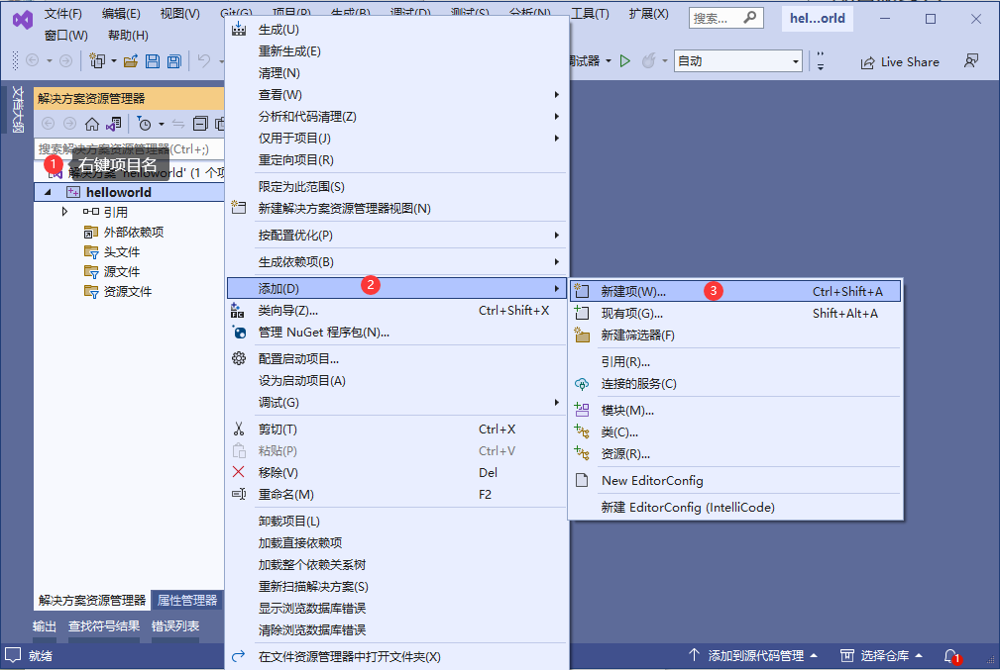

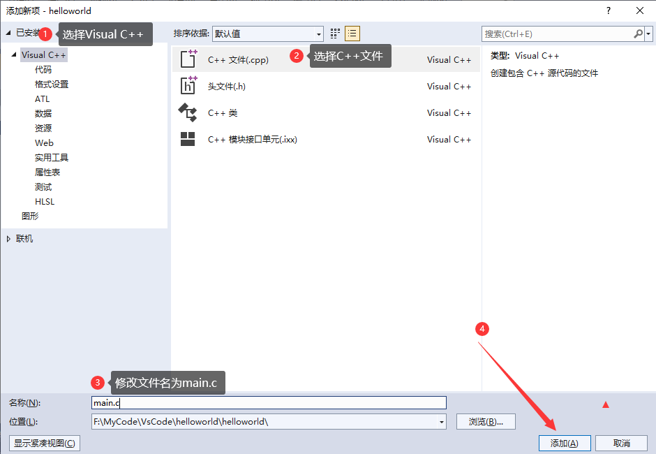

+ 然后输入如下代码

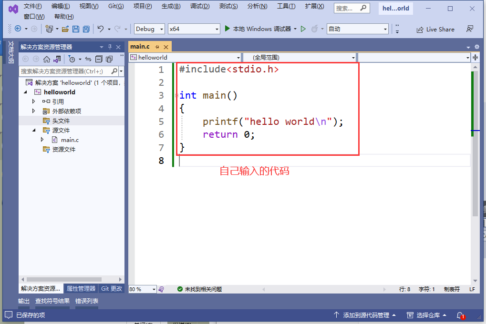

+ 再按Ctrl + F5运行(笔记本可能要按fn+Ctrl+F5)

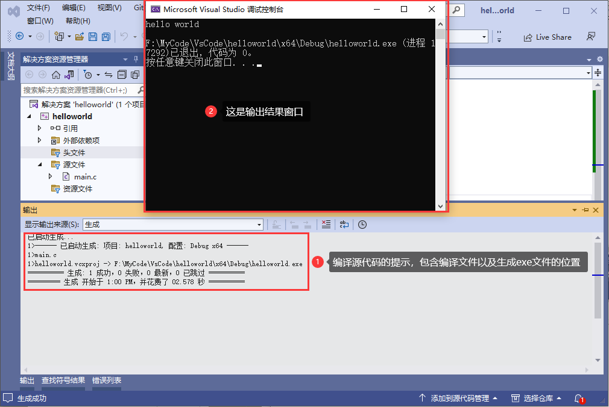

### 选项设置

如果你的代码没有行号，则可以点击上方**工具菜单-选项-文本编辑器-C/C++**勾选上行号

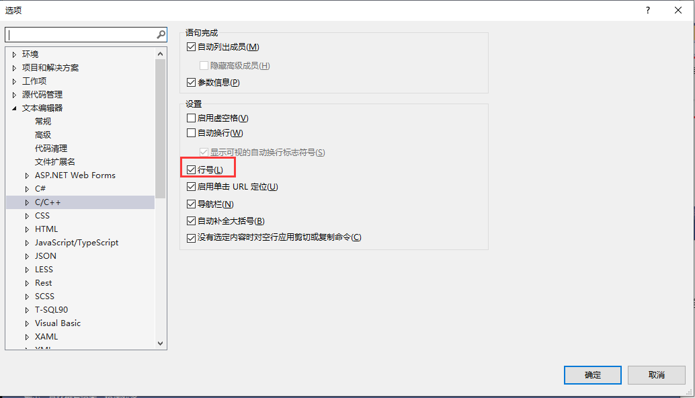

为了方便看到函数的参数提示，还可以勾选上内联提示

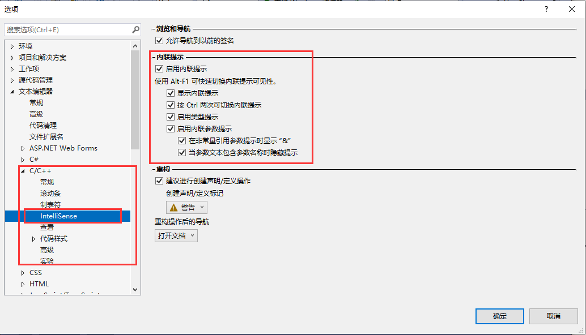

### 视图

如果不小心把`解决方案管理器`弄不见了(如下图所示)，可以在**视图**菜单中显示出来。

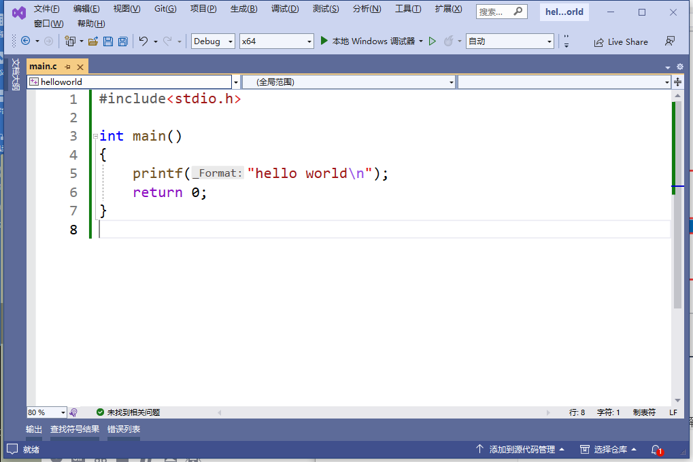

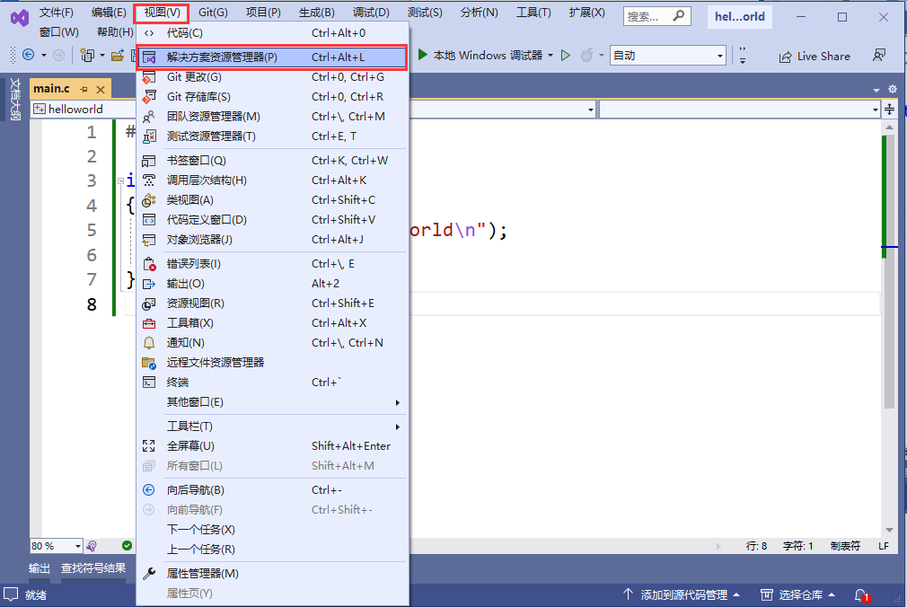

如果不小心`解决方案管理器`浮动出来了(如下图所示)

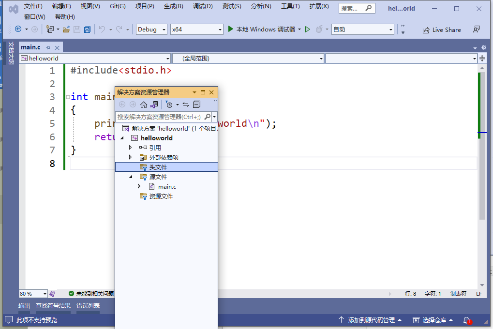

则可以用鼠标左键按住黄色标题区域，进行拖动

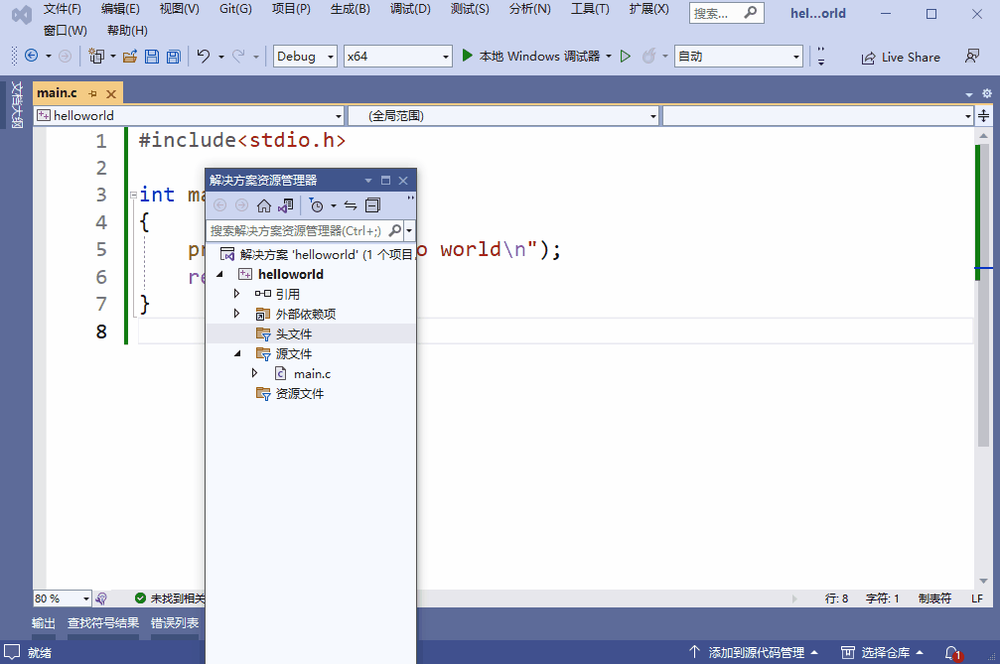

### 项目结构

首先，打开项目所在目录。

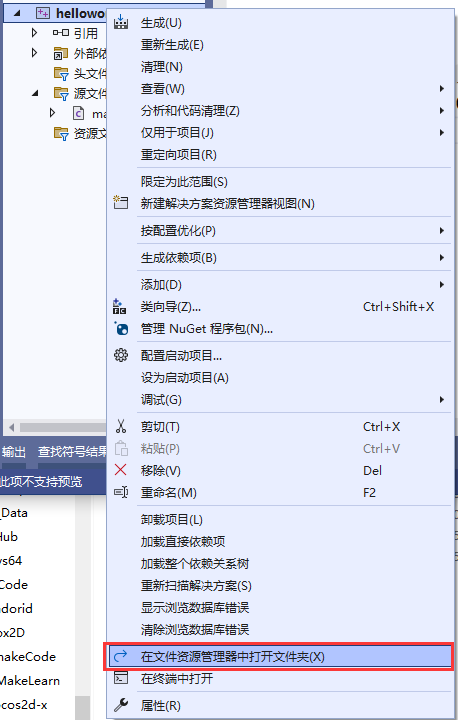

可以看到有如下几个文件：

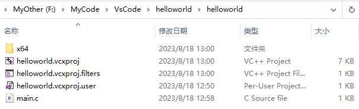

+ main.c 为咱们上面创建的源代码文件(如果你要把代码发给别人，只需要发这个就可以了)
+ xxx.vcxproj.user 为用户配置文件
+ xxx.vcxproj.filters 为筛选器配置(就是就是解决方案的树组织形式)
+ xxx.vcxproj   项目文件(保存项目的各种配置)

+ x64  目录，存放代码编译过程中生成的各种中间文件