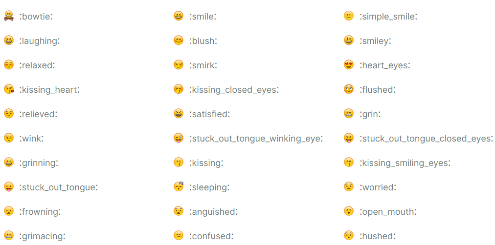

## MarkDown是什么？


Markdown 是一种轻量级标记语言，它允许人们使用易读易写的纯文本格式编写文档。

Markdown 语言在 2004 由约翰·格鲁伯（英语：John Gruber）创建。

Markdown 编写的文档可以导出 HTML 、Word、图像、PDF、Epub 等多种格式的文档。

Markdown 编写的文档后缀为 **.md**, **.markdown**。

[思维导图](https://www.processon.com/mindmap/63661050e0b34d524cc0b639)

## 标题

Markdown 标题有两种格式。

#### 1. 使用=、-标记

使用=和-标记一级和二级标题，语法如下

```tex
我是一级标题
===
我是二级标题
---
```
显示效果如下图所示：


#### 2. 使用#标记

使用 **#** 号可表示 1-6 级标题，一级标题对应一个 **#** 号，二级标题对应两个 **#** 号，以此类推

```tex
# 一级标题
## 二级标题
### 三级标题
#### 四级标题
##### 五级标题
###### 六级标题
```


## 段落

Markdown 段落没有特殊的格式，直接编写文字就好，**段落的换行是使用两个以上空格加上回车**。


当然也可以在段落后面使用一个空行来表示重新开始一个段落。


#### 分割线

你可以在一行中用三个以上的星号、减号、底线来建立一个分隔线，行内不能有其他东西。你也可以在星号或是减号中间插入空格。下面每种写法都可以建立分隔线：

```cpp
***
* * *
*****
- - -
----------
```

**效果：**

***
* * *
*****
- - -
---------


## 强调

斜体：*我是斜体*   _我是斜体_ 		单下划线

粗体：**我是粗体**  __我是粗体__ 		 双下划线

删除线：~~我是删除线~~ 				  双波浪号

下划线：<u>我是下划线</u> 			     HTML标签<u>

脚注：我有脚注 [^Maye]

[^Maye]:顽石老师 -- 聪明又可爱！！

## 列表

Markdown 支持有序列表和无序列表。

**无序列表：** 无序列表使用星号(*****)、加号(**+**)或是减号(**-**)作为列表标记，这些标记后面要添加一个空格，然后再填写内容：

```tex
+ Name:顽石
- QQ:823861087
* Sex:男
```

+ Name:顽石
- QQ:823861087

* Sex:男


**有序列表：**有序列表使用数字并加上 **.** 号来表示，如：

```cpp
1. Name:顽石
2. QQ:823861087
3. Sex:男
```

1. Name:顽石
2. QQ:823861087
3. Sex:男

#### 列表嵌套

列表嵌套只需在子列表中的选项前面添加四个空格即可：

```cpp
1. 第一项：
    - 第一项的第一个元素
    - 第一项的第二个元素
2. 第二项:
    + 第二项的第一个元素
    + 第二项的第二个元素
```
1. 第一项：
    - 第一项的第一个元素
    - 第一项的第二个元素
2. 第二项:
    + 第二项的第一个元素
    + 第二项的第二个元素


## 区块引用

Markdown 区块引用是在段落开头使用 **>** 符号 ，然后后面紧跟一个**空格**符号：

```cpp
> 区块引用
> 顿开教育
> 让每个学员都学有所成    
```

> 区块引用
> 顿开教育
> 让每个学员都学有所成  


另外区块是可以嵌套的，一个 `>` 符号是最外层，两个 ``>`` 符号是第一层嵌套，以此类推：

```cpp
> 最外层
>> 第一层
>>> 第二层
```

> 最外层
> > 第一层
> >
> > > 第二层


#### 区块中使用列表

```cpp
> 区块中使用列表
> 1. one
>     + one1
>     + one2    
> 2. two
> 3. three
```

> 区块中使用列表
> 1. one
>     + one1
>     + one2    
> 2. two
> 3. three


#### 列表中使用区块

```cpp
+ 第一项
    > 顿开教育
    > 顽石老师
+ 第二项
```

+ 第一项
    > 顿开教育
    > 顽石老师
    
+ 第二项

## 代码

如果是段落上的一个函数或片段的代码可以用反引号把它包起来（``代码``），例如：

```tex
`printf()`函数
```

`printf()`函数

#### 代码块

代码区块使用 **4 个空格**或者一个**制表符（Tab 键）**。

    void show()
    {
        printf("顽石老师")
    }

你也可以用 **```** 包裹一段代码，并指定一种语言（也可以不指定）：

```cpp
void show()
{
	printf("顽石老师")
}
```

## 链接

#### 内嵌式链接

##### 外部链接：

链接使用方法如下：

```cpp
[链接名称](链接地址)
<链接地址>
```

列如：

```css
这是一个链接 [百度一下](www.baidu.com)
```

**效果：**这是一个链接 [百度一下](www.baidu.com)

直接使用链接地址：

```tex
<www.baidu.com>
```

**效果：**<www.baidu.com>

##### 内部链接：

内部链接可以跳转到文档得指定位置。

```tex
[链接名称](#标题)
```

**效果：**[跳转到标题](#标题)


#### 引用式链接

我们可以通过变量来设置一个链接，变量赋值在文档末尾进行：

```tex
这个链接用1作为网址变量 [Google][1]
这个链接用baidu作为网址变量 [Baidu][baidu]

在文档的最后为变量赋值网址
[1]: www.google.com
[baidu]: www.baidu.com
```

这个链接用1作为网址变量 [Google][1]
这个链接用baidu作为网址变量 [Baidu][baidu]

这个链接用demo作为内部链接变量 [跳转到标题][demo]

在文档结尾为变量赋值网址

[1]: https://www.google.com	"谷歌网址"
[baidu]: https://www.baidu.com	"百度网址"
[demo]: #标题

**注意：**变量最好简单易懂，不要用数字。


## 图片

Markdown 图片语法格式如下：

```tex

```

- 开头一个感叹号 !
- 接着一个方括号，里面放上图片的替代文字
- 接着一个普通括号，里面放上图片的网址，最后还可以用引号包住并加上选择性的 'title' 属性的文字。

```cpp

```


当然，你也可以像网址那样对图片网址使用变量:

```tex
![百度图片][baidu_img]

[baidu_img]: https://www.baidu.com/img/PCtm_d9c8750bed0b3c7d089fa7d55720d6cf.png
```

![百度图片][baidu_img]

[baidu_img]: https://www.baidu.com/img/PCtm_d9c8750bed0b3c7d089fa7d55720d6cf.png

Markdown 还没有办法指定图片的高度与宽度，如果你需要的话，你可以使用普通的  标签。

```tex

```


## 表格

Markdown 制作表格使用 **|** 来分隔不同的单元格，使用 **-** 来分隔表头和其他行。

语法格式如下：

```
|  表头   | 表头  |
|  ----  | ----  |
| 单元格  | 单元格 |
| 单元格  | 单元格 |
```

**效果:**

| 表头   | 表头   |
| ------ | ------ |
| 单元格 | 单元格 |
| 单元格 | 单元格 |


#### 对齐方式

**我们可以设置表格的对齐方式：**

- **-:** 设置内容和标题栏居右对齐。
- **:-** 设置内容和标题栏居左对齐。
- **:-:** 设置内容和标题栏居中对齐。

实例如下：

```
| 左对齐 | 右对齐 | 居中对齐 |
| :-----| ----: | :----: |
| 单元格 | 单元格 | 单元格 |
| 单元格 | 单元格 | 单元格 |
```

**效果：**

| 左对齐 | 右对齐 | 居中对齐 |
| :----- | -----: | :--: |
| 单元格 | 单元格 |  单元格  |
| 单元格 | 单元格 |  单元格  |

| 姓名 | 年龄 |
| ---- | ---- |
| 顽石 | 18   |
| 里奇 | 30   |

## emoji表情

[MarkDown表情大全](https://www.webfx.com/tools/emoji-cheat-sheet/)

:smile:



&#x23eb;

## 数学公式

[typora之数学公式](https://blog.csdn.net/qq_43713303/article/details/105711878)

## HTML语法

#### 文字相关

<font color='red' size=7px>文字颜色</font>


## 在线练习闯关

[MarkDown 教程](https://www.markdowntutorial.com/)

## Typora快捷键

|快捷键|	作用	|快捷键	|作用|
|:----:|:----:|:----:|:----:|
|Ctrl+1	|一阶标题	|Ctrl+B	|字体加粗|
|Ctrl+2	|二阶标题	|Ctrl+I	|字体倾斜|
|Ctrl+3	|三阶标题	|Ctrl+U	|下划线|
|Ctrl+4	|四阶标题	|Ctrl+Home	|返回Typora顶部|
|Ctrl+5	|五阶标题	|Ctrl+End	|返回Typora底部|
|Ctrl+6	|六阶标题	|Ctrl+T	|创建表格|
|Ctrl+L	|选中某句话|	Ctrl+K	|创建超链接|
|Ctrl+D	|选中某个单词|	Ctrl+F	|搜索|
|Ctrl+E	|选中相同格式的文字|	Ctrl+H|	搜索并替换|
|Alt+Shift+5	|删除线	|Ctrl+Shift+I|	插入图片|
