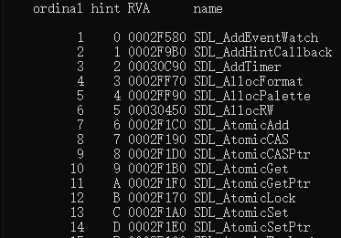
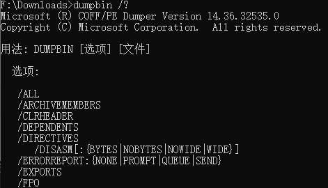

## dumpbin.exe

dumpbin.exe是查看dll、lib导出函数的工具。

```sh
> dumpbin -exports SDL2.dll
```

执行以上命令，可以查看指定dll的所有函数。



更多选项执行`dumpbin /?`查看



附件详细信息：

(1)、/ALL :此选项显示代码反汇编以外的所有可用信息。 使用/DISASM显示反汇编。 与/ALL一起使用/RAWDATA:NONE可以省略文档的原始二进制文件详细信息。

) 2、/ARCHIVEMEMBERS :此选项显示有关库成员对象的最小信息。

)3)，/CLRHEADER file )其中，file是由/clr生成的图像文件。 CLRHEADER显示有关任何托管程序使用的. net标头的信息。 显示. net标头以及其中每个节的位置和大小(以字节为单位)。

)3)，/DIRECTIVES )此选项转储编译器生成的图像的. directive部分。

(4)、/DEPENDENTS )从转储图像中导入函数的DLL的名称。 请勿转储导入函数名称。

)5)，/DISASM )此选项显示代码段的反汇编，如果显示在文件中，则使用符号。

(6)，/EXPORTS )此选项显示从可执行文件或DLL导出的所有定义。

(7)，/FPO )该选项显示帧指针优化(FPO )记录。

(8)，/HEADERS )此选项显示文件标头和每个节的标头。 在存储库中使用时，将显示每个成员对象的头部。

)9)，/IMPORTS[:file] :此选项显示导入到可执行文件或DLL中的DLL列表(静态链接和延迟加载)以及上述每个DLL的每个导入。 可选的file规范允许指定只显示一个DLL导入。

(10 )，/LINENUMBERS :此选项显示COFF行号。 如果目标文件是使用程序数据库(/tzdcg )、C7兼容)/Z7 )或仅行号)/Zd编译的，则包含行号。 如果可执行文件或DLL链接到生成调试信息/调试，则包含COFF行号。

(11 )，/LINKERMEMBER[:{1|2}] :此选项显示库中定义的公共元件。 如果指定参数1，符号及其偏移将按对象顺序显示。 如果指定参数2，将显示对象的偏移和索引号，并按字母顺序显示列车上的这些符号和每个符号的对象索引。 要同时获取这两个输出，请指定没有数字参数的/LINKERMEMBER。

(12 )，/LOADCOMFIG )此选项转储IMAGE_LOAD_CONFIG_DIRECTORY结构。 此结构由WindowsNT加载程序使用，是在WIINNT.H中定义的可选结构。

(13 )，/out :文件名：此选项指定输出的文件名。 默认情况下，DUMPBIN在标准输出中显示信息。

(14 )，/pdb path [ : verbose ] filename:filename是要在其中搜索匹配. pdb文件的. dll或. exe文件名。 VERBOSE (可选)是报告尝试搜索. pdb文件的所有目录。 /PDBPATH将在调试器中沿与. pdb文件相同的路径搜索计算机，并报告这些. pdb文件(如果有)与在filename中指定的文件相对应。

(15 )，/rawdata(:(1|2|4|8|none )，number]] ) :此选项显示文件各节的原始内容。 参数说明： 1、默认值，内容显示为十六进制字节，如果内容已打印，也会显示为ASCII字符。 2、内容显示为十六进制的2字节值； 4、内容显示为十六进制坏4字节值； 8、内容显示为十六进制的8字节值； NONE，取消显示原始数据。 此参数有助于控制/ALL输出； number，显示的行设置为每行具有number个值的宽度。

(16 )，/RELOCATIONS )此选项显示对象或图像中的重新定位。

(17 )，/SECTION:section :此选项限制有关指定section的信息的输出。

(18 )，/SUMMARY )此选项显示关节的最小信息(包括总大小)。 如果未指定其他选项，则此选项为默认值。

(19 )，/SYMBOLS :此选项显示COFF符号表。 符号表存在于所有对象文件中。 图像文件仅在链接到/DEBUG时才包含COFF符号表。

(20 )，/UNWINDINFO )向程序映像(例如exe和dll )中转结构化异常处理) SHE )表的展开描述符。 /UNWINDINFO仅适用于IA64图像。


## lib.exe

+ 合并多个lib文件

```sh
lib /out:1.lib 2.lib
```

