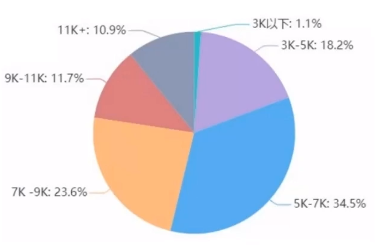
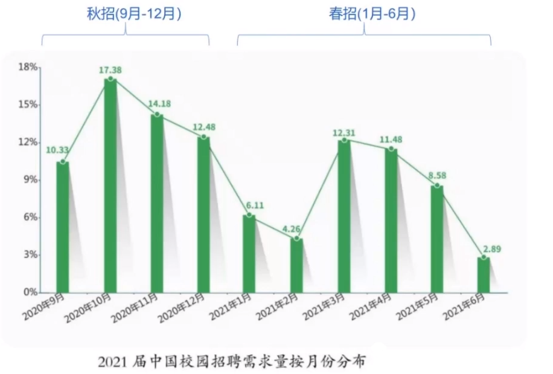
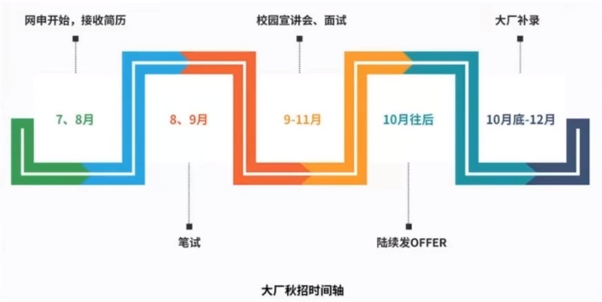
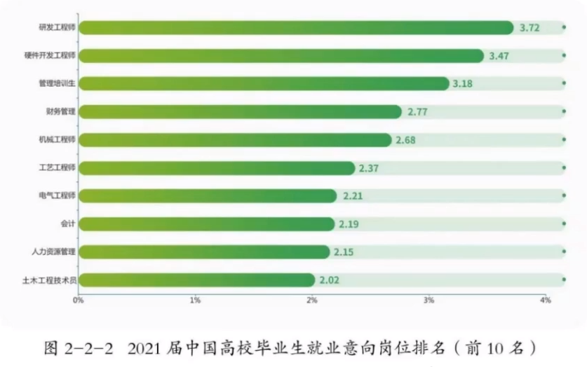

# 春招、秋招、社招的区别以及C/C++的发展方向

# 一，应届生

## 1，2021届大学生的薪酬分析

## 2，大学生的高薪就业捷径-春招、秋招

## 3，大学生入职大厂的机会

**本科生：(2-4次)**

大三 秋招	(实习offer) - 签实习协议，发实习补贴

大三 春招	(实习offer) - 签实习协议，发实习补贴

大四 秋招	(正式offer) - 签劳动合同，发正式工资

大四 春招	(正式offer) - 签劳动合同，发正式工资

**专科生：(2次)**

大三 秋招	(正式offer) - 签劳动合同，发正式工资

大三 春招	(正式offer) - 签劳动合同，发正式工资

> 以上不是确定规则，也有部分例外

大厂实习补贴：200-600元/天  不加班，每个月20-22天，工作压力非常小

## 4，面试一家还是多家

同时面多家，拿多个offer，在薪资谈判时，占主动地位。

 

## 5，为什么选择春招和秋招

在毕业之前，如果具备独立的企业级开发能力，在校招中，就具备碾压优势，形成降维打击。

## 6，社招

社会招聘，直接和在职工程师竞争，进大厂的难度翻倍。

## 二，发展方向

### 后端开发

### 客户端开发

### 音视频开发

### 游戏开发

### 嵌入式开发

### 人工智能

### 军工仿真

### 我应该选择那个方向？

优先选择：自己最感兴趣的方向

学习机会：

薪资待遇：