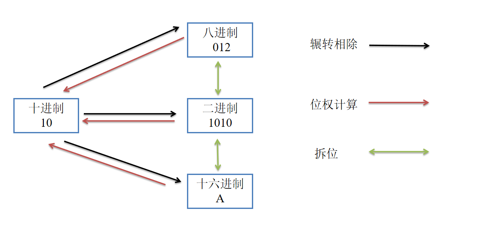

### 进制转换

#### 什么是进制

进制也就是进位计数制，是人为定义的带进位的计数方法。 对于任何一种进制---N进制，就表示每一位置上的数运算时都是逢N进一位。 

数数相信大家都会了，比如0 1 2 3 4 5 6 7 8 9 10 11 12 13...，在数数时某一位数量满10了就向前进位，这种逢十进一的进位制，就叫十进制。

不过在日常生活中，并不止这一种进位制，比如1小时有60分钟，1分钟有60秒，满60进一，这就是六十进制。

而在计算机中常用的进制除了``十进制``，还有``二进制``、``八进制``、``十六进制``

##### 十进制

组成：0 1 2 3 4 5 6 7 8 9 

规则：逢十进一

表示方式：十进制数520可写成(520)10或写成520D

##### 二进制

组成：0 1

规则：逢二进一

表示方式：二进制数1000010可写成(1000010)2或写成1000010B

##### 八进制

组成：0 1 2 3 4 5 6 7

规则：逢八进一

表示方式：八进制数520可写成(520)8或写成520O

##### 十六进制

组成：0 1 2 3 4 5 6 7 8 9 A B C D E F

规则：逢十六进一

表示方式：十六进制的520可以写成(520)16或写成520H


**为什么在计算机中，有这么多种进制表示方式？**

+  方便：二进制数中只有两个数码0和1，可用具有两个不同稳定状态的元器件来表示一位数码。

+  简单：二进制数运算简单，大大简化了计算中运算部件的结构，0+0=0，0+1=1，1+0=1，1+1=10。

+ 真假：二进制天然兼容逻辑运算。
+ 缺点：二进制计数在日常使用上有个不便之处，就是位数往往很长，读写不便，如：把十进制的100000D写成二进制就是11000011010100000B，所以计算机领域我们实际采用的是十六进制。二进制数转换为十六进制数时，长度缩减为原先的约四分之一，把十进制的100000写成八进制就是303240。十六进制的一个数位可代表二进制的四个数位。这样，十进制的100000写成十六进制就是186A0。

### 存储单位

我们平常使用的程序，如：Windows操作系统、打字软件、游戏软件等。一般安装在硬盘等外存上，但仅此是不能使用其功能，必须把它们调入内存中运行，才能真正使用其功能。

因为内存的读写速度相对于外存来说非常快，但是内存是暂时存储程序以及数据的地方。当我们使用WPS处理文稿时，当你在键盘上敲入字符时，它被存入内存中。当你选择存盘时，内存中的数据才会被存入硬（磁）盘。

内存是由无数个晶体管组成的(可以理解为灯泡)，一个晶体管作为一比特(bit)的存储器。每个晶体管可以存储一个二进制0或1，比特通常也叫做位。


**位(bit)**：		计算机存储的最小单位

**字节(byte):**	数据表示的最小单位

+ 一个字节通常8位长 1byte  = 8 bit

**千字节(KB)：**

+ 1KB = 1024byte
+ 为什么是1024，而不是1000呢？二的十次方刚好是1024，就这么表示啦~

字节以上的转换单位都是1024，只有一个字节等于八个位是不一样的...

**兆字节(MB):**

+ 1MB = 1024KB
+ 1GB = 1024MB
+ 1TB = 1024GB
+ ....


**思考：为什么硬盘标注的容量与实际的容量不一样？**

买的256G硬盘实际上只有238.4G，咱们一起来换算一下：

``硬盘厂商十进制计算：``256G = 256,000MB = 256,000,000KB = 256,000,000,000Byte	以1000为单位换算

``操作系统二进制计算:``  256G = 262,144MB = 268,435,456KB = 274,877,906,944Byte	以1024为单位换算

``那么256G实际容量：``256,000,000,000Byte/1024MB/1024MB/1024MB = 238.4G

所以，买256G硬盘实际上只有238.4G，而且容量越大差距也就越大了。


### 进制转换



**十进制转其他进制：短除法**

+ 以十进制数520为例，分别转换为二进制、八进制和十六进制，转换过程如下：


**其他进制转十进制：位权相加**

+ 就以上面的520D的二进制、八进制和十六进制为例
+ 首先，需要对其他进制从右往左依次开始编号，0 1 2 3 4 5 ...
+ 然后，把每一位的数通过这个公式【数值 * 基数^编号】计算，然后把结果相加，即得到转换结果


```二进制10 0000 1000 转十进制```

```c
98 7654 3210 编号
10 0000 1000 B
1*2^9 + 0 + 1*2^3 = 512 + 0 + 8 = 520 D
```

``八进制1010 转十进制``

```c
3210 编号
1010 O
1*8^3 + 0 +1*8^0  = 520 + 8 =520 D  
```

``十六进制208 转十进制``

```c
210 编号
208 H
2*16^2 + 0 + 8*16^0 = 2*256 + 8 = 520 H  
```


**八进制、十六进制与二进制相互转换：拆位**

``八进制与二进制``

+ 一个八进制数可以拆分为3个二进制数，3个二进制数可以合成一个八进制数

```c
//二进制转八进制
001 000 001 000 B
1   0   1   0   O
    
//八进制转二进制
1   3   1   4   5   2   0    O    
001 011 001 100 101 010 000  B
```

``十六进制与二进制``

+ 一个十六进制数可以拆分为4个二进制数，4个二进制数可以合成一个十六进制数

```c
//二进制转十六进制
0010 0000 1000 B
2    0    8    H
    
//十六进制转二进制
1    3    1    4    5    2    0    H
0001 0011 0001 0100 0101 0010 0000 B    
```


**为什么可以这样拆位呢？**

+ 三位二进制数表示的范围是[0 - 8)  -> 2^3   对于八进制来说刚刚好

+ 四位二进制数表示的范围是[0 - 16) -> 2^4  对于十六进制来说刚刚好


### 整数的存储方式

#### 一，机器数和机器数的真值

##### 1，机器数

一个数在计算机中的二进制表示形式，叫做这个数的机器数。机器数是带符号的，在计算机用机器数的**最高位**存放符号，正数为0，负数为1。

比如，十进制中的数 +3 ，**计算机字长为8位**，转换成二进制就是0000 0011，如果是 -3 ，就是 100 00011 。

那么，这里的 0000 0011 和 1000 0011 就是机器数。


##### 2，机器数的真值

因为第一位是符号位，所以机器数的形式值就不等于真正的数值。

例如上面的有符号数 1000 0011，其最高位1代表负，其真正数值是 -3，而不是形式值131（1000 0011转换成十进制等于131）。所以，为区别起见，**将带符号位的机器数对应的真正数值**称为**机器数的真值**。

例：0000 0001的真值 = +000 0001 = +1，1000 0001的真值 = –000 0001 = –1


#### 二，原码, 反码, 补码

让我们先了解原码、反码和补码的概念。对于一个数，计算机要使用一定的编码方式进行存储，原码、反码、补码是机器存储一个具体数字的编码方式。

##### 1，原码

**原码就是机器数，**即用第一位表示符号，其余位表示值。比如：如果是8位二进制：

[+1]原= 0000 0001

[-1]原= 1000 0001

第一位是符号位，因为第一位是符号位，所以8位二进制数的取值范围就是：（即第一位不表示值，只表示正负。）

[1111 1111 , 0111 1111]   即   [-127 , 127]

**原码是人脑最容易理解和计算的表示方式。**


##### 2，反码

+ 正数的反码是其本身；

+ 负数的反码是在其原码的基础上，符号位不变，其余各个位取反。

[+1] = [0000 0001]原 = [0000 0001]反

[-1] = [1000 0001]原 = [1111 1110]反

可见如果一个反码表示的是负数，人脑**无法直观的看出来**它的数值。通常要将其转换成原码再计算。


##### 3，补码

+ 正数的补码就是其本身；

+ 负数的补码是在其原码的基础上，符号位不变，其余各位取反，最后+1。(也即在反码的基础上+1)

[+1] = [0000 0001]原 = [0000 0001]反 = [0000 0001]补

[-1] = [1000 0001]原 = [1111 1110]反 = [1111 1111]补

对于负数，补码表示方式也是人脑无法直观看出其数值的。通常也需要转换成原码再计算其数值。


#### 三，为何要使用原码、反码和补码

人脑可以知道第一位是符号位，在计算的时候我们会根据符号位，选择对真值区域的加减。(真值的概念在本文最开头) 但是对于计算机，加减乘数已经是最基础的运算，要设计的尽量简单，计算机辨别"符号位"显然会让计算机的基础电路设计变得十分复杂！

于是人们想出了将符号位也参与运算的方法。我们知道，根据运算法则减去一个正数等于加上一个负数，即：1-1 = 1 + (-1) = 0， 所以机器可以只有加法而没有减法，这样计算机运算的设计就更简单了。


``我们以计算十进制表达式：1 - 1 =  0为例``

**首先来看原码：**

1 - 1 = 1 + (-1) = [0000 0001]原+ [1000 0001]原= [1000 0010]原= -2

如果用原码表示，让符号位也参与计算，显然对于减法来说，结果是不正确的。这也就是为何计算机内部不使用原码表示一个数。


**为了解决原码做减法的问题， 出现了反码：**

1 - 1 = 1 + (-1) = [0000 0001]原+ [1000 0001]原= [0000 0001]反+ [1111 1110]反= [1111 1111]反= [1000 0000]原= -0

发现用反码计算减法，结果的真值部分是正确的。而唯一的问题其实就出现在"0"这个特殊的数值上，虽然人们理解上**+0和-0**是一样的，但是0带符号是没有任何意义的，而且会有[0000 0000]原和[1000 0000]原两个编码表示0。

**于是补码的出现，解决了0的符号问题以及0的两个编码问题：**

1-1 = 1 + (-1) = [0000 0001]原+ [1000 0001]原= [0000 0001]补+ [1111 1111]补= [1 0000 0000]补=[0000 0000]补=[0000 0000]原注意：进位1不在计算机字长里。

**这样0用[0000 0000]表示，而以前出现问题的-0则不存在了。而且可以用[1000 0000]表示-128：-128的由来如下：**

(-1) + (-127) = [1000 0001]原+ [1111 1111]原= [1111 1111]补+ [1000 0001]补= [1000 0000]补

-1-127的结果应该是-128，在用补码运算的结果中，[1000 0000]补就是-128，但是注意因为实际上是使用以前的-0的补码来表示-128，所以-128并没有原码和反码表示。(对-128的补码表示[1000 0000]补，算出来的原码是[0000 0000]原，这是不正确的)

使用补码，不仅仅修复了0的符号以及存在两个编码的问题，而且还能够多表示一个最低数。这就是为什么8位二进制，使用原码或反码表示的范围为[-127, +127]，而使用补码表示的范围为[-128, 127]。

整数的存储是将十进制为的整数转换成其相应的补码后存储。

### 小数的存储方式

现如今的计算机中浮点数的存储都是遵循IEEE754/854标准，以二进制的科学计数法存放到内存中。

对于浮点数在计算机中有两种存储的精度，即单精度和双精度，单精度是32位，双精度是64位。


+ 符号S：0为正，1为负
+ 尾数M：小数点后面的部分
+ 指数E：即阶码，指明了小数点在数据中的位置
  + 为了让指数表示正、负引入了偏差码，float的为127,double的为1023


**十进制小数转二进制小数**

+ 先把整数部分转化为二进制
+ 再把小数部分转化为二进制(用2乘以小数部分，每次将结果整数取出，然后用剩余小数部分继续乘以2，直到小数部分为零，或者达到要求的精度为止)


> 以float f = 5.25为例

整数部分：5       -> 101

小数部分：0.25  ->  0.01

```c
0.25 * 2 = 0.5  --- 0
0.5  * 2 = 1.0  --- 1  
从上往下取值：0.01    
```

最后结果：101.01 = 1.0101 * 2^2

可见指数实际值为2，加上偏差码127，2 + 127 = 129，129的二进制为10000001B，因此不难得到，8.25在内存中的存储情况为:

|  S   |     E     |              M               |
| :--: | :-------: | :--------------------------: |
|  0   | 1000 0001 | 0101 0000 0000 0000 0000 000 |

**如果把这个值作为整型使用，将是一个很大的数字，是1084751872**


把这个内存里面的值转为十进制小数就很简单了：

```c
//1,首先判断S表示的正负      +
//2，计算出E实际表示的指数   1000 0001 = 129    129 - 127 = 2
//3，根据M写出二进制小数形式  1.0101 * 2^2  = 101.01
//4，对二进制小数以小数点为界限开始编号
210 -1-2 编号
101. 0 1 B
1*2^2 + 0 + 1*2^0 + 0*2^(-1) + 1*2^(-2) = 4 + 1 +  0.25 =5.25   
```


**注意：**

- 在二进制，第一个有效数字必定是“1”，因此这个“1”并不会存储。
- 浮点数不能精确表示其范围内的所有数。
- 可精确表示的数不是均匀分布的，越靠近0越稠密。

