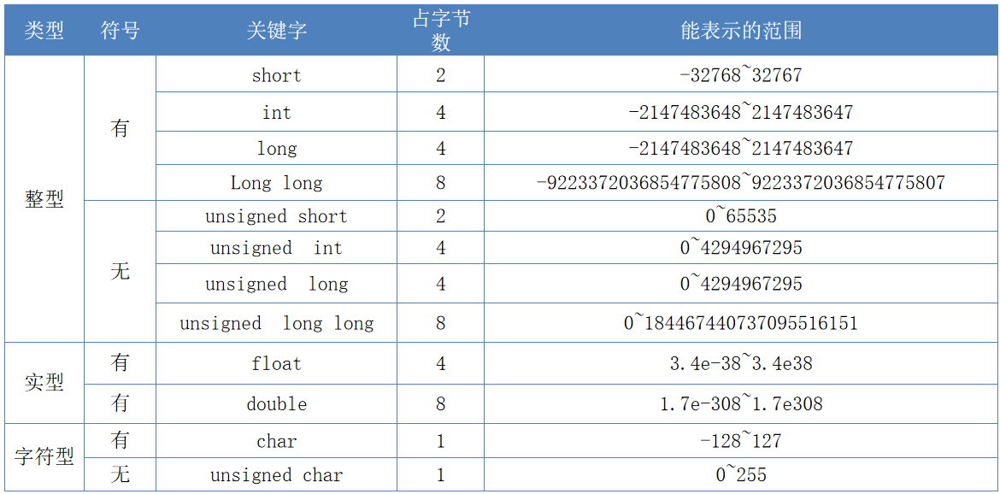

# 数据类型

在C语言中，数据类型用于声明不同类型的变量或函数。数据类型决定了变量存储占用的空间以及如何解释存储的位模式。C语言中有多种数据类型，包括基本数据类型、枚举类型、void类型和派生类型。

本节课，我们只学习基本数据类型，其他的会在后续的课程中逐渐学习到。

## 基本数据类型

基本数据类型包括整型（int）、字符型（char）、浮点型（float）和双精度浮点型（double）。这些类型用于表示数值和字符数据。



> 在C语言中本来是不存在bool类型的，但在C99标准中加入了bool类型。加上stdbool头文件即可使用！

+ 实型默认都是double型
+ 整型默认都是int型
+ 所有类型默认都是有符号(signed)型

## 变量

**变量**是一个可以存储数据并在程序运行过程中修改其值的存储单元。变量的声明可以单独进行，也可以在声明时赋初值。

### 变量名

要想使用变量，必须给变量取名字。变量名是程序中用于标识存储位置的名称。变量名的选择和命名规则对于代码的可读性和维护性至关重要。以下是C语言变量命名的一些基本规则和建议：

#### 基本命名规则

1. **变量名的组成**：变量名可以由字母、数字和下划线组成，且不能以数字开头。
2. **区分大小写**：C语言是区分大小写的，因此*a*和*A*是两个不同的变量。
3. **避免使用关键字**：变量名不能是C语言的关键字，例如*int*、*return*等。
4. **无空格**：变量名中不能包含空格。

#### 命名规范

除了基本的语法规则外，良好的命名规范可以提高代码的可读性和可维护性：

1. **有意义的名称**：避免使用单个字母作为变量名，除非在循环等特定情况下。变量名应具有明确的含义，例如使用*count*表示计数。

2. **使用缩写**：对于较长的单词，可以使用公认的缩写，例如*temp*缩写为*tmp*，*message*缩写为*msg*。

3. **驼峰(小驼峰)命名法**：对于由多个单词组成的变量名，可以使用驼峰命名法，即第一个单词的首字母**小写**，其后每个单词的首字母大写，例如*totalCount*。

4. **帕斯卡(大驼峰)命名法**：与小驼峰只有一个区别，那就是把首个单词的首字母也大写，例如`TotalCount`。

5. **蛇形(小蛇形)命名法**：所有字母都**小写**，单词之间用下划线 `_` 连接，例如`my_name`。

   **变种**：

   - **大蛇形命名法**：所有字母**大写**。`CONSTANT_VALUE` (常用于常量)。
   - **驼蛇形命名法**：首字母大写。`First_Name` (非常罕见，不推荐)。

### 变量定义

变量是一种可以存储和修改数据的容器。在程序执行过程中，变量的值可以被多次更改。变量使我们能够灵活地处理和操作数据，是编写动态和交互式程序的基础。

在C语言中，声明变量的一般语法格式如下：

```bash
数据类型 变量名;
数据类型 变量名 = 值;
```

> 在这里，**数据类型** 必须是一个有效的 C 数据类型，可以是 char、int、float、double 或任何用户自定义的对象

我们可以在声明变量的同时进行初始化，也可以以后再赋值。

例如，声明一个整型变量：

```c
int age;
```

我们还可以在声明变量的同时为其赋初值（这种在定义是指定一个初始值的方式叫做变量的初始化）：

```c
int age = 25;
```

如果要同时定义多个类型相同的变量，可以用逗号隔开批量定义，以减少类型的编写。

```c
int a,b,c,d;
int a = 0,b = 1,c = 2;
```

### 左值/右值

在C语言中，**左值**和**右值**是两个重要的概念，主要用于赋值表达式中。左值（lvalue）是指可以出现在赋值号左边的表达式，它标识了一个可以存储结果值的位置。右值（rvalue）是指可以出现在赋值号右边的表达式，它必须具有一个特定的值。

#### 左值

左值是指向内存区域的对象，可以出现在赋值表达式的左边或右边。当左值出现在右边时，会自动转换为右值使用。例如：

```c
int m = 1; // m是左值
int n;
n = m; // n是左值，m自动转换为右值
```

左值包括基本类型的变量、枚举类型变量、数组类型下标成员、结构类型变量或成员、联合类型变量或成员、指针类型等。

#### 右值

右值是指存储在内存中的数值本身，不能出现在赋值表达式的左边，否则会编译出错。例如：

```c
int m = 1;
1 = m; // 不合法，1是常量，只能作为右值
```

右值可以是变量、常量和表达式。左值在所有情况下均可以作为右值。

## 类型转换

在C语言中，数据类型转换是一个常见的操作，它允许程序员将变量、数值或表达式的结果从一种类型转换为另一种类型。数据类型转换可以分为两种：自动类型转换和强制类型转换。

### 自动类型转换

自动类型转换是编译器在不需要程序员干预的情况下自动进行的。这种转换发生在以下情况：

- 当将一种类型的数据赋值给另一种类型的变量时，例如将*int*类型的数据赋值给*float*类型的变量。
- 在不同类型的混合运算中，编译器会将所有数据转换为同一种类型后再进行计算。

转换规则如下：


- 数据长度增加的方向进行转换，以保证数值不失真或精度不降低。例如，*int*和*long*参与运算时，会先将*int*类型转换为*long*类型。
- 所有浮点运算都以双精度进行，即使只有*float*类型，也会先转换为*double*类型。
- *char*和*short*参与运算时，必须先转换为*int*类型。

例如：

```c
float PI = 3.14159;
int s1, r = 5;
double s2;
s1 = r * r * PI; // 自动转换为double类型，然后转换为int类型赋值给s1
s2 = r * r * PI; // 自动转换为double类型赋值给s2
```

### 强制类型转换

强制类型转换是程序员在代码中明确指定的类型转换，格式为*(type_name) expression*。这种转换允许更精确地控制数据类型的转换，尤其是在自动类型转换不能满足需求时。

例如：

```c
int sum = 103;
int count = 7;
double average;
average = (double) sum / count; // 强制将sum转换为double类型
```

在使用强制类型转换时，需要注意可能造成的数据精度丢失问题，并保持代码的可读性。例如，将*float*转换为*int*时，小数部分将丢失。

类型转换只是临时性的，不会改变数据本来的类型或值。例如：

```c
double total = 400.8;
int count = 5;
double unit;
int total_int = (int)total; // 强制转换为int类型
unit = total / count; 		// 使用原始的double类型进行运算
```

在C语言中，有些类型既可以自动转换也可以强制转换，如*int*到*double*，*float*到*int*等；而有些类型只能强制转换，不能自动转换，如`void*`到`int*`，`int`到`char*`等。使用强制类型转换时，程序员应意识到潜在的风险。

## 常量

**常量**是一个值在程序运行期间不可更改的存储单元。常量可以通过*const*关键字或*#define*宏定义来声明。

```c
const int MAX_AGE = 100; 	// 使用const定义常量（这里其实并不是真正的常量，而是只读变量）
#define PI 3.14159 			// 使用#define定义常量
```

在C语言中，整数常量和浮点可以通过后缀来指定其数据类型。

整数常量还可以指定前缀，用来表示不同的进制。

浮点常量可以表示为指数形式。

### 整数常量

整数常量可以是十进制、八进制或十六进制的常量。前缀指定基数：0x 或 0X 表示十六进制，0 表示八进制，不带前缀则默认表示十进制(VS2019支持二进制常量表示：0b或0B表示二进制)。

整数常量也可以带一个后缀，后缀是 U 和 L 的组合，U 表示无符号整数（unsigned），L 表示长整数（long）。后缀可以是大写，也可以是小写，U 和 L 的顺序任意。

```c
80			//十进制
0120		//八进制
0X50		//十六进制
0B1010000	//二进制
```


### 浮点常量

浮点常量由整数部分、小数点、小数部分和指数部分组成。可以使用小数形式或者指数形式来表示浮点常量。

当使用小数形式表示时，必须包含整数部分、小数部分，或同时包含两者。当使用指数形式表示时， 必须包含小数点、指数，或同时包含两者。带符号的指数是用 e 或 E 引入的。

```c
0.25;		//合法
.25;		//合法 	相当于0.25
5.;			//合法 	相当于5.0

314159E-5;	//合法	3.14159;
314159E;	//非法	应输入指数值而非“;”
.E-5;		//非法	缺少整数或者分数
```


### 字符常量

字符常量是括在单引号中，例如，'x' 。

字符常量可以是一个普通的字符（例如 'x'）、一个转义序列（例如 '\t')，或一个通用的字符（例如 '\u02C0'）。

**ASCII字符代码表：**


**转义字符:**一种特殊的字符常量

+ 以反斜线"\"开头，后跟一个或几个字符。
+ 转义字符具有特定的含义，不同于字符原有的意义，故称“转义”字符。
+ 转义字符中只能使用小写字母，每个转义字符只能看作一个字符。
+ ‘\v’垂直制表和‘\f’换页符对屏幕没有任何影响，但会影响打印机执行响应操作。

下表列出了一些这样的转义序列码：

| 转义序列 | 含义                | ASCII码值(十进制) |
| :------- | :------------------ | ----------------- |
| \\\      | \ 字符              | 092               |
| \\'      | ' 字符              | 039               |
| \\"      | " 字符              | 034               |
| \a       | 警报铃声            | 007               |
| \b       | 退格键              | 008               |
| \f       | 换页符              | 012               |
| \n       | 换行符              | 010               |
| \r       | 回车                | 013               |
| \t       | 水平制表符          | 009               |
| \v       | 垂直制表符          | 011               |
| \0       | 空字符(NULL)        | 000               |
| \ddd     | 一到3位的八进制数   | -                 |
| \xhh     | 一到2位的十六进制数 | -                 |


### 字符串常量

字符串字面值或常量是括在双引号 "" 中的。一个字符串包含类似于字符常量的字符：普通的字符、转义序列和通用的字符。

可以使用空格做分隔符，把一个很长的字符串常量进行分行。

下面的实例显示了一些字符串常量。下面这三种形式所显示的字符串是相同的。

```c
"hello,world";

"hello,\
world";

"hello,""w""orld";
```
