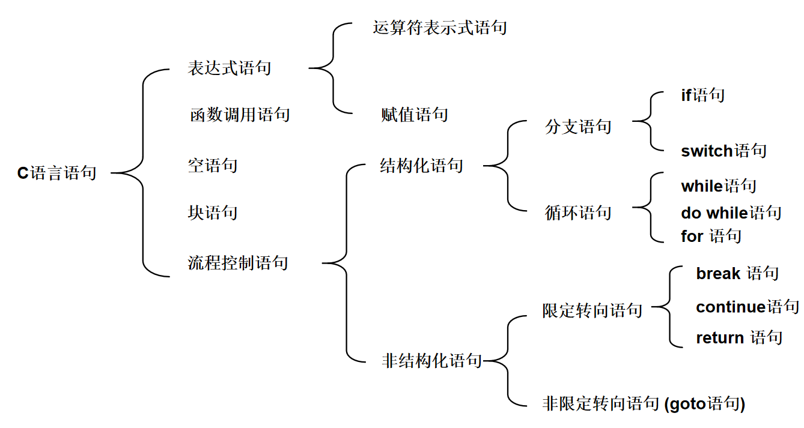

## 程序最小独立单元

如果把写程序和写小说类比，变量常量等可以看成是字和词，函数可以看成是一个段落，运算符等可以看作是字词的组合方式（规则），那么，字词组成的句子就是小说的最小独立单元，表达了一定的意思，同样，程序的最小独立单元是“语句”，每个语句表达出完整的意义。




## 三种控制结构

结构化程序设计提供了3种控制结构，分别是顺序结构、分支结构和循环结构，早在1966年，牛人Bohm和Jacopini便证明了，用此3种基本结构可以构成任意复杂的算法。3种基本控制结构如所示。


### 顺序结构

顺序结构表示程序中的各操作是按照它们出现的先后顺序执行的。

顺序结构是最简单的程序结构，也是最常用的程序结构，只要按照解决问题的顺序写出相应的语句就行，它的执行顺序是自上而下，依次执行。

例如，a = 3，b = 5，现交换a，b的值，这个问题就好像交换两个杯子水，这当然要用到第三个杯子，假如第三个杯子是c，那么正确的程序为： c = a； a = b； b = c； 执行结果是a = 5，b = c = 3如果改变其顺序，写成：a = b； c = a； b = c； 则执行结果就变成a = b = c = 5，不能达到预期的目的，初学者最容易犯这种错误。

### 分支结构

顺序结构的程序虽然能解决计算、输出等问题，但不能做判断再选择。对于要先做判断再选择的问题就要使用分支结构。分支结构的执行是依据一定的条件选择执行路径，而不是严格按照语句出现的物理顺序。

#### 单一分支

+ 语法

  ```c
  if(条件)
  {
   	分支   
  }
  ```

+ 规则：当条件成立时，执行分支体，否则不执行。


**示例：**输入一个数，判断是否是偶数！

**示例：**输入两个数，求最大的一个！


#### 双分支

+ 语法

  ```c
  if(条件)
  {
      分支1
  }else
  {
      分支2
  }
  ```

+ 规则：当条件成立时，执行分支体1，否则执行分支体2。

**示例：**某公司工资按周发放，标准是每小时制20元，若员工周工作时间超过40小时，超出部分每小时30元。输入一名员工一周的工作小时数，输出他的周工资。


#### 嵌套分支

+ 语法

  ```c
  if(条件1){分支1}
  else if(条件2){分支2}
  ...
  else if(条件n){分支n}
  else{分支n+1}
  ```

+ 规则：条件1成立时，执行分支1，然后结束分支语句，否则继续依次判断后面的条件，或者直到某个条件满足。如果条件都不满足，则会执行else分支。

**示例：**有一个函数如下，写一段程序，输入x，输出y
$$
y = 
\left[\begin{matrix}
x&x<1\\
2x-1&1<=x<10\\
3x-11&x>=10
\end{matrix}\right]
$$


**来个练习**

>编写程序：从屏幕上输入一个学生的成绩(0-100)，对学生成绩进行评定：
>
>　　<59为"E"
>
>​       ==59为经典语录
>
>​       60~69为"D"
>
>​       70~79为"C"
>
>​       80~89为"B"
>
>​       90以上为"A"
>
>​       <0或>100提示成绩输入出错


#### switch开关语句

+ 语法

  ```c
  switch(exp)
  {
      case 常量表达式1:
      case 常量表达式2:
      case 常量表达式3:
      ...
      case 常量表达式4:
      [以下语句为可选]
      default:
          break;
  }++
  ```

+ 规则：
  + exp(表达式)和case后面的“常量表达式”的结果值的类型应该一致。其类型可以是除实型以外的任何类型（如整型、字符型、枚举类型）。
  + 在同一switch语句中，case后的常量表达式的值必须唯一。
  + switch语句中可以不含default分支；default分支并不限定在最后，几个case分支也没有顺序区别，但必须做适当处理，否则会影响执行结果。


<font color="red">思考：如何使用switch完成分数等级评定？</font>

