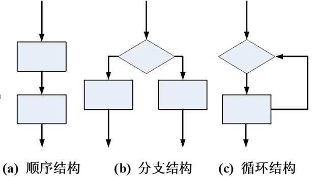

## 程序最小独立单元

如果把写程序和写小说类比，变量常量等可以看成是字和词，函数可以看成是一个段落，运算符等可以看作是字词的组合方式（规则），那么，字词组成的句子就是小说的最小独立单元，表达了一定的意思，同样，程序的最小独立单元是“语句”，每个语句表达出完整的意义。


## 三种控制结构

结构化程序设计提供了3种控制结构，分别是顺序结构、分支结构和循环结构，早在1966年，牛人Bohm和Jacopini便证明了，用此3种基本结构可以构成任意复杂的算法。3种基本控制结构如所示。



### 顺序结构

顺序结构表示程序中的各操作是按照它们出现的先后顺序执行的。

顺序结构是最简单的程序结构，也是最常用的程序结构，只要按照解决问题的顺序写出相应的语句就行，它的执行顺序是自上而下，依次执行。

例如，a = 3，b = 5，现交换a，b的值，这个问题就好像交换两个杯子水，这当然要用到第三个杯子，假如第三个杯子是c，那么正确的程序为： c = a； a = b； b = c； 执行结果是a = 5，b = c = 3如果改变其顺序，写成：a = b； c = a； b = c； 则执行结果就变成a = b = c = 5，不能达到预期的目的，初学者最容易犯这种错误。

### 分支结构

顺序结构的程序虽然能解决计算、输出等问题，但不能做判断再选择。对于要先做判断再选择的问题就要使用分支结构。分支结构的执行是依据一定的条件选择执行路径，而不是严格按照语句出现的物理顺序。

#### 单分支

+ 语法

  ```c
  if(condition_expression)
  {
   	statement
  }
  ```

  + **condition_expression**即条件表达式，任意合法的表达式都可，0为假(false)，非零为真(true)。
  + **statement**即当条件成立时，执行的语句。

+ 规则：

  + 当条件成立(为真)时，执行语句，否则不执行。


如：输入一个数，如果是负数，转成正数并输出。

```c
int a = 0;
scanf("%d",&a);
if(a<0)
{
    a = -a;
}
print("%d\n",a);
```

+ 当分支体只有一条语句时，{}可以省略，但不建议
+ if() 后面不要加分号，加上分号之后下面的语句将不受if约束

**示例：**

从键盘输入三个整数到变量a，b，c中，将这三个数由小到大进行排序，使a中存放最小的数，c中存档最大的数，然后输出。


#### 双分支

+ 语法

  ```c
  if(条件)
  {
      语句1
  }else
  {
      语句2
  }
  ```

+ 规则：当条件成立时，执行分语句1，否则执行语句2。

**示例：**

1. 输入一个数，输入是偶数输出`even number`，奇数输出`odd number`。

2. 某公司工资按周发放，标准是每小时制20元，若员工周工作时间超过40小时，超出部分每小时30元。输入一名员工一周的工作小时数，输出他的周工资。

3. 编写程序，输入三角形的三条边，求其面积。注意：如果3条边构不成三角形，则要给出错误提示。
   + 设三角形三条边分别为a、b、c，三角形的面积为S，则公式如下：

$$
S =\sqrt{p(p-a)(p-b)(p-c)}
$$

其中p等于三角形周长的一半。即p=(1/2)(a+b+c)。

4. 输入一个三位整数，判断它是否为水仙花数，当输入数据不正确的时候，要求给出错误提示。
   + 水仙花数是一个三位数，其各位数的立方和等于该数本身，如153 = 1<sup>3</sup>+5<sup>3</sup>+3<sup>3</sup>


#### 多分支

+ 语法

  ```c
  if(条件1){语句1}
  else if(条件2){语句2}
  ...
  else if(条件n){语句n}
  else{语句n+1}
  ```

+ 规则：条件1成立时，执行语句1，然后结束if语句，否则继续依次判断后面的条件，或者直到某个条件满足。如果条件都不满足，则会执行else分支。

**示例：**

1. 有一个函数如下，写一段程序，输入x，输出y

$$
y = 
\left[\begin{matrix}
x&x<1\\
2x-1&1<=x<10\\
3x-11&x>=10
\end{matrix}\right]
$$

2. 从键盘输入3个整数a，b，c的值，求一元二次方程 ax<sup>2</sup>+bx+c=0的跟，计算结果保留两位小数。

   + 一元二次方程根的判别式：△ = b<sup>2</sup>-4ac
     + △>0 有两个不等的实根
     + △=0 有两个相等的实根
     + △<0 没有实根

   + 一元二次方程求根公式：
     $$
     x_1,_2 = \frac{-b\pm\sqrt{b^2-4ac}}{2a}
     $$
     

#### switch开关语句

+ 语法

  ```c
  switch(exp)
  {
      case 常量表达式1:
      case 常量表达式2:
      case 常量表达式3:
      ...
      case 常量表达式4:
      [以下语句为可选]
      default:
          break;
  }++
  ```

+ 规则：
  + exp(表达式)和case后面的“常量表达式”的结果值的类型应该一致。其类型可以是除实型以外的任何类型（如整型、字符型、枚举类型）。
  + 在同一switch语句中，case后的常量表达式的值必须唯一。
  + switch语句中可以不含default分支；default分支并不限定在最后，几个case分支也没有顺序区别，但必须做适当处理，否则会影响执行结果。

**示例**

1. 编写程序，实现学生管理系统的菜单选择功能。


# 课堂练习

+ 编写程序：从屏幕上输入一个学生的成绩(0-100)，对学生成绩进行评定：

>　　<59为"E"
>
>​       ==59为经典语录
>
>​       60~69为"D"
>
>​       70~79为"C"
>
>​       80~89为"B"
>
>​       90以上为"A"
>
>​       <0或>100提示成绩输入出错


<font color="red">思考：如何使用switch完成分数等级评定？</font>


+ 请写出与`a=(b>c?b:c)>d?1:0`程序段功能等价的if语句！<font color=white>if(b>d || c>d){a=1;}else {a=0;}</font>