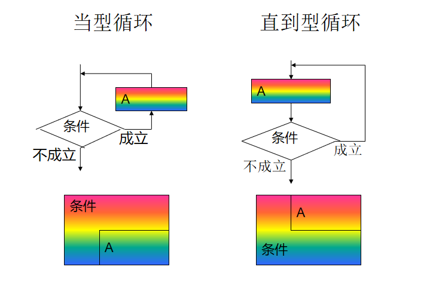

## 循环结构

有的时候，我们可能需要多次执行同一块代码。一般情况下，语句是按顺序执行的：函数中的第一个语句先执行，接着是第二个语句，依此类推。

编程语言提供了更为复杂执行路径的多种控制结构。

循环语句允许我们多次执行一个语句或语句组，下面是大多数编程语言中循环语句的流程图：



### 循环类型

C 语言提供了以下几种循环类型。


**while循环**

+ 语法

  ```cpp
  while(condition)
  {
      循环体;
  }
  ```

+ 规则

  + 只要condition为真，C 语言中的 **while** 循环语句会重复执行循环体。


**do...while循环**

+ 语法

  ```cpp
  do
  {
      循环体;
  }while(condition);
  ```

+ 规则

  + 不像 **for** 和 **while** 循环，它们是在循环头部测试循环条件。在 C 语言中，**do...while** 循环是在循环的尾部检查它的条件。
  + **do...while** 循环与 while 循环类似，但是 do...while 循环会确保至少执行一次循环。


**for 循环**

+ 语法

  ```cpp
  for(init;condition;increment)
  {
      循环体;
  }
  ```

+ 规则

  + **init** 会首先被执行，且只会执行一次。这一步允许声明并初始化任何循环控制变量。您也可以不在这里写任何语句，只要有一个分号出现即可。

  + 接下来，会判断 **condition**。如果为真，则执行循环体。如果为假，则不执行循环主体，且控制流会跳转到紧接着 for 循环的下一条语句。

  + 在执行完 for 循环主体后，控制流会跳回上面的 **increment** 语句。该语句允许您更新循环控制变量。该语句可以留空，只要在条件后有一个分号出现即可。

  + 条件再次被判断。如果为真，则执行循环，这个过程会不断重复（循环主体，然后增加步值，再然后重新判断条件）。直到条件变为假时，for 循环终止。

    

### 循环控制语句

循环控制语句改变你代码的执行顺序。通过它你可以实现代码的跳转。

C 提供了下列三个循环控制语句。

##### break语句

**作用**：终止**循环**或 **switch** 语句，程序流将继续执行紧接着循环或 switch 的下一条语句。

+ break只能跳出一层循环，多层循环需要使用标志。

+ break不能用在处循环和switch之外的任意语句中。

  

##### continue语句

**作用：**告诉一个循环体立刻停止本次循环迭代，重新开始下次循环迭代。

+ **continue** 语句有点像 **break** 语句。但它不是跳出，而是会跳过剩下的循环代码，直接开始下一次循环。
+ 对于 **for** 循环，**continue** 语句执行后自增语句仍然会执行。对于 **while** 和 **do...while** 循环，**continue** 语句执行后，重新执行条件判断语句。


##### goto语句

**作用：**将控制转移到被标记的语句。但是不建议在程序中使用 goto 语句。

+ C 语言中的 **goto** 语句允许(在同一函数内)跳转到任何的被标记的语句。

  **注意：**在任何编程语言中，都不建议使用 goto 语句。因为它使得程序的控制流难以跟踪，使程序难以理解和难以修改。任何使用 goto 语句的程序可以改写成不需要使用 goto 语句的写法。

  

##### 无限循环

如果条件永远不为假，则循环将变成无限循环。**for** 循环在传统意义上可用于实现无限循环。由于构成循环的三个表达式中任何一个都不是必需的，您可以将某些条件表达式留空来构成一个无限循环。

**实例**

```cpp
#include <stdio.h>  
int main()
{   
    for( ; ; )   
    {      
        printf("该循环会永远执行下去！\n");   
    }   
    return 0; 
}
```

当条件表达式不存在时，它被假设为真。您也可以设置一个初始值和增量表达式，但是一般情况下，C 程序员偏向于使用 for(;;) 结构来表示一个无限循环。

**注意：**您可以按 **Ctrl + C** 键终止一个无限循环。


### 练习

+ 求[1,100]的和。
+ 写一个九九乘法表。
+ 求100以内的素数
  + 素数又称质数。所谓素数是指除了 1 和它本身以外，不能被任何整数整除的数，例如17就是素数，因为它不能被 2~16 的任一整数整除。
  + **思路1)**：因此判断一个整数m是否是素数，只需把 m 被 2 ~ m-1 之间的每一个整数去除，如果都不能被整除，那么 m 就是一个素数。
  + **思路2)**：另外判断方法还可以简化。m 不必被 2 ~ m-1 之间的每一个整数去除，只需被 2 ~  之间的每一个整数去除就可以了。如果 m 不能被 2 ~  间任一整数整除，m 必定是素数。例如判别 17 是是否为素数，只需使 17 被 2~4 之间的每一个整数去除，由于都不能整除，可以判定 17 是素数。
  + **原因**：因为如果 m 能被 2 ~ m-1 之间任一整数整除，其二个因子必定有一个小于或等于 ，另一个大于或等于 。例如 16 能被 2、4、8 整除，16=2*8，2 小于 4，8 大于 4，16=4*4，4=√16，因此只需判定在 2~4 之间有无因子即可。


**练习答案：**

```cpp
//求[1,100]的和。
void summation()
{
	int sum = 0;
	for(int i=0;i<=100;i++)
	{
		sum+=i;
	}
	printf("[1,100]的和为:%d\n",sum);
}
//写一个九九乘法表。
void multiTable()
{
    for (int i = 1; i <= 9; i++)
	{
		for (int k = 1; k <= i; k++)
		{
			printf("%d*%d=%2d ", k, i, i * k);
		}
		printf("\n");
	}
}

//求100以内的素数
void  primeNumber()
{
	for (int i = 2; i <= 100; i++)
	{
		bool flag = true;
		for (int k = 2; k < i; k++)
		{
			if (i % k == 0)
			{
				flag = false;
				break;
			}
		}
		if (flag)
		{
			printf("i%d是素数\n", i);
			flag = true;
		}
	}
}
```

