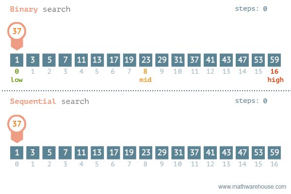

## 一维数组

### 数组是什么？

数组：相同数据类型的集合，多个变量共同使用一个变量名称，并用下标加以区分

**为什么要有数组？**

+ 如：现在需要存储全班同学的年龄，那么有n个同学，则需要定义n个变量，定义和管理都十分的麻烦。但是我们用数组只需要一行代码就可以定义完成。

  ```c
  //普通方式
  int age1,age2,age3,age4,age5...agen;
  //使用数组
  int age[n];
  ```

### 数组初始化

初始化只能在定义数组的同时进行

```c
//不同的初始化方式测试
int arr[8];						//不初始化
int arr[8]=0;					//error 数组初始化需要代扣好的初始值设定项列表(大括号初始化)
int arr[8]={0};					//true	告诉编译器，所有的都按一个方式初始化
int arr[8]={6};					//true	只有第一个为6，剩下的元素都自动初始化为0
int arr[8]={1,2,3,4,5,6};		//true
int arr[8]={0,1,2,3,4,5,6,7,8};	//error	初始值太多，超出了数组的存储范围
int arr[8]={,,,5,2,0};			//error 初始化只从从左到右，前面和中间都不能省略
int arr[]={1,2,3,4,5};			//true	数组里有几个元素？未指定数组大小，编译器会自动推导出来
int arr[];						//error	既不告诉编译器要多大内存，也不说有几个元素，编译器并不知道改怎么分配内存
int arr[]
```

### 输出数组

输出一个元素：数组名[下标]

```c
printf("%d",arr[0]);
```

输出所有元素：需要用循环输出

```c
for(int i=0;i<8;i++)
{
    printf("%d",arr[i]);
}
```

**注意：**

+ 数组的下标是从0开始的，因为下标是当前元素相对于第一个元素的偏移量

+ 输出的时候下标不能超出最大下标，最大小标为数组大小减一

### 数组的输入

```c
int arr[8];
for(int i=0;i<8;i++)
{
    scanf("%d",&arr[i]);
}
```

### 数组的插入、删除

数组不擅长插入（添加）和删除元素。数组的优点在于它是连续的，所以查找数据速度很快。但这也是它的一个缺点。正因为它是连续的，所以当插入一个元素时，插入点后所有的元素全部都要向后移；而删除一个元素时，删除点后所有的元素全部都要向前移。

```c
//插入
int arr[10] = { 5,2,0 };
int maxSize = 10;		//数组最大存储数量
int curSize = 3;		//数组当前存储元素的有效个数
int pos = -1;			//要删除或者插入的位置
int data = -1;			//要插入的数据
printf("请输入要插入的pos和data:");
scanf_s("%d%d", &pos, &data);
if (curSize == maxSize)
{
	printf("数组已满，无法插入~\n");
}
else
{
	//如果能插入，但是下标输入错误，那么就插到有效元素的后面
	if (pos<0 || pos >= maxSize)
	{
		pos = curSize;
		printf("下标输入错误，自动插入到有效元素的后一个\n");
	}
	//把插入点后面所有的数据往后移动
	for (int i = curSize; i > pos; i--)
	{
		arr[i] = arr[i - 1];
	}
	arr[pos] = data;
	curSize++;
}
//删除
printf("\n请输入要删除的pos:");
scanf_s("%d", &pos);
if (curSize == 0)
{
	printf("数组为空，无需删除~\n");
}
else
{
	//不能够乱删除，只要不是有效元素的下标统统不用理会
	if (pos < 0 || pos >= curSize)
	{
		printf("pos不合法,无法删除\n");
	}
	else
	{
		for (int i = pos; i < maxSize; i++)
		{
			arr[i] = arr[i + 1];
		}
		curSize--;
	}
}
```

## 数组排序

```c
//冒泡排序
int* bubbleSort(int arr[], int n)
{
	for (int i = 0; i < n - 1; i++)
	{
		for (int j = 0; j < n - i - 1; j++)
		{
			if (arr[j] > arr[j + 1])
			{
				int t = arr[j];
				arr[j] = arr[j + 1];
				arr[j + 1] = t;
			}
		}
	}
	return arr;
}

//选择排序
void selectSort(int arr[],int n)
{
	for (int i = 0; i < n-1; i++)
	{
		int min = i;
		for (int j = i+1; j < n; j++)
		{
			if (arr[j] < arr[min])
			{
				min = j;
			}
		}
		if (min != i)
		{
			int temp = arr[i];
			arr[i] = arr[min];
			arr[min] = temp;
		}
	}
}
/*例如
int i=0；//i：0 1 2 3 4
6  9  8  1  0     5个数
第一趟：0  1  6  8  9 
第二趟：
第三趟：
第四趟：
*/

//插入排序
void insertSort(int arr[], int n)
{
	for (int i = 1; i < n; i++)
	{
		int temp = arr[i];
		int j;
		for (j = i - 1; temp < arr[j]&& j >= 0; j--)
		{
				arr[j+1] = arr[j];	
		}
        //如果需要插入
		if (i != j+1)
		{
			arr[j + 1] = temp;
		}//else{arr[i/*j+1*/] = temp;}
	}
}
/*例如
int i=0；//i： 1 2 3 4
6  9  8  1  0     5个数
第一趟：6 9 8 1 0
第二趟：6 8 9 1 0
第三趟：1 6 8 9 0
第四趟：0 1 6 8 9
*/
```

## 二分查找

 **二分查找**是一种知名度很高的查找算法，在对**有序数列**进行查找时效率远高于传统的**顺序查找**。

下面这张动图对比了二者的效率差距。



二分查找的基本思想就是通过把目标数和当前数列的中间数进行比较，从而确定目标数是在中间数的左边还是右边，将查找的范围缩小一半，反复重复该过程，不断缩小范围，直到找到目标 （即目标数等于中间数时），或者确定目标数并不在该数列中。