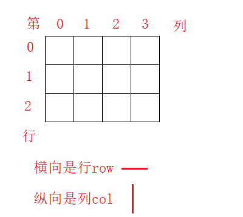
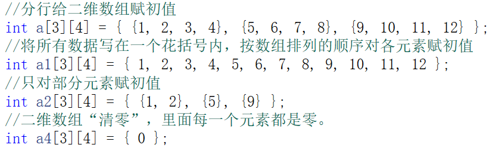

# 二维，三维数组和推箱子

二维数组与一维数组相似，但是用法上要比一维数组复杂一点。后面的编程中，二维数组用的相对较少，因为二维数组的本质就是一维数组，只不过形式上是二维的。

## 二维数组

**定义：**数据类型 数组名\[ROW][COL]

+ ROW 二维数组的行

+ COL  二维数组的列

  > 对于二维数组，可以看成一张表格，方便理解。但是下标和一维数组一样，都是从0开始的

**内存理解：**

+ 二维数组是由行和列组成的，所以说，要获取到一个元素，需要用两个下标表示 

+ 可以理解为二维数组的每个元素都是一维数组

  

### **初始化**

**注意**

+ 在初始化的时候可以省略行(ROW)，但是不能省略列

### 二维数组使用

+ 二维数组的元素也称为双下标变量，其表示的形式为：数组名\[下标][下标]
+ 下标变量和数组定义在形式中有些相似，但这两者具有完全不同的含义。
  + 数组定义的方括号中给出的是某一维的长度，即可取下标的最大值；
  + 而数组元素中的下标是该元素在数组中的位置标识。
  + 前者只能是常量，后者可以是常量、变量或表达式。

**访问所有元素**：需要使用双重循环，分别遍历行和列

## 三维数组

三维数组也与一维数组相似，但是用法上要比二维数组还复杂一点。三维数组用的极少。三维数组可以看成，每个元素都是一个二维数组的一维数组。

**定义**：数据类型 数组名\[LEVEL]\[ROW][COL]

+ LEVEL 	三维数组的层

+ ROW 	三维数组的行

+ COL  	三维数组的列

  > 对于三维数组可以理解为一个本子，每一页都是一层，而每一页上的表格就是对于的二维数组

**内存理解：**

+ 三维数组是由很多个二维数组构成的，所以说，要获取到一个元素，需要:
  + 找到层数    即哪一个二维数组
  + 找到二维数组之后遍历就方便了

+ 用三维数组实现推箱子的关卡跳转

## 推箱子

推箱子游戏时一款很有趣味的游戏，其开发过程有一定的技巧和方法，其中涉及到二维数组等基础知识以及键盘操作。

		写出推箱子，对大家的基础巩固及运用会有提升，希望大家认真学习~

**游戏设计步骤：**

+ 1，初始化数据
+ 2，绘制界面
+ 3，人及箱子移动

**基本属性定义：**

WALL：▓

DEST：☆

BOX：□

PLAYER：♀

BOX+DEST：★

PLAYER+DEST：♂