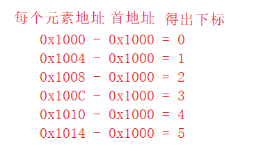

# 指针进阶

## 二级指针

指针可以指向一个普通类型的数据，例如 int、double、char 等，也可以指向一个指针类型的数据，例如 int *、double *、char * 等。

如果一个指针指向的是另外一个指针，我们就称它为二级指针，或者指向指针的指针。

假设有一个 int 类型的变量 age，page是指向 age 的指针变量，ppage 又是指向 page 的指针变量，它们的关系如下图所示：


将这种关系转换为C语言代码：

```cpp
int age =28;
int *page = &age;
int **ppage = &page;
```

指针变量也是一种变量，也会占用存储空间，也可以使用`&`获取它的地址。C语言不限制指针的级数，每增加一级指针，在定义指针变量时就得增加一个星号`*`。page 是一级指针，指向普通类型的数据，定义时有一个`*`；ppage 是二级指针，指向一级指针 page，定义时有两个`*`。

如果我们希望再定义一个三级指针 p3age，让它指向 ppage，那么可以这样写：

```cpp
int ***p3age = &ppage;
```

四级指针也是类似的道理：

```cpp
int ****p4age = &p3age;
```

实际开发中会经常使用一级指针和二级指针，几乎用不到高级指针。

想要获取指针指向的数据时，一级指针加一个`*`，二级指针加两个`*`，三级指针加三个`*`，以此类推，请看代码：

```cpp
#include <stdio.h>
int main()
{
    int a =100;
    int *p1 = &a;
    int **p2 = &p1;
    int ***p3 = &p2;
    printf("%d, %d, %d, %d\n", a, *p1, **p2, ***p3);
    printf("&p2 = %#X, p3 = %#X\n", &p2, p3);
    printf("&p1 = %#X, p2 = %#X, *p3 = %#X\n", &p1, p2, *p3);
    printf(" &a = %#X, p1 = %#X, *p2 = %#X, **p3 = %#X\n", &a, p1, *p2, **p3);
    return 0;
}
```


## 一维数组指针

数组（Array）是一系列具有相同类型的数据的集合，每一份数据叫做一个数组元素（Element）。数组中的所有元素在内存中是连续排列的，整个数组占用的是一块内存。以`int arr[] = { 99, 15, 100, 888, 252 };`为例，该数组在内存中的分布如下图所示：


定义数组时，要给出数组名和数组长度，数组名可以认为是一个`指针`，它指向数组的第 0 个元素。在C语言中，我们将第 0 个元素的地址称为数组的首地址。以上面的数组为例，下图是 arr 的指向：


**数组下标为啥从0开始？**

+ 数组下标实际上是每个元素的地址相对于第一个元素地址的偏移量




访问数组元素除了可以通过*下标法*之外，还可以通过*指针法*访问。

+ 下标法

  ```cpp
  for(int i = 0;i < 6;i++)
  {
      printf("%d ",arr[i]);
      //printf("%d ",i[arr]);
  }
  ```

+ 指针法

  ```cpp
  for(int i = 0;i < 6;i++)
  {
      printf("%d ",*(arr + i));
  }
  ```

  这就是为什么在某些地方大家会看到 **i[arr]** 这种访问数组元素的方法的原因，实际上下标法就是通过指针法来实现的，只不过编译器帮助我们做了这个操作，简化了操作难度。

### 指向数组的指针

我们也可以定义一个指向数组的指针，例如：

```cpp
int arr[] = { 99, 15, 100, 888, 252 };
int *p = arr;
```

arr 本身可以看做是一个指针，可以直接赋值给指针变量 p。arr 是数组第 0 个元素的地址，所以`int *p = arr;`也可以写作`int *p = &arr[0];`。也就是说，arr、p、&arr[0] 这三种写法都是等价的，它们都指向数组第 0 个元素，或者说指向数组的开头。

如果一个指针指向了数组，我们就称它为**数组指针（Array Pointer）**。

数组指针指向的是数组中的一个具体元素，而不是整个数组，所以数组指针的类型和数组元素的类型有关，上面的例子中，p 指向的数组元素是 int 类型，所以 p 的类型必须也是`int *`。

反过来想，p 并不知道它指向的是一个数组，p 只知道它指向的是一个整数，究竟如何使用 p 取决于程序员的编码。

使用指针访问数组元素和使用函数名没有任何区别，值得注意的是我们不同通过指针获得数组的大小，但是通过数组名却可以。

```cpp
printf("%d\n",sizeof(arr));		//数组所占字节数 20 Byte
printf("%d\n",sizeof(p));		//指针所占字节数 4 Byte
```

也就是说，根据数组指针不能逆推出整个数组元素的个数，以及数组从哪里开始、到哪里结束等信息。不像字符串，数组本身也没有特定的结束标志，如果不知道数组的长度，那么就无法遍历整个数组。


### 关于数组指针的谜题

假设 p 是指向数组 arr 中第 n 个元素的指针，那么 \*p++、\*++p、(\*p)++ 分别是什么意思呢？

*p++ 等价于 *(p++)，表示先取得第 n 个元素的值，再将 p 指向下一个元素。

*++p 等价于 *(++p)，会先进行 ++p 运算，使得 p 的值增加，指向下一个元素，整体上相当于 *(p+1)，所以会获得第 n+1 个数组元素的值。

(*p)++ 就非常简单了，会先取得第 n 个元素的值，再对该元素的值加 1。假设 p 指向第 0  个元素，并且第 0 个元素的值为 99，执行完该语句后，第 0  个元素的值就会变为 100。


### 数组名和数组指针的区别

虽然说数组名可以当做指针使用，但实际上数组名并不等价于指针。

+ 数组名代表的是整个数组，具有确定数量的元素
+ 指针是一个标量，不能确定指向的是否是一个数组
+ 数组可以在某些情况下会自动转换为指针，当数组名在表达式中使用时，编译器会把数组名转换为一个指针常量，是数组中的第一个元素的地址，类型就是数组元素的地址类型(通过sizeof也可以看出来)


## 二维数组指针

二维数组可以理解为每一个元素都是一个一维数组的数组，这样就可以很好的理解二维数组与指针了。

下面定义了一个2行3列的二维数组，并画出了对应的内存模型。


我们可以使用arr[0]获得第0个一维数组，然后再加上一个小标就可以获取到对应的元素，如arr\[0][0]获取了第0行第0列的元素。

## 指针数组

每个元素都是指针的数组叫做指针数组，即存储指针的数组。

如：`int* parr[5] = {NULL};`

parr里面存的是int*型指针，同时我们把每个指针都初始化为了NULL。接下来我们让这个数组的每个元素都指向一块动态分配的空间。

```cpp
for(int i=0;i<5;i++)
{
    parr[i] = malloc(sizeof(int));
    *parr[i] = i;
}
```


## 内存四区

计算机中的内存是分区来管理的，程序和程序之间的内存是独立的，不能互相访问，比如QQ和浏览器分别所占的内存区域是不能相互访问的。而每个程序的内存也是分区管理的，一个应用程序所占的内存可以分为很多个区域，我们需要了解的主要有四个区域，通常叫内存四区。


### 1.代码区

程序被操作系统加载到内存的时候，所有的可执行代码（程序代码指令、常量字符串等）都加载到代码区，这块内存在程序运行期间是不变的。代码区是平行的，里面装的就是一堆指令，在程序运行期间是不能改变的。函数也是代码的一部分，故函数都被放在代码区，包括main函数。

注意："int a = 0;"语句可拆分成"int a;"和"a = 0"，定义变量a的"int a;"语句并不是代码，它在程序编译时就执行了，并没有放到代码区，放到代码区的只有"a = 0"这句。

### 2.静态区

静态区存放程序中所有的全局变量和静态变量。

### 3.栈区

栈（stack）是一种先进后出的内存结构，所有的自动变量、函数形参都存储在栈中，这个动作由编译器自动完成，我们写程序时不需要考虑。栈区在程序运行期间是可以随时修改的。当一个自动变量超出其作用域时，自动从栈中弹出。

每个线程都有自己专属的栈；栈的最大尺寸固定，超出则引起栈溢出；变量离开作用域后栈上的内存会自动释放。

+ **实验一**：观察代码区、静态区、栈区的内存地址

```cpp
#include <stdio.h>
int g = 0;
void test(int a, int b)
{
	printf("形式参数a的地址是：%p\n形式参数b的地址是：%p\n", &a, &b);
}
int main()
{
	static int m = 0;
	int a = 0;
	int b = 0;
	printf("自动变量a的地址是：%p\n自动变量b的地址是：%p\n", &a, &b);
	printf("全局变量g的地址是：%p\n静态变量m的地址是：%p\n", &g, &m);
	test(a, b);
	printf("main函数的地址是：%p", &main);
	return 0;
}
```

**结果分析：**自动变量a和b依次被定义和赋值，都在栈区存放，内存地址只相差12，需要注意的是a的地址比b要大，这是因为栈是一种先进后出的数据存储结构，先存放的a,后存放的b,形象化表示如上图（注意地址编号顺序）。一旦超出作用域，那么变量b将先于变量a被销毁。这很像往箱子里放衣服，最先放的最后才能被拿出，最后放的最先被拿出。

另外，栈不会很大，一般都是以K为单位。如果在程序中直接将较大的数组保存在函数内的栈变量中，很可能会内存溢出，导致程序崩溃，严格来说应该叫栈溢出（当栈空间以满，但还往栈内存压变量，这个就叫栈溢出）。

如果你需要大量的空间来存储，则需要堆出场了！

### 4.堆区

堆（heap）和栈一样，也是一种在程序运行过程中可以随时修改的内存区域，但没有栈那样先进后出的顺序。更重要的是堆是一个大容器，它的容量要远远大于栈。一般比较复杂的数据类型都是放在堆中。但是在C语言中，堆内存空间的申请和释放需要手动通过代码来完成。对于一个32位操作系统，最大管理管理4G内存，其中1G是给操作系统自己用的，剩下的3G都是给用户程序，而在一个程序中，一个用户动态分配理论上可以使用3G的内存空间。堆上的内存必须手动释放（C/C++），除非语言执行环境支持GC（如C#在.NET上运行就有垃圾回收机制）。那堆内存如何使用？


## 动态内存分配

动态内存是相对静态内存而言的。所谓动态和静态就是指内存的分配方式。动态内存是指在堆上分配的内存，而静态内存是指在栈上分配的内存。

前面所写的程序大多数都是在栈上分配的，比如局部变量、形参、函数调用等。栈上分配的内存是由系统分配和释放的，空间有限，在复合语句或函数运行结束后就会被系统自动释放。而堆上分配的内存是由程序员通过编程自己手动分配和释放的，空间很大，存储自由。堆和栈后面还会专门讲，这里先了解一下。

**动态分配意义**

+ 定义数组时必须指定数组的大小，使用动态分配可以在运行时调整大小。
+ 突破函数内局部变量的作用域局限，函数结束之后，不希望变量的内存被释放。

### 库函数

那么动态内存是怎么造出来的？在讲如何动态地把一个数组造出来之前，我们必须要先介绍 malloc 函数的使用。

#### malloc

malloc 是一个系统函数，它是 `memory allocate` 的缩写。其中memory是“内存”的意思，allocate是“分配”的意思。顾名思义 malloc 函数的功能就是“分配内存”。要调用它必须要包含头文件<stdlib.h>。

```cpp
void* malloc(size_t _Size);
int* parr = calloc(sizeof(int) * 10);
```

malloc 函数只有一个形参，并且是整型。该函数的功能是在内存的动态存储空间即堆中分配一个长度为size的连续空间。函数的返回值是一个指向所分配内存空间起始地址的指针，类型为 void*型。

简单的理解，malloc 函数的返回值是一个地址，这个地址就是动态分配的内存空间的起始地址。如果此函数未能成功地执行，如内存空间不足，则返回空指针 NULL。

“int i=5；”表示分配了 4 字节的“静态内存”。这里需要强调的是：“静态内存”和“静态变量”虽然都有“静态”两个字，但是它们没有任何关系。不要以为“静态”变量的内存就是“静态内存”。静态变量的关键字是 static，它与全局变量一样，都是在“静态存储区”中分配的。这块内存在程序编译的时候就已经分配好了，而且在程序的整个运行期间都存在；而静态内存是在栈中分配的，比如局部变量。

#### calloc

calloc函数的功能与malloc函数的功能相似，都是从堆分配内存。最大的不同在于calloc会把申请的空间全部初始化为0。

```cpp
void* calloc(size_t _Count,size_t _Size);
int* parr = calloc(10,sizeof(int));
```

#### realloc

realloc函数的功能比malloc函数和calloc函数的功能更为丰富，可以实现内存分配和内存释放的功能。

```cpp
void* realloc(void*  _Block,size_t _Size);
int* pnew = realloc(parr,20);
```

+ _Block是堆上已经存在空间的地址
+ _Size是目标空间大小

重新分配堆上的void指针\_Block所指的空间为\_Size个字节，同时会复制原有内容到新分配的堆上存储空间。注意，若\_Size小于或等于原来空间的字节，则保持不变。否则会扩容。

#### free

前面讲过，动态分配的内存空间是由程序员手动编程释放的。那么怎么释放呢？用 free 函数。

```cpp
void free(void* _Block);
```

free 函数无返回值，它的功能是释放指针变量 p 所指向的内存单元。此时 p 所指向的那块内存单元将会被释放并还给操作系统，不再归它使用。操作系统可以重新将它分配给其他变量使用。

需要注意的是，释放并不是指清空内存空间，而是指将该内存空间标记为“可用”状态，使操作系统在分配内存时可以将它重新分配给其他变量使用。

### 注意

动态创建的内存如果不用了必须要释放。注意，一个动态内存只能释放一次。如果释放多次程序就会崩溃，因为已经释放了，不能再释放第二次。

malloc 和 free 一定要成对存在，一一对应。有 malloc 就一定要有 free，有几个 malloc 就要有几个 free，与此同时，每释放一个指向动态内存的指针变量后要立刻把它指向 NULL。

最后需要强调的是，只有动态创建的内存才能用 free 把它释放掉，静态内存是不能用free释放的。静态内存只能由系统释放。比如：

```
int a = 10;
int *p = &a;
free(p);	//error
```

如果试图用 free(p) 把指针变量 p 所指向的内存空间释放掉，那么编译的时候不会出错，但程序执行的时候立刻就出错。

