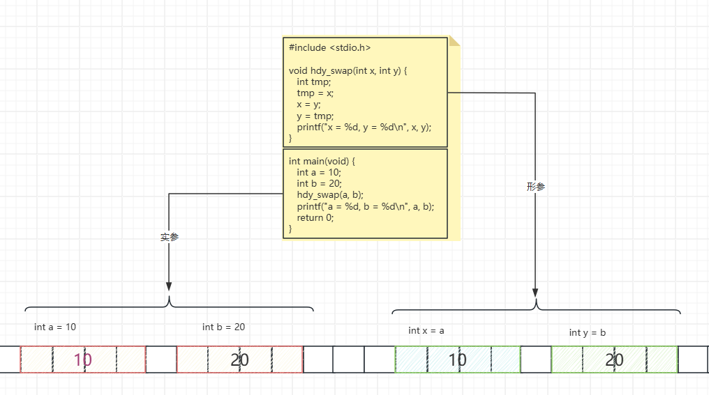
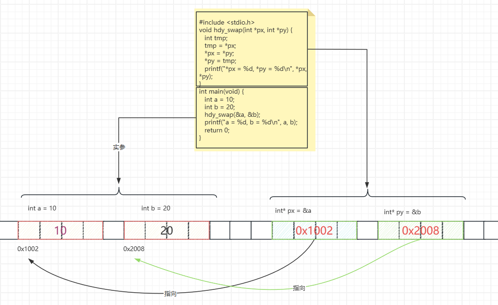

# 函数与指针

在C语言中，函数和指针是两个非常重要的概念。函数是一段执行特定任务的代码块，而指针则是存储变量地址的变量。将函数与指针结合使用，可以实现更高级的功能，比如函数指针、回调函数等。

## 函数与指针结合

### 指针作为函数参数

函数参数传递主要有两种方式：**值传递**和**地址传递**（也称为引用传递）。这两种方式在处理数据时有不同的特点和应用场景。

#### 值传递

值传递是将实参的值复制到形参中，即形参和实参分别占用不同的存储单元。在这种方式下，形参的任何变化都不会影响到实参的值。来看一个简单的例子：

```c
#include <stdio.h>

void hdy_swap(int x, int y) {
   int tmp;
   tmp = x;
   x = y;
   y = tmp;
   printf("x = %d, y = %d\n", x, y);
}

int main(void) {
   int a = 10;
   int b = 20;
   hdy_swap(a, b);
   printf("a = %d, b = %d\n", a, b);
   return 0;
}
```

在这个例子中，`hdy_swap`函数交换了`x`和`y`的值，但并没有改变`a`和`b`的值，因为`x`和`y`只是`a`和`b`的副本。



#### 地址传递

地址传递是通过传递变量的地址来间接地改变实参的值。形参接收到的是实参的地址，因此对形参的操作会直接影响到实参。来看一个示例：

```c
#include <stdio.h>
void hdy_swap(int *px, int *py) {
   int tmp;
   tmp = *px;
   *px = *py;
   *py = tmp;
   printf("*px = %d, *py = %d\n", *px, *py);
}
int main(void) {
   int a = 10;
   int b = 20;
   hdy_swap(&a, &b);
   printf("a = %d, b = %d\n", a, b);
   return 0;
}
```

在这个例子中，`hdy_swap`函数通过指针交换了`a`和`b`的值，因为`px`和`py`指向的是`a`和`b`的地址。



#### 传递指针的地址

对于指针变量，如果希望通过函数改变主函数中的指针变量的值，需要使用二级指针。来看一个正确的示例：

```c
#include <stdio.h>
#include <stdlib.h>
#include <string.h>
#include <time.h>

void func(char **dst) {
   char *buf = (char *)malloc(20);
   strcpy(buf, "hello world!");
   *dst = buf;
}
int main() {
   char* str;
   func(&str);
   puts(str);
   free(str);
   return 0;
}
```

> 在函数里面使用指针参数时，最好先判断是否为空

### 数组指针作为函数参数

数组名本质上是一个指针，可以直接作为函数参数传递。

```c
// 两种等价的函数声明方式
void print_array1(int arr[], int size) {
    for (int i = 0; i < size; i++) {
        printf("%d ", arr[i]);
    }
    printf("\n");
}

void print_array2(int *arr, int size) {
    for (int i = 0; i < size; i++) {
        printf("%d ", *(arr + i));
    }
    printf("\n");
}

void modify_array(int arr[], int size) {
    for (int i = 0; i < size; i++) {
        arr[i] *= 2;  // 修改数组元素
    }
}

int main() {
    int numbers[] = {1, 2, 3, 4, 5};
    int size = sizeof(numbers) / sizeof(numbers[0]);
    
    printf("原始数组: ");
    print_array1(numbers, size);
    
    modify_array(numbers, size);
    
    printf("修改后数组: ");
    print_array2(numbers, size);
    
    return 0;
}
```

> 要在函数中使用数组大小，必须传递大小参数！

### 返回指针的函数

指针可以作为函数的返回值，但需要注意的是，不要返回临时变量的地址，也就是说一定要确保函数执行完成后，返回的地址的内存不会释放。

```c
//error:返回了临时变量的地址
int* getPtr()
{
    int num = 89;
    return &num;
}

//ok:返回静态变量的地址
int* getPtr1()
{
    static int num = 89;
    return &num;
}

//ok:返回全局变量的地址
int count = 0;
int* getPtr2()
{
    return &count;
}

//ok:返回动态内存的地址
int* getPtr3()
{
    int* p = malloc(sizeof(int));
    if(!p){
        printf("malloc failed!\n");
        return NULL;
    }
    return p;
}

//ok:返回传入的地址
int* getPtr3(int* pnum)
{
    if(!pnum){
        printf("pnum is nullptr!\n");
        return NULL;
    }
    return pnum;
}
```


## 函数指针

函数指针是指向函数的指针变量。通过函数指针，我们可以调用不同的函数，这在实现回调函数、函数表等时非常有用。

### 声明函数指针

函数指针的声明需要指定返回类型和参数类型。例如：

```c
int (*func_ptr)(int, int);
```

这个声明表示`func_ptr`是一个指向函数的指针，该函数接受两个`int`参数并返回一个`int`。

### 使用函数指针

假设我们有两个函数：

```c
int add(int a, int b) {
    return a + b;
}

int subtract(int a, int b) {
    return a - b;
}
```

我们可以将函数指针指向这两个函数之一，并通过指针调用函数：

```c
int main() {
    int (*func_ptr)(int, int); // 声明函数指针

    func_ptr = &add; // 或者直接写 add
    printf("Add: %d\n", func_ptr(5, 3)); // 输出 8

    func_ptr = &subtract;
    printf("Subtract: %d\n", func_ptr(5, 3)); // 输出 2

    return 0;
}
```

### 返回函数指针的函数

函数也可以返回函数指针。例如：

```c
int (*get_operation(char op))(int, int) {
    if (op == '+') return add;
    if (op == '-') return subtract;
    return NULL;
}

int main() {
    int (*func)(int, int) = get_operation('+');
    if (func != NULL) {
        printf("Result: %d\n", func(5, 3));
    }
    return 0;
}
```

这里`get_operation`函数根据传入的字符返回对应的函数指针。

### 函数指针数组

我们也可以创建函数指针数组，用于实现状态机、命令模式等。

```c
int (*operations[])(int, int) = {add, subtract};

int main() {
    printf("Add: %d\n", operations[0](5, 3));
    printf("Subtract: %d\n", operations[1](5, 3));
    return 0;
}
```

### 回调函数

函数指针可以作为参数传递给另一个函数，这样可以使函数更加灵活。例如，我们可以实现一个计算器函数，它接受一个函数指针作为参数：

```c
int calculate(int (*operation)(int, int), int a, int b) {
    return operation(a, b);
}

int main() {
    printf("Add: %d\n", calculate(add, 5, 3));
    printf("Subtract: %d\n", calculate(subtract, 5, 3));
    return 0;
}
```

回调函数是一种通过函数指针调用的函数。如果你把函数指针作为参数传递给另一个函数，当这个指针被用来调用其所指向的函数时，我们就说这是回调函数。

例如，C标准库中的`qsort`函数就使用回调函数来定义排序规则：

```c
#include <stdio.h>
#include <stdlib.h>

int compare(const void *a, const void *b) {
    return (*(int*)a - *(int*)b);
}

int main() {
    int arr[] = {5, 2, 8, 1, 9};
    int n = sizeof(arr) / sizeof(arr[0]);

    qsort(arr, n, sizeof(int), compare);

    for (int i = 0; i < n; i++) {
        printf("%d ", arr[i]);
    }
    return 0;
}
```

## 案例

### 实现定时器

#### 简单的定时器

```c
typedef void(*TimeOutCallback)();
//定时器函数
void timer(int ms, TimeOutCallback func)
{
	static int start = 0;
	if (clock() - start >=  ms) {	
		func();
		start = clock();
	}
}

void show() {
	printf("%s\n", "show");
}

int main()
{
	while (true) {
		timer(1000,show);
	}
	return 0;
}
```


#### 完整的定时器

```c
#define MAX_TIMER_SIZE 10
typedef void(*TimeOutCallback)();
//定时器函数
void timer(int id,int ms, TimeOutCallback func)
{
	//每个定时器的开始时间
	static int start[MAX_TIMER_SIZE] = { 0 };
	//如果第一次开始初始化一次，防止开始就调用一次
	if (start[id] == 0) {
		start[id] = clock();
	}
	//如果时间到了，调用函数
	if (clock() - start[id] >= ms) {
		func();
		//如果需要循环调用，则重新开始计时
		start[id] = clock();
	}
}

void show() {
	printf("%s\n", "show");
}
void foo() {
	printf("%s\n", "foo");
}
void bar() {
	printf("%s\n", "bar");
}

int main()
{
	while (true) {
		timer(0, 1000, show);
		timer(1, 800, foo);
		timer(2, 500, bar);
	}
	return 0;
}
```

#### 支持注册和取消的定时器

```c
#include<stdio.h>
#include<time.h>
#include<stdbool.h>

#define MAX_TIMER_SIZE 10					/*!最大定时器数量*/

typedef void(*TimeOutCallback)(int, void*);
int startTime[MAX_TIMER_SIZE];				/*!定时器开始时间*/
int timeout[MAX_TIMER_SIZE];				/*!定时器超时时长*/
TimeOutCallback timerFunc[MAX_TIMER_SIZE];	/*!定时器回调函数*/
void* timerArgs[MAX_TIMER_SIZE];			/*!定时器回调函数,参数*/
int size;									/*!定时器数量*/

//注册定时器
int registerTimer(int ms, TimeOutCallback func, void* arg)
{
	if (size >= MAX_TIMER_SIZE) {
		printf("%s\n", "定时器数量超过最大值");
		return -1;
	}
	startTime[size] = 0;
	timerFunc[size] = func;
	timerArgs[size] = arg;
	timeout[size] = ms;
	return size++;
}
//移除定时器
void removeTimer(int id)
{
	if (id < 0 || id >= size) {
		printf("%s\n", "定时器id错误");
		return;
	}
	for (int i = id; i < size - 1; i++) {
		startTime[i] = startTime[i + 1];
		timerFunc[i] = timerFunc[i + 1];
		timeout[i] = timeout[i + 1];
	}
	startTime[size - 1] = 0;
	size--;
}

//定时器更新函数
void updateTimer()
{
	for (int i = 0; i < size; i++)
	{
		//如果第一次开始初始化一次，防止开始就调用一次
		//if (startTime[i] == 0) startTime[i] = clock();
		if (clock() - startTime[i] >= timeout[i]) {
			timerFunc[i](i, timerArgs[i]);
			startTime[i] = clock();
		}
	}
}

void show(int id, void* arg)
{
	printf("%s %p\n", __FUNCTION__, arg);
}

void show1(int id, void* arg)
{
	printf("%s %p\n", __FUNCTION__, arg);
}

void show2(int id, void* arg)
{
	printf("%s %d\n", __FUNCTION__, *(int*)arg);
	removeTimer(id);
}

int main()
{
	int num = 11;

	registerTimer(1000, show, NULL);
	registerTimer(2000, show1, NULL);
	registerTimer(3000, show2, &num);

	while (true) {
		updateTimer();
	}

	return 0;
}
```

