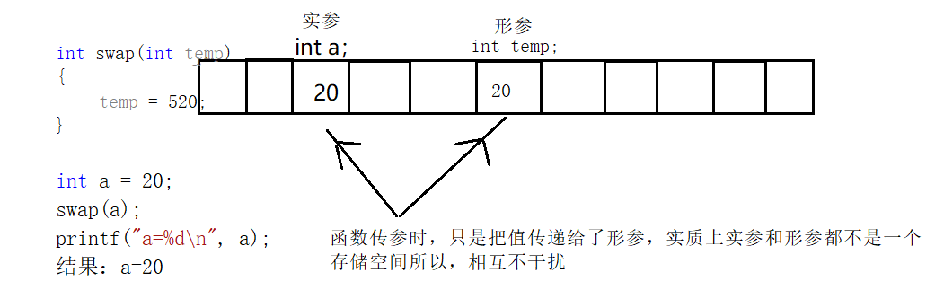
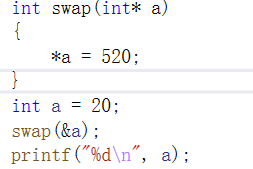

# 指针高级

## typedef

C语言允许用户使用 typedef 关键字来定义自己习惯的数据类型名称，来替代系统默认的基本类型名称、数组类型名称、指针类型名称与用户自定义的结构型名称、共用型名称、枚举型名称等

在使用复杂指针类型时，比如函数指针，可以用typedef取别名，不需要每次都写很长的指针定义。

**定义：typedef 类型 别名；**

+ typedef int INT；INT就是我们定义的新类型，此时可以用INT 代替int来定义整型变量
+ typedef void (*PFUNA)(int a); ———— 在语句开头加上typedef关键字，PFUNA就是我们定义的新类型


**一，typedef的一个重要用途是定义机器无关的类型。**

例如，定义一个叫REAL的浮点类型，该浮点类型在目标机器上可以获得最高的精度：

```c
typedef long double Real;
```

如果在不支持 long double 的机器上运行相关代码，只需要对对应的typedef语句进行修改，例如：

```c
typedef double Real;
```

或者：

```c
typedef float Real
```

**二，使用typedef为现有类型创建别名，给变量定义一个易于记忆且意义明确的新名字。**

+ 类型过长，用typedef可以简化一下

```c
typedef unsigned int UInt32
```

+ 还可以定义数组类型

```c
typedef int IntArray[10];
IntArray arr;				//相当于int arr[10]
```


**三、使用typedef简化一些比较复杂的类型声明。**

例如：

```c
typedef int (*CompareCallBack)(int,int);
```

上述声明引入了PFUN类型作为函数指针的同义字，该函数有两个类型分别为int、int、char参数，以及一个类型为int的返回值。通常，当某个函数的参数是一个回调函数时，可能会用到typedef简化声明。
例如，承接上面的示例，我们再列举下列示例：

```c
int callBackTest(int a,int b,CompareCallBack cmp);
```

callBackTest函数的参数有一个CompareCallBack类型的回调函数。在这个示例中，如果不用typedef，callBackTest函数声明如下：

```c
int callBackTest(int a,int b,int (*cmp)(int,int));
```


从上面两条函数声明可以看出，不使用typedef的情况下，callBackTest函数的声明复杂得多，不利于代码的理解，并且增加的出错风险。

所以，在某些复杂的类型声明中，使用typedef进行声明的简化是很有必要的。


## 小心陷阱

示例：

```c
typedef int* IntPtr;
cont IntPtr p;
```

**`const IntPtr` 相当于 `const char`” 呢？还是`char* const`呢？**

+ 答案是相当于`char* const`，原因很简单，typedef 是用来定义一种类型的新别名的，它不同于宏，不是简单的字符串替换。
+ 因此，`const IntPtr`中的 const 给予了整个指针本身常量性，也就是形成了常量指针`char* const`（一个指向char的常量指针），而不是`const char*`（指向常量 char 的指针）。
+ 当然，要想让 const IntPtr相当于 const char* 也很容易。如下面的代码所示：

```c
typedef const int* const_IntPtr;
const_IntPtr p;
```


还值得注意的是，虽然 typedef 并不真正影响对象的存储特性，但在语法上它还是一个存储类的关键字，就像 auto、extern、static 和 register 等关键字一样。因此，像下面这种声明方式是不可行的：

```c
typedef static int Static_Int;	//错误
```

不可行的原因是不能声明多个存储类关键字，由于 typedef 已经占据了存储类关键字的位置，因此，在 typedef 声明中就不能够再使用 static 或任何其他存储类关键字了。

## 指针做函数参数

学习函数的时候，讲了函数的参数都是值拷贝，在函数里面改变形参的值，实参并不会发生改变。



如果想要通过形参改变实参的值，就需要传入指针了。



注意：虽然指针能在函数里面改变实参的值，但是函数传参还是值拷贝。不过指针虽然是值拷贝，但是却指向的同一片内存空间。


+ 数组当做指针传参

## 指针做函数返回值

返回指针的函数，也叫作指针函数。

和普通函数一样，只是返回值类型不同而已，先看一下下面这个函数，非常熟悉对不！

```cpp
int fun(int x,int y);
```

接下来看另外一个函数声明

```cpp
int* fun(int x,int y);
```

这样一对比，发现所谓的指针函数也没什么特别的。

**注意：**

+ 不要返回临时变量的地址
+ 可以返回动态申请的空间的地址
+ 可以返回静态变量和全局变量的地址

## 函数指针

如果在程序中定义了一个函数，那么在运行时系统就会为这个函数代码分配一段存储空间，这段存储空间的首地址称为这个函数的地址。而且函数名表示的就是这个地址。既然是地址我们就可以定义一个指针变量来存放，这个指针变量就叫作函数指针变量，简称函数指针。

### 函数指针定义

`函数返回值类型  (* 指针变量名) (函数参数列表);`

+ “函数返回值类型”表示该指针变量所指向函数的 返回值类型；

+ “函数参数列表”表示该指针变量所指向函数的参数列表。

**那么怎么判断一个指针变量是指向变量的指针，还是指向函数的指针变量呢？**

+ 看变量名的后面有没有带有形参类型的圆括号，如果有就是指向函数的指针变量，即函数指针，如果没有就是指向变量的指针变量。

+ 函数指针没有++和 --运算

### 函数指针使用

定义一个实现两个数相加的函数。

```cpp
int add(int a,int b)
{
    return a+b;
}
int main()
{
    int (*pfun)(int,int) = add;
    int res = pfun(5,3);
    printf("res:%d\n",res);
    
    return 0;
}
```

在给函数指针pfun赋值时，可以直接用add赋值，也可以用&add赋值，效果是一样的。

在使用函数指针时，同样也有两种方式，1，pfun(5,3);  2，(*pfun)(5,3)

**用函数指针实现一个简单的计算器，支持+、-、*、/、%**

```cpp
plus sub multi divide mod		//加 减 乘 除 取余
```

## 回调函数

首先要明确的一点是，函数也可以作为函数的参数来传递。

当做函数参数传入的函数，称之为 回调函数（至于为什么要叫“回调函数”，不能叫别的呢？其实这只是人为规定的一个名字。你也可以叫“maye专属函数”，但是到时候你又会问为什么要叫“maye专属函数”，它特么的总的有个名字吧！所以叫“回调函数”就是王八的屁股：规定！）。

