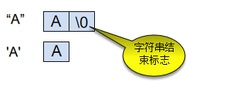
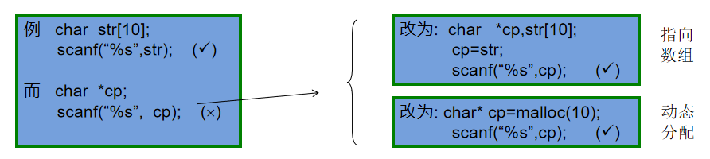
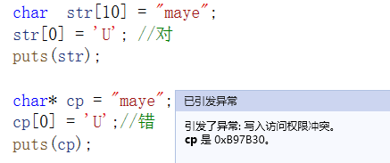
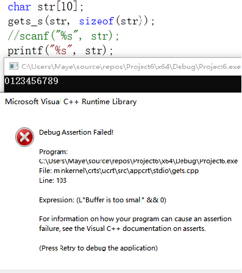

# 字符串与字符数组

## 字符和字符串

**字符**

+ 普通字符：'a','1'
+ 转义字符：'\a','\n'...

**字符串**

+ “Boy”,”Maye”

**字符与字符串的区别**

​		1，形式上不同
​				2，本质上：字符串有结束符 '\0'



`字符A和字符串A所占内存空间不一样,以下代码输出分别是多少呢？`	

```cpp
printf("%d %d", sizeof('a'),sizeof("a"));
```


## 字符串与字符数组

在各种编程语言中，字符串的地位都十分重要，C语言中并没有提供“字符串”这个特定类型，而是以特殊字符数组的形式来存储和处理字符串，这种字符数组必须以空字符’\0’结尾，因此，也将这种特定字符数组称为C风格字符串， 如何声明创建一个C风格字符串时，如何使用C风格字符串，这是本节课要学习的内容。

### 特点

+ 字符数组可以没有'\0'
+ 字符串必须要有'\0'
+ 字符数组可以存储字符串

字符串一定是字符数组，字符数组不一定是字符串

**下列字符数组存储的是不是字符串：**

```cpp
 char str[10] = {'1','b','c'};		//并不是字符串，没有\0
 char str[1] ={'\0'};		 	    //是字符串 等价于””
 “abcdedf”; 			            //也是字符串,编译器会自动的在双引号最后加，上\0
 char str[10] =“abcdef"; 			//字符串可以用字符数组表示{'a','b'...'\0'}
 char str[10]={''a,”,”b”,”c”,'\0'}	//不是字符串
 char *p=”maye”;			        //一个字符指针指向字符串
```

**总结：**

+ 编译器不会给字符数组自动添加'\0'

+ 编译器会自动给双引号的字符串字面值加上'\0'

+ 指针指向的字符串是常量，是没法修改的。

### 创建字符串两种形式

+ 字符数组形式：char str[20];
+ 字符指针形式：char* pc;

**区别：**

+ str是一个字符数组，字符串中的每个字符逐个存放，且可以随意修改
+ pc是一个字符指针，指向的是常量区的字符串，不能修改，只能访问

```cpp
char  str[20];     str=“I love China!”;    //(X) str是常量不能改变指向
char   *pc;        pc=“I love China!”;     //(√) pc是变量，可以改变指向
```

+ 因此pc接受输入字符串时，必须先开辟内存空间





## 字符数组输入/输出

### 输入

#### scanf

+ 使用scanf输入字符串时，遇到空格会自动截断，遇到回车结束,自动添加'\0'
+ 输入超出范围时，不会进行越界检查，甚至能完全输出

#### gets_s

+ 能读取空格，遇到回车结束,自动添加'\0'
+ 输入超出范围时，会进行越界检查,如下图



#### getchar

```cpp
char str[10];
for(int i=0;i<10;i++)
{
    str[i] = getchar();
}
puts(str);	//如果结尾没有'\0',输出结果将不可预料，可以改为逐个字符输出

```

+ 在结尾自动加上’\0‘

```cpp
for(int i=0;i<10;i++)
{
    str[i] = getchar();
    if(str[i] == '\n')
    {
        str[i] = '\0';
        break;
    }
}
```

### 输出

由于C语言中没有真正的字符串类型，可以通过字符数组表示字符串，因为它的元素地址是连续的，这就足够了。 

1. 从首地址开始逐字节寻址，把存储单元（一个字节）内的数据转换为ASCII字符格式输出。

  		2. 直到某一个字节内存的元素为字符'\0'时，输出此字符并且寻址结束。

如果字符数组里没有'\0'，那么使用printf (%s) 输出时，就找不到正确的结束标志，就会多输出一些乱码。


## 字符串处理函数

C语言提供了丰富的字符串处理函数，大致可分为字符串的输入、输出、合并、修改、比较、转换、复制、搜索几类。 使用这些函数可大大减轻编程的负担。用于输入输出的字符串函数，在使用前应包含头文件"stdio.h"，使用其它字符串函数则应包含头文件"string.h"。

### strlen

求字符串长度(不包括\0)

```cpp
strlen("hello maye");	
```

### strcpy/strncpy

把一个src拷贝到dest中去，要保证dst缓冲区有足够的内存。

+ strcpy 会在dest结尾添加\0
+ strncpy 不会在dest结尾添加\0

```cpp
char dest[10];
strcpy(dest, "maye");
puts(dest);
```

### strcmp/strncmp/stricmp

比较str1和str2，str1 > str2 返回1，str1==str2 返回0，否则返回-1

```cpp
int res = strcmp("maye", "maye");
printf("res:%d\n", res);
```

### strcat/strncat

+ 把src连接到dest的末尾(\0的位置)

```cpp
char dest[20]="hello ";
strcat(dest, "maye");
puts(dest);
```

### strchr/strrchr

+ 在字符串string中查找字符val，存在返回val的开始位置，否则返回NULL

```cpp
char words[] = "hello every one,My name's maye";
puts(strchr(words, 'o'));
```

### strstr

> char* strstr(char* _String, char * _SubString)

+ 在字符串string中查找子串substr，存在返回substr的开始位置，否则返回NULL

```cpp
char words[] = "hello every one,My name's maye";
puts(strstr(words, "one"));
```

### 其他

+ strlwr 把字符串转成小写

+ strupr 把字符串转成大写
+ strset/strnset 把字符串s中的所有字符都设置成字符c
+ strrev 反转字符串
+ strdup 拷贝字符串，返回动态分配的内存，使用完毕后需要手动free

### memcmp

+ 内存比较，不仅可以比较字符串，还可以比较其他的内存

```cpp
int arr[5] = { 1,2,6,4,5};
int arr1[5] = { 1,2,5,4,5 };
int ok = memcmp(arr, arr1, sizeof(int) * 5);
int ok1 = strcmp(arr, arr1);
printf("%d  %d\n", ok,ok1);
```

### memcpy

+ 内存拷贝

```cpp
int temp[5];
memcpy(temp, arr,sizeof(int)*5);
//strcpy(temp, arr);		//strcpy复制整型数组会有问题

for (int i = 0; i < 5; i++)
{
	printf("%d ", temp[i]);
}
```

### memset

+ 按字节对内存进行初始化

```cpp
char num[5];
memset(num, 127, sizeof(char) * 5);
for(int i = 0; i < 5; i++)
{
	printf("%d ", num[i]);
}
```
