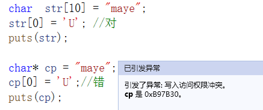

# 字符串与指针

在各种编程语言中，字符串的地位都十分重要，C语言中并没有提供“字符串”这个特定类型，而是以特殊字符数组的形式来存储和处理字符串，这种字符数组必须以空字符’\0’结尾，因此，也将这种特定字符数组称为C风格字符串， 如何声明创建一个C风格字符串时，如何使用C风格字符串，这是本节课要学习的内容。

**存储字符串有两种形式：**

+ 字符数组形式：char str[20];
+ 字符指针形式：char* pc;

**区别：**

+ str是一个字符数组，字符串中的每个字符逐个存放，且可以随意修改
+ pc是一个字符指针，指向的是常量区的字符串，不能修改，只能访问

```cpp
char  str[20];     str=“I love China!”;    //(X) str是常量不能改变指向
char   *pc;        pc=“I love China!”;     //(√) pc是变量，可以改变指向
```

## 字符串输入

+ pc接受输入字符串时，必须先开辟内存空间




## 多个字符串输入

需要存储多个字符串时可以用二维数组或指针数组。

+ 二维数组：每个元素为一维数组的数组，叫二维数组。可以用个一维数组存储一个字符串。

  ```cpp
  char str[5][10];
  for (int i = 0; i < 5; i++)
  {
  	gets_s(str[i], 10);
  }
  for (int i = 0; i < 5; i++)
  {
  	puts(str[i]);
  }
  ```

+ 指针数组

  ```cpp
  char* str1[5];
  for (int i = 0; i < 5; i++)
  {
  	str1[i] = malloc(10);
  	gets_s(str1[i],10);
  }
  for (int i = 0; i < 5; i++)
  {
  	puts(str1[i]);
  	free(str1[i]);
  	str1[0] = NULL;
  }
  
  ```

  

## 字符串操作函数

C语言提供了丰富的字符串处理函数，大致可分为字符串的输入、输出、合并、修改、比较、转换、复制、搜索几类。 使用这些函数可大大减轻编程的负担。用于输入输出的字符串函数，在使用前应包含头文件"stdio.h"，使用其它字符串函数则应包含头文件"string.h"。

+ strlen 求字符串字面量长度
+ strcpy 字符串拷贝
+ strcat 字符串连接
+ strcmp 字符串比较

**自己用指针实现这些函数：**