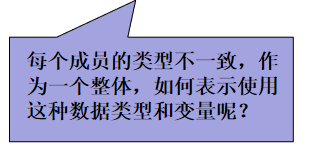

# 结构体

## 结构体是什么？

在前面我们学习过基础的数据类型int float char 等，都只能用来表示基础的数据类型，那么要怎么来表示复杂的数据类型呢？

比如学生信息：

| **学号** | **姓名** | **性别** | **年龄** | **总分数** |
| -------- | -------- | -------- | -------- | ---------- |
| 100      | maye     | 男       | 18       | 666        |
| 101      | 椰汁     | 女       | 19       | 555        |



定义5个数组，然后每个数组的长度都一致是否可行？

```c
int ids[N]={0};
char names[N][10]={0};
char sexs[N][3]={0};
int ages[N]={0};
int scores[N]={0};
```

看起来还不错，实际上有很多同学也是这么做的，在没有学习结构体之前这样还是不错的，从这节课开始有更好的方法来处理哦~

既然学生信息有很多，那么能不能定义一个学生类型呢？如果能，直接通过学生访问该学生的所有信息就很方便了!

答案是能！！

**数组：**可存储相同数据类型的变量。

**结构体：**用户自定义的数据类型，它允许存储不同类型的数据项。(数据项被称为"成员")

## 结构体的申明

为了定义结构体，您必须使用 **struct** 语句。struct 语句定义了一个包含多个成员的新的数据类型，struct 语句的格式如下：

```c
struct tag
{
    member1;
    member2;
    member3;
    ...
}
```

+ tag 是结构体标签；
+ member 是标准的变量定义，比如int i;char c;或者其他有效的变量定义。
+ 多个成员之间用分号分隔(不允许0成员结构体的定义)
+ 末尾的分号不可缺少。


那么对于上面的学生的信息，就可以用如下结构体表示学生结构体类型：

```c
struct Student	//学生结构体类型
{
    int id;			//学号
    char name[10];	//姓名
    char sex;		//性别
    int age;		//年龄
    int score;		//总分
}
```


## 结构体变量定义

结构体类型已经声明，如何使用结构体类型定义结构体变量呢？有三种方法：

1. 先声明结构体类型再定义结构体变量

```c
struct Student maye;
```

2. 在声明结构体类型的同时定义变量

```c
struct Student
{
    ...
}maye;
```

3. typedef取别名之后再定义变量

```c
typedef struct Student
{    
    ...
}Student;	//加了typedef之后，这里的Student就是struct Student 的别名了
Student maye;
```

+ 通过第一种方法定义结构体变量时，struct关键字不能省略。

## 结构体变量初始化

在定义结构体变量的同时通过{}的方式为每一个成员变量进行赋初值

+ 全部初始化

```c
struct Student maye = {100,"maye",1,18,666};
```

+ 部分初始化：未初始化部分自动初始化为0

```c
struct Student maye = {100};
```

+ 全部初始化为0

```cpp
struct Student maye = {0};
```

+ 初始化指定的成员(可以初始化任意成员，不必遵循定义顺序)

```c
struct Student maye = {.id = 100,.age = 18};
```

+ 用另一个结构体变量初始化:

```c
struct Student zc = maye;
zc = (struct Student){200，"zc"};
```

+ 和数组初始化一样，只能从左边开始逐个初始化，不能跳过
+ 初始化时，类型及顺序要一一对应

## 结构体变量的使用

要通过结构体变量访问成员，就需要用到成员访问运算符(. 或 ->)~

+ 普通结构体变量访问成员使用 .

```c
struct Student hero = {007,"007特工"};
puts(hero.name);
```

+ 通过结构体指针访问成员使用 ->

```c
struct Student *ph = &hero;
(*ph).name;
ph->name;
```


## 结构体嵌套

在一个结构体内包含另一个结构体作为其成员，有两种写法。

比如，给学生增加一个出生日期，包含年月日.

1. 先定义好结构体，然后在另一个结构体中定义结构体变量

```c
struct Date
{
    short year;
    short month;
    short day;
};

struct Student
{
    int id;
    char name[10];
    struct Date birth;	//出生日期
};
```

2. 直接把结构体定义在另一个结构体内。

```c
struct Student
{
    int id;
    char name[10];
    struct Date
	{
    	short year;
    	short month;
    	short day;
	}birth;//出生日期
};
```

+ 当出现结构体嵌套时，必须以级联方式访问结构体成员，即通过成员访问运算符逐级找到最底层的成员。

```c
struct Student maye;
maye.birth.year = 2022;
maye.birth.month = 2;
maye.birth.day = 9;

struct Student zc = {2000,"顽石",{2021,5,14}};
```

## 结构体数组

一个结构体变量可以存放一个学生的一组信息，可是如果有 10 个学生呢？难道要定义 10 个结构体变量吗？难道上面的程序要复制和粘贴 10 次吗？

很明显不可能，这时就要使用数组。结构体中也有数组，称为结构体数组。它与前面讲的数值型数组几乎是一模一样的，只不过需要注意的是，结构体数组的每一个元素都是一个结构体类型的变量，都包含结构体中所有的成员项。

```c
struct Student stus[10];
```

这就定义了一个结构体数组，共有 10 个元素，每个元素都是一个结构体变量，都包含所有的结构体成员。

下面编写一个程序，编程要求：从键盘输入 5 个学生的基本信息，如学号、姓名、年龄、性别，然后将年龄最大的学生的基本信息输出到屏幕。

```c
#include <stdio.h>

struct Student
{
    int id;
    char name[10];
    int age;
    char sex;
};
/*
1001 小红 22 F
1002 小明 21 M
1003 小欣 23 F
1004 小天 20 F
1005 小黑 19 M
*/

int main()
{
    struct Student stus[10];
    for (int i = 0; i < 5; i++)
    {
        printf("input %d stu>",i+1);
        scanf("%d %s %d %c",&stus[i].id,stus[i].name,&stus[i].age,&stus[i].sex);
    }

    struct Student maxStu = stus[0];
    for (int i = 0; i < 5; i++)
    {
        if (maxStu.age < stus[i].age)
        {
            maxStu = stus[i];
        }         
    }
    printf("%d %s %d %c\n", maxStu.id,maxStu.name, maxStu.age, maxStu.sex);

    return 0;
}
```

input 1 stu>1001 小红 22 F
input 2 stu>1002 小明 21 M
input 3 stu>1003 小欣 23 F
input 4 stu>1004 小天 20 F
input 5 stu>1005 小黑 19 M
1003 小欣 23 F

结构体数组也是能够初始化的，我们将上面的程序修改一下：

```c
int main()
{
    struct Student stus[10] = {{1001, "小红", 22, 'F'},{1002,"小明" ,21,' M'},{1003,"小欣" ,23, 'F'},{1004, "小天", 20, 'F'},{1005, "小黑", 19, 'M'}};

    struct Student maxStu = stus[0];
    for (int i = 0; i < 5; i++)
    {
        if (maxStu.age < stus[i].age)
        {
            maxStu = stus[i];
        }         
    }
    printf("%d %s %d %c\n", maxStu.id,maxStu.name, maxStu.age, maxStu.sex);

    return 0;
}
```

## 结构体字节对齐

每种类型在定义对象时，都会开辟内存，类型不同所占内存大小也不一样，用sizeof即可获取类型大小。

思考：结构体占用的内存大小是多少呢？

+ 是成员所占内存的总和吗？
+ 还是有其他的处理方式？

先来看几个例子吧：

```c
#include<stdio.h>

struct Node
{
    int a;
    int b;
};

int main()
{
    printf("%d\n",sizeof(struct Node));
    return 0;
}
```


```c
struct Node
{
    int a;
    int b;
};	//8
```

这个结构体大小为8个字节，看起来是成员大小的总和，实际上这只是个巧合：当成员类型全部一样时，结构体大小就等于每个成员大小之和。

```c
struct Node1
{
    int a;
    char b;
};	//8
```

这个结构体大小还是8个字节，为什么？这实际上是编译器对结构体的空间进行了优化，就是所谓的字节对齐。

### 什么是字节对齐？

从理论上讲，对于任何变量的访问都可以从任何地址开始访问，但是事实上不是如此，实际上访问特定类型的变量只能在特定的地址访问，这就需要各个变量在空间上按一定的规则排列，而不是简单地顺序排列，这就是内存对齐。

### 为什么要字节对齐？

原因：

+ 某些平台只能在特定的地址处访问特定类型的数据；

+ 提高存取数据的速度。比如有的平台每次都是从偶地址处读取数据，对于一个int型的变量，若从偶地址单元处存放，则只需一个读取周期即可读取该变量；但是若从奇地址单元处存放，则需要2个读取周期读取该变量。

### 字节对齐规则

C语言标准并没有规定内存对齐的细节，而是交给具体的编译器去实现，但是对齐的基本原则是一样的。

+ 1) 结构体变量的首地址能够被其最宽基本类型成员的大小所整除；

+  2) 结构体每个成员相对于结构体首地址的偏移量都是成员大小的整数倍，如有需要编译器会在成员之间加上填充字节；
+ 结构体的总大小为结构体最宽基本类型成员大小的整数倍，如有需要编译器会在最末一个成员之后加上填充字节。


## 位段(位域)

### 位段是什么？

C语言允许在一个结构体中以位为单位来指定其成员所占内存长度，这种以位为单位的成员称为位段。利用位段能够用较少的位数存储数据。

**语法：**

```c
struct 结构体名
{
  	  整数类型 位段名1 : 位段大小;
      整数类型 位段名2 : 位段大小;
      整数类型 位段名3 : 位段大小;
      整数类型 位段名4 : 位段大小;
      ...
};
```

+ 整数类型：C语言标准规定，只有有限的几种数据类型可以用于位段。(所有整数类型以及char类型和_Bool类型)。
+ 位段名：即有效的标识符
+ 位段大小：此位段所占的位数，不能超过类型的最大位数。

**范例：**

```c
struct BitField
{
    unsigned char a:1;
    unsigned char b:4;
    unsigned char c:3;
};
int main()
{
    //初始化
    struct BitField bit={1,2,3};
    //输出
    printf("first:%d %d %d\n",bit.a,bit.b,bit.c);
    //赋值
    bit.a = 2;
    bit.b = 20;
    bit.c = 8;
    //再次输出
    printf("last:%d %d %d\n",bit.a,bit.b,bit.c);
}
```

运行结果：

```text
fast:1 2 3
last:0 4 0
```

第一次的输出结果都是完整的，第二次输出的结果令人摸不着头脑。

+ **第一次输出时：**a、b、c的值分别为1、2、3，转换成二进制分别是0b1、0b10、0b11，都没有超出限定的位数，能正常输出。

+ **第二次输出时：**a、b、c的值分别为2、20、8，转换成二进制分别是0b10、0b10100、0b1000，所有位段都超出了限定的位数，不能正常输出。
  + 超出部分被直接截去(从高位开始截断，即从左往右)，截去之后的二进制分别为0b0、0b0100、0b000，换算成十进制分别为0、4、0


### 注意事项

1、**位段的内存分配：**位段占的二进制位数不能超过该基本类型所能表示的最大位数，即位段不能跨字节存储，比如char是占1个字节，那么最多只能是8位；

```c
struct Bit
{
  	char a:3;	//right
	char b:9;	//error C2034: “d”: 位域类型对位数太小
};
```

2、**位域的存储：**C语言标准并没有规定位域的具体存储方式，不同的编译器有不同的实现，但它们都尽量压缩存储空间。

当相邻成员的类型相同时，如果它们的位宽之和小于类型的 sizeof 大小，那么后面的成员紧邻前一个成员存储，直到不能容纳为止；如果它们的位宽之和大于类型的 sizeof 大小，那么后面的成员将从新的存储单元开始，其偏移量为类型大小的整数倍。

```c
struct Bf1
{
    char a:3:
    char b:3;
};
//sizeof(struct Bf1) == 1

struct Bf2
{
    char a:3:
    char b:3;
    char c:3;
};
//sizeof(struct Bf2) == 2
```

3、**禁止对位段取地址**：地址是字节（Byte）的编号，而不是位（Bit）的编号。

```c
&bit.a;		//error C2104: 位域上的“&”被忽略
```

4、**无名位段：**位域成员可以没有名称，只给出数据类型和位宽

```c
struct Bf
{
    int a:12;
    int :20;
    int b:4;
};
```

无名位域一般用来作填充或者调整成员位置。因为没有名称，无名位域不能使用。

上面的例子中，如果没有位宽为 20 的无名成员，a、b 将会挨着存储，sizeof(struct Bf) 的结果为 4；有了这 20 位作为填充，a、b 将分开存储，sizeof(struct Bf) 的结果为 8。

# 联合

联合也是一种数据类型，用户可自定义。不同于结构体成员——它们在结构中都具有单独的内存位置，联合成员则共享同一个内存位置。也就是说，联合中的所有成员都是从相同的内存地址开始。因此，可以定义一个拥有许多成员的联合，但是同一时刻只能有一个成员允许含有一个值。联合让程序员可以方便地通过不同方式使用同一个内存位置。

## 联合的定义

联合的定义方式与结构是一样的，只是把关键字 struct 改成 union：

```c
union tag
{
   member;
   ...
};
```

下面的例子定义了一个名为Data的联合类型，它有 3 个成员：i、x 和 str：

```c
union Data
{
    int i;
    double x;
    char str[16];
};
```

这种类型的对象可以存储一个整数、一个浮点数或一个短字符串。如果想获得联合的空间大小，可以使用 sizeof 运算符。对上例来说，sizeof（union Data）会返回 16。

如下图所示：联合中所有成员都是从内存中同一个地址开始的。


为展示联合和结构的差异，看看下面定义的 struct Record，它具有成员 i、x 和 str：

```c
struct Record
{
    int i;
    double x;
    char str[16];
};
```

如下图所示：结构对象中每个成员使用内存中的不同位置。


获取联合成员的方式和获取结构成员的方式一样。唯一的差异在于，当改变一个联合成员的值时，实际上修改了该联合所有成员的值。

程序员要确保联合对象的内存内容被正确地解释和使用。联合内成员的类型不同，允许程序员采用不同的方式解释内存中的同一组字节值。例如，下面的循环使用联合来展示一个 double 值在内存中的存储形式：

```c
union Data var;
var.x = 3.14;
for(int i = sizeof(double)-1;i>=0;i--)
{
    printf("%02X ",(unsigned char)var.str[i]);
}
```

该循环从 var.x 的最高位字节开始，生成下面的输出：

```c
3F F4 00 00 00 00 00 00
```

## 联合的初始化

与结构类似，通过初始化列表（initialization list）来初始化联合对象。但是，对联合来说，列表只有一个初始化器（initializer）。

与结构一样，C99 允许在初始化器中使用成员指示符来指示哪个成员被初始化。而且，如果初始化器没有成员指示符，那么就与联合内的第一个成员关联。具有自动存储类的联合对象也可以使用已有的同类型对象来初始化。下面是一些初始化例子：

```c
union Data var1 = { 77 };
union Data var2 = { .str = "Mary" };
union Data var3 = var1;
```


# 枚举

枚举：具有有限个整型符号常量的集合，这些整型符号常量称为枚举常量。

枚举的定义很简单，和结构体差不多，只需要把关键字 struct 改成 enum：

```c
enum tag
{
   member;
   ...
};
```

枚举类型有什么用？

+ 在实际应用中,有些变量的取值范围是有限的,仅可能只有几个值,如一个星期7天, 一年12个月,一副扑克有4种花色,每一花色有13张牌等。
+ 整型数来表示：直观性差，如1，在别让看来可能就是数字1，或者星期一，或者一月份，难以区分！
+ 由此看出,为提高程序的可读性,引入非数值量即一些有意义的符号是非常必要的。

```c
enum week{ Mon, Tues, Wed, Thurs, Fri, Sat, Sun };
```

判断用户输入的是星期几：

```c
#include <stdio.h>
enum week{ Mon = 1, Tues, Wed, Thurs, Fri, Sat, Sun } day;
int main()
{
    scanf("%d", &day);
    switch(day){
        case Mon: puts("Monday"); break;
        case Tues: puts("Tuesday"); break;
        case Wed: puts("Wednesday"); break;
        case Thurs: puts("Thursday"); break;
        case Fri: puts("Friday"); break;
        case Sat: puts("Saturday"); break;
        case Sun: puts("Sunday"); break;
        default: puts("Error!");
    }
    return 0;
}
```

