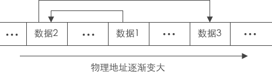
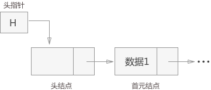
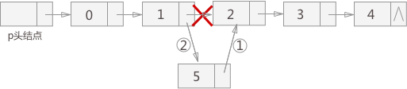

# 一，数据结构概述

## 1.1什么是数据结构？

**官方解释：**

​		数据结构是一门研究非数值计算的程序设计问题中的操作对象，以及他们之间的关系和操作等相关问题的学科

**大白话：**

​		数据结构就是把数据元素按照一定的关系组织起来的集合，用来组织和存储数据

## 1.2数据结构分类

传统上，我们可以把数据结构分为逻辑结构和物理结构两大类。

**逻辑结构分类：**

​		逻辑结构是从具体问题中抽象出来的模型，是抽象意义上的结构，按照对象中数据元素之间的相互关系分类，也是我们后面课题中需要关注和讨论的问题。

a,集合结构：结合结构中数据元素出了属于同一集合外，他们之间没有任何其他关系


b,线性结构：线性结构中的数据元素之间存在一对一的关系


c,树形结构：树形结构中的数据元素之间存在多对一的层次关系


d,图形结构：图形结构的数据元素是多对多的关系


**物理结构分类：**

​		逻辑结构在计算机中真正的表示方式(又称映像)称为物理结构，也可以叫做存储结构，常见的物理结构有顺序存储结构、链式存储结构。

``顺序存储结构``

​		把数据元素放到地址连续的内存单元里面，其数据间的逻辑关系和物理关系是一致的，比如我们常用的数组就是顺序存储结构。


​		顺序存储结构存在一定的弊端，就想生活中排队时，会有人插队也有可能有人突然离开，这时候整个结构都处于变化之中，此时就需要链式存储结构。

``链式存储结构``

​		是把数据元素存放在任意的存储单元里面，这组存储单元可以是连续的，也可以是不连续的。此时，数据元素之间的关系，并不能反映元素间的逻辑关系，因此链式存储中引进了一个指针存放数据元素的地址，这样通过地址就可以找到相关联数据元素的位置。


## 1.3数据结构术语

**抽象数据类型：**(Abstract Data Type,简称ADT)是指一个数学模型以及定义在该模型上的一组操作。抽象数据类型的定义仅取决于它的一组逻辑特性，而与其在计算机内部如何表示和实现无关，即不论其内部结构如何变化，只要它的数学特性不变，都不影响其外部的使用。

抽象数据类型和数据类型实质上是一个概念。例如,各个计算机都拥有的“整数”类型是一个抽象数据类型,尽管它们在不同处理器上实现的方法可以不同,但由于其定义的数学特性相同,在用户看来都是相同的。因此,“抽象”的意义在于数据类型的数学抽象特性。

数据结构的表示(存储结构)用类型定义( typedef)描述。数据元素类型约定为Data。


# 二，线性表

**线性结构的特点是：**在数据元素的非空有限集合中

+ 存在唯一的一个被称为"第一个"的数据元素
+ 存在唯一的一个被称为“最后一个”的数据元素
+ 除了第一个之外，结合中的每个数据元素均只有一个前驱
+ 除了最后一个之外，集合中每个数据元素均只有一个后继

线性表示一个相当灵活的数据结构，它的长度可以根据需要增长或缩短，即对线性表的数据元素不仅可以进行访问，还可以进行插入和删除等。

## 1.1顺序表

顺序表是指用一组地址连续的内存单元依次存储线性表的数据元素

通常都用数组来描述数据结构中的顺序存储结构。由于线性表的长度可变，且所需最大存储空间随问题不同而不同，则在C语言中可用动态内存分配一维数组，如下描述：


## 1.2 链表

链表是指逻辑结构上一个挨一个的数据，在实际存储时，并没有像顺序表那样也相互紧挨着。恰恰相反，数据随机分布在内存中的各个位置。

由于分散存储，为了能够体现出数据元素之间的逻辑关系，每个数据元素在存储的同时，要配备一个指针，用于指向它的直接后继元素，即每一个数据元素都指向下一个数据元素（最后一个指向NULL(空)）。



如图所示，当每一个数据元素都和它下一个数据元素用指针链接在一起时，就形成了一个链，这个链子的头就位于第一个数据元素，这样的存储方式就是链式存储。

### 链表中数据元素的构成

每个元素本身由两部分组成:

1. 存储数据的区域，称为“数据域"；
2. 指向直接后继的指针，称为“指针域”。


这两部分信息组成数据元素的存储结构，称之为“结点”。n个结点通过指针域相互链接，组成一个链表。


由于每个结点中只包含一个指针域，生成的链表又被称为单链表。

链表中存放的不是基本数据类型，需要用结构体实现自定义：

```c
typedef int Data;
typedef struct LinkList
{
    Data data;			//数据域
    struct LinkList*next;	//指针域，指向下一个节点
}LinkList;
```

### 头结点、头指针和首元结点

头结点：有时，在链表的第一个结点之前会额外增设一个结点，结点的数据域一般不存放数据（有些情况下也可以存放链表的长度等信息），此结点被称为头结点。

> 若头结点的指针域为空（NULL），表明链表是空表。头结点对于链表来说，不是必须的，在处理某些问题时，给链表添加头结点会使问题变得简单。

首元结点：链表中第一个元素所在的结点，它是头结点后边的第一个结点。

头指针：永远指向链表中第一个结点的位置（如果链表有头结点，头指针指向头结点；否则，头指针指向首元结点）。

> 头结点和头指针的区别：头指针是一个指针，头指针指向链表的头结点或者首元结点；头结点是一个实际存在的结点，它包含有数据域和指针域。两者在程序中的直接体现就是：头指针只声明而没有分配存储空间，头结点进行了声明并分配了一个结点的实际物理内存。



> 单链表中可以没有头结点，但是不能没有头指针！

### 链表的创建

万事开头难，初始化链表首先要做的就是创建链表的头结点或者首元结点。创建的同时，要保证有一个指针永远指向的是链表的表头，这样做不至于丢失链表。

createLinkList()创建一个空链表并返回链表的头指针：

```c
LinkList* createLinkList()
{
    LinkList*head = calloc(1,sizeof(LinkList));		//创建一个头结点
    if(!head)
        return NULL;
    return head;
}
```

### 插入节点

链表中插入结点，根据插入位置的不同，分为3种：

1. 插入到链表的首部，也就是头结点和首元结点中间；
2. 插入到链表中间的某个位置；
3. 插入到链表最末端；



虽然插入位置有区别，但都使用相同的插入手法。分为两步，如上图所示：

- 将新结点的next指针指向插入位置后的结点；
- 将插入位置前的结点的next指针指向插入结点；

头插：

```cpp
void push_front(LinkList* list,Data val)
{
    LinkList* newNode = calloc(1,sizeof(LinkList));
    if(!newNode)
        return NULL;
    newNode->data = val;
    newNode->next = list->next;
    list->next = newNode;
}
```

尾插：

```cpp
void push_back(LinkList* list,Data val)
{
    //找到最后一个节点
    LinkList* lastNode = list;
    while(lastNode->next)
    {
        lastNode = lastNode->next;
    }
    
    LinkList*newNode = calloc(1,sizeof(LinkList));
    if(!newNode)
        return;
    newNode->data = val;
    lastNode->next = newNode;
}
```

指定插:

```c
void insert(LinkList*list,Data val,size_t pos)
{
    LinkList* prevNode = list;	//辅助节点，用来保存待插入位置的上一个节点
    //先判断有没有pos位置
    for(int i = 0;i < pos; i++)
    {
        if(prevNode == NULL)
        {
            printf("插入位置无效\n");
            return;
        }
        prevNode = prevNode->next;
    }
    //如果找到了位置，创建节点插入
    LinkList* newNode = calloc(1,sizeof(LinkList));
    if(!newNode)
        return;
    newNode->data = val;
    newNode->next = prevNode->next;
    prevNode->next = newNode;
}
```

### 遍历节点

一般情况下，链表只能通过头结点或者头指针进行访问，如果要访问所有节点就需要对链表中的结点进行逐个遍历。

```c
void printList(LinkList*list)
{
    LinkLis*curNode = list->next;	//指向首元结点
    while(curNode)
    {
        printf("%d ",curNode->data);
        curNode = curNode->next;
    }
}
```

### 删除节点

当需要从链表中删除某个结点时，需要进行两步操作：

- 将结点从链表中摘下来;
- 手动释放掉结点，回收被结点占用的内存空间;

> 使用malloc函数申请的空间，一定要注意手动free掉。否则在程序运行的整个过程中，申请的内存空间不会自己释放（只有当整个程序运行完了以后，这块内存才会被回收），造成内存泄漏，别把它当成是小问题。

```c
void removeOne(LinkList*list,Data val)
{
    LinkList* curNode = list;
    //找到要删除的节点的前一个节点
    while(curNode->next)
    {
        if(curNode->next->data == val)
        {
            break;
        }
        curNode = curNode->next;
    }
    //如果找到了要删除的节点删除节点
    if(curNode->next != NULL)
    {
        LinkList* delNode = curNode->next;
        curNode->next = delNode->next;
        free(delNode);
    }
}
```

### 销毁链表

当链表使用完毕，需要对链表进行销毁，即释放每个节点的内存。

```c
void freeLinkList(LinkList*list)
{
    LinkList* curNode = list;
    LinkList* delNode = NULL;
    while(curNode)
    {
        delNode = curNode;			//保存要删除的节点
        curNode = curNode->next;	//curNode向后移动
        free(delNode);//释放
    }
    list = NULL;	//这句能否修改实参？
}
```

