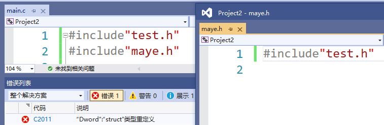

# 预编译指令

在编译和链接之前，还需要对源文件进行一些文本方面的操作，比如文本替换、文件包含、删除部分代码等，这个过程叫做预处理，由预处理程序完成。

较之其他编程语言，C/C++ 语言更依赖预处理器，所以在阅读或开发 C/C++ 程序过程中，可能会接触大量的预处理指令，比如 #include、#define 等。

在C语言中，凡是以“#”开头的行，都称为预编译指令，主要有

| 指令                                  | 作用                                                         |
| ------------------------------------- | ------------------------------------------------------------ |
| #define<br />#undef                   | 定义宏<br />取消宏定义                                       |
| #include                              | 包含头文件                                                   |
| #if<br />#else<br />#elif<br />#endif | 条件编译                                                     |
| #ifdef<br />#ifndef                   | 判断是否定义了某个宏                                         |
| #program                              | 设定编译器的状态或者是指示编译器完成一些特定的动作           |
| #error                                | 当预处理器预处理到*#error*命令时将停止编译并输出用户自定义的错误消息 |


## 预定义宏

预定义宏是C语言中标准编译器预先定义的宏，在ANSI标准中C程序有5个预定义宏可以直接使用。

| 宏            | 说明                   |
| ------------- | ---------------------- |
| \__LINE__     | 当前编译的代码的行号   |
| \__FILE__     | 当前编译文件的源文件名 |
| \__DATE__     | 当前源程序创建的日期   |
| \__TIME__     | 当前源程序创建的时间   |
| \__FUNCTION__ | 当前正在被访问的函数名 |


## #define宏定义

\#define 叫做宏定义命令，它也是C语言预处理命令的一种。所谓宏定义，就是用一个标识符来表示一个表达式，如果在后面的代码中出现了该标识符，那么就全部替换成指定的表达式。

宏定义形式：

```c
#define 宏名  stuff	//stuff为替换内容
```


【示例】

```c
#inlcude<stdio.h>
#define MAYE "顽石"
int main()
{
    printf("%s\n",MAYE);
    return 0;
}
```

运行结果：顽石

`#define MAYE "顽石"`就是宏定义，`MAYE`为宏名，`"顽石"`是宏的内容（宏所表示的字符串）。在预处理阶段，对程序中所有出现的“宏名”，预处理器都会用宏定义中的字符串去代换，这称为“宏替换”或“宏展开”。


值得注意的是，如果宏定义的是一个运算表达式，可能会出现歧义。

【示例】

```c
#include<stdio.h>
#define EXP 2*5+1

int main()
{
    int ret = 3 * EXP;
    printf("ret:%d\n", ret);

    return 0;
}
```

运行结果:ret:31

这显然是不正确的，我想要的结果是3*(EXP)，应该输出33才对，那为什么是31呢？

请记住宏只是简单地替换，根据这个规则我们来替换一下：

```c
int ret = 3*2*5+1;
```

原来宏替换不会自动计算值，而是直接复制过来，所以运算的顺序就对了，那如果想要宏作为一个整体怎么办呢？我们可以在定义宏的时候把表达式用()括起来，如下。

```c
#define EXP (2*5+1)
```

替换后代码如下:

```c
int ret = 3*(2*5+1);
```

这个就是我们想要的结果33了。

### 带参宏

Ｃ语言允许宏带有参数。在宏定义中的参数称为形式参数，在宏调用中的参数称为实际参数。

对带参数的宏，在调用中，**不仅要宏展开，而且要用实参去代换形参**。

带参宏定义的一般形式为:

```c
#define 宏名(形参表) stuff
```

+ 形参列表是一个由逗号分隔的符号列表，它们可能出现在stuff中。参数列表的左括号必须与name紧邻。如果两者之间有任何空白存在，参数列表就会被解释为stuff 的一部分。

【示例】下面是一个带参宏，它接受一个参数，用来计算数值的平方。

```c
#include<stdio.h>
#define SQUARE(number) (number*number)
int main()
{
    printf("%d\n", SQUARE(3));
    return 0;
}
```

预处理阶段会被替换为`printf("%d\n", (3*3);`输出结果为9，没毛病，老铁~

那接着看下面的代码，你会发现就离谱！

```c
printf("%d\n",SQUARE(3+2));
```

我们想要计算(3+2)的平方，即5的平方，但是输出结果却是11，更具宏只是简单地替换原则，可以展开为如下样式

```c
printf("%d\n",(3+2*3+2));
```

上面的代码大家都懂，结果可不就是11嘛，但是计算的不是5的平方，要想达到需要的结果，必须给每个参数都加上括号，如下

```c
#define SQUARE(number) ((number)*(number))
```

这样修改之后，就不会出现任何问题了。


### 带参宏和函数的区别

在带参宏定义中，不会为形式参数分配内存，因此不必指明数据类型。

带参宏非常频繁的用于执行简单的计算,比如在两个表达式中寻找其中较大的一个:

```c
#define MAX(a,b) ((a)>(b)?(a):(b))
```

为什么不用函数来完成这个任务呢？原因有两个：

+ 函数的调用是需要开销的，在小型任务时，使用宏比使用函数在程序的规模和速度方面都更胜一筹.

+ 更为重要的是，函数的参数必须是一种特定的类型，所以他只能在类型合适的表达式上使用。而上面的带参宏可用于int、long int、float、double、char等。就是说宏是与类型无关的。

```c
printf("%d\n",MAX(3,6));
printf("%lf\n",MAX(3.14,5.20));
printf("%c\n",MAX('a','A'));
```

如果要用函数实现，则需要定义多个函数，而且函数名还不能重复，略显麻烦~

还有一些任务根本无法用函数实现，比如：下面这个宏，第一个参数是一种类型，它无法作为函数参数进行传递。

```c
#define MALLOC(type,size) malloc(sizeof(type)*size)
...
int*pn = MALLOC(int,10);
char*ps = MALLOC(char,20);
```

【示例】高难度：用宏定义实现一个foreach循环，用来快捷遍历数组。

```c
#include<stdio.h>

#define foreach(val,arr)  \
for (size_t i = 0, ctr = 0; i < sizeof(arr)/sizeof(arr[0]); i++,ctr = 0)\
    for (val = arr[i]; ctr < 1; ++ctr)

int main()
{
    int arr[10] = { 1,2,3,4,5,6,7,8,9,10 };
    foreach (int a, arr)
    {
        printf("%d ", a);
    }
    
    char* str[] = { "hello","world" };
    foreach(char* val, str)
    {
        puts(val);
    }
    return 0;
}
```

**宏和函数对比**

| **属性**     | #define                                                      | **函数**                                                     |
| ------------ | ------------------------------------------------------------ | ------------------------------------------------------------ |
| 代码长度     | 每次使用时，宏代码都被插入到程序中。除了非常小的宏之外，程序的长度将大幅度增长. | 函数代码只出现于一个地方;每次使用这个函数时, .都调用那个地方的同一份代码 |
| 执行速度     | 更快                                                         | 存在函数调用/返回的额外开销                                  |
| 操作符优先级 | 宏参数的求值是在所有周围表达式的上下文环境里，除.非它们加上括号,否则邻近操作符的优先级可能会产生不可预料的结果 | 函数参数只在函数调用时求值一次，它的结果值传递给函数。表达式的求值结果更容易预测 |
| 参数类型     | 宏与类型无关。只要对参数的操作是合法的，它可以使用于任何参数类型 | 函数的参数是与类型有关的。如果参数的类型不同，就需要使用不同的函数，即使它们执行的任务是相同的 |

### #undef

 这条预处理指令用于移除一一个宏定义。如果一个现存的名字需要被重新定义，那么它的旧定义首先必须用#undef移除。


### 宏定义中的特殊符号

#### # 参数转字符串

使用#可以把宏参数变成一个字符串。

```c
#define toString(value) #value
...
puts(toString(我是顽石老师));    
```


#### ## 连接参数

使用##可以把宏参数连接在一起。

```c
#define VAL(val) val##_maye
...
int VAL(one) = 20;
printf("%d\n", one_maye);    
```


#### #@ 参数转字符

使用#@可以吧宏参数变成一个字符。

```c
#define toChar(ch) #@ch
...
printf("%c", toChar(1));
```


## #if条件编译

一般情况下，源程序中所有的行都参加编译。但有时希望对其中一部分内容只在满足一定条件才进行编译，也就是对一部分内容指定编译的条件，这就是“条件编译”。有时，希望当满足某条件时对一组语句进行编译，而当条件不满足时则编译另一组语句。

条件编译功能可按不同的条件去编译不同的程序部分，从而产生不同的目标代码文件。这对于程序的移植和调试是很有用的。

先来学习一个别的指令，#error用来输出错误信息并终止编译。

```c
#error 亲，欢迎学习C语言！
```


**常见的条件编译指令**

| 条件编译指令 | 说 明                                          |
| ------------ | ---------------------------------------------- |
| #if          | 如果条件为真，则执行相应操作                   |
| #elif        | 如果前面条件为假，而该条件为真，则执行相应操作 |
| #else        | 如果前面条件均为假，则执行相应操作             |
| #endif       | 结束相应的条件编译指令                         |
| #ifdef       | 如果该宏已定义，则执行相应操作                 |
| #ifndef      | 如果该宏没有定义，则执行相应操作               |

调用格式为:

```c
#if 条件表达式
    程序段1
#else
    程序段2
#endif
```

功能和C语言的条件语句类似，不同的是条件编译中的条件表达式必须为能够在编译期间计算出结果的。(不能为变量)

注意，必须使用 #endif 结束该条件编译指令。

```c
int main()
{
#if 1
    printf("#if\n");
#else
    printf("#else\n");
#endif

#ifdef SHOW     	//或者 #ifndef
    printf("#ifdef\n");
#else
    printf("#else\n");
#endif

#if defined(SHOW)   //或者 #if !defined(SHOW)
    printf("#if defined\n");
#else
    printf("#else\n");
#endif
    return 0;
}
```

判断是否是Windows系统文件

```c
const char* systemString()
{
#ifdef _WIN32
	return "windows";
#else
	return "linux";
#endif // _WIN32
}
```

判断是程序是64位还是32位文件

```c
const char* platformString()
{
#ifdef _WIN64
	return "x64";
#else
	return "x86";
#endif // _WIN32
}
```

判断是否是C语言文件

```c
const char* languageString()
{
#ifdef __cplusplus
	return "c++";
#else
	return "c";
#endif // _cplusplus_
}
```

判断构建类型是Debug还是Release

```c
const char* buildTypeString()
{
#ifdef _DEBUG
	return "Debug";
#else
	return "Release";
#endif // _cplusplus_
}
```


## #include头文件包含

#inlcude指令我们已经用过很多次了，它会把我们包含的文件全部复制到包含位置。实际上不仅能包含.h文件，.c文件也行，甚至任意文件都行。

**标准库文件包含**

+ 对于编译器已经提供好的库文件，我们可以用过下面这种语法。
  ``#include<filename>``
  对于filename，并不存在任何限制，不过根据约定，标准库文件以.h后缀结尾。编译器通过定义好的“库文件位置“查找头文件。

  

**本地文件包含**

+ 对于自定义的库文件，我们可以使用下面这种语法。
  ``#include“filename”``
  处理本地头文件首先是在源文件所在的当前目录进行查找，如果该头文件并未找到，编译器就像查找函数库头文件一样在标准位置查找本地头文件。

注意：你可以在所有的#include语句中使用双引号。但是，使用这种方法，编译器在查找函数库头文件时会浪费少许时间。而且，对函数库头文件使用尖括号可以很方便看出包含的是标准库文件还是自定义头文件，便于区分。


**重复包含头文件**

在一个文件中直接或间接多次包含同一文件，可能会导致问题，比如：

+ 当文件中有对变量或类型的定义时，多次包含该文件这个变量或类型就会被多次定义。


+ 当然，没有人会故意编写这样的代码。但下面的代码，会让你难以察觉。




多重包含在绝大多数情况下出现于大型程序中，它往往需要使用很多头文件，因此要发现这种情况并不容易。要解决这个问题，我们可以使用条件编译。如果所有的头文件都像下面这样编写:

【demo.h】

```c
#ifndef _DEMO_H_
#define _DEMO_h_
/*你的代码*/
#endif  
```

这样，多重包含的危险就被消除了，在第一次包含时头文件被正常替换，并且定义宏\_DEMO_H_。如果头文件被再次包含，通过条件编译，它的所有内容被忽略。

但是，你必须知道预处理器仍将读入整个头文件，即使这个文件的所有内容将被忽略。由于这种处理将拖慢编译速度，所以如果可能，应避免出现多重包含。


## #pragma

**用于指定计算机或操作系统特定的编译器功能**，#pragma指令是计算机或操作系统特定的，并且通常对于每个编译器而言都有所不同。

### 1.#pragma once

指定该文件在编译源代码文件时仅由编译器包含（打开）一次。

使用 #pragma once 和使用预处理宏定义来避免多次包含文件的内容的效果是一样的，但是需要键入的代码少，可减少错误率，例如：

```c
使用#progma once
#pragma once  
// 放置在这里的代码每个翻译单元只包含一次  

使用宏定义方式
#ifndef HEADER_H_ 
#define HEADER_H_  
// 放置在这里的代码每个翻译单元只包含一次
#endif // HEADER_H_
```


### 2.#pragma message(messageStr)

**不中断编译的情况下，发送一个字符串文字量到标准输出**。message编译指示的典型运用是在编译时显示信息，例如：

```c
#pragma message("hello world")
```


### 3.#pragma waring(...)

#### 修改编译器警告状态

```c
#pragma warning(warning-specifier : warning-number-list)
```

+ 警告参照表

| 警告说明   | 含义                                     |
| ---------- | ---------------------------------------- |
| `default`  | 将警告行为重置为默认值                   |
| `disable`  | 不发出指定的警告信息                     |
| `error`    | 将指定的警告视为错误                     |
| `once`     | 指定的警告只显示一次                     |
| `suppress` | 抑制下一行的指定警告生成(只对下一行生效) |

看这个表估计会头晕，举例说明吧！

```c
int num = 3.14;
int score = 59.5;
```

这行代码会出现两次警告：`warning C4244: “初始化”: 从“double”转换到“int”，可能丢失数据`，C4244为警告代码。

通过`#pragma warning`可以对这个警告的行为进行设置。

```c
#pragma warning(disable:4244)		//禁用4244警告
#pragma warning(once:4244)			//只显示一次4244警告
#pragma warning(error:4244)			//把4244警告视为错误
#pragma warning(default:4244)		//恢复4244警告的默认行为

#pragma warning(default:4244;once:4244;error:4244;default:4244)	//可以写在一个pragma指令里面
#pragma warning(disable:4244 4477)		//对于相同的行为可以更方便的表示
```

#### 保存和恢复警告状态

push和pop可以保存和恢复当前警告状态，语法为：

```c
#pragma warning(push [,n])    
#pragma warning(pop )
```

其中 n 表示警告等级（1 到 4）。

+ warning( push ) 指令存储每个警告的当前警告状态。
+ warning( push, n) 指令存储每个警告的当前状态并将全局警告级别设置为 n。
+ warning( pop ) 指令弹出推送到堆栈上的最后一个警告状态()。

**超出push和pop的范围，在 push 和 pop 之间对警告状态所做的任何更改都将失效**。

```c
#pragma warning(push)  
#pragma warning( disable : 4705 )  
#pragma warning( disable : 4706 )  
#pragma warning( disable : 4707 )  
// Some code  						//代码的书写，这里不会发出4705、4706、4707的警告
#pragma warning(pop)   				//会将每个警告（包括4705、4706、4707）的状态还原为代码开始的状态
```

当你编写头文件时，你能用push和pop来保证任何用户修改的警告状态不会影响正常编译你的头文件。在头文件开始的地方使用push，在结束地方使用pop。例如，假定你有一个不能顺利在4级警告下编译的头文件，下面的代码改变警告等级到3，然后在头文件的结束时恢复到原来的警告等级。

```c
#pragma warning( push, 3 )    
//Declarations/ definitions    		//要书写的代码
#pragma warning( pop )
```


### 4.#pragma comment（comment-type [,“commentstring”]）

该指令将一个注释记录放入一个对象文件或可执行文件中。

comment-type 是一个预定义的标识符，它指定了注释记录的类型。 可选 commentstring 是一个字符串，它提供了某些注释类型的附加信息。 由于 commentstring 是一个字符串，因此它遵循有关转义字符、嵌入的引号 (") 和串联的字符串的所有规则。

**指定链接库**

```c
#pragma comment(lib,"winmm.lib")
```

****

```c
#pragma comment(linker,"/subsystem:console /entry:mainCRTStartup")
```


### 5.#pragma pack

**指定结构、联合和类成员的封装对齐。其实就是改变编译器的内存对齐方式**。

在没有参数的情况下调用pack会将n设置为编译器选项/zp中设置的值。**如果未设置编译器选项，windows默认为8，linux默认为4**。

具体的使用方法为，其中n的取值必须是2的幂次方，即1、2、4、8：

```c
#pragma pack(n) 	//设置以n个字节为对齐长度
struct 
{
	int  ia；
 	char cb；
}
#pragma pack ()  	//弹出n个字节对齐长度，设置默认值为对齐长度
```

