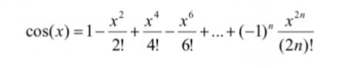

+ 传入一个三位数的正整数，看是否满足下列条件：1，是某一个数的平方，2，其中两位数字相同，如100,121

  ```cpp
  bool isRight(int num)
  {
  	double logNum = sqrt(num);
  	//printf("%d %lf ->%lf\n", num, logNum, logNum - (int)logNum);
  	//找出所有是某个数的平方数的num
  	if (logNum - (int)logNum < 0.00001)
  	{
  		//判断是否有两位数相同
  		int a = -1, b = -1, c = -1;
  		a = num % 10;
  		b = num / 10 % 10;
  		c = num / 100;
  		if(a==b || a == c || b == c)
  		{
  			return true;
  		}
  	}
  	return false;
  }
  ```

  

+ 把从键盘上输入的一个大于等于3的整数分解为质因子的成绩，如输入24时，输出结果为：2 2 2 3；输入50时，输出结果为：2 5 5；输入37时，输出结果为37

  ```c
  void primeFactor(int num)
  {
  	for (size_t i = 2; i <= num; i++)
  	{
  		if (num % i == 0)
  		{
  			printf("%d ", i);			
  			primeFactor(num / i);
  			return;
  		}
  	}
  }
  ```

+ 用下列公式求cos(x)，x为角度的弧度值

  + 1，输入角度(0~360)或弧度(0~2π)时，均可计算出对应的三角函数cos(x)的值

+ 2，计算精度为：最后一项的绝对值小于10^-6
  		

  ```cpp
  //求阶乘
  long long  factorial(int num)
  {
  	long long res = 1;
  	for (size_t i = 2; i <= num; i++)
  	{
  		res = res * i;
  	}
  	return res;
  }
  double myCos(double x)
  {
  	//如果x大于2π，则默认传进来的是角度，那么将他转为弧度再计算
  	if (x > 2 * 3.1415)
  	{
  		x = 3.1415 / 180 * x;
  	}
  	double res = 1.0;	//第一项结果是已知的，所以从第一项开始
  	for (int n = 1;;n++)
  	{
  		double item = pow(x, 2.0*n) / factorial(2*n);
  		int symbol = pow(-1, n);
  		res = res + symbol * item;
  		if (fabs(item) < 0.00001)
  		{
  			break;
  		}		
  	}
  	return res;
  }
  ```

  

+ 反序数的定义：从左向右读的的数的反序数为从右向左读得到的数；如123的反序数为321，平方镜反数的定义：一个数的平方和它的反序数的平方互为反序数，如：12是平方反镜数，因为12^2=144，21^2=441

  + 编写一个程序，输出所有二位数的平方镜反数（ps:个位数不能为0哦）

  ```cpp
  //求一个数的反序数
  int antitoneNumber(int num)
  {
  	int res = 0;
  	//先求一下这是几位数
  	size_t cnt = 0,tnum = num;
  	do
  	{
  		cnt++;
  	} while (tnum /= 10);
  
  	//求反序数
  	for (size_t i = 0;i<cnt; i++)
  	{
  		//12345 5*10+4 54*10+3
  		res = res * 10 + num % 10;
  		num /= 10;
  	}
  	return res;
  }
  void test()
  {
  	for (size_t i = 10; i <= 99; i++)
  	{
  		if (i%10!=0 && antitoneNumber(i * i) == antitoneNumber(i)* antitoneNumber(i))
  		{
  			printf("%d ", i);
  		}
  	}
  }
  ```

+ 求出指定范围内的所有素数(只能被1和自身整除的数)

  + （1），定义函数int isPrime(int num);改函数用于判断num是否为素数，是素数返回true，不是返回false
  + （2），在主函数中输入指定范围，按每行五个的格式，输出指定范围内的素数和个数

  ```cpp
  //判断一个数是不是素数
  bool isPrime(int num)
  {
  	for (size_t i = 2; i < num; i++)
  	{
  		if (num % i == 0)
  		{
  			return false;
  		}
  	}
  	return true;
  }
  void test()
  {
  	int m, n,cnt = 0;
  	scanf_s("%d %d", &m, &n);
  	for (size_t i = m; i <= n; i++)
  	{
  		if (isPrime(i))
  		{
  			cnt++;
  			printf("%2d ", i);
  			if (cnt != 0 && cnt % 5 == 0)
  				printf("\n");
  		}
  	}
  	printf("\n共有素数%d个\n", cnt);
  }
  ```

+ 495数学黑洞：任何一个数字都不相同的三位数，经过有限次“重排求差”操作，总会得495。“重排求差”操作:是将一个数的各位数字重排得到最大数减去最小数。请编程进行验证。

  ​		**如：**数107，“重排求差”操作序列为：710-17=693，963-369=594，954-459=495

  + （1），定义函数void digitn(int num,int *max,int *min);max为对num重排后得到的最大数，min为对num重排后得到的最小数
  + （2），主函数中，输入一个整数，输出每次处理后得到的新数

  ```cpp
  int cmp(int* p, int* p1)
  {
  	return *p1 - *p;
  }
  void digitn(int num, int* max, int* min)
  {
  	int buf[5] = { 0 };
  	int cnt = 0;
  	//把num进行逐位拆解
  	for (int i = 0; num; i++)
  	{
  		buf[i] = num % 10;
  		num /= 10;
  		cnt = i+1;
  	}
  	//对数组进行排序
  	qsort(buf, cnt, sizeof(buf[0]), cmp);
  	//重排求出最大和最小数
  	*max = 0, * min = 0;
  	for (size_t i = 0; i < cnt; i++)
  	{
  		*max = *max * 10+ buf[i];
  		*min = *min * 10 + buf[cnt - i-1];
  	}
  }
  void test()
  {
  	int num = 101;
  
  	int max, min;
  	int t = num;
  	while (1)
  	{
  		digitn(t, &max, &min);
  		printf("%d - %d = %d\n", max, min,max-min);
  		t = max - min;
  		if (t == 495)
  			break;
  	}
  }
  ```
  
  

+ 哥德巴赫猜想之一是，任何一个不小于6的偶数都可以表示为两个素数之和,例如，6=3+3，8=3+5，10=3+7等，试写一个函数，验证6~100之间的所有偶数。具体要求如下:

  ```cpp
  //哥德巴赫猜想 num>5
  void goldbach(int num)
  {
  	if (num % 2 != 0)
  		return;	//不是偶数
  	for (int i = 2; i < num; i++)
  	{
  		//8=3+5   3是素数   8-5 也是素数
  		if (isPrime(i) && isPrime(num - i))
  		{
  				printf("%d = %d + %d\n", num, i, num - i);
  				return;
  		}
  	}
  }
  ```

  

+ 小明正看着203879这个数字发呆。原来，203879 * 203879 =41566646641这有什么神奇呢?仔细观察，203879是个6位数，并且它的每个数位上的数字都是不同的，并且它平方后的所有数位上都不出现组成它自身的数字。具有这样特点的6位数还有一个，请你找出它!再归纳一下筛选要求:

  + 1.6位正整数
  + 2.每个数位上的数字不同
  + 3.其平方数的每个数位不含原数字的任何组成数位

  ```cpp
  bool 相同的两个六位数相乘结果不出现这个六位数的数字(uint64_t num)
  {
  	int numCnt = 0;	//num的位数
  	int numArray[6] = { 0 };
  	uint64_t tnum = num;
  	for (size_t i = 0; tnum; i++)
  	{
  		numArray[i] = tnum % 10;
  		tnum /= 10;
  		numCnt = i;
  	}
  	if (numCnt + 1 != 6)
  	{
  		return false;	//不是六位数
  	}
  	for (size_t i = 0; i < 6; i++)
  	{
  		for (size_t k = i+1; k < 6; k++)
  		{
  			if (numArray[i] == numArray[k])
  			{
  				return false;	//有重复的数
  			}
  		}
  	}
  
  	uint64_t res = num * num;
  	int resCnt = 0;
  	int resArray[12] = {0};	//存储结果的每位数
  	//求出结果的位数
  	for (size_t i = 0; res; i++)
  	{
  		resArray[i] = res % 10;
  		res /= 10;
  		resCnt++;
  	}
  
  
  
  	//判断是否有重复的数字
  	for (size_t i = 0; i < resCnt; i++)
  	{
  		for (size_t k = 0; k < 6; k++)
  		{
  			if (resArray[i] == numArray[k])
  			{
  				return false;
  			}
  		}
  	}
  	
  	return true;
  }
  
  void test()
  {
  	for (uint64_t i = 100000; i <= 999999; i++)
  	{
  		if (相同的两个六位数相乘结果不出现这个六位数的数字(i))
  		{
  			//printf("ok!");
  			printf("%llu %llu\n", i,i*i);
  		}
  	}
  }
  ```


```cpp
int main()
{
	int num = 0;
	printf("inputNum:");
	scanf("%d", &num);
	int res = 0;
	for (size_t i = 0; i < num; i++)
	{
		for (size_t k = 0; k < num; k++)
		{
			if (i == 0 || i == num-1 || k == 0 || k == num-1)
			{
				if (k == 0 && i != 0)
				{
					res = num * 4 - 3 - i;
				}
				else if (k == num-1)
				{
					res = num + i;
				}
				else if (i == num-1)
				{
					res = num * 3 - 2 - k;
				}
				else
				{
					res++;
				}
				printf("%3d ", res);
			}
			else
			{
				printf("    ");
			}
		}
		printf("\n");
	}
	return 0;
}
```

猴子选大王:有N只猴子选大王，先从头到尾1~3开始报数，报到3的猴子退出﹐报至尾后﹐再从头接着报﹐同样是1~3报数﹐报到3的猴子退出，…，最后剩下的一只猴子即为大王。输入N﹐求猴子大王的编号。

```cpp
int main()
{
    int n = 0;
    printf("输入猴子数量>");
    if (!scanf_s("%d", &n))
        return -1;
    int* arr = calloc(n, sizeof(int));
    for (int i = 0; i < n; i++)
    {
        arr[i] = rand()%100;
    }
    //开始报数
    int num = 1;    //当前报数
    int cnt = 0;    //有几个猴子退出了
    //循环遍历数组，直到只剩一个猴子
    for (int i = 0; cnt != n-1; i = (i+1)%n)
    {
        if (arr[i] != -1)   //剩下的猴子报数
        {
            if (num == 3)
            {
                arr[i] = -1;
                num = 0;    //下面会自增一次，所以从0开始
                cnt++;
            }
            ++num;          
        }
    }
    for (size_t i = 0; i < n; i++)
    {
        if (arr[i] != -1)
        {
            printf("最终%d号为猴子王\n", arr[i]);
            break;
        }
    }
    free(arr);
    return 0;
}
```

对数组进行调整，规则是把偶数放在数组的左边，把奇数放到数组的右边。

如：调整之前的数组：12 31 17 45 68 40 57 43 25 78

​       调整之后的数组：12 78 40 68 45 17 57 43 25 31

```cpp
#include<stdio.h>
void adjust(int arr[], int len)
{
    int left = 0;
    int right = len-1;
    while (left <= right)
    {
        if (arr[left] % 2 == 0)
        {
            left++;
        }
        else
        {
            while (arr[right] % 2 != 0)
            {
                right--;
            }
            if (right <= left)
                break;
            int temp = arr[left];
            arr[left] = arr[right];
            arr[right] = temp;
            right--;
        }
        if (arr[right] % 2 != 0)
        {
            right--;
        }
    }
}
void print(int arr[], int len)
{
    for (int i = 0; i < len; i++)
    {
        printf("%d ", arr[i]);
    }
    printf("\n");
}
int main()
{
    int arr[] = { 12,31,17,45,68,40,57,43,25,78 };
    printf("调整之前的数组> ");
    print(arr, 10);
    adjust(arr, 10);
    printf("调整之后的数组> ");
    print(arr, 10);

    return 0;
}
```

